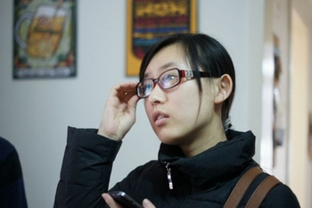
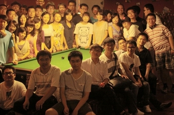

# 我和你们的北斗

（一） 

08年的某一天，忘记是谁传给我一个纪录片，《寻找林昭的灵魂》。

那会儿我是一只十九岁愤青，看完这样的东西感慨万千，不吐不快。于是半夜里在校内网码了一篇充斥着口号和情绪化字眼的口水文《林昭，林昭》。

过了一阵子，还在北外读本科的薄然在网上说，有意召集几个好友办一份网络杂志。我与他高中还算熟识，几个小屁孩偶尔凑在一起，盖一些皿煮柿油的楼，于是就留意了这个消息。他发帖向几个感兴趣的好友为这份萌芽中的杂志征一个上口的名字。

几天后，他说： 就叫北斗吧。

彼时的北斗更像几个年轻人自娱自乐的一时兴起，连草台班子都算不太上，自然约不到大牛的稿。于是四月的某一天薄然在那篇日志下给我留言：想用你这篇文章做北斗的创刊号，可以吗？

那会儿我作为薄然的脑残粉，当然乐得屁颠屁颠儿的。

嗯，故事都从这儿开始。

（二） 

平庸的高考成绩将我送入了辽宁半岛的这所理工科院校，读了边缘化的文科专业。

平庸的我过着平淡无奇的生活。攒GPA，刷四六级，混学生会。为论文、作业及下一顿饭吃什么天天发愁。为某个男生的一举一动牵肠挂肚，在网上挂满矫情空洞的流水帐。偶尔翘课，偶尔偷懒，偶尔去图书馆翻翻闲书，偶尔立志读完本专业的宏篇巨著再在翻了不到半本之后就被硌得龇牙咧嘴。自称逼格高尚的文艺青年理想青年，却仅仅在脱离了知音读者故事会，看过周国平林达刘瑜，听说过哈耶克罗素昆德拉的区间内徘徊。

我想说的是，对我这样一个始终欲做文艺青年而不得的普通青年而言，北斗是什么。 （三）

当然，在这里，北斗是许多人的事业、信念和理想。这里不缺大牛和学霸，太多人可以引经据典长篇大论地解释什么叫做网络人文新生活，华人大学生思想门户或者青年的自我启蒙。

不过对我而言，北斗更像一扇从孤独中将我解救的大门。

二十年前，在中国的大学里扔一块砖头，恐怕都能砸到两三个传统意义上的文艺青年。而如今，哪怕只是愿意花时间去看一本小说的人，在大学里所占的比例，恐怕都不再能同日而语。这样的变化当然有许多原因，我也无力一一条分缕析。就我最浅薄的体验而言，在一个任何选择都可以无限多元化的时代，每个人都变得更加自由，却又更加容易孤独。且放下所谓人文、启蒙的概念不谈，在周围的一群人中，想找到一首大家都会唱的歌，一部都爱看的电影，一个都熟悉的游戏，也都不再是轻而易举的事。何况在生活节奏越来越快，信息更新越来越频繁的当下，一定会有更多的人，在工作之余难得的闲暇里，选择吝惜自己的时间与精力，效率至上，娱乐至死。外加我作为一个务虚惯了的文科生，却被扔到了一个典型的理工类学校，这其中近似错位的冷清与郁闷更是显而易见的。

这样的情形下，我从一开始就对北斗萌生了强烈的认同感。作为一个逼格不高的普通青年，当然不可能是从中看到了足以令自己奋斗终身的人文理想。只是觉得，这应该是一群喜欢看书，喜欢写字，喜欢搞搞无用之事的人。 窃以为，这也是北斗作为一个线上、零经费、学生运营、毫无背景的组织，却吸引了大江南北的诸多优秀成员，令许多人颇为惊讶的原因之一。许多人因为某一篇文章，某一个观点，甚至某一句话留意到它，关注了它，最后留了下来。我想，未必都是那一句话多么真知灼见掷地有声，多么令自己醍醐灌顶。只是在偌大的中国，成千上万的大学生们发出的嘈杂声音中近乎惊喜地发现，居然也有人同我一样在关心这些。 原来你们在这儿。原来我并不孤独。 （四）

有了北斗之后，我的生活发生了微妙的改变。

囿于地理、经济、时间上的原因，许多人自始至终也难以在现实中见上一面。我们却不曾感到陌生，反而因为这样一个抽象的名词就可以生出天然的信任与亲近。出现在从网好友申请中的那些陌生的名字们，看一眼共同好友，就可以会心一笑，仿若故交。混了七年从网，越踢越少的三百多个好友里，因为北斗而相识的比例越来越大。

交到了志趣相投的朋友，认识了学富五车的大牛，看到了生活的一千种美好可能，任何一方面都有了自省与进步的榜样和空间。看过硬邦邦的干货，也吹过海阔天空的水。节日里群发祝福，假期里围观午夜场。

有人问过我，这这这几个人都是谁？在哪儿认识？看上去你们很熟啊？我说，网上认识的，不曾见面。他们一副看非主流失足女青年的表情：矮油，网友诶！

我笑一笑，觉得实在难以三言两语说清，却又十分幸福。

生存层面的我，是个不称职的女儿，略微自闭的滞销女青年。社会层面的我，是个努力混毕业证的大学生，为了有一口饭吃苦逼地考这考那的社会新鲜人。

这二者之外弥足珍贵的空间里，我与北斗越来越近。

七年的大学生涯即将结束。此刻回首望去，北斗才是我纯粹意义上的大学，和青春。

生而不易，愿同摘星。

呃，等车时打发时间的默泪口水文，观众们凑合看吧，大神们就求别黑了。。

十一聚后 于北京站

（荐稿：刘一舟，采编：佛冉，责编：佛冉）
