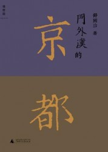

# 我的2012年年度书籍推荐

推荐新书往往会有风险，因为未曾经历过时间的淘洗，不免会出现各种问题。荐书者往往愿意向大家推荐一些经典性著作，因为这些书经历的时间的考验，其质量必然是信得过的。但这并不意味意味着我们可以无视浩如烟海的新出版书籍，其中不乏佳作，所以我就从中选取一些我感兴趣的书籍向大家做一推荐。

我的推荐基本立足于个人的兴趣与口味，所以绝非什么必读书目，只是拣出去年出版的一些少有人推荐的好书与大家分享而已，因而个人色彩很重。我这个新书推荐大概学术的味道会重一些，但推荐的学术书以有趣为标准，那些专业性太强的就不在我的考虑范围之内。

读书这种事情（非专业学习），到了开书单的地步就不好了，这个推荐里的书大都不是什么年度必读书，只是读来有趣而已。我看了各种媒体的年末推荐，大多一年以来的畅销书，有销量打底，大概质量总不会太差。但正因如此，有些值得一读的书，只因其销量不佳而沦为所谓“沉默的声音”。所以我大概翻检一下今年出的一些新书，里面有一些确实不错，却被很多榜单都遗忘了，这真是万分地不该，所以特别做了一个这个推荐，希望和更多的人分享一些有趣的非主流阅读书籍。

### 

### **[1、 舒国治：《门外汉的京都》](http://ishare.iask.sina.com.cn/f/16817067.html)**

我读散文不多，也没有什么特别推荐的文学作品，故而推荐文学是一件让我很头痛的事情，如果非要推荐的话，舒国治的书我认为是非常值得一读的。舒国治是我非常喜欢的作家，他的散文有一种奇异的安静感觉，但此君似乎并没有什么名气，名副其实的小众作家。这本书描写的主题是京都，也是非常能够惹人兴趣的话题，谈日本的文章一般也会有一种特殊的祥和。和李长声老师的《东居闲话》相比，舒国治的文风别具一格，能给人带来完全不一样的阅读体验。

### 

### **2、 黄道炫：《蒋介石：一个力行者的思想资源》**

[![u=4039474176,966057207&fm=11&gp=0[1]](3437a076-4ecf-4fc9-9a74-2e6672ca6321.jpg)](/archives/29293/u4039474176966057207fm11gp01)

研究蒋介石的人极多，今年大陆还引进了陶涵那本大红大紫的[《蒋介石与现代中国的奋斗》](http://ishare.iask.sina.com.cn/f/20791089.html)。而如黄仁宇和杨天石从蒋介石的日记出发解读蒋介石，也堪称经典的研究。黄道炫先生另辟蹊径，从蒋介石的阅读出发，解读蒋介石思想的渊源，无疑让我们这些习惯于立足纯政治史阅读的人感到耳目一新。书单这东西其实就是在说读书的事情，所以这种有关读书的书籍也值得拿来分享一二。

同类阅读：汪朝光等：《天下得失》、提摩西·莱贝克：《希特勒的私人图书馆》

### 

### **3、 刀尔登：《旧山河》**

[![00142246e9801137920603[1]](9a369bb6-5bb6-418d-8342-db9db2ea565e.jpg)](/archives/29293/attachment/00142246e98011379206031)

中信出版社的这个系列当以野夫的[《乡关何处》](http://ishare.iask.sina.com.cn/f/25328819.html)最为出色，以至于人们常常忽视了这个系列的其他作品，这本《旧山河》就是一个被忽视的佳作。刀尔登笔下的人物不能当做历史事实来看，此书并非一本学术著作，最多可以视为作者的读史札记，或者干脆可以视作历史散文。作者嬉笑怒骂，读者读来也是一种极为畅快地享受。此书为专栏文章的结集，文章的长度收到限制，每篇长度所差无几，故而若是一口气读完，可能会有审美疲劳之感。可以将此书置于举手可及之处，得闲时翻阅几篇，才不至于错过此书的精彩之处。

### 

### **4、 木心：《文学回忆录》**

[![res13_attpic_brief[1]](d2819b0e-0c70-423a-83fc-aafad14b73d3.jpg)](/archives/29293/res13_attpic_brief1)

准确地说，木心的这本书是2012年的末尾出版的，所以大多数榜单未能收入，我也就捡个漏子。我以为，此书当为2012年最优秀基本书之一，因为这书刚刚到手，截至目前为止我只读了里面的一些章节，但这不能阻碍我给予这本书如此高的评价。木心这个名字就是这本书质量的保证。不过需要注意的是，就我的阅读体验而言，这本书的个人色彩极强，堪比钱穆先生的[《晚学盲言》](http://ishare.iask.sina.com.cn/f/16183559.html)，所以读起来一定要注意，很多一家之言不可尽信，还需要有一些文学史的背景阅读为好。

### 

### **5、 江勇振：《月亮·星星·太阳：胡适的感情世界》**

[![22633502-1_e[1]](a68abe78-e283-4f47-96e1-c227f30424f9.jpg)](/archives/29293/22633502-1_e1)

这书不能算是新书，只是旧书的增订本重新出版而已，不过为了满足我对胡适的偏爱，特将这本书掺进这个新书书单里。不得不说，近代人物的感情史一直都是八卦界重要的材料来源，诸如林徽因和金岳霖、沈从文和张兆和，更不必说徐志摩复杂的感情史。作为近代中国最为重要的学术人物之一，胡适的重要地位毋庸置疑，而其感情生活也是非常有趣的。本书的作者江勇振，是一名专业研究胡适的学者，因而书中对于胡适感情世界的描写，是值得我们相信的“八卦史”。

### 

### **6、 陈映芳：《城市中国的逻辑》**

[![2012081202410710950[1]](f7e2195f-ddf6-4872-aa62-03bb9376e05e.jpg)](/archives/29293/attachment/20120812024107109501)

城市与城市化是我们所经常讨论的话题，但是当我们讨论城市化的时候，更多地是从经济的面向上来考虑的。陈映芳的对于中国城市的理解正为我们提供了一种全新的视角。我一向佩服社会学家的研究方式，他们对于中国问题的研究大多是接地气的作品。从社会学的角度理解当代中国的城市，我们既避免了如很多文学作品一般过于感情化的文学表述，又能将经济学中被抽象成数字的城市图景还原出来，这样看来，像《城市中国的逻辑》这样的著作自然是能多一些才好。

### 

### [**7、 罗杰·伊伯特:《伟大的电影》**](http://ishare.iask.sina.com.cn/f/25091826.html)

[![s9100236[1]](31045a3a-1827-42e9-b2b1-4523856e57f1.jpg)](/archives/29293/s91002361)

我们热衷于评选年度书籍，当然也有人热衷于评选年度电影，这本书的作者罗杰·伊伯特就是这样一个热衷于影评的职业作家，这本书就是作者一些影评的结集出版。这位影评家的口味非常有趣，在这部书所评价的的一百部电影中，黑白片占了一大半。作者在导言中忍不住吐槽那些不喜欢黑白片的观影者是“无可救药的庸俗”，他对经典老电影的逝去表示痛心疾首。在我们今天这样一个电影工业空前繁荣、电影技术日益成熟的时期，重温这些经典的电影，似乎能够给我们带来一些与众不同的体验。

### 

### **8、 易社强:《战争与革命中的西南联大》**

[![8699180916753473738[1]](028a402b-36e9-43ac-9e5a-05ceb0efa92d.jpg)](/archives/29293/attachment/86991809167534737381)

近代的大学校园总是被人当做理想型来批评现行的大学制度，尤其是西南联大这样一个近乎近代教育史上的传奇，更是常常为人所提起。但是，近代的大学生活究竟是怎样的，却有待于我们进一步地了解。易社强的这本书就是一个对西南联大历史的严谨地学术研究。和以往岳南等人的近乎小说体不同，此书是一本严谨的学术著作，希望了解近代大学制度的同学可以多读读此书

同类阅读：[《联大八年》](http://ishare.iask.sina.com.cn/f/23809709.html)、叶文心《民国时期大学校园文化》 

（采编：陈芝，责编：陈芝）
