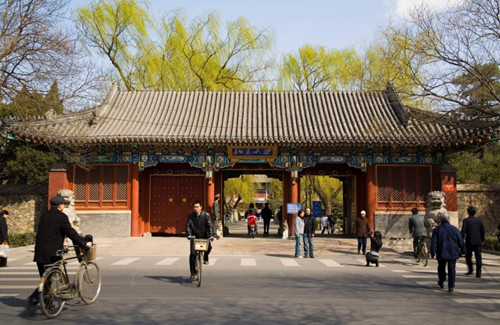
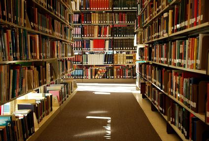
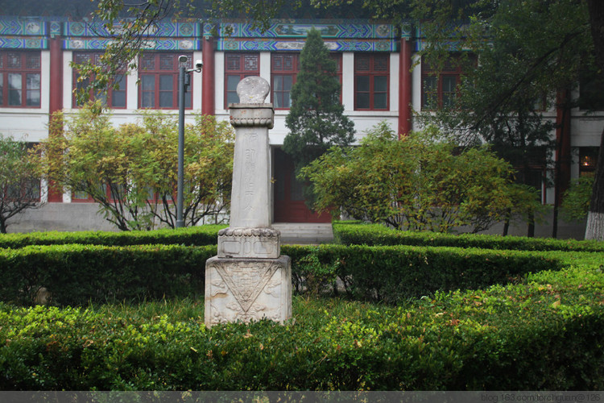
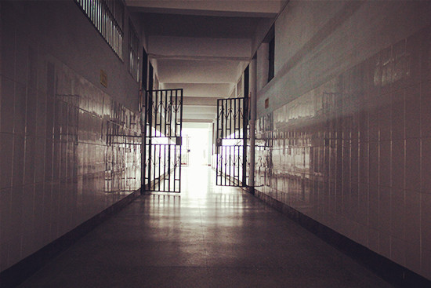

# 我的大学

###中关村###

我一个人坐在咖啡馆，这里是中关村。没有村长，美女很多，过马路从来不守规则，破旧的地方同样需要翻修。

这是一间韩国人开的咖啡馆，椅子有点高，敲键盘不舒服，书架上摆的书不是那么无脑。以前有篇文章流传很广，名字叫“我奋斗了十八年，才和你们坐在一起喝咖啡”。我的故事没有那么惨烈，只是有些惨淡，因为现在的我是一个人，玩得好的弟兄姐妹都走了，离开北京了。

我从一个小山村考进大学，一进校门就将深深的自卑埋在心里。我跟同学们说，小时候家里穷，炒菜没有油，爸爸去邻居家借了两酒杯菜籽油，妈妈用口罩蘸了沿着锅涂一层，然后将菜下锅。这当然是我瞎编的，同学们哈哈大笑。我比较幽默，一定程度上遮掩了自卑，虽然普通话说得很土，他们一点也不嫌弃，喜欢和我玩。

我第一次进咖啡馆是和张大彪一起，结账时我坚持AA，他同意了，这是他的风度。张大彪长得帅，举手投足有派头，精英范儿很足。他喜欢和我扯闲天，总是先高谈阔论一番，然后说“你来自基层，熟悉情况，你觉得呢”。我虽然来自基层，但是从小埋头学习不闻窗外事，算不上了解情况，只能说说家乡的人和事，不知道对于张大彪的治国理政有没有帮助。很久之后，有人跟我说学校的实践团到地方上和别的院校联谊，团队负责人开口就说你们地方院校怎么怎么样，搞得对方非常不爽。我听后笑笑，说这个带队的情商也是够低的。不过在当时，我在张大彪面前没有觉得丢面子，自己的经历和他的算是优势互补。
 
在张大彪的影响下，我在校团委的职能部门混过一段时间。我从小接受的教育就是好好学习，爸爸妈妈打电话给我，说的总是“好好学习钱不够了跟家里说”。搞人际拉关系非我所长，学生社团里勾心斗角，我夹在中间很为难，活动慢慢就不去了。时间长了，我开始明白这些都是正常现象，在什么地方都会遇到。在当时我心里受不了，一直以来期待向往的大学怎么会是这个样子，有种幻灭感。没办法，只能和学生官僚一拍两散，从此之后再没复合。

后来老师跟我说这是一个立场问题，站在什么样的立场，就会看见什么样的世界，基本立场站住了，大致就决定了你是一个什么样的人。决定你立场的，不是学了多少知识、读了多少书，而是天性和禀赋，某种先验的的东西。我那时候刚刚开始求学，老师的一番话让我受到巨大震撼，他的原话更加精巧、有说服力，只是我现在记住的不多了。

我也没能做个完全清高的人。保研的时候，张大彪在学工系统工作，我托他打听了不少消息。后来我请他喝酒，张大彪说我的性格不适合混体制，还是单干容易出成绩，还说他虽然是学生干部，其实更愿意和我这样的人打交道。此时我们比大一时候生疏了不少，他说话也习惯了打官腔，我不知道他的话里多少是场面话多少是真心话，就笑笑说你喝多了。

印象中我和人激烈争辩只有一次。张大彪让我回团委工作，不喜欢搞关系可以去清闲的部门当笔杆子，我不去。后来我俩两吵起来了，先是甩了对方一通脏话，然后开始争一些救国救民的问题。现在回想起来只会觉得傻逼，但当时年纪还小，感情都是真挚的。

张大彪说读书不能读得一身文人气，总是批判不去建设有什么出息，多骂几句废话不能让世界前进得更好。

我说扶大厦于将倾是本事，扶阿斗才是没有出息。

张大彪说汉献帝不得不扶。

我说你是傻逼，这是台湾谢长廷的话，而且谢长廷最后也没能成曹操，你学谢长廷的话以后更不可能成曹操。

现在我承认这话说得过分了，张大彪是有抱负的人，他会记一辈子的，虽然这和记仇是两码事。他听后扭头就走，隔了几天发短信给我，说烂文人又臭又硬。我回复他，说领导干部不能有架子，你合格了。

张大彪不能算顺风顺水，最大的挫折是输掉选战。

团委官僚习气很重，张大彪想换个环境，做些活泼向上的工作，大三参加了学生会选举。张大彪身上是有能量的，只是这种能量长期处于压抑状态。有一次系里开会学习领导讲话，老师和学生骨干都在。进入自由讨论阶段，有同学说现在左派和右派都是少数，大部分人的政治态度是温和的，属于中间派。说这话的是个长相清秀的研究生师兄，老师们向他投去了赞许的目光。这时候，作为本科生的张大彪举手要求发言，他说他不同意师兄的观点，现在大部分人的政治观点是右的，只是大家藏在心里不说。系里的学工老师为了稳住会议方向，半开玩笑地说，大彪啊，别人藏在心里不说你又是怎么看出来的呢？我在心里暗暗替张大彪担心，如果他是这样想的，以后进入体制心里一定会非常纠结、痛苦。

张大彪的选战打得轰轰烈烈，那一阵，连成天躲在宿舍的我都感受到了他的宣传攻势，像章传单满天飞。我可以肯定，选举期间是张大彪最忙碌最快乐的时光，像章上的他笑得那么自信，印在传单上的标语是“要选就选咱彪哥”。张大彪的努力并未换来应有的结果，他输给了暗箱操作。失败以后，他在网上发了选举感言，一时引起轰动，也赚取了团队里不少漂亮小美眉的眼泪，这一点我挺羡慕。我听同学说，学生会选举要是所有学生人手一票的话，张大彪百分之一百当选，他的做法太西方化，搞得像美国总统大选，所以引起少数权贵的不满。这个说法还算靠谱，可是我不敢全信，要说权贵，张大彪自己不就是权贵么？

张大彪找我喝过一顿酒，我知道他心情不好，就一直和他说好玩的，让他介绍我认识竞选团队里的美女。张大彪自始至终没有提竞选的事，问我以后的打算以及班里的八卦。他比以前成熟了，我替他高兴，也就顺带着说了一句真心话。我说既然你选了这条路，就不能总是和我这样的人走得太近，多去结识权贵。他没说话，点点头，和我碰杯。

我去保研面试，发现张大彪也在，手里拿着表格。我问他怎么也在，他说系里人手不够，临时找他当秘书组织面试。我说权贵真是无孔不入啊。面试完毕，他和老师们在屋里登记分数，过了好长时间，他出来跟我说我通过了，看得出来他替我高兴。我问他毕业去哪，他说中央选调或者地方选调吧，具体的选择过段时间才能定。

张大彪最终选择了去地方，广西北海，离家离校十万八千里。我得知这个消息的时候，正在崭新的研究生宿舍整理床铺，他发了两条短信。第一条是：兄弟姐妹们，哥们下基层了，广西北海，这是新号，常联系。——张大彪。第二条似乎是专门发给我的：苟利国家生死以，岂因祸福避趋之。

实话实说，那一刻我的眼眶湿润了，大一时候那个以天下为己任的张大彪仿佛又出现了，他就坐在我对面，谈农村的破败，谈城市的浮华，谈得口干舌燥喝一口水，“你来自基层，熟悉情况，你觉得呢”。

我在心里佩服他，也祝福他，只是不想太矫情，短信只回复了两个字，“蛤蛤”。

###美国###

我和张大彪吵完架，心情很糟。

退出学生社团，要说一点不后悔，那是不可能的，虽然我觉得“人脉”、“人际成本”这样的东西全是垃圾，可是完全不与人交往，确实很难做到。

很长一段时间，我真的这样做了。在宿舍、图书馆、咖啡厅找个角落蜷缩起来，做喜欢的事。

我没吃早饭进了图书馆，不间断读了九个小时《柏拉图全集》，王晓朝翻译的，译文很烂，到下午四点半，我把四本都翻完了。那一天是我本科时代最美好的回忆之一，到了一百岁也可以跟别人吹牛逼炫耀。之所以美好，还因为我把书合上的时候看见了坐在对面的漂亮女生。

哦！柏拉图赐给我的礼物，张小雪！

我不是想编造一个烂俗的图书馆爱情故事，事情确实就那样发生了。为了全方位观察张小雪，我端着满满的水杯假装去打水。她头发很长，生殖能力强的表现，为了看书方便扎了起来。穿着白毛衣，日系那种，很宽松、毛茸茸的。腿好长好长啊，坐着都能看出来，灰色的袜子有点薄，她一定很冷吧，让我摸摸多好！可能我的眼神太饥渴，张小雪应该察觉到了，捋捋头发，把书举起来又放下。

我走过去：“同学你听见了吗？”

张小雪看看我：“什么？”

“同学你能听见我砰砰的心跳声吗？”

张小雪听懂了我操蛋的问题，翻了我一个白眼，但还是忍不住笑了。她说我没听见你的心跳，一直在听你的肠鸣，你是不是没吃饭。虽然我有些尴尬，但是刚刚读完柏拉图，当然是雄辩滔滔。我说十九岁的男生你知道吗，在球场上可以跑得像风一样快，对知识和美女的渴求像猛兽一样饥渴。张小雪被逗乐了，这次笑得露出了牙齿，像狗牙一样整齐。她说你翻书也像风一样快，能记住吗？这时候我肚子又响了，于是机智地提议去食堂吃饭，去晚了抢不到好吃的。

真是饿了，我一口气吃掉九个包子。吃完了我问张小雪自己的吃相美吗，张小雪说没关系，她妈妈说男生吃的多是好事情。张小雪说她想学英美文学，将来想去美国留学，正在背托福。她问我是怎么打算的，这下把我问住了，只能实话实说。她听后点点头，留在国内也很好，是金子在哪都会发光。这样说话很善解人意，我还是觉得自尊心被戳了一下。

之后就换成她主动了，当时我觉得奇怪，后来明白了，张小雪的主动不止是性格好的原因，也需要很大勇气。可惜我那时的自尊其实是源于自卑，没有足够的勇气回应张小雪。从食堂回图书馆的路上，我话很少，一直是她在说，于是我知道了张小雪的淑女形象背后藏着一个女神经病。晚自习她把座位挪到我旁边，把奥利奥分给我吃，图书馆闭馆音乐响起的时候，她让我送她回宿舍。

张小雪要给我过生日，我说我从来不过生日。她说给你买个蛋糕吧，我说我从来不吃蛋糕。她有点不高兴，最后还是送了我一杆钢笔，让我好好写东西，我板着脸说谢谢，她赶紧跑了。张小雪还会送我水果，她买的水果都神经兮兮的，比如让我吃木瓜、榴莲，大冬天送椰子，凿了洞送到我手里汁都冻成冰了。有一次她正常了，三伏天喊我吃西瓜。我两俩坐在宿舍楼下的长椅上，我像猪八戒一样啃掉好几片，她突然将西瓜皮砸在我脸上。

“要不是你撩骚，我也不会这么厚脸皮送这送那。”

我当时就吓尿了，脸上还沾着西瓜子，直愣愣看着她。

“我操你大爷，你再不表白，老娘就跟别人了！”

我当时第一反应是脱口而出一句“操”，擦擦嘴问她肿么了。然后张小雪就哭了，我心一横就把她搂进怀里。明明知道最后不能在一起，还是这么做了，还不如一开始我主动点，那样的话张小雪就不会哭了。

张小雪天天和我黏在一起，夸耀美国有多么牛逼，我话少的时候，她就会说你知道吗我们美国怎么样怎么样。斯诺登事件之后，学校电视台闲得蛋疼，在宿舍区搞了个采访，采访各种路人对窃听门的看法。一个女记者拦住了我和张小雪，记者是师妹，长得不错，我多看了两眼。张小雪大概吃醋了，回答问题的时候像打了鸡血一样，各种学识炫耀外加英文单词往外蹦，用中文说的时候强势排比，我们美国的自由怎么怎么样，我们美国的民主怎么怎么样，我们美国的法治怎么怎么样。师妹有些不服，问窃听门难道不是美国自由民主的讽刺吗。张小雪说你这个问题太笼统，应该分开看，然后旁征博引又爆了师妹一轮。

师妹的最后一个问题是：“美国这么好，难道一点缺点没有吗？”

张小雪把手一挥：“美国太牛逼了，美国没有缺点！”

女记者的身后站着人高马大的师弟，扛着摄像机，憨厚的脸上满是汗珠。他放下摄像机，对我笑笑，安静而友善。

一起上课的时候，张小雪让我看她的手机。她微信关注的都是什么瘦腿、减肥、女人心计一类的无聊公共号，这次让我看的是瘦腿推送的一个的调查，说女人在不知情的情况下突然被摸大腿会促进血液循环，更容易瘦腿。我就伸手摸摸她腿，说手感不好。她问为什么，从课上追问到课下，像神经病一样。我说下次穿丝袜，最好是带点花纹的那种，摸上去有起伏感。她骂我变态，然后过几天穿了带星星花纹的黑丝，大老远就冲我喊“快来摸快来摸”。

彼时秋风正劲，银杏叶满天，校园里一片金黄。

后来张小雪去美国了，走之前留给我一本书，扉页上写的是  Detour to Romance   我翻译成“曲曲折折浪漫路”，张小雪说不错，接近我们美国的翻译水平了。

我得承认，张小雪的神经兮兮有时候让人受不了。她的脑子很清楚，不仅比同龄的男生懂事，也比同龄的女生更懂事。张小雪去美国之后没再联系我，我也没联系她。

这是个悲伤的故事。

###办公室###

按照系里要求，大学三年级需要完成一篇学年论文，鼓励学生自己联系导师，自己不联系的系里指派导师。我平时疏懒惯了，根本没把这件事放在心上。

大概五月份的样子，窗户外面开始有蝉在叫。我接到一通陌生电话，说是我的指导老师，我问什么指导老师，对方说你这个同学也真是的，压根就不知道学年论文的事情吧，怪不得一整年都没有联系我。我意识到问题严重了，赶忙道歉，并不断强调自己真的疏忽了。

老师说你先来我办公室一趟吧。

办公室很雅致，书架之间有几幅版画。老师问我论文的事情怎么一点不上心的，是不是不喜欢这个学科。我说女朋友今年出国，和我分手了。他哈哈大笑，说你很厉害嘛，能把师姐追到手，现在女孩子可不喜欢比自己年纪小的啊，不像我们那时候，女大三，抱金砖。我刚想笑，他又板起脸，说这都五月份了，六月要提交论文，总不能我帮你写吧，你把以前写的东西整理整理先弄一篇应付过去，毕业论文再好好写。

我觉得这个老师很实在，回去下了一番功夫，新写了一篇送给他看。他又把我叫到办公室，说你看了不少书，想法也很尖锐，但是有两个缺点，一是喜欢反驳别人，二是论文没有注释，这都是大忌，必须得改。我给文章加了中英文注释，又缓和了行文语气，再次送给他。他匆匆浏览一遍，表示满意。

老师泡了两杯茶，推给我一杯。看我不爱说话，他就打开了话匣子，说年轻时候插队挑土建大坝，后来被发配去修铁路，和少数民族打架。我越听越带劲，情不自禁问以后能不能跟着老师学习、读研究生。他笑笑，问我对哪些方面感兴趣。我说想关注一下农村城市化的问题，解决农民问题的根本之道是消灭农民，城市化不能走回头路。现在想想这些大而化之的命题会觉得脸红，老师当时很宽容，鼓励我多看些资料再作出更精准的判断。

研究生三年，我每个周末都会捧着一堆资料去办公室求教。在喝茶聊天中，我读了米瑟斯、哈耶克，和老师一起看了电影《美丽心灵》，他还抽空和我一起读《死屋手记》。很长时间我都没意识到老师只有我一个研究生，后来消息灵通的张大彪告诉我老师年轻时候犯过“政治错误”，八九年差点坐牢，老先生保他过了关。这么多年他在系里一直是边缘人，开课也少，几乎没有学生找他指导，我是误打误撞才成了他的学生。

老师很勤奋，一个人的工作量相当于一个团队，虽然辛苦也有好处，大量基础工作让他对数据和材料非常熟悉。我提出分担一些简单的工作，帮他跑跑腿，他说太耽误时间，你们年轻人应该有自由时间好好看书，不要被老师的研究项目绑架。我开玩笑说你就我一个学生不用白不用，他乐了，说也行，年纪大了精力确实跟不上了。

说是简单的工作，老师总把最重要的数据处理交给我做。他说天才的禀赋也比不过长期的训练，要珍惜年轻的时光。现在的政治环境偏紧，学术环境太松，很多学者多少年不出成果还洋洋自得，现代学术条件不允许这样，他们不合格。很多人之所以松松垮垮是觉得没劲，觉得没劲是因为时代环境太龌龊。年轻人能做的就是自己上紧发条，为未来做准备。

大学者也有无脑的时候。有一次老师带我出去调研，调研地点是一个全国贫困县，我们走访了几户村民，家里都超生，女孩早早就辍学了。老师临走把口袋里的钱全掏出来留给他们，让孩子去上学，我也跟着把钱全拿出来。走到村口，我们的心灵都被刚才的善意充盈得满满的，然后发现没钱坐车回县城了。总不能再回去问人家要吧，老师摸摸口袋，还有两个钢镚，我的口袋则全空了。他看见村口的小店里有个赌钱机，两眼放光，把钢镚塞进去了，不到一个小时赢了七十块，六十买了车票，剩下十块吃了两碗面。老师在车上跟我说赌钱机的选项不多，大致算算概率，加上点运气还是能赢的。

我和老师起冲突是快毕业的时候。那时候我想早点工作，缓解家里的困难。我把硕士论文送给老师，他看了很赞赏，逗逼地从衬衣口袋里拿出一支钢笔放到我面前，it's my honour。我两都大笑，这是《美丽心灵》的片段。然后我就脑洞大开，不识时务地谈起工作的事情。他听说我想考公务员当即大怒，说你本身就是学经济的，我带着你读了三四年书，原以为你是懂道理的，你天天帮我处理数据，这个社会溃烂如许难道你心里没数吗，你要是想工作养家糊口我只是觉得可惜，你要是进入体制以后便不再是我的学生。我想缓和一下气氛，就说老师你怎么讲话还蹦出文言词了，有点像鲁迅的口气。老师一点都没笑，我知道完蛋了，因为我已经下了决心去工作，不可能退让。当时我心里也急了，不想再争吵，只能用我所出生的小山村里最原始的方式，跪下来给老师磕了一个头，走了。

老师最终把我留下来了。他说马克思韦伯那两篇演讲你也读过，里面就引了两位文学家，都是俄国的，一个是托尔斯泰，一个是陀思妥耶夫斯基。我带你读过他们的小说，你现在要做的不是去圣彼得堡犯罪，而是去西伯利亚赎罪，赎罪的方式就是排除一切干扰，锄草、劳动、休息，循环往复永不止息。我觉得这个老头有点肉麻，但多少还是被感动了。老师说《美丽心灵》里导师对纳什说 you haven't focused，三心二意是学人的大忌。我没再找借口，答应老师继续完成学业。他点点头，说我那天磕头的举动挺吓人，而且土得掉渣。

老师的办公室在一栋古建筑的二楼，南面向阳，窗外树影婆娑。

###宿舍###

博士入学，我的宿舍在靠近楼道的位置，和盥洗间斜对门。我们系人数少，这一届招进来的男生是奇数，于是我就被发配到“天涯海角”，一个人住。

盥洗间附近是背着室友打电话的好地方，如果哪天晚上碰巧有和女朋友吵架的哥们就彻底瞎了，在电话里能吵一两个小时，并且吵架内容信息量极大，引人入胜，于是什么事都别干了，安安静静在宿舍里当听风者。那段时间，我疯狂地爱上了重金属摇滚，买了两个音箱，摆出嚣张的架势和电话婊硬扛。

这种状态没能持续，宿管中心的老师找到我，说有个物理系的博士，室友说他精神有些失常，不愿和他一起住，其实只是性格有些孤僻，没他们说的那么严重。现在学校没有空闲的博士生宿舍，考虑到你做过一段时间学生工作，又是老（chun）党（diao）员（si），想安排他和你一起住。我在心里呵呵了一下，估计他们觉得我精神也有问题吧，正好可以住一起以毒攻毒。我说没问题，组织上培养我这么多年，这种时候当然要服从大局。宿管老师又夸了我几句，笑吟吟走了。

马克是大半夜搬进来的，我早上醒来发现对面床上睡了个人，吓得半死。既然见识了他的神经病，我就老老实实生活，不去招惹他，也不主动和他说话。马克有一些不好的习惯，比如我在电脑上工作，他总要停在那看一会，我很烦他这样。有一次他站在我后面看，然后发出一声冷笑，我后背凉了一下，手里虽然还在敲键盘，脑子已经乱了，在想这个家伙会不会有一天拿刀砍我。马克先出声了，他指着电脑屏幕，说这个数据是错的。我看看，说数据跑过一遍了啊，应该不会错，不过这个是分枝上的，也说不定。他拿了纸笔在我桌上写了一阵，就坐到自己床上啃面包去了。我看看他的演算，用英语形容就是neat，而且neat一逼。我又仔细算了一遍，那个数据确实错了。

我停下手里的活，说行啊哥们，你够牛逼的，心算就搞定了。他冲我笑笑，说以前搞竞赛算过类似的，所以能记住，遇见新的也得老老实实算。马克夸了我两句，说我数据做得扎实。慢慢我发现这个家伙聪明绝顶，还很谦虚，事实上他遇见新的数据也还是心算，很少出错。马克时不时和我讨论奥古斯丁、托马斯阿奎那，最后说物理做到最后都是哲学，给足文科生面子，说明他很会做人。在马克面前，懂就是懂，不懂就是不懂，只要稍微装个逼，马上就会被戳穿。原来的室友说他有神经病，估计是他们太笨蛋了所以受不了吧。

马克学的是理论物理，经常在草稿纸上写写画画。我有一次小心翼翼问他为什么不出国，开玩笑说学校里最闲的人就是物理系和中文系的博士生。马克说他的主要工作是数学，在国内也一样。他每天过得像个文科生，看历史书、哲学书，还读读佛经，真正辛苦的工作在午睡之后到晚饭之前，大概有三个小时，在草稿纸上写个不停。吃过晚饭就拿着草稿纸看，有时候睡前把草稿纸撕掉。

有一天晚上，马克盯着草稿纸看了好长时间，然后仔细叠好夹在书里。他看起来心情很好，问我留在学校做研究是为什么。我说一方面喜欢，另一方面希望自己的工作对改进社会有用。他表示赞同，说自己的工作今天可以告一段落，还兴致勃勃和我一起看了美剧。

马克用英文写了一篇论文，让我在文字上给他把把关。我看了一遍，说卧槽你这个论文整篇就没几个英文单词，全是运算过程，让我看个毛。后来论文发表了，引起不小的轰动，我在网上搜过一些评论，都用了breakthrough这个词。我替马克高兴，他终于熬出头了。

出了名，马克的生活没变，日子还是那么过。似乎他在解决一个更难的问题，每天工作时间更长，经常眉头紧锁。每到这个时候，我都会悄悄退出宿舍，到老师办公室或者图书馆继续工作。马克在学术上的成就一定会远远超过我，不能打扰他。后来我睡觉半夜翻身的时候，看见他的台灯还亮着。我叫他，半天他才答应，我说想不出来就休息，别把身体熬坏了。他把眼镜摘了抵在嘴角，说自己也搞不清楚现在是什么状态，是搞研究作贡献，还是硬赖在学校不走。我一时没答上来，就说你别多想，早点休息。

直到今天我都在后悔，当时应该和他多说一会，哪怕是废话，我想当然的以为马克不想听废话，其实不是那样。

说到这，结局大致都猜出来了。对，马克死了。他是突然死掉的，不是自杀，在床上坐着就没了。送到医院心跳已经停了，医生查不出原因，除非解剖。马克家人不同意解剖，一直问我马克的情况，我也觉得有责任把马克寡少的语言复述给他们。马克死前一直在嘀咕，说有个小瑕疵，之前他想问题从不出声，我就问什么瑕疵。他说问题解出来了，有个范围要限定，可是有个数总在跑，捉不住。我走过去看他的演算，根本看不懂，草稿纸上密密麻麻。马克确实遇见了大困难，他是从来不屑把每一步思考都写出来的。

我听过不少个版本的天才之死。据说中国刚开始市场经济的时候，经济系有个老师跳楼自杀了。还据说有个数学家点错了小数点，算不出来急的跳楼了。马克死后，我把他的草稿纸收起来，找数学系、物理系的老师看，我怕他因为某些傻逼的原因死了，虽然我心里固执地认为以他的才华不会犯低级错误。老师们看了草稿纸，都说短时间完成这样的工作量简直是奇迹，但他们也不知道具体问题出在哪，完全看懂马克思考过程的没几个。有个数学系的老先生很认真地把马克的草稿纸复印了，过了一个月打电话让我去找他。他先把马克的草稿纸还给我，说虽然复印了，不会剽窃。然后他拿出自己的演算，老先生说这个孩子思维太跳，我顺着他的思路换了一种更稳定的算法，最后有个变量没法确定范围。我看看老头的演算，最后是个字母，马克的草稿纸最后是个1，画个圈打了问号。

最后老教授征求了马克家人的意见，将他的演算加以整理，以马克的名字发表了。他做了一项了不起的工作，把命丢了。我没有觉得太遗憾，马克自己也不会，他死在了智力的顶点，这是聪明人的荣耀。

马克是我在学校最后的朋友，我们的友情原本可以更长。

我在学校十年了。

十年前，我刚刚迈进校门，师兄告诉我男人之间的玩笑只有两种，政治和性。和张大彪讨论国家前途的时候，和张小雪讨论丝袜的时候，我是由衷感到快乐的。现在回想起来，我会嘲笑当时的自己，即便是这种嘲笑，也能让我忘记现在的一切烦恼。唯一让我感到沉重而难以挣脱的，是老师和马克这样的人，他们未完成。我知道自己穷尽一生也只能换来一个未完成，像无尽隧道里的旅人。而过去呢，张小雪硬生生将我挡在机场闸口外面，而现在呢，张大彪在光秃秃的地头晒得黝黑。我们的所有期盼都是残缺，回忆也只是模糊。

有一盏台灯，灯罩是浅蓝色的，上面落了一滴巧克力。有只毛毛虫在灯罩里面，看见了外面的斑点，慢慢靠近它，伸展躯体与它重合，然后一动不动，直到被烤焦，重重跌落在冰冷坚硬的坟墓上。

（采编：徐蕾；责编：刘铮；）

 
