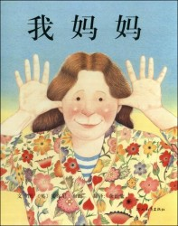
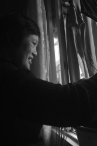

# 我的母亲

我的母亲是个怪人。

年轻时的母亲有着就那代人来说颇为光鲜的履历，高考刚恢复那年以超过重点线60多分成绩上了东北工学院（现东北大学），从热处理专业毕业后成了一个工程师，几年后就评了高级职称。考过一个高翻证，据说因为工作跟军工有关还被送去参加过间谍训练，最后因为练习越野车吓得大呼小叫而不了了之。听到这些描述可能有人会脑海里浮现出发福了一圈长了不少皱纹的女特工尼基塔形象来，其实母亲的长相并不出众，大圆脸水桶腰衣着朴素不施粉黛，除了一米七的个子稍显不同外就是一个慈眉善目的居家老太太。

从很多方面来说，母亲都是一个笨拙到了有点儿迟钝的主妇。她不喜欢做家务，做饭粗糙到一个土豆切三刀不去皮扔油锅里翻三下就是一盘菜，就这样还经常伤到自己。母亲的口才也不好，絮絮叨叨说半天经常就把主题忘了，所以跟她交流是件痛苦的事情。我经常在她凑上来想跟我谈谈一天见闻的时候就挥手驱赶，母亲脾气太好，对我如此恶劣的态度也不抱怨什么，只是怏怏走开。

母亲另一个让人头疼的特点是没有主见，爱随波逐流。这种性格三番五次地让她上当。气功热的那两年她被朋友怂恿去练了大藏功，成日里听着又像佛经梵乐又像秧歌配乐的磁带在一百块钱买来的蒲团上打坐，还拿着一个仿制的景泰蓝瓶子让我拿着瓶口朝下冲她发功，硬说上师玉琦可千里之外通过瓶子给她灌顶。她自己一个人执迷不悟也就算了，还非要拉上我们全家去听大师的现场讲座。我把现场诸如隔山打牛五鬼搬运的奇景写到了作文里，被老师批了个“小小年纪就如此封建迷信”，拿到母亲那里去看，母亲颇为不屑，说叫你们老师来找我，我给她发发功她就信了。直到法轮功被定性为邪教组织，我妈才在家人的劝说下心不甘情不愿地放弃了大藏功，还总是念叨不可以偏概全，玉琦大师和李洪志不可一概而论，学习气功要去芜取菁。

气功之后她又被一个发小怂恿着参加了安利直销，家里摆了一柜子纽崔莱卖不出去，她就逼迫我们父子俩吃，说自己吃见效了再卖给别人才显得诚实可信，那段时间我和我爸都感觉自己像临床医学实验室里抓来的小动物。直到父亲吃安利钙片吃出了骨质酥松，我妈才作罢。

我曾经开玩笑说，我妈属于那种骗子看她身无长物放过她她都要追上去扯住骗子不撒手的人。

某些时候母亲又有着偏执甚至是狂热的一面。前两年饮食不规律让她的血糖出了问题，母亲买回了一台血糖仪。隔三差五给自己扎一针测血糖。这种习惯很快变成了一种爱好，而且从她自己蔓延到了身边的人。只要有亲戚或朋友跟她提到最近身体疲累，头晕脑胀，她就非要追着扎人家一针。作为实验室小动物一号的父亲自然没被放过，搞得他手指尖都是细密的小口子。甚至有一次我随口说这两天工作太累，我妈听了就开始摆弄她的血糖仪，我吓了一跳，大声表示抗议：

“妈，我才二十五，哪儿可能得糖尿病？！”

“防患于未然呗。”

“你这是没病非要给我找点儿病出来！”

“不要讳疾忌医。”

我忍无可忍，突然灵机一动想起国外的Intervention来，就是找来一个对某件事儿痴迷成瘾的人的所有亲戚朋友，每个人都说一段话让这个人幡然悔悟，这种活动好像叫介入治疗。我威胁母亲，如果她继续这么热衷于扎别人测血糖，我就把全家人叫来开个介入治疗会，好治治她这种奇特的怪癖。

“好啊，都叫来吧。”母亲出乎意料地欣然赞同。

“真叫了啊我。”

“嗯，正好全家人聚一块，省得我拿着血糖仪到处跑。”

“......"

由此可见我的母亲执拗到了何种地步。

母亲对新事物有着超乎其同龄人的兴趣，尤其是网络。今年年初我去上海工作前，久病成医的母亲突发奇想要开一个关于糖尿病预防与治疗的博客，要为网上广大的糖尿病患者送去福音。我只好帮她申请了一个博客，开始叫“糖尿病患者的诊疗日志”，但是接连几天没人关注，我就自作主张改成了“康大夫私人诊所在线服务”。

从上海回来后，我有次无意点进了她的博客，发现居然有数百人关注。在留言板里充斥着这样的对话。

“康大夫，我女朋友一个多月没来例假了怎么办？”

“不好意思，我这个博客是关于糖尿病预防治疗的。”

“康大夫，我老公自从我产后就一直借口加班不回家，是不是有外遇了？”

“不好意思，我这个博客是关于糖尿病预防治疗的。”

“康大夫，最近鸡蛋是不是要涨价啊？”

“不好意思，我这个博客是关于糖尿病预防治疗的。”

我看了几条后就被各种奇葩留言笑喷了。而且母亲始终如一淡定回复的“不好意思，我这个博客是关于糖尿病预防治疗的”让这些评论更具喜剧效果。我于是指着电脑告母亲：“妈，你没看出来？这些人就是故意捣乱呢。现在网上这种闲人特别多，你这数百关注每一个关心糖尿病的，你还每天更新一篇，谁都要回复。有啥意思，快注销了吧。”

“不能注销，注销了就没人理我了。”母亲的话让我一愣。

原来她是这么寂寞，我第一次为挥手驱赶想要跟我说话的母亲感到不安。

早早从单位内退的母亲差不多在家坐了十年，不爱与人打交道的性格让她朋友很少，平时她宅在家里除了偶尔做做家务，也就是电脑上斗地主，或者拿着各种关于中医养生的书看，这样的生活确实索然无味。而我却一直以为她乐在其中。

我才发现我对母亲的内心世界毫不关注，我只知道她很懒，好上当受骗，不好打扮。心里想什么，我不知道也一直无意去探究。

其实就是我所知的有时也是错的。这些年母亲因为甲低（甲状腺功能低下）开始成片掉头发，她平常都戴着一顶假发。就在前不久，母亲出门遇上了一次事故，骑着自行车被一辆面包车挂倒，惯性让她跌飞出去受了轻伤。虽然伤势不重，但当时情形还是颇为惊险。母亲惊魂甫定后问我，你猜我当时飞出去脑子里想的什么？

我以为母亲会说以为这下再也见不到你和你爸你俩相依为命怎么办之类的煽情话语，谁想到她说了一句：

“我想着假发掉了，得赶紧捡回来戴上，不能让人家看见我这么丑的脑袋。”

我在哭笑不得的同时，突然意识到母亲也是爱美的，她在自己最好的韶华里想必也曾被各种各样的人追求和赞美，她肯定也做过年轻人光鲜亮丽的美梦，她肯定也曾心高气傲，也曾孤芳自赏。而这些都随着婚姻和家庭的现实被消磨殆尽，化成了迟钝、市侩、絮语和老态毕露。

要说起来，我该是这种变化的罪魁祸首。

我爱我的母亲，却完全不愿去包容她任何的缺点，而且自觉我的所有挖苦奚落和指责都理所当然。因为她是母亲不是爱人，我无需讨好无需委婉无需小心翼翼诚惶诚恐，因为我所有的伤害在她对我的爱里激不起一丝波纹。而她凭什么爱我？凭我把她从言笑嫣然的娉婷女子变成了絮絮叨叨的中年妇人？

我原来是这么一个无耻混蛋。在得到如此的恩惠之后，却从没想过要为母亲做些什么。

也许回家以后，我该让母亲用她的血糖仪给我扎上一针。

（采编：谢逸云；责编：刘迎）

