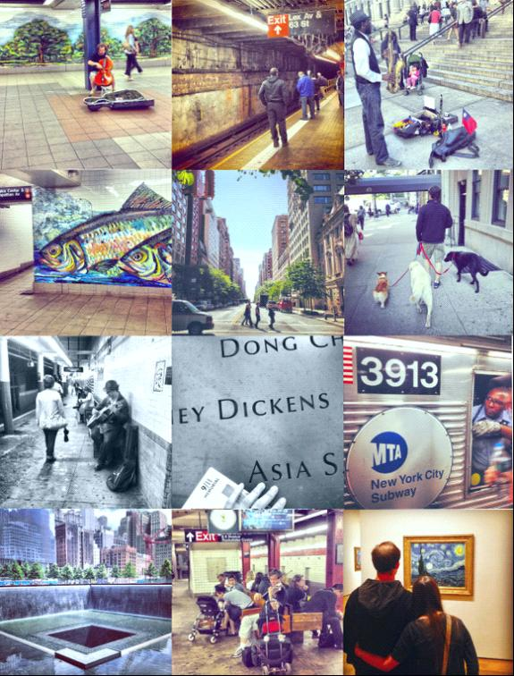

# 我眼中的“纽约客”

** **

#### （一）

早上六点半的时候，开往曼哈顿方向的地铁已经人满为患了。这是早起去拍火车的T先生告诉我的。每当新的一天开始，曼哈顿这个在地图上看起来细细长长、甚至显得有些小气的岛屿，却一下子被上帝赋予了一股巨大磁石般的吸引力。从布鲁克林区，皇后区，布朗克斯区，斯塔登岛，以及隔河相望的新泽西州的人们，纷纷挤上不同的火车或者是地铁线，奔向这块纽约最繁华的地区。他们从地铁站急急忙忙地一路小跑出来，开始一天的新生活。有的钻进四十七街到五十街上高耸入云而又华丽的办公大楼，掏出特许的电磁钥匙，昂首步入宽敞明净的办公室；有的下了地铁又骑上自行车，在雨天也是如此，来到下东区靠近华埠的一栋公寓大楼里，打开位于一楼角落一间小办公室的铁门；有的来到餐馆，扎好头发，穿上工作服，手里拿着抹布，准备开始迎接一波又一波食客；当然，还有的便是从地球上每个角落里冒出来的游客，心怀着所有对纽约这个大都市的憧憬和向往，拿着被风吹乱的地图，开始他们又一天新的探索。

纽约的地铁是最肮脏的地铁。地下通道里弥漫着垃圾及排泄物混合而成的异味，仿佛在那里存在了百年，不知道一百零八年前纽约的第一条地下线路开通的时候，是否是同样的光景？在铁轨之间穿梭的硕大的老鼠，对热闹的地铁站里的人丝毫不觉得稀奇，无时不刻埋头于铁轨之间的垃圾堆和污水里，寻觅着它们自己的美食，这景象和那些在它们头顶的地面上那些过度肥胖的灰色鸽子一样。它们的头顶上除了鸽子，还有发霉的绿色墙皮。久经时间折磨的墙皮，朝不同的方向裂开，露出底下深色的基底，竟然呈现出一种斑驳破碎之美。然而从另一个角度看，纽约的地铁又是最美丽的地铁。无数的艺术家在地铁站里用马赛克、雕塑、壁画、彩绘玻璃及铁花装饰着这座艺术之都最繁忙的交通系统。我曾经无意中看见几个地铁站里的艺术作品而大为惊叹，甚至产生过将纽约地铁艺术全部拍一遍的想法，最后因为太多而作罢。

肮脏也好，美丽也罢，纽约地铁是纽约客们出行必不可少的工具，而地铁也变成了一个万花筒，折射着纽约客的各色人生。有人说，富人不会坐地铁，因为他们有车。可是在拥挤的曼哈顿，轿车有时候也许比地铁还要慢。遇见下雨的天气，更是可以看见许多衣着光鲜的俊男靓女，焦急而尴尬地站在路边挥手拦车，这时候地铁的优势就变得十分明显了。即使是为了作秀，纽约的市长不也是偶尔坐一坐地铁，且也没有人给他让座么？所以在地铁里，什么样的人都有。

地下没有信号，大多数人便拿出各式的手机，平板电脑，书，杂志或者报纸，开始趁机弥补精神上的空虚；有的人也什么都不做，闭着眼睛睡觉。谁也不会对谁产生兴趣，大多数人都保持着沉默——开往法拉盛的7号线也许会是个例外，华人大都比较喜欢热闹，不甘寂寞的小孩子们也会插上一脚——但是这沉默有时候总会被打破。纽约地铁里罕有的不保持沉默的人，便是各式各样的“伸手要钱者”。称他们为“乞丐”似乎太不恰当，因为其中许多会表演各式节目来换取无动于衷的乘客哪怕一丁点的关注与同情，这也是坐纽约地铁的有趣之处；一个多月下来，我已经欣赏了不少“节目”了。唱歌的人占多数，种类也各异。西班牙风情的民歌不需要伴奏，一般一个胖胖的中年妇女开口便可以唱出来；跳街舞的需要劲爆一些的音乐，上次遇见的两个黑人小伙子，都带着俏皮的棒球帽，穿着宽松的衣服，一个把他的iPhone连进便携式音响里，另一个便开始在有限的空间里跳了起来，连车厢中间的钢管扶手也不放过，将自己倒挂在上面。最后二人都跳了起来，感染力极强的音乐诚然有些效果，许多人纷纷掏出一美元的纸币，放进它们的棒球帽里。还有变魔术的，那穿着黑色西服的男人看起来魔术水平并不高，还要不断大声吆喝来分散观众的注意力——如果他有观众的话——最后不巧的是，魔术快变完了，车也到站了，他失去了收钱的机会，乘客都像鱼一样纷纷溜出了车厢。他更像是表演了一场独白。还有一次遇见一个表演口技的，真是十分精彩，对着话筒的他嘴巴里吐出了直升机迫近的声音，逼真极了；到最后还模仿了一段地铁报站，惹得众人忍俊不禁，便又纷纷掏钱了。待他表演完毕，则拉开连接车厢中间的两道门，又移到下一节车厢去，不厌其烦地重演方才上演过的一幕。

表演乐器的人则通常不会在车厢里走动，而是在候车站台待着。乐器在地铁里不占优势，因为地铁的轰鸣通常可以淹没一切声音。而小提琴在频率上相较于其他乐器则有优势得的多，地铁艺术家们会选择车没有来的时候奏上一曲。一天夜里在雷克星顿大道-53街等地铁，远远听见欢快的小提琴声；走到站台尽头处看，发现是一个年轻人在拉琴；他不远处有另外两个等车的瘦削的年轻人，跟着舞曲的节奏就在站台上旁若无人地跳起舞来，那拉琴的年亲人拉的更起劲儿了，一曲完毕后跳舞的年轻人带头鼓起了掌；过了一会儿，跳舞的年轻人上车走了，又来了一对父子，那小孩子就跳的更肆无忌惮了，旁人都笑着看他。还有次我站在站台的一端，远远听见德彪西的《月光》响起，忙走了一段过去看，发现是一位华人艺术家坐在候车的木头椅子上，身旁的地上放着一个破旧的音响，放着《月光》的钢琴伴奏。法国印象派的音乐，经一位华人艺术家的手流出，再回荡于纽约破烂不堪的地铁里，竟融合产生了一种异样的美，我听着听着也不禁呆住了。

如果说这些地铁艺术家在遵守着交换原则，以自己的才华去换取路人的钱财，那么其他讨钱的人则和世界上所有大多数乞丐一样，抱着不劳而获的心态了——或者他们想通过展示自己的悲惨来换取旁人的同情。手里拿着写着“无家可归“纸板的人有很多，大多数是女人，有的手里还会牵一个小孩。对于这样看起来非常值得同情的人，大多数乘客反而不为所动。还有的流浪者干脆就躺在地铁站里，其中也有看起来四肢健全的壮年人。也许实际的纽约人信奉的人生哲学，便是依靠实力谋得生存罢？在我看来，坐得安安稳稳、西装革履的上班族是纽约客，穿梭在地铁车厢来回嘟囔着：“我很饿，我没有家！”的也是纽约客，在靠近地铁门的方形广告牌上印着的“Is Your Dog a Real New Yorker?"号召纽约人给宠物狗上牌照的广告也提醒着人们，成为一个真正的New Yorker是多么重要的事情——你要证明你是一个纽约客，至于那凭证是一把公寓的钥匙，还是其他，则显得不那么重要了。这一整个车厢的人都可以被称为纽约客；这世界上难道不是许多人都客居他乡么？

#### （二）

大多数人的美国梦都光鲜亮丽，不像纽约的地铁那样破败不堪。提起美国，也许人们脑中浮现出的总是那高举火炬的自由女神像。还记得无数的老电影里描绘新移民到达纽约的场景，总是一群小伙子站在船头，隐隐约约看见高耸的女神像——“看！我们到纽约啦！那自由民主的美利坚合众国！”无数电影浪漫的渲染，也难怪有了《Which Way Home》(一部讲述墨西哥及其他南美地区的儿童冒死穿越美墨边境，希望永远留在美国的纪录片）里采访者和一个叫Kevin的小男孩的对话：

Have you ever been in the US before?

你去过美国吗？

Never.

从来没有

How do you imagine the US?

你想像中的美国是什么样子？

WOW. big towers. A great city. Cities. Huge ones.

哇哦。摩天大楼。一座巨大的城市...城市，大城市

How do you know it’s like that?

你怎么知道是那样的呢？

Because they show them on TV, and in movies. And now I want to see it live.

因为他们在电视和电影里就是那样放的啊，现在我想亲眼看看。

Which part do you wanna see most?

你最想看的是什么地方？

God, I want to see all cities. Not only to see, but to stay there forever, if possible

天啊，我想看所有的城市。不只是看，我想永远留在那里，如果可能的话。

Any special place you wanna go?

有什么特殊的地方想去吗？

Manhanttan.

曼哈顿。

好一个曼哈顿，造就了无数局外人对于美国的幻想。当我在某个平常得不能再平常的夜晚，和其他好奇而兴奋的游客一样，登上洛克菲勒中心GE大楼的顶端，看着脚下一栋又一栋发出金色光芒的摩天大楼，我也产生了一种征服纽约的错觉；不远处，修建于大萧条时期左右的克莱斯勒大楼和帝国大厦的顶部已经亮起了璀璨夺目的灯光，1930年代的恐慌和低落不复存在，留下的除了荣耀，还是荣耀。

让纽约引以为豪的不只是宏伟的钢筋水泥大楼，那座矗立在曼哈顿岛南部的自由女神像更是游客们必须去朝拜的圣地。我去的时候还是冬末，空气里还有一丝寒意，但这并不妨碍游客对自由女神像的热情。游客大多来自外地，这是常情；就像北京人不会总去长城，武汉人不会总去黄鹤楼一样，纽约人肯定早已经习惯了这座静静站在小岛上的女神。然而怀抱极大热情的游客们则依旧排着长队，在冬末微弱的阳光里攒着手中的轮渡票。船在海上摇摇晃晃，站在布鲁克林大桥公园时看到的只有一丁点的女神像，那时候随着船的迫近而显得愈加宏伟和硕大；她身上奇异的绿色，更让人无法想象她刚刚落脚美国时所散发的铜原本的光泽。时间洗刷了很多东西，却也许没有磨去她身上象征的自由的精神。无数人站在那个小岛上，从她的正面走到背面，再绕到正面，发出和我一样的感慨：" 原来她是这样的啊！" 多少电影电视里的画面，彼时彼刻真正呈现在眼前了。轮渡码头附近的公园里的街头艺人会扮成她，纪念品商店会在T恤和杯子上印上她，游客会戴上她头上刺状的装饰，成群结队、兴高采烈走在纽约的街头，前往下一个旅游景点。而前几天，我不经意在地铁里瞥见一个穿着黑色t恤的男子，他的衣服上也印着自由女神像——只不过女神的脸换成了一个骷髅，仿佛在说：“自由已经死了！” 世界上的事情也许就是这样，外人看来无比美好的东西，身在其中的人也许并不这么觉得；或者是，等到外人变成了身在其中的人，才发现事情并不像看起来那么美好，就像钱钟书在《围城》里写的一样。我在F车上遇见的两个中国妇女，依我说她们在纽约已经落脚一阵子了，也算半个“纽约客”了——客居纽约。她们看起来，就像是进了围城的人。

她回头看了一眼坐在旁边的我.

“你是中国来的？”

“是呀.”

“哎呦，太好了。我们想去法拉盛，坐地铁坐晕了。从法拉盛来曼哈顿的时候一下子就到了，怎么回去的时候怎么都找不到来的时候那个口子啊。”

“这条F线是可以转7号线的呀。7号线坐到底就是法拉盛了。我前天还去买了一次菜。”

“哦，这样啊。那就好。真是坐糊涂了。我们都转了一个小时了还没回去。你是哪儿人呀？在这儿上学的吧？”

“我是湖北的。是在上学。您是哪儿的？”

“我是西安的。她是东北的（指了指旁边的中年妇女）。”

“我去过西安。好地方啊。所以你们是来旅游的？”

(她似乎心中叹了一口气)“来打工的。现在后悔啊！想回去。”

“为什么想回去呢？美国不好吗。”

“可能是因为我们才来两个多月吧。听别人说住久了就会喜欢上这里。来了就后悔。想回去啊。觉得还是国内好。”

“我觉得还是美国好。空气新鲜啊，水也干净。吃的也放心一些。你看中国那些吃的,太吓人了。”

“对对，这倒是的。不过我们当时在休斯敦的时候，晚上街道五六点钟就没人了！有点不习惯。”

“那就在家呆着呗，家里多舒服啊。我就喜欢在家呆着。”

“还是不习惯。可能是刚来吧。”

“所以你们是旅游签证过来的？”

“是啊。 给了半年的时间。我们也是花了好多钱出来的！没想到出来就后悔。”

“是啊，机票不便宜呢。所以你们今天去曼哈顿玩的吗？”

“没有，找工作。”

“所以一般都是什么类型的工作呢？”

“餐馆啊什么的。现在也不是很好找。我想着再呆一段时间看看吧。”

“恩。所以你住法拉盛？法拉盛挺好的，什么好吃的都有啊。”

“是啊。住家庭旅馆。”

“家庭旅馆？那多少钱呢？”

“十美金一晚上。”

“十美金一张床是吧。一个房间多少人呢大概？”

“四到六个人。”

“那安全吗？”

“我们找的这家还行吧。”

“纽约房子确实很贵就是了。”

“你们要在我前面一站下车呢。下了车找紫色的7号线的标志，很好找的。”

“好，谢谢你啊姑娘。”

#### （三）

同样让游客排着长队的，还有9/11纪念公园。负责重建的开发商很聪明，并没有在倒塌的大楼遗址上再重新修建新的大楼，而是调整了整个世贸中心建筑群的布局，留出了一片空白，修了纪念公园。这在寸土寸金的曼哈顿显得有些奢侈浪费，也和美国人一向的实用主义不甚相符。也许在失去2977条无辜生命之后，美国人更加明白有些东西是大把金钱换不回来的了；空出曼哈顿这一小块地方来缅怀逝去的生命或许再合适不过。曾经两座高楼矗立的地方，如今显得空旷极了，只有一排排树和原址上两个巨大的方形下沉式瀑布。加上1993年伊斯兰恐怖分子在世贸地下车库引爆炸药造成的伤亡人数，一共有2983位罹难者的姓名被刻在水池周围的铜墙上，名字按照“有意义的毗邻关系”排列。流水从四周的墙壁哗哗流下去，最终汇入池中央的深渊。水池的直径太大，以至于没人能够看见池中间的深渊里面是个什么样子。我想，这也许便是这个瀑布设计的独特之处。那一天，很多生命就像这些水一样流走了，不知道流到了哪里，连痕迹都没有留下，只剩一个冷冰冰的刻在铜壁上的名字。

我去的那天天气非常热，人们弯弯曲曲排着长队等待安检。纪念公园的门票是免费的，但是进入公园却是异常艰难，安检的程序极其复杂。美国人的神经依旧有些紧绷，对待这些事情也格外小心。对于大多数美国人，尤其是纽约人来说，2001年9月11号是一生中最难以忘怀的一天；世贸大厦留下的两个触目惊心的大坑，也是美国人心中巨大的伤口。来世贸遗址参观的，多是慕名而来的外地游客；其中的大部分人，在时间和空间上都和9/11有着巨大的隔阂。十一年前的一撞，在毫不相关的人眼里已然化成了一个个抽象的数字。我原以为世贸遗址是个严肃的地方，然而好的天气加上游客一如既往的高昂兴致，人们的嬉笑和此起彼伏的相机快门声碰撞在一起，竟然使这个地方显得无比欢欣鼓舞起来，使人一时间忘记了这里曾经的光景。纪念公园附近游客中心的玻璃柜里，陈列着少量遇难者的遗物；旁边的电视屏幕也不断播放着关于9/11的纪录片。身边来来往往的游客都在买东西，我抬头看了一会儿电视，恍惚忆起十一年前那天晚上，那个和美国毫不相干的汉口的家里，电视机开着，父亲在吃宵夜，我已然躺下准备睡了，家里的电话响起，是父亲的朋友打来说：“快看电视，美国出事儿了。” 睡眼朦胧里，是双子塔浓浓的黑烟。那时候没有想到，有一天我会站在曾经的双子塔的脚下，因为这个看似和我没有任何关系的事件而感伤。当我听见电视屏幕里面一个失去妻子的男人说“I can't believe it's been four years. I miss her every day"，心里觉得非常难过，眼泪都要出来了，便从游客中心走了出来。低头又看了看手里的小册子，第二页说：

“...Respect this place made sacred through tragic loss.

Recognize the endurance of those who survived, the courage of those who risked their lives to save others, and the compassion of all who supported us in our darkest hours.

The lives remembered, the deeds recognized, and the spirit reawakened be eternal beacons, which reaffirm respect for life, strengthen our resolve to preserve freedom, and inspire an end to hatred, ignorance and intolerance.“

（......对这个发生过悲剧的地方致以崇高的敬意。表彰那些努力活下来和冒着生命危险拯救他人的人，以及那些给予我们同情和帮助，让我们度过最黑暗时刻的人。

愿生者铭记，愿逝者安息，愿这精神重新苏醒过来，成为永恒的灯塔，重申对生命的尊重，增强我们的决心，以捍卫自由，结束仇恨、无知与偏狭。）

#### (四)

美剧看多了的人，难免会被电视里纸醉金迷的现象所欺骗，以为那就是纽约人的生活。“纽约客”这个经典的翻译，也似乎被蒙上了一层略带文艺范的影子。New Yorker这个词里的“er”,强调的是在纽约生长生活的人，而中文里的“客”，则往往有种漂泊不定的浪子情怀，两者的差别实际很大。然而就像那部《纽约，我爱你》里某个老女人说的，“这就是我爱纽约的原因之一——每个人都是从别的地方来的”，有的人客居于此却把自己当作这里的一份子，有的人在这里生活一辈子，心却在别处。在纽约一待就是一个夏天，也渐渐发现她没有伦敦的典雅，没有巴黎的浪漫，在曼哈顿豪华高楼的阴影下，也有肮脏的垃圾堆和毫无秩序的小摊小贩；和曼哈顿只有一河之隔的新泽西颇有些荒凉，曼哈顿北部的布朗克区更是破败不堪。文艺青年心目中的圣地布鲁克林的许多地方，在不久前也是废弃的厂房，而吹得过于猛烈的文艺之风，正把布鲁克林的许多租金抬高到了艺术家们无法承受的地步。在某个温度高达36度的晚上，我穿着一身邋遢的衣服，背着三脚架，浑身臭汗穿梭于曼哈顿光鲜亮丽的上东区，绞尽脑汁想给克莱斯勒大厦拍个夜景，这时候不经意路过一群刚刚从空调屋里出来的衣着优雅考究的人群，他们和我在电视里看见的一模一样——我想，那也许是大多数人心中纽约客的样子——在装修豪华的地方举杯庆贺，或是在历史悠久、只接受引荐会员制度的私人俱乐部（例如19街附近的The Players Club）里欣赏小型脱口秀表演。

而我眼中的纽约客，可能还是那些看起来无比平常的、穿梭在这个巨大城市的人们。他们或者结束一天的工作，在洛克菲勒中心地铁站上车后里松开自己的领带；或者在34街广场地下摆起架子鼓和贝斯，在川流不息的人群里忘我的演奏；又或者在下东区的华埠食品店里，边把虾米肠粉和豆浆装在袋子里递给顾客，边大声用带着粤语腔调的普通话吆喝道——“我们这豆浆好得很，从来不加防腐剂！”

汉斯

2012年7月4日于美国纽约

 

### 注：

 1.本文灵感源于黄陀某天的一条状态2012-06-21 09:01：“ 之前廖汉斯吐槽某些人梦想着成为一个“纽约客”，重点还是那个“客”字的小清新范儿。想起那天去食物救济中心做社区服务，看见墙上贴着一张海报，"Providing meals to New Yorkers in need." 是啊，穷得要靠救济才能吃上饭的纽约人也是New Yorker，在华尔街一掷千金的纽约人也是New Yorker。而New Yorker一旦翻译成“纽约客”，马上就成了一个小资小清新的词儿了。” 2. 文中提及的那个小男孩Kevin,最后冒着极大的危险穿越了美墨边境，最后被警察抓住，送进了休斯敦的一家专门收容偷渡者的机构。他没有办法出去，每天得打扫自己的房间并且学英语。他在采访中说：“这和我想的美国很不一样。” 

(采编：何凌昊；责编：何凌昊）

 
