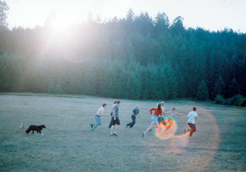
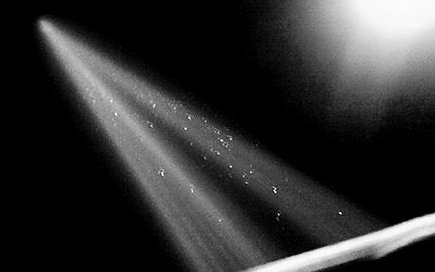
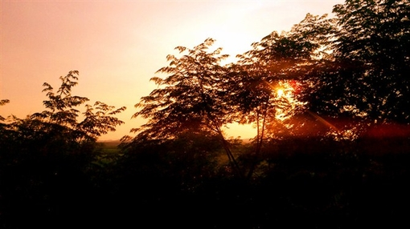

# 战术手电

当年的费铭，毫无疑问是我们那群皮孩子的绝对领袖。

我们模仿着黑白电视机里的“黑社会”那样，叫他费爷——虽然那时他才十五岁，腰里也没有黑亮的手枪——但他好像很不在乎这个在我们看来，无比光荣霸道的称呼，只有在邻班的苗苗路过我们时，他才会顺其自然地享受这个称呼，在我们叫他“费爷”时深沉地转身，眼神沉静地清叱一声“什么事？”

其实，费铭以前叫作二傻。组织里还有大头和三楞，我是最小的四喜。

大头的头还是那么大，三楞还是楞了吧唧的，四喜还是风流倜傥但经常挨揍的四喜，但是二傻已经变成了费爷。所以我们这群革命老区的小伙伴们，便在县初中里，跟着费爷一起鸡犬升天。不对，我不是鸡犬，三楞才是。

老子是他奶奶的喜子哥。

我们四个都是一个村的孩子，一起上树跳井，一起摸鱼扒虾，一起爬北边的荒凉山头，一起偷李老汉家的桃子陶老汉家的李子，一起把村里的一切翻个底朝天搅个龙宫乱，然后拖着长长的鼻涕被爹娘拿着笤帚揍得鬼哭狼嚎。

家里不栽果树的老人们则欣慰地任由我们胡闹——“这么点的小娃娃，正赶上调皮时候，让他们作吧！大了想作还作不动了哩！”

我们四个娃娃是同岁，大头生于飘雪纷飞的正月，我生于飘雪纷飞的腊月。

那时的费铭我是记得的，就像每一个普通的农村娃娃一样普通，却又有些怯懦和怕生，村落很小，挨家挨户都很相熟，但是他见到我爹还会怯怯的，耷拉着瘦瘦脖颈上的大脑袋，眼睛仔细盯着脚尖，两只小手不安地揉捏着脏兮兮的衣服角，直到揉得皱巴巴，薄薄的嘴唇里嘟哝出一句“福叔”，仿佛声音大了就会显得不礼貌。

除了我们，他见到谁都这样，他爹也一样。

“老费家那小子脸皮儿可真薄！将来指不定是个文化人！”我爹喝了两盅烧刀子，在炕上大声嚷嚷道。我想就二傻那小子，遇到十以上的算术题就开始脱鞋数脚趾，还不照样得回家拉弯弯铁。

乡村的日子在我们四个孩子的笑闹哭声里溜走，赤脚趟过的河流与在手心里蹦跳的滑溜溜的鱼儿，毛桃刺手的痒与李子甘甜的香，在日后想来都是极为平淡美好的回忆，时针跑在城里的一圈一圈，无关于乡下的日出日落。我们四个小娃娃就在平淡的年光里上学、调皮、撒野、挨揍，构成了那时老人们心里，又一代人的童话童年。

我们四个就这样缓慢地长大又坚定地抗拒成长。大头依旧最疯胆儿最大，二傻依旧傻傻的不太说话，三楞不知道自己是谁，只听大头和我的话，四喜还是那个嘻嘻哈哈的调皮四喜。

直到有一天，费铭当兵的远房表叔路过这里，给他带来了一个小玩意儿。

那是个会发光的圆筒子，敲一下屁股头上就会喷出洁白的光辉，我从未见过那么长的光束，从村头能照到村尾，连村长家的一百瓦大灯泡也没有那个小筒子厉害，更何况我家燃桐油的马灯。筒子通体黝黑，不知涂了什么材质的油漆却没有漆味儿，仿佛比黑夜还黑的身体，日落时一定会不见踪迹。过了好久的以后，费铭只让我摸它的时候，透心儿的凉气从手心里蔓延进身体，我才明白这玩意原来是钢铁造的，更加羡慕地张大了嘴巴，灌了一腔子气喘吁吁的风雪。

那天夜里，费铭轻轻地敲了筒子的屁股，我第一次在黑夜里看到了洁白纷飞的雪柱。他就坐在身边看着我，眼里的神色耐人寻味。

不久，我们三个都知道了二傻原来有一个当特种兵的表叔！他表叔还给他带来一个手灯。

“三楞，那不叫手灯。”

“拿在手里的灯俺家也有！就是光是黄的，俺家那个叫手灯，凭啥你这个不叫手灯？”

“不一样，你不懂。”

“嘿！那你小子说，你这黑乎乎的玩意儿叫啥？！”

“听好了，她叫——战，术，手，电。”

费铭叹了口气，那是我第一次见到九岁的娃娃会叹气。

费铭从此以后就变了。

费铭渐渐地不屑于白日的摸鱼偷桃儿，而是把大多的精力留在了夜里。恰巧那时的我们渐渐长大，吃腻了汁液丰美的果子也爬够了树摸够了鱼，我们时常打量着村北面的山峦，眼里有着探险的火苗与畏缩的惊恐，这两种情绪杂糅到一起，成为了楔在心上的欲望。

终于在一天夜里，大头对我们说，走，咱去北边的山上瞅瞅去。

“俺爹……俺爹说山上有蛇……还有狼……”三楞声音有些颤抖。

“咱要不白天再去吧。”我也有些害怕。

“怕个球！你们摸摸自己的裤裆里有卵吗？！”大头的声音微颤，却强行压抑住声音里的抖，把这些细节用更大更恢弘的声音掩盖住，瞬间成为了伟岸的领袖，像是独立寒秋俯瞰湘江的毛主席。

我默默地摸了摸裤裆，发现卵都被冻得回了老家冬眠。但还是不忘大声吼了声“有！”那一刻我昂首挺胸，仿佛洗去了罪孽的恶人，成为了知错就改的好同志，成为了被组织挽救了的好党员。

“那就走吧。”先前一言不发的费铭突然说道。

“走！”我们四个小娃娃，在村头的小路前，一齐奋力地吼道，仿佛准备献身一场注定流血的革命。

“等等，咱们得找个火把。”大头说。

“不用，二傻有手灯。”我赶紧补充，之前可没看够费铭的手灯的威力。

“那叫战术手电。”费铭有点生气。

“对对对，战术手电！走吧。”

之后的一年里，我们几乎每夜都在爬这座山。与这座山相比，我们的村子太小太小，田垄间的趣味显然没有山里的世界刺激。我们没有火把，照明只靠费铭的战术手电。

费铭在那一夜第一次与我们爬山时，在如墨的浓夜里轻敲手电的屁股，一道白虹喷薄而出，照亮了远方几百米的岩石，照亮了山上深秋的草木，照亮了我们孩童的眼睛。这光芒如同长枪般刺破山村的夜色浓稠，天上的明月与星辰都黯然失色，甘心匍匐于这不应属于人间的光辉。这道光芒像是我在很久以后，在城市里音乐会上见过的指挥棒，轻轻挥摆之间我们的身体随之摇曳，视线随之停滞。我们呆住了，在夜色的衬映下，这光芒愈发神圣耀眼，如同神迹。

而在这束光芒的源头处，费铭没有盯着那道光，而是盯着紧握在手心里的战术手电。

须臾间，他的气质发生了不可思议的变化，就像一名手执长枪的十字骑士，像握紧雪刃的沉默武者，像潇洒挥杆的白须钓叟，从容、稳健、自信、骄傲从他瘦小的身体中苏醒，甚至可以听到他往常驼背的身体，由于站得笔挺，小关节发出的噼啪微响。瑟瑟秋风吹起他皱了的衣角，在我的眼中却像飒然舞展的罗袂。他仿佛没有和我们在一起，而是独立寒秋，俯瞰山下的村落，甚至是更远处城里的万家灯火。

我每次回忆起那晚他的身姿，总觉得复杂难言，像极了一名骄傲自尊的特种兵，却又有了特种兵可贵的气质与素质——冷静如狼，残忍如狮，沉静如貂，狡诈如狐。他稚气的脸庞上浮起神圣的云纹，雕琢了他本平凡无奇的面容。他拿着战术手电的身影，是那样的令我们心安，那样的令人信任。

在日后的爬山革命中，他比第一次更加地从容稳健，我们遇到过长长的青蛇，遇到过吓人的黄皮子，甚至是饥饿的母狼。我们的惊惶里他却冷静如雪，从容不迫地化解了我们的害怕与危机。慢慢的，他的脚步不像以前那样拖沓，他说话时会笑着直视我爹的眼睛，他不再上树偷桃、下河摸鱼，而是经常去拜访邻村的武师，学习武术与散手。

村里的老人们都夸费铭这娃越来越懂事，三个月后老师拜访了想让他辍学的父亲，他老实愚昧的父亲唯唯诺诺地给老师敬烟，却被坚决冷淡地挡回。

“你知不知道你这娃儿学习很好？很有前途！你这庄家人，却想毁了未来的知识分子！祖国的栋梁之才！像你这般愚昧肤浅，注定会被扫进历史的垃圾堆！你这是想做历史的罪人！人民的公敌！”

老师的金丝眼镜在油灯下闪着庄严的光芒。留下了呆若木鸡的费铭爹。半晌，费铭爹拿起抹布，擦了擦脸上快要干了的唾沫，对同样呆若木鸡的费铭妈喊道“还愣着干什么！快去打酒！”

费铭家传来了一个女人欢天喜地的哭嚎。

我时常看到费铭蹲在田垄旁，拿着一方干净的丝绸手帕，细细地擦拭他的宝贝——战术手电。他的眼神已不复童年时那般怯怯，而是坚定又充满向往，向往田野尽头的山，向往大山外面的世界。

他断断续续地对我说起了好多话，说起了他的远房表叔走过的地方，披戴的荣光，他的眼眸愈发深远，穿过田野，穿过大山，直到后来在西雅图的港口，看见太平洋上的漫天海雾却发觉熟稔莫名，我才明白，原来费铭当年的目光，曾经停留在这里良久。

大山的外面，是县城。

一年后，我们四个捣蛋娃儿都考上了县明星初中。

这真是村里的大事，拿到通知书的当天，我们四个娃儿的爹在村长家宽阔的庭院里摆了好几桌酒，宴请了村里所有的人，就连不方便出门的老太太都被儿女搀着来坐在炕头，用没了牙齿的嘴巴，缓慢地咀嚼着儿媳递到嘴边的软糕。四个妈妈在宽阔的灶台前忙得热火朝天，递上一叠又一叠的菜肴，男人们喝酒喝得红光满面兴奋得像是过了年，就连平时轻易不喝酒的村长都喝了八两烧刀子。

“春明，你的娃儿可摘过俺家的桃儿。”

“唉，李叔，你瞧你还记得呢，俺让这臭小子过来敬酒赔罪！”

“干什么呢你！俺当时看你这娃儿专挑好的摘，俺就瞅着这娃儿精神！将来准有出息！”

“李叔你瞧你说的，我这脸臊的慌！来来来我替臭小子敬你一杯！”

“啊，陶叔你怎么也来了……”

推杯错盏之中，大人们都醉了，只剩我们四个还清醒着。

“我做梦都没想到，我还能上了明星初中。”三楞腆着脸说道，脸上笑得春暖花开。

“你小子少来，最后那段时间你天天做算术题你以为我不知道？”大头咧开嘴笑骂道。

“我可是真没怎么学。”我无辜地说。

“就你小子聪明！”他们一起骂道。

我们都哈哈大笑。费铭也笑着，笑容真切澄澈，如沐春风。

初中时的费铭成绩依旧遥遥领先，身材愈加挺拔，初一便进入了校篮球队。他的分数高得像永远不会坠落的星星，他所在的班里别的学生再怎么努力，也只能争第二名。他正直而又善良，面对校外的流氓时却毫不手软，拳出脚落，鞭腿正蹬，转身错步，鲤鱼打挺。染着黄头发的流氓们屁滚尿流，他保护了许多受欺负的同学。也不畏惧报复。每每遇到他们人多势众掉头就跑，再各个击破，每一场斗殴都像是高明无比的战役。

他自主向学校里申请巡夜，每至夜落，校园里总是会有一道明亮的光芒，缓慢而又冷静。

渐渐地，他成为了明星中学的明星。

无数人在猜测这名优秀少年的成长历程，只有与他最亲近的我知道，在他拿到那个战术手电的夜晚，他迎来了生命里的重大转折，他把未来的路皆尽照亮，成为了与原来不一样的人。

那个“二傻”的称呼留在隔山的乡村，尘封在我们隔年的记忆里，就是连我们都很难想起，原来这个优秀聪慧的费铭，曾被我们称呼为二傻。

渐渐地，上了初三，他已经被别人称呼作“费爷”。随着年光流逝，我感觉到他在以一种迅疾的速度成长，他越来越像那夜里山上的特种兵，越来越像那名有原则的骑士，越来越光芒耀眼却又沉着从容。他与别人亲切地招呼，在我看来却有种天然的矜持与自傲，但那种自傲又不令人讨厌，像是一支傲雪的寒梅，超卓于群，温和坚定。

“你是那样的优秀而自信……”他念着班里女生托我递给他的情书，笑得肚子都痛了。

“在说我？”他上气不接下气。

“那还能是说老子？”我也笑了。

他收起这薄薄的纸条，说“我知道了，替我说声谢谢。”

我笑骂道，“要说你自己说，你个装逼贩。”

初三上学期还未到头，在一个放学该要回村子的傍晚，我见到了费铭。他萧索地站在校门口，原本梳理得整齐的头发蓬乱，眼睛通红却无神，木头人似缓慢地走着，旁边向他打招呼的同学都吃了闭门羹，奇怪地看着他，又没有人敢上前询问他。

我赶紧走上前去，抓着他的肩膀摇晃他的身子，“你怎么了？怎么成了这副鬼样子！”

他艰难地把目光移向我，干枯的嘴唇不住地颤抖，嘶哑着嗓子说。 

“找不到了。”

我一瞬间明白了他的意思。

变故陡生。

“我陪你找！”

“你先走吧……”

“费铭！”

“滚！！！”

我看着满脸通红的他，一双怒目里渐渐溢出泪水，将他的眼睛淹成一双迷惘的湖泊，他在众人惊讶不解的眼神里抓紧头发，缓缓地蹲了下去。

夕阳的余晖映在他的身上，落叶摩挲于地发出沙沙的声响。

像一声沉重的叹息。

我没有陪他，紧了紧书包，转身而走。

半个月后的月考，费铭成绩跌落至班级第十五名。

一年后，我以总成绩全校第一被保送至县第一高中。

渐渐地，如同“二傻”一样，“费爷”的称呼渐渐被人遗忘，只是残存在某些人酒后的印象里，某些女孩儿抬头望天的夜晚里，某些老师唏嘘不已的回忆里。

而那只陪伴他六年的战术手电，逐渐被风化在残忍浩荡的年光。我在县一中的门前，看着手中的录取通知书，心想这本应属于你。

二傻，我突然想起了初中那篇文言课文。

我从费铭家出来时，已是深夜。他已经变成了一个小老头，终日沉迷于不会变味儿的烧刀子酒中。我在逼仄发霉的空间里，看到了摆满整座壁橱的战术手电，有TK-15，TK-21，还有许多我无法叫上名字来的玩意，像是二十年前的夜里，那个黝黑冰凉却光芒万丈的圆筒儿。

呼啸的冬风涌进县城，挟裹在洪流里的锋利冰茬，将小城的虚空扎成了筛子。耳畔的风声如同二十年前一样，如同尖锐刺耳的警笛长长拉响，让人没有来由地心生惊惧。

二十年来，我从县城走进武汉，从武汉走向东京早稻田，又从东京辗转西雅图，从西雅图到利物浦。最终披戴着些许荣光回到这里，想要寻觅当年这里的风木草海，这里依稀零落的回忆。

二十年来我辗转四方，曾在日本的道场里看到由于剑断而哭泣的武士，曾在球馆里见过韧带撕裂而痛苦的运动员，曾在黑夜里看见因为丢了警徽而难过的年轻警官。他们的眼神，都与费铭那天的眼神惊人相似。

见识到形形色色的人后，我才终于明白。

原来每个渴望不凡的骄傲之人，都有一支战术手电。

挂在嘴边或是拿在手里，甚至是深埋于心。他们有的走了下去，有的死在了路上，有的策马驰骋，有的打马回旋，有的落马殒身。

如同因果，如同轮回，如同劫缘。

生生不息。

“老公，我还真没在这么小的县城里开过车。在这儿咱家的车就是这县城里最好的车！”

我看了看她波涛汹涌的胸部，心道果然如此。

“个傻娘们儿。”

城外冬风呼啸，汽车大灯照亮远方的前路。如同二十年前的夜里，山坡上的光柱一般孤洁绚烂。

亦如黑夜里的，两柱长香。

参考电影：《Revolutionary Road》/导演：Sam Mendes 参考文献：《路至尽头》/艾小柯 发表于2009-01-13 01：46 “这里，我想一个非常关键的“革命”动机便是这种超然大众的源动力，与极尽全力保存这种超越性的努力。在惠勒夫妇的邻居眼中，这种特立独行的行为艺术是不被理解并令人怜悯的（如果不是更为激进的鄙夷的话）。但“超越大众”的想法本身有错吗？或者换句话说，一个人如何界定自己究竟是普普大众的一分子，还是在某个角度某种程度上超越一般大众行为准则与思维理念的不凡之士？再追问一句，思想上的超越与行动上的超越是否常常脱节？而这种脱节，是否本身便是大众的，普遍的，是一种常态？” 

（采编:FR，责编：FR）
