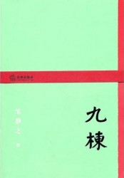

# 戴柳条圈的小男孩

我爱看文革的回忆录，像是看戏。

这些年出了不少书，口述式的回忆居多，五六十岁的人，隔着几十年的时空回望，叙述的语气再白描，也是有鲜血做底色，仿佛有咚咚咚的战鼓鼓点在背景里急促地敲，听不真切，但也让前面的讲述总带着一点唱念做打似的、戏剧性的意味。

所有人都在等着终了那一刻，锣鼓炸裂，银瓶迸破，铁骑突出刀枪鸣。揪着眉头读完残酷的细节，书里书外的人都松了口气，几十年后夹着烟的叹息幽幽地从纸上传来，荒诞的一切继而回归了荒诞。

看得多了，这渐渐变成了一个大家心知肚明的过场，那些情结、那些欲擒故纵、那些约定俗成的语气，削弱了历史本初的力量，如果要说，就是以《七十年代》为甚，中年精英们规定动作的回眸，几乎带有种集体致敬的意味，致敬的对象是当年的自己。 可是当年的自己呢？

邹静之的这本《九栋》帮我们找回了一个。那是一个小男孩，正在读小学，九栋是他们家正在住的楼，那栋楼现在已经炸掉重修了一幢，可是那个小男孩当时还不知道。他正在热衷于种种大人们说毫无用处的技艺，打嘎，弹球，掼刀，玩磁片……磁片还是从北京地铁的工地上偷来的，当时刚挖到公主坟，他们一群人偷偷地过去看公主，却是什么都没看到。

儿童的视野总有着幻想的变形，一个正要开始癫狂的世界，更让所有的线条加速地扭转。他们往后背上拍粉包、讲坛子人的江湖秘闻、种了棵蓖麻就天天跑去尿尿，拉屎的时候对着厕所粉墙上的污点幻想……可就在你以为这是几代童年的相似回忆时，那个小男孩又多跑远了几步，从北海踏青归来，他大大的脑袋上顶着已经蔫掉的柳条圈，到了九栋楼下，眼前是大孩子们正在抽邻居张奶奶，“臭地主”张奶奶在乒乓球案上爬行，他看见汪大义手中的柳条比他的新鲜，也比他的粗，抽中张奶奶的时候，衣服上腾起一股一股的灰。

树荫下也躺过一个刚自杀的人，是班上最漂亮女生的父亲。

败血症的孩子当着红卫兵弟弟的面，用脏手捏了片药吃下去，未知的神秘病症就杀灭了红袖标的威风。

“他说抓他爸妈的那天，他一直在楼下等着用一只铜挂钩和房勇换一颗黄芯的玻璃球”“他说他当时并没有什么想法，只是把换玻璃球的事儿忘了。”

于是终于在讲打鸡血的故事时，全身的寒毛竖了起来——小男孩在心疼自己被偷偷借走的鸡，可读书的我们终于惊醒：那是一个怎样的时代啊！与掺杂了另一种动物血统的人一起生活，那些歇斯底里和人伦的逆施，真的是一个孩子应该见到的奇异吗？

这是一个不能复刻的童年，邹静之在引子中说，“她的隐秘之处将永远隐秘下去，甚至你靠全身心的回想，也难以进入了。”这是我读过最真切、也是最愿意相信的童年记忆。而这本桃红配翠绿的书，并不是整本都好看，在“九栋”的下一个篇章，主角变成了北大荒麦地里一个男青年，见惯了生生死死，也与无数他人的回忆相似。

只是在变成男青年的前一刻，在装满知青的列车开动时，那个小男孩说了成熟前的最后一句话：“我一生中再也没有听到过那么众多的哭声，像一条河流崩溃了。”

后来的后来，几十年过去了，搜索现在的邹静之，才知道他是个著名的编剧，那些“中国第一编剧”““千万稿酬”的名头，跟书里的那个小男孩完全是两个人，也不像是一个优美文字的作家应该顶起的名头。

好在又搜到了他的微博，看见他说：“春天来了，我还在屋里呆着，这真够傻的。”

有人转发：“春天来了就一定要出去吗”

他回：啊，你说的对，春天有什么了不起。 ** **

（采编：陈静； 责编：王卜玄）

