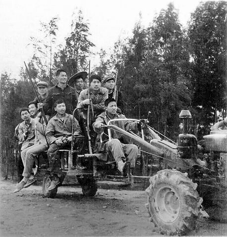
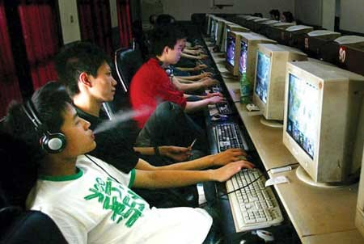
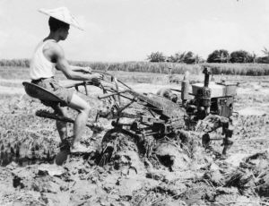
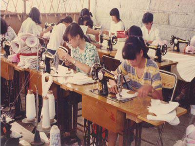

# 手扶拖拉机

实在找不到女朋友我们就搞基，我长得不丑，身体也还行，当个受绰绰有余，互攻也不落下风。

我和张大彪蹲在田埂上抽烟扯淡。张大彪说他越干越没信心，赚不到钱怎么找女朋友，自己老大不小了。我说这两季收完了本钱就能上来，明年肯定能讨老婆。张大彪点点头，大他部分时间他能听进我的意见，我是狗头军师嘛。

拿出手机打开微信搜附近的人，跟我说三百米以内有个女的好漂亮。我拿过来看看，长得很土，露个大腿，签名是典型的城乡结合部女青年风格，“今天你对我爱搭不理，明天我让你高攀不起”。我说你不要只看女生，都打开看看。张大彪一看我操这么多男的，狼多肉少啊，早被抢光了。我安慰他说明年肯定能找个比她漂亮一百倍的，就找镇上中学的英语老师，听说是个大学生呢。

张大彪把烟掐了，掸掸夹克衫，我俩继续干活。

我和张大彪没钱买大型农机，就用家里早已上锈的手扶拖拉机耕田。犁很窄，挂在拖拉机头上，耕地的时候手扶着拖拉机把手用力下压，实在没力气了就把档往上挂，烟囱里就突突突一阵黑烟。地翻不深，田种不熟。我们这一辈农村青年好吃懒做，庄稼人的技艺早丢光了，只有祖辈父辈的“种地口诀”还在耳畔心里，被生活迫上绝境的时候，千百年来田间地头积累的智慧还是会重现并发挥作用。来回一趟能耕出四个人肩膀那么宽的地方，人已经很累了，我们就轮流耕，虽然费时间，只要不怕累，总能耕完。我和张大彪耕耕停停，坚持下来了，不是因为我们勤劳，是我们没事可做了，再不搞点样子出来，真的会众叛亲离万人唾弃。

我和张大彪在湖南把钱输光了，没地方可去就回家，从衡阳坐了十几个小时绿皮车。村里人骂我俩是王八蛋败家子，我们听了无所谓，从小被说不成器已经习惯了，成天还是游手好闲。一时找不到事情做，我们就去给镇上的网吧打工。说是打工，其实就是看场子，没事的时候占台机子打英雄联盟，有什么事了就站出来装得凶神恶煞把闹事的赶走。网吧里挑事的最厉害也不过是高中生，很容易对付。在网吧挣的不多，刚好够用，嘴馋了想抽几包好烟还得管家里要。

张大彪父亲是村支书，上过越南战场，幸运地全身而退。老头子作风很正，平时一脸严肃，村里人敬重他。老张唯一的软肋就是自己儿子。虽然是芝麻大的村官，心里还是以国家干部自居，带头执行了计划生育政策。老头时常嘀咕要是再生一个就好了，这个小畜生也不会变成现在这样。新闻里报道哪哪的村干部都开宝马包小三了，老张没有这样。我们这里是全国贫困县，没有骄奢淫逸的经济基础。按张大彪的原话，老头自己也很土，都二十一世纪了，还成天开个手扶拖拉机到处跑。老张去镇上开会经常挨镇长骂，你那堆破铜烂铁都多少年了，黑烟冒一路，多不环保！

到处都在挖路盖楼，废弃不用的建材很多，老张看见村里能用的就拉回来。我们那处在地震带上，经常有地震的谣言，搞得人心惶惶。别的村家家户户凑份子搭防震棚，我们村路口的那一排防震棚没花钱，用老张捡回来的材料搭成的。

九月份学生开学，警察照例要到网吧扫荡一遍，揪几个未成年人扬言罚款，老板照例赔笑脸送钱，走走过场也就算了。不过生意还是会受到影响，来的学生少了，网吧很冷清，我和张大彪打游戏打得眼睛疼，就偷偷跑出去玩。丘陵地区，上坡下坡很多，柏油路像一条黑色的绸带向远处抖动，抖动它的就是我和张大彪满心满脑的无赖和烦躁。马路旁边是蔬菜大棚，我和张大彪爬进去，里面长满了娇艳欲滴的、假惺惺的反季节蔬菜，像波多野结衣的胸。土培得很松，湿漉漉的，我们爬了一会，看见一长溜草莓。

我和张大彪像袋鼠一样用T恤衫兜住沾满泥土的草莓，站在马路边上明目张胆地往嘴里送。秋天的太阳还是很毒，能把人背上的痱子烤炸。吃着草莓，远远看见老张过来了。他戴着草帽，不知从哪搞到一拖拉机毛竹，突突突往村里开。

手扶拖拉机在日本的小块水田里用起来最方便。中国的手扶拖拉机都会加个拖斗，用来装载运输，拖斗和拖拉机头之间用一个三角形的托盘连接，人就在托盘上坐着驾驶。以前农村穷，买个拖拉机还放鞭炮庆祝，这么贵重的东西当然希望它多发挥一些作用。可是手扶拖拉机的机头只有两个轮子，遇到下坡的时候，所有重量都集中在三角盘和机头相连的那根钢轴上面，很容易出危险。据说日本专家来中国考察的时候，建议不要这样使用手扶拖拉机，中国官员说农村买不起运输工具，改装的手扶拖拉机总归比驴马拉车要强。为了安全，手扶拖拉机要限重限速，农民根本不管这些，结婚迎新娘的时候拖拉机上能坐十几个小伙子。城里的交警只要看见手扶拖拉机就拦下来，十有八九能找到罚款的理由。

老张拉了满满一车细毛竹，拖拉机一边走一边颤。我和张大彪提心吊胆地看着他驶过一个又一个上下坡，到了村口转弯的地方，老张看见我们，用手指了指张大彪，那意思就是“小狗日的，老子待会再来收拾你”。然后拖拉机的连接轴断了，老张死得很惨，毛竹从后背穿过，血淋淋地在前胸露出来。我们手中的草莓滚落一地，摔出惨淡的汁液。

村里人说老张好人没好报，死后得风光风光，他们看张大彪不成器，就自发组织人料理丧事。张大彪自始至终没哭没说话，把老张安葬好回来的路上，他发了一通无名火，大意是老张已经死了，谁要是再说他们家不好，就找一拖拉机人弄死谁。拖拉机在我们那里也是一个量词，比如一拖拉机嫁妆，一拖拉机弟兄等等。我觉得张大彪有点神经病，村里人大半夜过来帮忙不容易，当时太累了就没多问，倒头睡了。第二天张大彪告诉我村里有人去上访，为了征地拆迁补偿款的事情，夜里也不回来，就睡县政府门口，老张死前成天都在烦这些事情。

我陪张大彪去坟上看看，他沿着坟丘一周踩了踩土。老张是装殓进棺材土葬的，我们村这些年一直对抗国家政策。向民政部门举报会奖励人民币五百元，但没人这么做，每次村里举行葬礼，老人们都会担心，“搞不好真有贱皮为了五百块钱去举报”。只要家里有老人上了年纪的，堂屋都会摆一具棺材，秋天收完粮食卖了钱，老头老太太就把木匠叫到家里，做做棺材。一副好棺材要做很多年，老张的棺材就是这样，他生前没事干了还会钻进去躺着，看看舒不舒服。出殡的时候，找村里年轻力壮的小伙子抬棺，天不亮就要出发，抬起来的时候放炮仗，家里人哭，走到墓地之前，抬棺的人脚步不能停。墓穴一早就有人挖好，泥水匠做一些简单处理，封穴的时候抛纸钱，阴阳先生唱一些奇奇怪怪的东西。

过去的葬俗自有道理。那么大一具棺材成天在家摆着，老老少少对死亡早就有了长期心理准备，等人真的走了，不会因为悲伤而失态，老人们把这叫做礼法。我们年轻人当然不甩这一套，不过村里的葬礼确实比较肃穆，从来不请吹手，进入墓区只能听见阴阳先生嘴里咿咿呀呀，其他人都不说话，也不允许再放炮仗。

我对死亡没什么感觉，从小见得太多了，穷山恶水出刁民，我们这的人都不怕死。上小学的时候，有一次我系着鲜艳的红领巾高高兴兴出门，在路上看见一具尸体吊在树上。我们县一直有卖枪的，四百块钱现做一把，在我出生之前，村里的男人都有枪。我们村绝大多数人姓张，马路对面的村姓王，两个村世仇，经常打架。最厉害的一次，两村人沿着马路筑街垒，用枪对射。县里公安局长亲自到场平息事态，站在马路中间喊话，然后不知被谁放了冷枪打在脑袋上，死了。两村人互相推脱责任，继续枪战，最后南京军区下令出动军队才把事情解决。

为了镇住这帮刁民，组织上经过慎重考虑，将一名久经考验的退伍军官调入我们村主持工作，这个人就是老张。

我和张大彪是打架认识的。

有一年冬天，我和村里的小孩一起打雪仗。有个黑黑笨笨的家伙，总是把雪球做得非常紧非常硬，往我脑袋上砸。开始回击他两下也就算了，后来我被砸得炸毛了，就和他打起来。我们两俩推推搡搡到村里稻场上单挑，其他孩子站在旁边观战。我被打得很惨，但是最后被按在地上不能动的是对方，有了结果之后我们就被众小将拉开了。

张大彪走过来把手搭在我肩上，说你能打赢黑鬼，在我们大队排不上第二至少也是第三了。公社和大队已经撤销，父辈称呼习惯了，我们也跟着这样称呼。不管我排第二还是第三，第一反正是张大彪的。爱打架的是张大彪，我不喜欢打架，无奈一战成名，被彪哥招入麾下，从此走上不归路。张大彪很小的时候就被称为老大，这样的孩子虽然不学习，但是很早就展现出混世的潜质，家长虽然象征性骂两句，心里是爱护的，也就不怎么管。

高中上到一半，张大彪说没意思出去混吧，我想想也是，附近村镇都玩遍了。辍学之后，老张给我们安排了比较安稳的工作，在镇上空调厂做组装，八道工序翻来覆去，每天累得要死。我和张大彪商量了一下，逃了。后来我们身无分文回来，村里正在搞开发，地都被征完了。娃哈哈在县里设生产基地，建了医院、幼儿园、住宅区，招年轻工人，解决住房，条件是服务三十年。老张让张大彪去，张大彪皱皱眉，说搞得跟卖身一样，和过去的地主有什么区别，不犯法？我们最终没去娃哈哈，选择了游手好闲。成天上班太无聊了，在生产线上日复一日做同样的事情，会把人憋死。

逃去湖南，在老乡开的服装厂上班。其实工作性质没变，每天做同样的事情，不过服装厂年轻女工多，我们两个骚猴子找到了乐趣。湖南好玩的地方也多，我们是小厂，乡里乡亲，管理不严，逃出去玩一阵子回来罚掉工资了事。不过女工们都很勤奋老实，只有我和张大彪敢逃工。

我们去过凤凰，看到好多女的，大夏天披着头发戴个墨镜，我和张大彪一辈子没见过那么漂亮的女人。我们站在一家饮料店门口喝甜酒的时候，有个女大学生对同伴说，你不觉得白塔倒下翠翠痛哭的场景里有一种永恒吗？她穿着带星星花纹的黑丝，裙子一直垂到大腿。张大彪问我翠翠是谁，我说不知道，那是有钱人玩的，咱们别管。

服装厂没有自己的牌子，做的都是承包加工生意，到我们手上已经是二包三包，工序比较简单。生意根本做不完，有时候来了单子还得推掉。估计老板是烦我们两个了，喝酒的时候说男儿志在四方，撵我们出去单干。按照马克思八个雇工的标准，我和张大彪也算资本家了，而且心黑得很，给工人的中午饭永远是湘西人做的凉皮，要多加花生沫。

刚开始怕亏本，肯吃苦，没日没夜干，赚了不少钱。过年回家，张大彪把牛逼都吹到天上去了，说手下管着三十几号人，明年去美国谈生意，一边吹一边把手里的中华烟撒给村里的老老少少。厂里的事上了正轨，又进入一种无所事事的状态，摊子撂在那里不问事也不要紧。没了拼搏精神，总得找个发泄，张大彪开始赌钱。赌法很傻逼，拿着一枚古钱转，用碗盖上，大家猜正反。赌徒们说古钱是祖上传下来的，从他们祖宗开始赌，一直傻逼地赌到现在。后来张大彪有点后悔，说应该拿着钱找老婆，说不定现在孩子满地跑了。

老张死后，有人说拖拉机太晦气，卖废铁吧，张大彪不愿意。

地征完了，以前是绿油油的庄稼，现在只有光秃秃的黄土。张大彪找到村里，说自己看着心疼，让我种地吧，反正搞建设用不了多大地方，地荒着也是荒着。大伙都说张大彪精明，国家政策刚放开，搞试点，农村又有大地主了，叫作产业化经营。其实张大彪就是心里难受了，没想那么多，我们是农村走出来的有志青年嘛，身上总得剩一点对土地的眷恋。就这样，我和张大彪当完资本家又开始当地主，像过去一样穷。

老人们都搬到几十层高的安置房里了，他们住不惯会到我们这看看，骂两句，说年轻人干农活蠢的像猪，然后脱了鞋子下田，手把手教我们。按合同，每亩地我们要交四百斤稻子，这些住楼房的老家伙也是受益者。他们说还是想要土地，几十万补偿款有个屌用，又不能花一辈子，只要土地在、人不懒，日子永远不会差。

秋天我们把稻子送到收购站，政策好的话价格能上浮四五块钱，今年一百斤稻能卖一百四十元人民币。

回家路上，三十出头一事无成的张大彪把手搭在我肩头，像小时候一样。他鬼鬼祟祟对我说，镇上那个女老师你喜欢吧，有一次看到你站在中学门口，你就是这样，自己喜欢总是撺掇我去，所以只能当狗头军师，老大还是我。我笑笑认了，问他明年怎么打算。张大彪说先把麦子种上，明年夏天有钱了买收割机，娶老婆。

手扶拖拉机呢？

那个老家伙，早该让它退休歇歇了。

(采编:徐蕾；责编: 刘铮)
 
