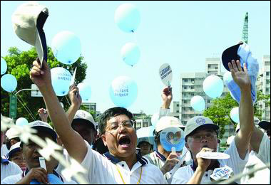
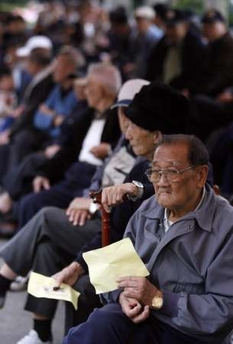

# 投這一票

** **

民國101年的總統大選前兩日，我滿了20歲。按照憲法規定，已有選舉權，兩天後，在社區內搭的投票處帳篷內，我為下一任國家元首和執政黨投了票。當天晚上，我選的人連任中華民國總統，我選的政黨繼續執政。但今天我不是要寫為甚麼選擇馬英九和國民黨，我的理由沒什麼大不了，680萬選民都有相似的理由。我要寫的，是作為“首投族”，在人生中第一次行使民主權利的感受和想法。

最近看了一部長篇歷史劇，“走向共和”。從清末甲午戰爭開始，直到民國洪憲帝制的結束。看到晚清對立憲的掙扎，對自強的心有餘而力不足，便問自己：為什麼中國不能有一位皇帝？日本可以有，英國可以有，比利時、西班牙、丹麥，他們都可以有君主立憲制，為何偏偏中國，這個歷史上實行了最長帝制的國家，不能有皇帝？劇中有一幕應是虛構的情節，是南京臨時政府成立後，一位老人來見孫文，一見到他，就立刻跪拜：“皇上萬歲、萬歲……”孫文急忙扶他起來，向他解釋總統與皇上的區別，“總統與平民，都是民國的公民啊”。兩千五百年來，中國人都有一位皇帝，就算是兵荒馬亂的年代，總也有一位大王。君權，按照中國人最古老的觀念，就是上天授與執政者，以仁愛、公正去領導普世萬民的。當執政者失去德行，失去公平正義，不仁慈待民，則人民將視其為“天命已盡”，要推翻之。“民主政治”，是不存在的，它是徹頭徹尾地由西方引進的觀念。

我的疑問，是沒有什麼解答的：或許只能說，是“時局”。大清的“天命”已去不復返。她的腐敗、慵懶與無能徹底地被孫文的革命所破，清帝被袁世凱逼迫退位，中國人的帝制結束了，一個建立在共和理想上的民國才剛剛開始。但民主成功了嗎？人民作主了嗎？還沒有。中華民國建國百年，袁氏稱帝，溥儀復辟，國共內戰，蔣家掌權，經過了近一世紀的時間，才逐漸迎來了今天得之不易的選舉，人民可以一票一票地決定國家的執政人。

我熱愛台灣的民主，我喜歡看到人民對執政者的訴求與價值，是被人民提出，而非官方代言。作為公民，我們對執政者的要求很簡單：效率、公平、廉節、誠信。我想這在大多數國家都是差不多的。民主保障這些價值，當有任何人決意破壞這些價值去中飽私囊，當政府貪贓腐敗時，以權力為自己私慾服務時，人民可以通過民主制度去制止他。當執政者空口大話，沒有能力去給予人民幸福時，人民可以另選他人。當人權被踐踏，當公平被打破，當國家陷入暴政時，民主制度賦予的權利可以為人民伸張應得的正義。經歷兩次政黨輪替的今天，台灣已經向世界的華人證明：民主政治不是在西方才能成功的，中國人也可以做到。

沒有錯，民主是不容易的，台灣的民主也仍不成熟。民主制度要求公民有起碼的政治自覺與意識。民國初年，正是因為沒有這樣的自覺，而人民為奴才，執政者為主子的觀念沒有除去，導致了各種專制與暴政的復辟。但這一個世紀以來，我們的國民漸漸學會去追求，去尋找民主的價值。選舉前的日子裡，在台灣隨處可見“政治宣傳”，他們不是為某個政黨，某一個人的宣傳，而是要人民為了自己堅信的價值站出來，為廉政、為誠信、為良知，去選擇國家的將來。

年滿二十的我，按照憲法享有選舉權。投票的前夕認認真真地讀了選舉公報，對各個立委與政黨的政見，作了基本的了解。在社區的投票處，基於自己相信的政治理念，把總統票投給了馬英九，政黨票投給了國民黨。心裡的感受是難以言喻的，這是常年成長在大陸的我，第一次參與決定國家的未來。或許是帶著一絲驕傲，也帶着一絲僥倖吧，一次選舉，讓自己學到了第一堂最初級的“政治課”：根據自己的信念，依自己的能力，為打造一個更美善的社會去努力。

我十二歲時來到大陸，八年過去了，聽上海話比聽台語還熟。在台灣投了票，回首還要再看對岸。常常有人問我，臺灣人對統一的看法，我想，除開複雜的國家主權（一中各表）問題不談，臺灣人首先要求的是民主政治，而不是一國兩制。後者說穿了，也仍是一個“降服”於共產政權的緩路。執政者由人民選舉，透過民主制度保障人權與廉政，已經是所有民國公民的基礎意識，如果北京政府沒有這些信念作為根基，中華民族的統一仍將遙遙無期。選舉後第二天的報紙上寫著“馬英九贏了，九二共識贏了”，是的，九二共識是馬政府的王牌，代表了海峽兩岸的和平共處，經濟上的互相往來。但僅僅是經濟上的互利，不會解決兩岸的政治問題，只有當對岸的人民與政府對人權、對民主的價值有共同的肯定時，民族才有可能迎來真正的統一。

 

（采编：佛冉 责编：黄理罡）

 
