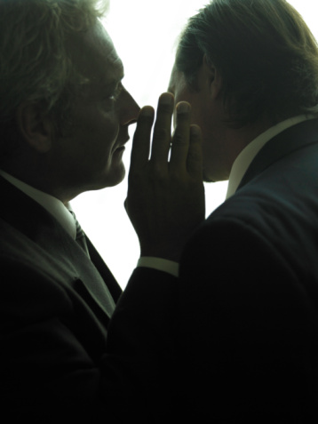
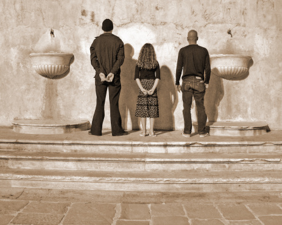

# 抛开“左右”谈“保守”——我的政治观

** ** **（1）**

前段时间和友人聊，谈到一个有趣的话题， 像伯克利这些美国左派中心学校（尤其在社会科学领域）是最不缺激进教育的，但是那里出来的中国学生，在谈论国内问题的时候往往最后变得比较“保守”，与学校和学科旨趣大相径庭。为什么呢？

我是这么回答的：

为什么西方左翼学术出身的中国学生往往走向“保守”？很多学生学者的确存在面对中西标准不一致的问题，这我能够感受到。但从智识角度讲，也有另一个可以说得通的路径，我个人即是如此。

我们出国前大多数是受王小波、林达等自由思想启蒙，对政治社会问题发生兴趣，继而决定投身此领域学术研究，赴美读书。这时候的底色都是“自由派”，心里抱着“去彼岸学习人家的先进制度和思想回来救国”的目的跑出去的。但是不幸进入了美国左翼学术体系，这是一个纯粹批判现实的体系，他们不仅批判专制集权主义，更批判披着民主外皮的资本主义。而且因为他们所面对的语境已经不是专制，而是自由环境下的资本猖獗、权力勾结、社会失据，所以我们读到的大多数批判作品都是批判资本主义和宪政民主结合为什么依然不能够达到“理想境界”的，大多数内容都是在揭发达资本主义社会背后的黑暗。

这种学术训练下，中国学生会有理想幻灭之感。本来是来取经的，结果如来佛祖说他自己的经狗屁不是，所以唐僧就凌乱了。如来佛祖还好奇的问唐僧，好像你们东土大唐虽然不民主，但是没有我们这里这些烂问题哦？

然后有些唐僧就飘飘然了，原来我们其实很牛啊！这就是潘维、王绍光这样较早期中国留学生的路径。

另一些唐僧则不满足，进一步纠结：我们西方马克思主义左派先后对市场和国家都失望了，不是还有公民社会可以指望么？

可叹的是，西方左派是个批判到底的流派，他们研究公民社会，研究社会运动，研究NGO，然后发现这里面还是一团乱糟糟，NGO褪掉了理想主义的最初冲动后，变得和政府一样面目可憎。社会运动则充满了精英野心和民粹冲动的混乱，中产阶级的维权运动仅仅停留于自我利益的守卫，反而增加了阶层间“人民内部矛盾”的激烈程度，阶层隔绝和冷漠充斥其间。

所以另一些唐僧也幻灭了……

总的来说，国内自由派所梦想的革命命题，早已经过西方政治现实的实践，而被西方左翼渲染为伪善和无效的社会实验，而西方左派又提不出什么可替代的更好的路径。在此学术大趋势下，不少中国学生取经取回了空白本子，理想幻灭以后，痛定思痛走向现实主义、民族主义、国家主义，这是一个可以理解的路径。

当然我个人不觉得这种理想上的退缩和放弃是一件好事，我本人还梦想着寻找到另一种进路。

  **（2）**

前面说到两种西方左派学术培养出来的中国学者走向“保守”的逻辑，一种是发现“原来我们本来就不错”，一种是发现“批判到最后所有政治理想都虚无了，只能退回到民族身份、国家身份的认同”。

对于我来说，不属于以上任何一种。但我本人的确也走向“保守”，是基于另一种逻辑。这种逻辑说白了就是探究大家习以为常的因果关系链条的可靠性。我们基于自己国家的历史经验，常常把一些本国历史上紧密纠结在一起的伴生现象当作因果关系来处理；再加上一些普遍的逻辑谬误，所以造成很多似是而非的判断。比如，在CCP执政环境下观察到腐败，就认为 CCP 执政和腐败直接有因果关系，进而认为取消 CCP 执政就可以取消腐败。前半句混淆了相关关系和因果关系，后半句犯了把否命题等价于原命题的错误（A->B， 否命题为 非A -> 非B，原命题不等价于否命题，而等价于逆否命题 非B -> 非A）。

中国知识分子这种普遍的逻辑缺陷和 CCP 话语的潜移默化塑造有很大关系。 CCP 讲历史，全都是这种逻辑问题：太平天国失败了，百日维新失败了，辛亥革命失败了，就直接推导出只有社会主义革命可以救中国。等等。我们的教育里不讲逻辑，不讲道理，全都是阶级情绪制造、仇恨制造、站队，大论断，大方向，大变革，只讲主义，不讲问题。这是革命党思路的遗存，到现在，这种倾向塑造了一代反对CCP 政权的知识分子，但是他们的逻辑习惯和中国革命党逻辑是一样的，也是这种论断、情绪代替逻辑道理。这种革命党的煽动风格，当年塑造了红色革命狂潮，其后果已经无任何争议的糟糕。而现在，只不过是原来的革命者坐到了对面，新的X大总统们照样拿着毛的旧武器站在毛的原先位置上而已。诉诸情绪而不是逻辑的红色革命变成了那样，有什么理由认为将来有可能的什么蓝色革命、绿色革命、粉色革命之类的就会不一样呢，如果它们依然走诉诸情绪而不是逻辑的老路的话？

具体说来，国内自由派有两种，一种是直接把自由认定为最核心的价值取向，认为自由最高，哪怕牺牲社会治理的performance，追求自由也是值得的。这是属于价值观的内容，我没法反驳，虽然不认同（我比较低等，认为生存才是最核心的价值取向。），反而敬佩这种执着。但另一种是持功利主义的自由观，认为政治自由和经济自由能够改善社会经济的治理，因此才值得追求。这里面其实就有很多的复杂条件。假如说我们要解决的问题是吏治的问题，那么是怎么在自由和吏治表现之间建立逻辑联系的呢？

这就回到了上面说的逻辑链条的问题。我们往往观察到美国自由民主，同时又吏治清明，所以就以为民主自由有利于吏治清明，甚至直接认为只要民主了就会吏治清明。但是国内很少知识分子去研究第三世界的状况（中国人眼睛都盯着最厉害的对手去斗争或学习，这也是中国人心气高的表现吧）。美国左翼研究第三世界非常多，我们看到了太多的民主失败案例，因此明白自由宪政民主这些东西不是吏治清明的充分条件。我们也了解美国19世纪是什么样子，一样的宪政民主框架，为什么19世纪的美国、20世纪的诸多第三世界新兴国家就那么黑暗？为什么二战后的美国就一下子“进步”多了，成为了我们梦想的典范？到底是自由宪政民主的作用，还是其他因素的作用？

探讨这个问题的过程中，马克思的经济决定论、韦伯的文化观、沃勒斯坦的世界体系观等等都产生了不小的影响。我们可以看到一个国家在全球经济产业中的地位、获得利润的能力，对其国内内政和阶级利益协调格局造成的影响。我们可以看到同样的制度进入不同的文化之后是如何被柔软而坚韧的文化所扭曲吞噬的。这还没有谈到后现代理论家们更为极端的视角呢。

有了这些“对照实验组”，有了这些思想资源，我们就有比较充分的力量去打破“宪政民主-〉吏治清明”的因果链条，而能够去进一步探讨宪政民主在怎样的条件下可以贡献与吏治清明和社会的整体治理水平，要促进分配公平，阶级阶层关系缓和，除了政治安排，还需要怎样的条件。

我现在认为美国对内治理的成功是有综合原因的，这些原因虽无法按重要性排序，但说实在的，票选民主在其中只是较为边缘化的因素。美国的国际产业地位、地缘位置、地方自治的政治架构、盎格鲁撒克逊白人的文化特质（托克维尔所谓的民风），少数民族尤其是黑人的斗争精神，都是可以和票选民主比肩的因素。缺乏了这些东西，只引入票选民主，结果如何，美国的前殖民地菲律宾就是一个典型对照组。

缺乏对这些复杂背景的综合探讨，只是瞄着民主样本美国而高喊要多党制，要民主选举，本质就和当年红色革命以共产苏联为唯一样本、盲目追求社会主义，性质是一样的。盲目追求的结果是什么呢？好歹当时苏联的计划经济曾经达到过该框架下相当的高度，而中国却啥都没搞成就乱成一团了。就连毛粉津津乐道的重工业突飞猛进，那也是苏联一时脑残倾囊援助的意外结果，与“社会主义优越性”本身又有多大关系呢？

单单就吏治的问题来说，我现在的观点是，“制衡”是最重要的。三权分立只是制衡的一部分表现形式，只讲三权分立是不够的。央地关系也要制衡，精英民众关系也要制衡。通过社会运动的压力，推进政务公开透明、官员财产公示、预算决算细化公开、实现新闻自由，都是非常重要的。唯独炒的最热的票选民主，在我的理论体系里面并不重要，其唯一用途是为政权寻找一个合法性外衣而已。大规模人群的直接投票和间接代议制民主，在数学理论上都是有极大困难的，太容易被利益集团操纵扭曲了，现实意义很少，除了天真的票选信仰者，就只有政治野心家喜欢了。

于是你会发现，从票选民主到社会良好治理之间的直接因果链条也许是可以打断的。而直接贡献于良性治理的直接的制衡因素，比如我上面说的新闻自由、政务公开、官员财产公示等等，你去看世界先进国家的经验，都不是通过票选民主(类比于私有化)获得的，而是通过社会运动（类比于反垄断）获得的。说白了，大家要不同程度的造反，找麻烦，抗争，让当权者不安生，给他压力。仅仅通过总统选举和议员立法而实现的社会进步，少之又少。而如果当权者给了你形式上的票选民主，反而是麻醉剂，削弱了你进行运动抗争的动力。（这个逻辑有点诡异，但是其实很普遍。我Berkeley政治系的同学的博士论文题目，就是中国的互联网论政的兴起是否有助于中国政治变革，结论是不能，反而互联网上吵架消解了民众的现实斗争意志，反而是有利于现政权稳定的。）

所以我为什么前些天在老高的微博后面吐槽许同学的文章。许的文章没有让我看到别的，只是看到另一个党化思维的新的毛而已。这样的政治革命，仅仅是改朝换代而已，不是我想要的。激进革命的Chrisma领袖事实上最自大、最醉心于专制，哪怕他具有无比诚挚的理想主义和献身精神，哪怕他宣扬的是基于自由的革命，这是无数历史事实证明了的。在这方面，我是托克维尔保守主义的信徒。

这就是我自己变得“保守”的原因。不过我宁愿不把这叫做保守，而其实是最本质的激进，对革命的革命。

 **（3）**

最后谈谈“情绪、价值立场”的问题。国内有些所谓“左派”经常批评“自由派”空谈不客观，不中立，而“自由派”也可以反过来批评“左派”的判断也是基于自己的情感、立场来进行观察视角的筛选，并不比自由派更客观、更中立。 对于典型的争议话题，比如对待计划生育政策的态度，或者对待族群矛盾，典型的自由派观点认为，这些问题很大程度上只能由价值立场判断得出，没法由客观中立的科学研究来得出解决方法。他们批评在计划生育政策上标榜科学中立的技术派，实际上已经接受了冷冰冰的“科学主义”和“现实主义”逻辑。

这个关于”情绪“的话题谈得很实在，但是我不觉得这能够成为对自由派诉诸情绪和价值立场的辩护。你总不能说你的对手和你一样烂，所以你自己就不烂了，对吧？而这段背后有种倾向，就是“反正客观中立是不可能的，所以我们压根就不用追求啦”。我觉得这是很不负责任的。

为什么？因为我们不能把人的价值和情绪看作是先天的、是最高位的、是不可改变的。我也曾经有过几次价值立场的转变过程，我深知一个人的价值观结构和情绪结构很大程度上是他的社会经历、知识视野和思辨能力所决定的。

我刚刚上硕士的时候是个坚定的自由派，或者说右派愤青，认为什么黑暗面都是政府的错，从房地产开发商，到医药代表，统统乱喷一气。后来念了很多社会学的东西，想通了一点儿，稍微有了些基本的历史的视野和社会结构的视野，就有些改造了自己的价值观。后来去美国念书，天天跟着美国人看资本论，批判资本主义，一度又变成了学院左派，对文革甚至有温情，对朱镕基的市场改革恨之入骨。后来又想通了，从这另一个极端又摆了回来，踏踏实实的从一个一个的现实逻辑链条开始重头检讨，形成了自己的“保守主义”风格。

如果能够把我的价值立场的变化过程看作是一个自省而进步的过程的话，其实这就是一个努力去和自己的“情绪”斗争的过程。回过头来看，诉诸情绪是一件多么简单的事情，连动物都会做的事情。一个东西侵害了你，你就仇恨它，你就希望消灭它，然后你就以为不会再有东西侵害你了。多么本能的情绪链条。可是世界不是这么运转的。世界有他的客观规律，就是原文朋友所说的“冷冰冰”的那些东西，你企图蔑视它，用你热情的情绪去覆盖它，那就和当年搞精神原子弹的就一样的荒谬了。

所以，我认可情绪的存在，并乐于去研究社会情绪的结构和对社会存在的反作用，但如果有知识精英宣称自己观点立场的核心出发点是基于情绪的价值观，我只能说这样的知识精英很廉价。这是所有民众、所有有灵生物都能达到的层次，若知识精英也如此，那何以称为知识精英？知识精英总得有点和别人不一样的长处吧？就比如看到计划生育的残酷性，是个人都会心痛啊，同情啊，如果我们把这种情绪作为批判计划生育的最核心的出发点，知识精英的独特贡献又能体现在哪里呢？很多人看起来鄙视那种不诉诸情绪反而从“科学主义”、“现实主义”出发而反对计划生育的进路，但我却相反，我觉得这才是有价值的反对。

有人常说 二十岁非左派无心，三十岁非右派无脑（当然是西方语境下的左右，中国语境下很可能是反过来的）。这句话对不对放在一边，我觉得，知识精英的职责，就是剥离简单的情绪控制，从“心”里面长出“脑”来。

以上，就是我在博客上许诺已久、拖欠已久的自白，关于左和右，关于激进和保守，关于自由和民主，总之，关于我的政治观。

原文博客链接：[http://beeplin.blog.163.com/blog/static/172544160201261211291488/](http://beeplin.blog.163.com/blog/static/172544160201261211291488/)

 

（荐稿：王也；采编：何凌昊；责编：何凌昊）

 
