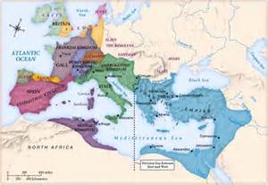
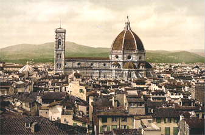
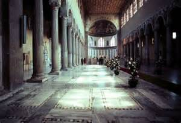
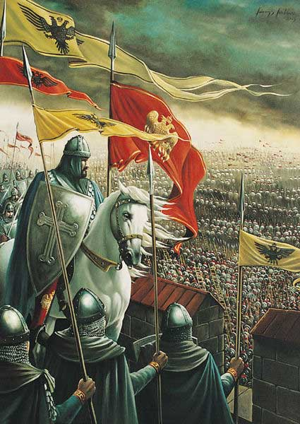

# 拜占庭的文艺复兴：本质与特性

**引言及概要**

现代所有的古希腊经典文献，除了极少数从埃及的沙漠中的纸莎草纸残片，字数极少的铭文外，所有都是通过拜占庭的知识分子阅读、保存、传抄而流传到现代，成为西方文明的创造力来源。卢梭出名地将十五世纪后欧洲的文艺复兴归功于拜占庭的传承：“君士坦丁的皇座的沦陷在意大利带来了古希腊的残骸碎屑。法兰西随而因这些宝贵的遗物而丰富充实。” 1 然而，希腊古典文学在拜占庭的千年承载中也有起有落，后人视作文化瑰宝的文本迷失在中世纪的停滞中，几次拜占庭的文艺复兴将古希腊文明再次注入到知识社会的血脉中，让学者们不用费力独立发现古人已知的渊博学识。本文了从关于拜占庭复兴的几部专著中综合提炼出关于拜占庭复兴的本质的思考。围绕着文艺复兴史学概念、三次文艺复兴的发展轨迹、拜占庭文明的内部矛盾、拜占庭希腊主义的发展这几个主要问题，介绍了拜占庭的知识史。拜占庭专有名词均以希腊文的英文译写为准，如果中文文献中罕见的不会有辅助的中文译名。

**一、文艺复兴史学概念**

十九世纪以来对意大利文艺复兴的研究衍生出了其他文艺复兴的说法，由此文艺复兴的历史学研究方法提出了如何定义文艺复兴这一基本问题。 由于古典时代受到文艺复兴以来的知识分子的高度赏识，该时期成为了比较衡量不同历史时期以判断复兴与衰退的标杆。首先介绍这个为西方文明奠定基础是如何分步发展完善的。从公元前五世纪到四世纪下半叶，雅典经历了剧作家、历史学家、哲学家、修辞家等文学创作的爆发，使该时期成为希腊的古典时期。文化原生以及此后绵延不断的希腊主义2 的源泉，古今希腊语文明的基础。创作于该时期的文学著作（belles lettres）成为后期传承。文人立刻开始了二十多个世纪的尝试来克服理解和诠释上的障碍，虽然这些障碍随着岁月流逝而有增无减。接着古典希腊的是希腊化时期，继续创作了后人敬仰的诗作和哲学著作。而此时亚历山大图书馆的学者发展了文学批评，已达到尽量改正传抄造成的错误、还原文本的目的。为此，他们编辑了大量的参考书和目录来归纳文学著作。与此同时，希腊文学进入了衰退期，这创造力的低迷持续直到第二次智者运动3 时以修辞和散文为主的创作复兴。第二次智者运动的影响持续了两个世纪，在其落下帷幕的时候古典著作基本上完善了，尽管后来的基督教教父文学在拜占庭夺取了经典的地位。

希腊古典文学在拜占庭学术史上很难定义。对现代学者来说的经典有异于对拜占庭学者的经典。首先，现代意义上的经典局限于多神教文明的古代。然而，由于希腊文学在早期基督教文献中的中心地位，以及古典时代晚期基督徒文人的涌现，拜占庭公认的经典书目包括并崇尚这些后来者。然而，异教文明的经典作为拜占庭身份的精要得到很好的汲取和留存，在其文化生活中的精髓里得到汲取。对这些经典的强度随不同时代得到不同程度的重视，形成了一系列的古典文化复兴和衰落。

二、**三次文艺复兴的发展轨迹**

由于他们对古典文学和思想的复兴符合文艺复兴的定义，三段拜占庭历史时期成为本文的研究对象。在这些人文主义盛行的时期，拜占庭人接触到现代意义上的古典时代总而与拜占庭当时的文化传统保持了一定距离，超出了受古典时代后期基督教教父4 文化影响的垄断。作为惯例，这些文艺复兴套用当时治王朝的名称马其顿复兴从八世纪末期持续了约180年直到十世纪下半叶。5 科穆宁复兴从十一世纪中期开始，结束于1204年第四次十字军东征。巴列奥略复兴始于十四世纪终于1453年君士坦丁堡沦陷。这些对早期传统的恢复也是与此同时对当代传统的远离。

在比较了古典时代与随后的时代后，意大利文艺复兴与之前的文艺复兴做出比较。关于文艺复兴这个术语是必须作出观察澄清这个概念，因为自从埃尔文·潘诺夫斯基（Erwin Panofsky）提出了在流动的历史条件下发生的众多次要文艺复兴（renaissances）和一个独一无二，影响广泛的十五、十六世纪文艺复兴（Renaissance）之间的区别以来就引起了诸多争论。6 简单来说，文艺复兴是强力的恢复对古典文学，尤其强调世俗的学问多于基督教学问。7 许多历史学家接受雅各·布克哈特的观点，将文艺复兴的概念推广成一种社会现象。按照布克哈特的说法，他“并不关注学问本身而是着重于古代事物在文学和生活中的再现”。他强调文化活动内部反映的思想形态，例如对个人荣誉的重视。布克哈特对意大利文艺复兴的刻画影响众多小文艺复兴的评价，因为所谓的小艺复兴是由意大利文艺复兴的理想型投射回中世纪产生的。鉴于意大利文艺复兴最初是整个中世纪的对立面，这点具有讽刺意味。例外，通过指出中世纪学者的铺垫 从而限制了意大利文艺复的新颖性，布克哈特为中世纪历史研究增加了注意力。由此，中世纪的研究会受益于对小文艺复兴上作目的论分析来认识到他们与意大利文艺复兴的关系。

前苏联学者亚历山大·卡日单（Kazhdan）否认所谓科穆宁文艺复兴值得被称为文艺复兴时明显受 受布克哈特影响。他注意到拜占庭对古典文学汲取的不可思议的连续性，犹如延续了一个幻觉般的“社会梦”，中世纪的拜占庭通过复古这种社会构造，来维持与古希腊的文化联系。8 这种连续性质疑文艺复兴这一术语的应用，因为文艺复兴要求除复古模仿增加之外，还要求离开当代文化现状的质变。其他意大利文艺复兴的特征，譬如作者地位的提高以及对个人的重视，也是科穆宁复兴所缺少的。卡日单降低科穆宁复兴至一个“前期文艺复兴”，表现出显著的目的论视角。然而，他不想澄清这一自创的术语。

相反的是，学者瓦伦·特雷格尔德（Warren Treadgold）扭转了目的论并颠覆了小文艺复兴和意大利文艺复兴的关系。他认为，意大利文艺复兴是终极的小文艺复兴。根据他的说法，“通过从最后一次拜占庭文艺复兴接收学者和文献，西方从黑暗时代和文艺复兴的循环中演变出来进入了意大利文艺复兴，从此以后再也没有黑暗时代”。9 还有，特雷格尔德将文艺复兴的意义缩小成古典文学著作知识的恢复。这是本文认可的方法。为了探讨希腊古典文学的传递，我们应按照如何增加与古代的接触，也就是弥补多少现代与古代的在古典知识上的差距来评估拜占庭的文艺复兴。最后还要批评一种出于谨慎避免应用文艺复兴这个术语的说法。为了不强加与意大利文艺复兴的联系，学者Ihor Sevcenko退而用“复兴”（revival）来指有力的文科兴盛。 这样他逃避了复兴时期拜占庭学者的一个关键问题，即他们在异教的古典时代和基督教教父的后期古典时代两个传统之间面临抉择。

​三次文艺复兴不是一致的知识运动，而是在他们如何接触古典文学方面有所不同，尤其是在创造力迸发的程度上。创造力的概念在拜占庭文化中需要澄清，并不是脱离传统的文化环境现代意义上的创造力，而是在对古代主题的重新演绎，创作自由受知识局限束缚的情况下独具风格的模仿。最初的复兴是九世纪的马其顿文艺复兴，这个从创造力来看一般的成功但不卓越为后期的发展开辟了根基。 如果说这次文艺复兴把文明从低点中提升起来，它不够成熟未能立即有原创的产物。马其顿复兴中主要的知识活动是对古代知识的编辑，收集。许多学者参与了目录的制作。教会大分裂时任大牧首阜丢斯（810-893）享有成功的政治和学术生涯。他的早期作品《辞书》，现名为大牧首阜丢斯辞书收集了古典希腊文（阿提卡希腊文）的词汇，尤其是被修辞家和历史学家用得好而值得参考的，以作为实用的阅读辅助。这本工具书使用广泛，为十世纪的百科全书编辑们10 提供了铺垫。其后，阜丢斯写作了著名的《文库》，一个含有279项条目的图书目录总结了他的阅读，主要简介并评价了在经典书目之外的稀有书籍。他不仅忠实地记载了这些不现存的书目，并且在攥写条目时模仿被介绍的对象的风格。对于六十部收录于《文库》的世俗著作，阜丢斯只表现了语文学和风格上的关注。就如追随他脚步的百科全书编辑们，他对古典时代后期的作者以及教父们比希腊古典时期更感兴趣。拜占庭学者威尔逊（N.G. Wilson）并不赞赏阜丢斯的文学偏好，就比如他给予柏拉图书信过低的评价但是给一个第二次诡辩时期的不为人知的书信家最高的评价。在他对异教古典作品的保守态度上，阜丢斯显得平庸，遵循拜占庭疏远古代思想的常规。在他晚年的《安菲罗科斯书信》（amphilochia）中表现出一个虔诚基督徒的形象，更加远离古代思想。如此，他非常欣赏教父文学，对圣巴西勒的雄辩情有独钟。

既阜丢斯之后，凱撒勒亞的阿力他（Arethas of Caesarea）（850-932后）继续了广泛的对古籍的收集，编目和阅读。他的图书目录同时也留下了关于书价的史料。他委人抄写了众多世俗书籍，并且给许多古代作者写了批注（scholia）11 ，包括柏拉图。他给后人最大的功劳应数他保存的马克·奥列留的作品。其后，君士坦丁七世（Constantine Porphyrogennetos）（912-959），除了写作政治论著外，赞助了百科全书的编辑，大大促进了实用古代科学知识的编辑整理。文史方面，君士坦丁委托编制了《君士坦丁摘要》（Excerpta）来总结了后古典时代以及拜占庭史学家的著作。这部著作被后来的百科全书《苏达辞书》广泛引用。《苏达辞书》（souda）是一部根据其他编辑做的编辑，主要来源包括《辞源》以及批注的收集。这种缺乏自主研究的的编辑最能体现这个时代拜占庭的复兴学者们对汲取古代思想先进性和超越的无能为力。无路如何，承认原创性的缺失并不是要否定这次复兴的优点。从零散书目中恢复了如此多的古代知识迫使学者们把精力集中在传抄，分类，编辑经典著作，为以后可能的创作准备材料。况且，在漫长的衰退时期刚结束之后就进行对古典的高雅模仿只是现代批评家的奢望。只有在古典的模范，形式和风格受到散播以后才会有这中创作。

尽管早期丰富的古典收集和传播没有能够导致对古典传统的深入吸收，科穆宁复兴在这发面取得了一定成功，可以说更加的有创造力。在文艺复兴的环境中，原创意味着恢复希腊主义的精髓—也就是其创意的方面—的能力。通过表明不同时期对荷马的接受水平的不断提高，拜占庭专家卡日单确认了文化原创力随复兴逐渐进步，随着百科全书运动对荷马注释的编辑保存， Niketas of Choniates 13 (1156-1217)在十二世纪新颖地将荷马诠释成道德寓言。Eustathios of Thessalonike（1115-1195）将评判的范围扩展至语文学之外，包含了史诗中的文化知识，应用到对当代地缘政治形势的评论中。同样地，John Tzetzes 14 （1110-1180）给传统的寓言诠释赋予了当代意义。确实，科穆宁复兴的成就超越了仅仅的模仿，达到了高水平的吸收和比较激进的复兴，以至于偏离了拜占庭的文化常规，也就是近期传统。除了基于之前的复兴的原创的学术成就后，文学创作也得出相似的结论。Michael Psellos15 在十一世纪创作了具有卓越叙述技巧和独特史观的《编年史》根据个人所知记叙了976-1078年的事件，围绕着角色的自由动机发生，不由得天道指引。而Anna Komnene（1083-1153）在十二世纪写了颂扬她父皇阿历克塞（Alexios I）的当代史《Alexiad》，创造了深刻复杂的意象和情感丰富的描述。丰富的浪漫文学也自从第二次诡辩运动以来再次出现，再现了古代的梦幻，充满了异教神话元素，它们逼真地模仿了古代的世界观，甚至能说是文字的错视画。学者Anthony Kaldelis评价说：“我不能肯定我们的古典学者们能够轻易地判断出这些是十二世纪的作品。”17 在主旨上，这些作品恢复了古代希腊人和野蛮人之间对立的概念。古希腊人认为，说希腊语的人是希腊人（Hellenes），也就是传说人物赫楞（Hellen）的后代，不说希腊语的便是野蛮人（Barbaros），在许多冒险小说中的异域都会遇上希腊主人公。一部值得一提的小说叫做《Rhodanthe and Dosikles》17 ，作者是柏拉图主义哲学家Theodoros Prodromos（1100-1165）。它讽刺琐碎的神学争议以及当代统治者的缺点，利用在一个朝廷和教会高压的环境下文学媒介显得相对安全的优点来表达批评。主旨探讨了古典的爱情和卓越的品质（arête，英文virtue），因此体现了对异教文化的老调重弹。

拜占庭人与古典的距离显然在科穆宁时期越拉越近。而在巴列奥略复兴时，拜占庭科学家不仅重振了古代科学知识，并扩大了感兴趣的范围。Nikephoros Gregoras（1290-1360）18 研究托勒密，批判托勒密著作的手抄本并增补了文本，还写作关于星盘的技术论著。对天文学的精通使得他能够改正儒勒历，修正的版本与现代格列高利历法相差无几，并且计算出日食。通过引进阿拉伯天文学，更多的新发现注入天文学著作中。George-Gregory Chioniades（？-1320）和George Chrysokokkes收集并翻译了东方著作，引进了新数据和理论用以补充托勒密，有的甚至取代了托勒密的发现。巴列奥略复兴的科学发现为古典科学注入新血。

**三、拜占庭文明的内部矛盾******

世俗和基督教的学问在这几段文艺复兴时期明显对立，世俗学问争取到更多的重视，尽管两者常常处于竞争中的僵势。作为一个政教合一的虔诚基督教文明，拜占庭的传统的知识构造有内外之分，内部知识涉及宗教、神学，而外部知识是世俗和多神教知识。就如涂尔干指出，宗教总是倾向于强调神圣和世俗的区别。虽然内外学问在拜占庭历史都有发展共存，两者不一定是兼容并纳的。拜占庭帝国的头三个世纪之内，世俗学问经历了严重的倒退，受到哲学学派受朝庭取缔的刺激，造成了文学产出一直下落到破坏圣像运动时的低点。19 在这个文化活动的广泛停滞，尤其是古典文学衰落的时期，大部分被阅读、抄写和创作的著作都是基督教的体裁，如诗歌、圣人传记等。破坏圣像运动时的知识分子更多地把注意力放在神学争端上，专有地关注教父文学，冷落世俗学问，以致于学者Kaldelis指出，在第一次文艺复兴开始前，“拜占庭中期的文学比古典时代后期更多涉及教会，圣经，神学，而且产出更稀罕”。由此，拜占庭传统，有别于其继承的希腊主义传统，有非常显著的基督教元素，但是，下文将会表明，文艺复兴时期的拜占庭将会远离这早期形成的传统，让参与推动文艺复兴的人士（revivalists）穿透后古典时代这一层土壤来靠近异教的古典文化。

首先，在国家的支持下，马其顿文艺复兴时的高等教育机构扮演了世俗文明的推动者。在855年和866年间，Caesar Bardas （卒866），米海尔三世的舅舅，在皇宫大殿（Magnaura）创立了一所学校20 ，除任命他赞助的科学家和数学家利奥为校长教授哲学外，还分别设置了文法，几何和天文的教席。利奥又称哲学家利奥（Leo the Philosopher）（790-869后），毁坏圣像派的一名都主教（metropolitan）21 ，研读并注释了托勒密、阿基米德和柏拉图的著作，由于其科学上的成就当时被称为“希腊人”。大殿（Magnaura）的高等学校在一个世纪里促进了世俗学问的研究和传承，虽然不断衰退直到君士坦丁七世将其恢复。他任命了多名高官为教授，并且对其教学工作表现了个人的关注。可以说，皇家支持的高等教育推广了对古典知识的接触。学者Lemerle认为这有相当大的影响：“从此以后，文化再也不是个别孤立的、自学而成的知识分子的成就了：它散播的很快”。22 在科穆宁文艺复兴时，国家的参与更加重要了。君士坦丁九世在1046年创立了一所大学，包括法律系和哲学系来培训官员，并任命了Michael Psellos为“哲学家执事”(hypatos of the Philosophers)。Psellos是拜占庭哲学的革命性人物，此举的意义深远。23 但是，这个世俗机构没能够隔离教会干涉，教授们由于道德原因受到严厉的处罚。Psellos和法律系的教授Xiphilinos被迫接受修道士的生活制度，剃发祈祷，而Psellos的继承人John Italos由于对亚里士多德的研究被教会定罪。之后，在巴列奥略复兴时期，教育的重心落在了牧首学院（Patriarchal Academy）上，保守，符合拜占庭传统对神学的偏好。十四世纪末，曼努埃尔二世24 改革了君士坦丁堡大学和牧首学院，并且亲自入读大学。这持续很久的国家指导的高等教育在前两次文艺复兴的特征，在宗教学问遍布的文明中支持世俗学问。

知识分子对内外学问持有一连串的不同态度,个别被称为基督徒人文学者25 的知识分子将世俗知识用于宗教用途，对世俗知识的进步有不可否认贡献。他们有异于完全敌视世俗学问的宗教神秘主义者们（如Nikolaos of Methone，批驳了新柏拉图主义者普罗克鲁斯（Proclos）的形而上学著作），或者是在光谱的希腊主义那一端的智者们（如策泽斯John Tzetzes）。他们的贡献虽然是内外学问汇集的例证，并不能够表明基督教和希腊主义的兼容性。最受拜占庭人赏识的希腊教父，圣额我略·纳齐安（Gregory of Nazianzos）是这个典型的先驱，精通异教文学的他创作了神学雄辩。阜丢斯也能够恰当地被称为基督徒人文学者，鉴于他对宗教文学的重视和虔诚的信仰。在他晚年问答形式的书信集Amphilochia中，他表示他的世俗学识不过是为了给宗教学问做铺垫，通过贬低前者来歌颂后者，还猛烈地批评了柏拉图。不过，在他赞扬讽刺作家琉善26 的优秀风格和文学价值时，他忽视了宗教上立场的厌恶。

接下来，科穆宁复兴时期重要的基督徒人文学者，塞撒隆尼卡的大主教Eustathios of Thessalonike写作了关于荷马，品达和亚里士多德的评介著作，还收集了许多旧注释（scholia）。本身也是一名当之无愧的文学家，他谴责奴隶制，表现了基督教的慈济精神，也是一种人文主义的体现。卡日单注意到：“他享受生活，认为人际关系比宗教仪式更加重要”。27 他不仅的态度与苦行僧般的神秘主义者持有截然不同的态度，他还批评他们愚昧无知，希望他们能够更加关注学问。有趣的是，希腊的身份认同在Eustathios的思想中占有显著的地位。在古希腊衰落后，希腊人的身份沦落为稀有的概念，在早期拜占庭的文化中比罗马人和基督徒次要。Kaldelis注意到，Eutathios把希腊古典教育理想化为希腊主义的象征，如同某种甚至能够提高宗教生质量的催化剂。他崇拜古希腊异教徒的卓越品质，甚至在某种程度上把同时代的拜占庭人当作希腊人。在表现一个彻底的基督教文明能够产生对古希腊文明的热爱上，Eutathios是一个典例。

最后，Nikephoros Gregoras是巴列奥略复兴中脱颖而出的例子。一方面，在宗教问题上有强烈而鲜明的立场的虔诚教徒，以至于被作为反Palamas派的首领处死。28 另一方面，他在科学和哲学上有卓越成就。通过阅读阜丢斯的《书目》，他摘抄编成了关于宗教史的许多文章。他还写作了《罗马史》（Historia Romaike）29 ，是一部涵括近年事件，同时有自传性质的历史。在记载1350年代时这发生了变质，成为宗教争论的书。虽然Nikephoros Gregoras最欣赏古典时代的异教徒作者，他在自己的著作中只是肤浅地引用他们的作品来修饰，而没有在深层汲取思想上的启发。在他关于柏拉图和亚里士多德的哲学著作中，他从基督教的偏见视角来看待他们，从而没有能明白地解释亚里士多德的灵魂学说。30 作为一个语文学者，他非常熟悉圣经和教父著作的引用和解释。但是综合来评判，Gregoras是一个多方面涉猎的学者，热心关注一般宗教辩论家不感兴趣的学术探索。

某些人尝试在宗教问题上应用古代哲学论述产生的后果，凸显了基督教人文主义的局限。31 科穆宁复兴时连续几位叫阿历克塞的皇帝（Alexioi）对异端的积极迫害使这一点便显而易见。因为推动了一种对神学的理性诠释，Eustratios of Nikaia十一世纪末被教会宣告有罪。Nikephoros Basilakes， Michael the Rhetor和Soterichos在十二世纪中期，重蹈他的遭遇。显然，不是所有在神学领域上对应用世俗知识的应用受宗教界的认可，仅仅一小部分符合基督教关于神和灵魂的教条的哲学能够通过。基督教人文主义的另一问题在于引导复兴的知识分子没有诚心地认同这种观念。连非常崇拜异教文化的Psellos也奉承圣额我略·纳齐安。很多革新者像Psellos一样拿基督教人文学者的标签来当做护身符，以至于他们能够在教会高压下追求世俗学问。

最典型的基督教人文学者同时体现了这种模式的优势和局限。普拉努得斯（Maximos Planoudes，1255-1305 ）是一名在学术生涯中体现了精神修养的修士学者。作为一名语文学家，他修订了鲜为人知的拜占庭诗人Nonnosos的作品，以及赫西俄德的《神谱》和普鲁塔克的《名人传》和《道德小品》，多种科学著作，还编了隽语的选集。32 然而，过于过度顾虑文学的得体，他大手笔地删改奥维德的作品，去掉了基督教不能接受的神话情节。这背离了科穆宁时期皇室广泛把异教神话用作政治宣传的做法。普拉努得斯是基督教人文学者通过伦理的谨慎使得异教古典时代正当化的例证，可是产生相当有限的同化。总而言之，基督教人文主义可以解释根据基督教的需要选择性吸收的过程，但是不能够证明基督教与异教古典文明的兼容性。

**四、拜占庭希腊主义的发展**

几次文艺复兴改变了拜占庭身份特性的构成，从彻底的基督教到一定程度的希腊主义。根据Kaldelis的说法，拜占庭由希腊主义、罗马和基督教身份构成：帝国的罗马性依靠一个根据共同文明构建的罗马民族国家；希腊主义，这里定义为希腊身份的话语上的构建，相对于罗马性来说在拜占庭比较少有，因为实践希腊主义的人都是在古希腊传统教养（paideia）基础上的， 通过学习古典思想锻造的创造出一种新的希腊身份。33 虽然基督教是在希腊文明的子宫里孕育的，它摈弃了希腊文明的许多内容来树立自己有别于异教的身份。这就是为什么拜占庭传统上外省未归化的异教徒叫做希腊人，跟古希腊的世界观相反。一个经典的说法出于拉丁教父特土良（Tertuliano）的反问：“雅典跟耶路撒冷有什么关系？”意指基督教神学应该要与古典哲学切割开来，教会应该和希腊主义划清界限。在有基督教浓重地渗透拜的占庭文明里，希腊主义提供了基督教的道德和哲学替代品。34 在文艺复兴的过程中，希腊的身份逐渐地，生气勃勃地解放出来其潜力。

对古希腊文化认同的重新构建在后期受到外在因素的复杂化。不像马其顿文艺复兴时“第一波的人文主义”35 不受外界影响的恢复，巴列奥略复兴的特征是存在外国影响。希腊与拉丁文明的互相渗透和一个深远的拜占庭身份改变紧密并进，为希腊主义的增长设好了舞台。拜占庭学者们高质量的翻译工作提供了早已失落的拉丁古典作品给希腊语读者。翻译技巧得到进步，比如，给拉丁著作中引用的希腊文片段查找希腊文原文，而不是像先前那样进行二次翻译。被这些作品的精神气质以及高雅的文学性所吸引，普拉努得斯翻译了西塞罗的《西庇阿之梦》连带马克罗比乌斯的评论36 ，以及波伊提乌的名著《哲学的慰藉》，他尤其对这些著作中柏拉图和新柏拉图思想感兴趣。37 出于赞同与拉丁教会合并，他翻译了奥古斯丁的《三一论》（De Trinitate）。紧接着他，德米图斯·西多内斯（Demetrios Kydones，1324-1398）继续翻译拉丁文献，以这些来源为辅助深化了拜占庭知识圈对古希腊经典的理解。崇拜亚里士多德多于柏拉图，西多内斯被阿奎那著作中的亚里士多德哲学所吸引，将其著作连带奥古斯丁和经院派哲学家的那些翻译成希腊文。西多内斯对托马斯主义（Thomism）的接受表明了一种受拉丁学识熏陶的趋势，被许多显著的知识分子，如曼努埃尔二世和约瑟夫·伯吕恩纽（Joseph Bryennios）共同分享。George Scholarios，主要的亚里士多德派人士和大牧首，在1435年翻译阿奎那的亚里士多德的评论，延续了拉丁语文学事业的尾声。当然，亚里士多德研究不仅仅从西方引入，如果考虑到包括Psellos, Italos, Prodromos and Tzetzes在内的科穆宁时期学者。从拉丁文献里吸收的哲学知识巩固了希腊语的学术贡献。

自从第四次十字军东征攻占君士坦丁堡以后，拜占庭的知识分子都顾虑于西方影响的不断扩大，以及由于政治军事形势所迫，热衷于拜占庭教会与拉丁教会联合的争议。38 这种自我身份意识的提高，跟几个世纪前稀薄的希腊身份认同形成鲜明对照：马其顿文艺复兴的阜丢斯在阅读希罗多德时更关注波斯方面的发展，全然没有被古典时代强烈的反波斯的希腊精神所感染，可是三个世纪之后，希腊主义在拜占庭的构成中占了空前显著的分量，知识分子们频繁地自称为希腊人（Hellenes）。早在尼西亚帝国时期，狄奥多罗二世（Theodoros II Laskaris）39 便热衷于民族希腊主义的理念40。（Kaldelis, pg.369）在巴列奥略时期，当希腊的民族认同得到增强时，塞奥佐罗斯·梅托基提斯（Theodoros Metochites） 和格弥斯托士·卜列东（Gemistos Plethon）最能代表这种集体意识的改变。梅托基提斯主要是政治家和天文学家，但是他的文学作品最能说明希腊意识。在被他引用和批评的作者中，写作世俗题材的散文作家得到最多关注，包括普鲁塔克，琉善，Dion Chrysostomos41 和Synesios42 。他严肃地深入思考了这些作者的内容，根据自已的政治理念批评柏拉图不切实际，崇尚普鲁塔克的道德境界而不是按照习惯欣赏普鲁塔克的文笔。他特别跟Synesios有共鸣，因为后者在其历史著作《Dion》中抗辩基督教僧侣的控诉，捍卫了古希腊文化与古希腊传统教育模式。43 在他的许多著作中，Metochites为拜占庭感到骄傲，把他的同胞们称作希腊人，因为他们保存了古希腊文化。这个关键人物的态度阐明了新的希腊性形成的过程，不是流传下来的，而是通过旧传统重新构造的。

如果说Metochites巴列奥略复兴初期他贡献塑造的希腊特性的证人，卜列东的生涯则是这次复兴末期的希腊主义复兴的证据。卜列东被学者判定是“最有创意的拜占庭思想家”44 ，他在自己的新柏拉图主义著作里猛然公开反基督教的观点，希望恢复古代多神教，摈弃了拜占庭根深蒂固的基督教模范，以至于他的遗作被大牧首不情愿地烧毁。他对柏拉图的信奉超越了理论层次，给米斯特拉的专制公45 提议根据《理想国》进行政治改革。在他思想里，柏拉图主义不再是一种宣扬虔诚和诚惶诚恐地做人的基督教信条的支柱，而是成为了异教希腊主义的显著特征。然而，除了激起了一场持续很久，牵涉到许多旅居意大利的的拜占庭学者，柏拉图派和亚里士多德派的争端之外，在君士坦丁堡沦陷之前他对同代人有非常少的影响。直到最后，拜占庭人也没有能彻底地使自己与古希腊同化，汲取古典思想，或者发展出非常强的希腊主义情感，相比之下，意大利文艺复兴更充分地靠近古代。 46 如此，卜列东反映了彻底恢复希腊主义的野心的失败，同时表现了巴列奥略复兴的成就和局限。

经过上文的论述，现在可以讨论与古代的连续性，这个每一个拜占庭复古主义者都向往的状态。可以辨别出两种连续性，一种是知识史发展的明显特征，即路径连续性，是与新近传统的连续。很自然地，后来的学者参考较早的著作，继承其文学风格和世界观，这种较保守的发展途径以现状作为起点。例如，改编（metaphrase，一种文体）的作者们总结十二和十三世纪的著作，Joseph Rhakendytes 47 同意普拉努得斯古典学识对内部学问有帮助的看法等。另外一种连续性可以叫做向量连续性，描述现状与历史上原点之间的位移，也就是说，根据文学知识的状态，其与原始的文化生命力—古典时代的联系会不一样，而且，不管拜占庭文化怎么发展，始终会不会脱离其源泉。这种发展轨迹跟新近的路径毫无瓜葛，只跟遥远的过去相对应。例如约翰五世按照修昔底德的模范写一了部当代史，数学家利奥通过对托勒密和阿基米德的掌握来研制了烽火台通讯系统，十二世纪的小说家们重新创造了古典希腊世界的梦幻，这些与古希腊的连续，就如卡日单所说，构成了一种有意幻想的社会梦。

**四、****结论**

结论就是，拜占庭的文艺复兴应该要按照多少古典时代的精髓被人恢复这个标准来评判。革新不是复古的反面，而是与新近传统的切割，与原有传统的脐带愈合。马其顿文艺复兴、科穆宁文艺复兴、巴列奥略文艺复兴不是一律不变的，随时间而改变，独创性有不同的的体现。同时，本文主张这些文艺复兴的本质是在于褒扬古典的古代（也就是现代意义的古代）而贬低拜占庭失真的古代。高等学校和基督教人文主义在促进复兴时扮演的角色揭露了拜占庭神圣和世俗之间的矛盾。这两种不兼容的元素在竞争中互有盈亏，而在几次文艺复兴过后世俗的元素，也就是希腊主义，得到了越来越多的依附，以至于拜占庭在暮年塑造了一种新的希腊身份。虽然拜占庭的文艺复兴在很多方面都不及继承它们的意大利文艺复兴，这些复古的知识运动成就了对古希腊文明的吸收，深刻地探讨了这些遗产，也是当之无愧的辉煌插曲。

**注释：**

1 Jean-Jacques Rousseau, _Discours Sur Les Sciences Et Les Arts ; Discours Sur L'origine De L'in__égalité_, ed. Jacques Roger (Paris: Flammarion, 1992), pg. 30. 作者译。 2 泛指对古希腊文明的欣赏和研究，或指某些拜占庭人、现代希腊人作为古希腊后裔的身份认同 3 60-230年雄辩成为希腊的主要文学活动，带动其他文学体裁，也泛指这次复兴后持续到5世纪的智者派的兴盛。 4 教父 （Ekkl**ē**siastikoi pateres，英文Church Fathers）是在基督教中除圣徒以外最权威的作者们。最著名的希腊教父有俄利根（Origenes），三位迦帕多家教父，和金口约翰（英文John Chrysostom）。 5 Treadgold提前了传统上马其顿复兴的开始年份，认为破坏圣像运动中盛行的研究教父文学为此文艺复兴做出铺垫。 6 虽然让·阿代马尔（Jean Ad’emar）更早提出周期性反复发生的文艺复兴 7 中文“文艺复兴”在翻译容易误导。实际上renaissance字面上仅表达复兴的意思，不一定限定于文学和艺术的广泛复兴。 8 Alexander Petrovǐc. Kazhdan, _Bisanzio E La Sua Civilt__à_ (Roma: Laterza, 1983), pg. xv. 9 Warren T. Treadgold, Renaissances before the Renaissance: Cultural Revivals of Late Antiquity and the Middle Ages (Stanford, CA: Stanford University Press, 1984), pg. 22. 10 见下文 11 写在页边的对经典文本的逐行注释，希腊化时期发明的文本批判方法 12 历史学家，著有Chronike diegesis (History),一部十二世纪的当代史。另有神学论著。 13 见下文。 14 该语文学者也著有书信集《一千事》（Chiliads or Histories），常有古典和圣经的引用。 15 （1018-1081）。 16 Anthony Kaldellis, _Hellenism in Byzantium: The Transformation of Greek Identity and the Reception of the Classical Tradition_ (Cambridge: CambridgeUniversity Press, 2007), pg. 26. 

17 见Prodromus, Theodore, Eustathius, Constantine Manasses, Nikētas, and Elizabeth Jeffreys. Four Byzantine Novels. Liverpool: Liverpool UP, 2012.

18 Gregoras主要是历史学家，见下文。 19 Treadgold, pg. 77-78。 20 有别于传统看法，卡日单质疑这所学校的存在 pg.121。 21 曾在布道时讲授数学。 22 308。 23 比如，Psellos的哲学主张自然被上帝创造后根据自己的法则运作，不容得奇迹干预。 24 1391-1425在位，本身也是重要文人，曾游历西欧。 25 humanism也有古典文化研究之义。 26 Lucian of Samosata 。(120年生)，第二次智者运动时以古雅典希腊语创作的散文对话著名。 27 A. P. Kazhdan, "Eustathios of Thessalonike," in The Oxford Dictionary of Byzantium (New York: Oxford University Press, 1991)。 28 Gregory Palamas是支持静默主义修道方式的神学家，遭到另一神学家Barlaam of Calabria利用三段论思辨反对。此论争在十四世纪牵涉朝野众多知识分子。 29 拜占庭自称为罗马，而有希腊血统的拜占庭人自称为罗马人。 30 Fryde, pg. 367。 31 Kazhdan and Jane, pg. 160ff。 32 六世纪外交官诗人，不是罗马希腊诗人Nonnos of Panopolis。 33 Kaldelis, pg.119。 34 Kaldelis pg.117。 35 Lemerle用的标题，该学者驳斥了早期复兴得益于叙利亚、阿拉伯文献对古典的转载。 36 Ambrosius Theodosius Macrobius, 四世纪至五世纪的拉丁作家，对《论共和国》中西庇阿顿悟的片段作了新柏拉图主义解说，在中世纪影响巨大。 37 Fryde pg. 259。 38 1054年发生东西教会大分裂；需要澄清，拜占庭的教会一直不服从罗马教皇，但是没有现代“东正教”的概念。自称“katholike、orthodoxos”，普世、正统，与罗马教会的定性一致 39 1204-1261年君士坦丁堡被十字军设立的拉丁政府占领，帝国迁都尼西亚； Theodoros II为一哲学家皇帝。 40 Kaldelis, pg. 369 41 40-111后，第二次智者运动希腊演说家和犬儒派哲学家，不是屈梭多模（金口约翰）。 42 370-413,基督徒文人。 43 Fryde, pg. 330。 44 Runciman, pg. 2。 45 Despot的日语译名“专制公”最恰当不过。 46 Sevcenko, pg. 170。 47 1260-1330哲学家，著有《百科全书》。  **参考书目：**

Burckhardt, Jacob. _The Civilization of the Renaissance in Italy._New York: Harper, 1958.

中译本：《意大利文艺复兴时期的文化》马香雪、 何新 译 商务印书馆 1979

Fryde, E. B. _The Early Palaeologan Renaissance (1261-c. 1360): By Edmund Fryde._Leiden: Brill, 2000.

Kaldellis, Anthony. _Hellenism in Byzantium: The Transformation of Greek Identity and the Reception of the Classical Tradition_. Cambridge: CambridgeUniversity Press, 2007.

Kazhdan, A. P., and Annabel Jane. Wharton. _Change in Byzantine Culture in the Eleventh and Twelfth Centuries_. Berkeley: University of California Press, 1985.

Kazhdan, Alexander Petrovǐc. _Bisanzio E La Sua Civiltà_. Roma: Laterza, 1983.

Lemerle, Paul. _Byzantine Humanism: The First Phase : Notes and Remarks on Education and Culture in Byzantium from Its Origins to the 10th Century_. Canberra: Australian Association for Byzantine Studies, 1986.

Panofsky, Erwin. _Renaissance and Renaissances in Western Art._New York: Harper and Row, 1969.

Runciman, Steven. _The Last Byzantine Renaissance._Cambridge [Eng.: University Press, 1970.

Sevcenko, Ihor. "Palaeologan Renaissance." In _Renaissances before the Renaissance: Cultural Revivals of Late Antiquity and the Middle Ages_, by Warren T. Treadgold, 144-72. Stanford, CA: StanfordUniversity Press, 1984.

Treadgold, Warren T. _Renaissances before the Renaissance: Cultural Revivals of Late Antiquity and the Middle Ages_. Stanford, CA: StanfordUniversity Press, 1984.

Wilson, N. G. _Scholars of Byzantium_. Baltimore, MD: JohnsHopkinsUniversity Press, 1983.

(采编：彭程；责编：彭程)
