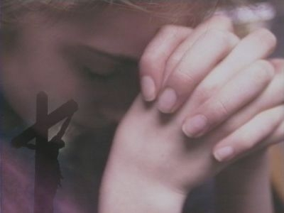

# 政治见解不同的两个人，是否可以相爱，做爱，结婚生小孩

** **

看过不少段子，政治控男编的，大意是看到某某美貌姑娘，性欲大起，遂上前搭讪，结果发现是男默女泪党，或者星座党，或者是自带干粮的女五毛，于是充满鄙夷，充血的鸡巴顿时瘪下去了。转身立马编个段子发到人人网上，以此明志。

或者某女生跟一个男生约会，结果发现对方是党员，或者是校团委内部人士之类的，一下冷淡下来，越看对方嘴脸越觉难看，草草结束了约会，转身立马编了个段子发到人人网上，以此明志。

或者有人放假回家，说到和家人或者旧友的餐桌聊天，结果对方是反美反日斗士，或者爱党拥政分子，或者是体制内的一份子，顿时深感失落，觉得旧情不复存在，大有痛心疾首之势。转身又立马编个段子发到人人网上，以此明志。

每次看到这些，笔者心中总会有一个疑问：难道政治见解已经在我们的思维里占据如此大的分量，以至于我们的情感、爱憎、对人亲疏都要根据它来决定？

大部分喜欢谈论政治的人，总是喜欢将政见当成划分敌我的首要标准——政见一致者，自然是朋友，推心置腹，政见相左者，必然非我族类，大可得而杀之，而忽略了私德和品格。私以为，在朋友之间，政见相合并非最重要的，政见相合者未必是真朋友，而政见相异者未必是死对头。最重要的是此人是否正直，诚恳，对人和善，宽容。举一个人尽皆知的例子：管鲍之交。

本人在和朋友，和家人相处的时候，几乎从未谈论过政治。这并非表明我持“莫谈国事”的态度，而是我认为，政治属于一个公共层面的话题，公开谈论，争辩，甚至对骂，都是合理的。但是在私交的层面上，政治并非一个上佳的话题和交流点，而政见的异同，也并非唯一的择友标准或者择偶标准。

比如崔鸡巴，他崇拜韩寒，只要是反对政府的他肯定支持，早年他反日，反美，现在反共，是个傻了吧唧的低端草泥马，我应该很看不上他才对，可是我知道他只是个工作稳定吃饱了撑得没事干的首都男青年，头脑简单，心地善良，会帮我搬行李，会请我吃饭，会在我特别穷的时候借给我钱，会在我蹲在地上哭泣的时候把我抱起来，会送我电影票，有时候看我仍然含情脉脉，这就足够了。况且，我爱的是他的鸡巴，又不是他的政治看法。

比如豆豆，他什么社会事件都不关心，就喜欢玩游戏，玩摩托车，偶尔看电影，几乎不看书，他不知道艾未未谭作人刘晓波陈光诚，不知道三年大饥荒死了多少人，而且经常会为政府说话，可是那又怎样呢？大学时他在冬天送我绵羊油，长期借给我相机，让我放肆地占用他的电脑，在聚餐之后开车送我回家的路上轻声说“你挺不容易的”，在聚会的时候突然夸我鞋子好看，笑起来一脸的孩子气，爱起来脉脉含情。我知道他永远不会做伤害我的事，说伤害我的话。

比如我姐，说到政府的时候她反政府，说到美国的时候她顿时又成了反美愤青，看抗日题材的电影时又是一个十足的反日愤青。但她就是我姐啊，她就是那个别人欺负我会跳出来帮我吵架打架，上大学在学校健美操队拿到补贴会给我买衣服，出国之后拼命打工，还给我买这买那寄回来，甚至托人给我带钱回来，看过我所有的文章日志知道我的同性取向之后告诉我“无论你做什么，姐都支持你”的姐姐。

我根本就不在乎他们对这个政党，对这个政府，对这个世界有什么看法。因为我知道，他们是这个世界上对我最好的人，是有血有肉，内心柔软的普通人。

十几岁的时候看过夏宇的一首诗《乘喷射机离去》，里面有一句：“这是一枚炮弹／炮弹在黎巴嫩落下／激烈的改革者温驯的／回家吃晚饭”。多年之后仍然清楚记得。

诗人写诗，不会考虑一句诗的现世价值和后世意义。所以在这也略去不言。但这句诗所要表达的意思，所有人一目了然：即使是政治人物，也要归于日常生活，要吃饭，约会，看电影，恋爱，工作，看舞台剧，看展览，去音乐会，旅行，郊游，看乐队演出，去图书馆，在公园散步，到植物园赏花，过生日，喝酒，亲自下厨招待朋友，玩电玩，运动健身，做爱，结婚，生育……而在进行这些的时候，并不需要政见的加入。而我相信，爱他们的人，他们的朋友，也并不关心他们的政见如何。

比如，某一个民主斗士，他说的所有的话，写的所有的文章，从事所有的运动，都在显示自己的社会良心，但他其实刚愎自用，对恋人不忠，同时有好几个地下情人，最后跟一个对他事业最有帮助的女人结婚，伤害了所有爱过他的女人。而某一个党员，或者五毛，他对爱人专一，对家庭负责。你会选择和谁相爱？

又比如，某些右派，反对派，或者自命的自由主义者，看起来冠冕堂皇，实则内心狭隘，对人不善，不会尊重他人，不守信用，热衷于自我美化，内心懦弱，小肚鸡肠。而某一个左派，党员，或者五毛，宽厚有礼，言出必行。你会选择与谁交友？

因此判断一个人是否值得融入你的日常生活，他的政治观点几乎可以忽略不计。而如果你在日常生活中与人打交道时，仍然热衷于谈论政治，你这个人，得有多乏味啊。

有人会说：跟一个人在一起，如果对政治的看法完全是相反的，比如我是反对派，而他是五毛，两个人还有什么可说的。当然，有没有话说，这取决于你们双方的宽容度，以及你们打算寻找的是革命同志，革命伴侣，还是挚友，爱人。我党丰富的历史教训已经证明：革命同志，革命伴侣，并非真的可靠。

革命同志可能会出卖你，革命伴侣也可能会背叛你。而只有真正的朋友，只有真心爱你的人，不管在你得意，还是失意的时候，一直在你身边。有可能伴你一生的，是这些对政治一窍不通，或者与你政见相反的人。

试着把政治从个人情感里剔除吧。在过去的几十年里，我们已经看到了太多意识形态介入私人生活而带来的悲剧，为了表明自己的政治立场而不惜与家人，朋友，爱人划清关系，家破人亡，妻离子散，旧友反目。如果说，我们要反对一个罪恶的体制，但我们体内的血液，我们的思维方式，仍然沿袭自这个体制，那我们所做的一切，又能有什么善终呢？

相反，看看欧美国家，看看泰国，看看台湾，也许一个家庭里，一群朋友里，甚至一对恋人，会分别是两个对立党派的支持者。大选之时，他们会站在各自的阵营摇旗呐喊，针锋相对，但这并不妨碍他们回到家后活在同一屋檐下，你为我盛汤，我为你端菜，周末聚会烧烤踢球打保龄，相亲相爱。

最后不得不说到一部电影，《蜘蛛女之吻》。在这个双线故事里，现实中的莫利纳是一名因为同性恋罪名入狱的，贪图享乐的，娘娘腔的男人，爱上了因为从事反政府活动而入狱的男人。最终莫利纳改变了那个男人，让他爱上自己。而莫利纳也为了那个男人，出狱后完成男人托付给他的一项革命任务，最后被警察跟踪败露，被男人的革命伴侣开枪打死。在莫利纳看来，他所做的一切，完全与政治理想，与革命无关。他所做的一切，只是因为爱。

 

（采编：董一儒；责编：应鹏华）

