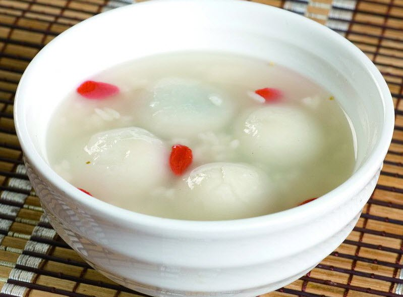
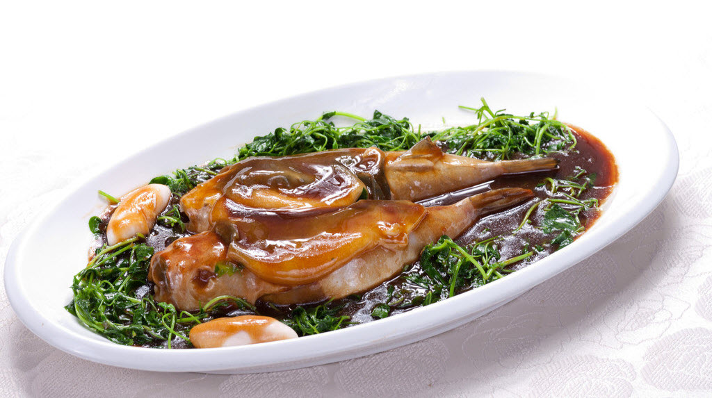
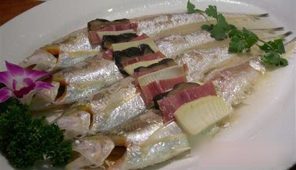
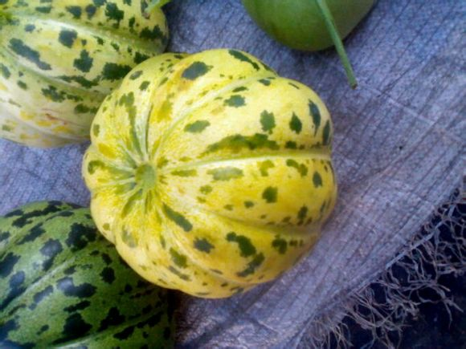
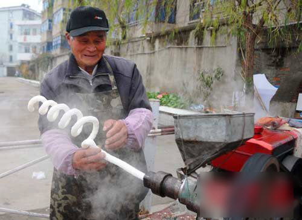

# 故乡食话

一、白酒 

早些年读流沙河先生的《Y先生语录》，最喜欢看他讲家乡的吃食。“春天的苕菜，还有香椿拌嫩胡豆哟，夏天的凉粉，还有酸豇豆炒碎牛肉哟，秋天的泡海椒，还有干煸狗爪豆哟，冬天的泡青菜，还有豆豉熬腊肉哟。”每每看到这里，我都是要读出声的，未及念完，已是口水四溢，摸着肚子咂摸嘴巴了。起初不明白他讲的苕菜是什么，老先生是金堂人，我还以为这是四川特有的菜色。后来有位成都同学拿着红苕跟我说，苕菜就是它的叶子，顿时恍然大悟，嗨，那不就是番芋叶子嘛！

番芋叶子我们那里当然也有，不知道金堂人怎么做，我们是不炒着吃的，一般都是要煮咸粥了，和豇豆、芋头一起下锅。炒的吃法也有，那是几十年前的事了，没有菜了就拿它往锅里一抄，不放油也挺香。不过那时候人家还舍不得吃它，怕叶子摘得多了，下面番芋长不好，收不到什么斤两，那可又要挨饿。后来日子好过了，也就是人家想尝尝鲜或者老人们想起那个味道了，才去剪几把回来煮粥喝，其他的都被人收回去喂猪吃。现在么，养猪的人家也没有了，种番芋的也少，也没人去剪了——谁还去吃草叶子呀！

如今社会进步，任意在哪个城市都能尝到各色菜系，花样繁多口味兼有，但是有几样味道是叫人很难忘怀的，也几乎不能寻到了。

譬如白酒。我们那里的白酒不是茅台、西凤这类的高度数白酒——那种我们叫烧酒，白酒是拿白米饭做的，酒色浑浊呈乳白色，更像米酒一些，但味道又同米酒不同，做法也不一样。现在各地的米酒、甜酒都是工厂生产的，沙上的白酒都是人家自己做，要批量生产也行，就怕不好保存。

做白酒都是夏天，天气热了才好发酵。也因为天热，我常常前天晚上就跟奶奶提出来要吃白酒，她第二天淘米之前就会多舀半瓢米——不一定要是糯米，粳米酒味道也差不多的好——到中午吃罢了饭就会剩下来小半篮米饭，把这些剩饭放到搪瓷盆里，上面压平了，然后在饭团中间打一个见底的洞——我们奶奶都是用大拇指朝中间一摁，就不大不小出来个洞，但是她常年做活计，手指比常人粗大。把糖精放到洞里，再往饭面上撒匀发酵粉，给瓷盆蒙上一层滤纱防苍蝇，把盆放进碗橱就可以了。

等上一天半，到吃的时候，要准备一壶冷开水，从中间的洞里倒下去，直到水漫过饭团，歇上一刻钟，就能吃了。白酒的酒水甜中带酸，要是能加一点儿冰块那真是了不得，直从嘴里爽到心里去，吃多了也不涩嘴，不像现在生产出来的米酒，放了多少添加剂，喝上两三罐舌头就发麻。饭团成了酒酿，面上长了些白毛毛，很好看，拿刀像切蛋糕一样切成块块，又软又滑，跟话梅似的酸溜溜，嘴里转一圈，没来得及好好舔舔，就下到肚子里了。

酒汤喝干了再冲些凉水，一样能吃，只是味道要淡一些。我奶奶说她有位表兄弟，年轻时常挑着箩担穿圩过埭的卖白酒，酒水售罄了，就直接到河里舀水冲余下的酒酿。我小时候听这个事总不大相信，那冲过几次的汤喝起来淡水气，人家怎么会买呢？不过那会儿河水也干净，要放到现在，别说味道，那颜色也不对啊。总之，我们那里人是很爱吃白酒的。

秦淮河边的巷子里也有卖酒酿汤圆的，很有名气，我也去吃过一回，圆子嫩得不得了，口口黏牙，吃一口要舔半天牙子，酒汤也甜，就是没有酒味。我们那里没有这种酿圆子，倒是我常常喜欢把豆沙圆子和白酒汤和在一块吃。做圆子用的米粉当然得是糯米的，小时候贪嘴，嘴里一生唾沫就吵着要吃圆子，老大人就会用三轮车拖上半袋糯米去作坊里轧米粉——沙上叫做“雪”，方言发音和雪一样，那米粉白细，也和雪神似，沙上的方言确实很有意思。吃圆子也要前一天晚上做准备，把豆沙做成或者芝麻炒了，要是做菜圆子还要剁细了青菜和肉渣，包圆子要做好记号，菜的就是一个团，糖的要搓出来一个小尾巴，这样捞的时候很分清，样子也漂亮，大概圆子也有灵气，要分公母的。

我们家里的圆子也很糯，但是一咬一口不拖连，吃起来爽气。也只有我把圆子放到白酒里吃，这样汤也甜，圆也甜，能吃的晕乎乎的，一个人傻乐，吃得肚儿和圆儿一样圆。奶奶看见我拿白酒泡圆子，要笑骂“胡作”，又叫不要出去乱跑，不然肠子要打结的。我小时候，要是第二天一早起来有圆子吃的话，这一整天都不闹的。

奶奶上了七十岁，我就不让她给做这些了。我母亲又不愿做白酒，所以算起来也有三四年没有尝到这味道。今年夏天老人过世，到现在将近四个月过去，不知怎么竟又馋起这家乡的白酒和圆子了，昨日正好立冬，这也不是吃白酒的时候啊。

二、河鲀与江刀 

自中学离乡求学，长假之外，就甚少回家，近几年尤其如此。每思故旧，便寻一淮扬菜馆，饭食下肚，颇解乡愁。可惜这些外地馆子作料虽精，厨艺也巧，却比不得水三菜蔬的出水之鲜，加上如今食品安全隐患大盛，也不放心。这更令我想起家乡的好菜了。

大抵人们对于自己家乡的食物总有一种独特的敬意。勋坦先生对他家乡菜肴也偏爱有加，对成都一川菜馆题壁有赞曰：“民以食为天，食以民为铨，百姓所赞扬，物美价且廉。”并对“白肉拌蒜泥，腰花炒猪肝，落座便可啖，爽口即为鲜。鸡丁说宫保，豆腐说淮南，锅巴烩肉片，炸响满堂欢……”大加推崇。想来这位先生也是个妙人，把吃食说的喜气洋洋，叫人未逢其面就能想见那副鼓手击足的模样，实在可爱，和这样有趣的顽人做同乡，川菜当与有荣焉。

水三虽是沙土打底，好在气候温润，雨水不缺，四季产获颇繁。淮扬菜口味清淡细腻，细的不只是厨艺刀工，更有美妙食材。去年清明，偶见仙林新开一家靖江老菜馆，进门点三五家常，却是叶黄肉黑，汤如泔水，看到邻桌食客大肆饕餮，我竟有些不忍。回校路上拟打油一首，寄回家叫老大人大笔书好，挂于书房。

春笋炒嫩韭，茭白配金针。

绿蒜爆鸡子，秧草烧河鲀。

夏芹滚蚌片，豆苗扒虾仁。

饭煮菊花脑，黄瓜叠糜荤。

秋鲶煨毛栗，金桂土鸡烹。

沙芋焯排骨，菠菜豆腐羹。

冬白焖腊肉，青萝赛党参。

木耳熬猪脚，羊肚炖干菌。

说鲜啖刀鱼，论美饮香椿。

圩乡数一品，马兰拌花生。

燕翅难言奇，参鲍休语珍。

生平何所乐，八戒小青蒸。

八戒即猪肉，小青是青菜，八戒小青蒸者，青菜肉圆汤也！其色若翡翠，肉圆似花苞，五花肉糜制成，涮过青菜之后肥而不腻，顺滑爽口，极是下饭。想想也对，八戒配得小青这等绝色，你说他美是不美？这道菜，实为我在外地最最怀念之家乡美味。

以上菜品大多是各地皆有的，只是做法有别，味道差异。要说故乡特产，应当是河鲀与江刀了。本来有个名目叫做“长江三鲜”，可惜鲥鱼命薄，多年不见踪迹，只余下这“二鲜”了。

吴人食河鲀已有两千年历史。梅尧臣赴范仲淹宴席，即兴赋过一首诗，名简单，就叫《河鲀鱼》，共四句：

“春州生荻芽，春岸飞杨花。河鲀当是时，贵不数鱼虾。”

如今江岸已无柳树，当然也飞不了杨花，只是这河鲀鱼的价格不曾贱过，还是要贵过鱼虾许多的。古人喜吃河鲀，也很早知道鲀肉大毒，只是奈不住鲜嫩爽白的诱惑，故有东坡“拼死吃河鲀”之说。古代人不懂人工繁育，吃的都是从海里洄游到长江的野生河鲀，毒性当然大。现在野鲀几乎绝迹，市面上见到的都是人工培植出来的，毒性不大。

但也不是人人都能做的。小时候我们家里开吃食馆子，也做河鲀，每有上这道菜时，必是由大师傅亲自端盘上桌，并用他那双专制的长筷子先夹一块吃了，方能叫食客品尝。我觉得当个烧河鲀的师傅也真适宜，一有客人点这道菜，自己就有的先吃了。师傅们是不怕毒的。杀洗的时候弄得干净，火候也好，我家开店那几年，没有出过事情。除了被人家举报了一回，因为我们那里做河鲀是要有许可证明的，大师傅没有，店里就被罚了一点钱。

这实在是多此一举。看那些在各村里行走的赤脚厨子，连证明上的字都识不得，不照样一年烧百十条鲀鱼。况且这宗好买卖，罚点钱人家就不做了？

倒不是说就没有吃河鲀被毒死的。隔了水三十多里地的村子里，有户人家的媳妇在河沟里网到一条鱼，白肚皮花青黑背，她也认不识是什么品种，中午就洗弄干净煮给全家吃了。结果一家四口尽皆毙命。我听到这个事情既同情又惋惜，食鲀致死固然可怜，可那媳妇能在河里捞到河鲀，那一定是野生的了，惜乎不能亲见是什么模样。而这户捕鱼的人家缘何都不认得河鲀鱼？还是自己托大，贪图美味才酿此惨剧？这都不可查了。

还有因为猜疑，烧鱼师傅用河鲀油下面害了婆娘的，这个案子闹的厉害，好长一段时间我们店里都不敢卖鱼。这时候河鲀又充当了凶器，成了人情仇恨的化身，很令我兴趣，给河鲀那小巧可爱的身子又沾上一点神秘的味道。

然而这些事情都有缘由，人家店里的河鲀是没有出过事故的，且也并未因这些事扫了饕客们的兴致，倒是听说许多人在办案禁食期间私烧私卖。原因无他，其味道实在太过鲜美，食者不忍释箸，口腹之欲上来了，是熬不住的。美食当前，自有爱不畏毒者多矣。

沙上用秧草作烧河鲀的配菜。李时珍曾经提到过宋人做法，“但用菘菜、蒌蒿、荻芽三物煮之”。菘菜就是白菜，蒌蒿、荻花都长在水边，这三样东西在我们家乡都是很常见的，却不曾见过人家拿他们来烧河鲀，估计古人口味同现在还是要有差别的。秧草这个东西家家都种，单炒着吃要多放油，不然容易枯，而且它天生带着一点苦味，算不上美味。可偏偏遇上河鲀这么个荤货，一下子倒大行其道了。秧草极其吃油，把河鲀的脂腴吸收过来，使鱼肉肥嫩不腻，还去掉了本身的草苦味，因此这道菜的汤是不多的，精华都集中到秧草里了。我少年时不喜吃鱼，独独钟情这藏于鱼腹中的草头，入口一嚼，蕴含的汤汁溅射满嘴，美得不敢张口咀嚼——怕一开口鲜汤漏出来，要等一嘴仙草散出所有灵气，咽入腹中，才敢通身安逸舒泰地大哈一道香气。

要是人家单烧河鲀，味道再鲜我也不伸筷子的，没有秧草，那烧河豚还有什么意思！就比如韩信假使不曾遇上萧何，那他固然只能做个吃不饱饭的懦夫，而萧何能以长安城布衣终老也已属侥幸，何谈淮阴侯、萧相国？我想这世上再卑微的人都有适宜他的活计和伙伴，并且一旦遇上就能很有一番作为。或许大多数人活在世上，都是在找自己的一条河鲀鱼嘛。

要是现在还有人用古方烧鱼，我倒情愿尝尝那芦芽、蒌蒿，和秧草比比哪个香。

再说刀鱼。我小时候刀鱼还是有不少的。至少比鲥鱼要好得多。打我出生，只见过一次鲥鱼，长得什么样已经记不得了，但是做的时候没有去鳞片，这我记得很清，因为一位本家爷爷吃的时候用筷子刮鳞，说怎么这鱼不去鳞呢，我父亲说，这是鲥鱼。我小时候不喜欢吃鱼，那次也没有下筷子，现在想想真是遗憾，估计这辈子是没有机会再用它了。

我家开饭店的时候，我经常坐父亲的摩托车去江边口收江虾和刀鱼。都是问弄船的人家收，都是只能站两个人的细划子，中间摆了一摞细密的网，专门套刀鱼。头几年那网眼还有大拇指阔，往后越来越细，听说现在已经用上了苍蝇都跑不走的“绝户网”，想来野刀鱼离赴那鲥鱼后尘的时日也不远了。

有一回客人忽遇急事，走得匆忙，留得两尾白刀没用。我送回家给老大人吃，他看着那不足筷子长的小鱼，忽的长叹一口气。我知道他为何叹息，他总和我说。在他小时候，三月夜里过江去江南，要是亮月子好的话，看江面上条条银光一起一伏，有时成千上万一同跃出水面，形成“千刀射长江”的壮观场面。我总把这些当故事听。

刀鱼最好还是蒸，鲜味一点不失。它们鱼刺很少，蒸过之后芒刺变得绵软，不用担心卡在喉咙口。没有吃过刀鱼的人总不能体会什么叫做入口即化。那鱼肉进口，勿用牙齿，不经两腮，只需舌头与上腭一抿，鱼肉立刻化作浆汁，随唾液流入腹中，只留得满口清香。因而刀鱼最是风雅，从不必大嚼大咽，是顶好的斯文菜。

南京这里的刀鱼大概也是从我们那里收过来的，专被大酒店里奉为上品善价而沽。据说筷子长的鱼烧好以后，一斤值到万金，不知是什么仙味美馔，却实在令人望而却步。这让我想起年少时，几乎每年都有一个月可以日日尝到刀鱼滋味，如今竟也成了难得一见的“珍品”，真不知是该暗自庆幸呢，还是自哀。

听说现在有江南人攻克了刀鱼繁殖技术，以后应该有可能像河鲀那样稳定供应，不过那也没有弄船人什么事情了。

三、奶奶哼 

钱塘姚绿衣姑娘曾问我，这世上还有什么水果，如同香蕉那样吃起来方便不费事的？这可把我难住了。大千世界，许是真还有如香蕉那样的妙物，奈何自己见识短浅，至今无缘会面呀。不过人家问到你这里，回不知道也不大好，于是我搜肠刮肚，终于抓到一点意思，答曰：奶奶哼。

这话一出口，倒先把自己惹笑了。我把这物事特征和绿衣一讲，她大为惊异，说此等奇物以前竟未曾听过。于是我再也忍不住，就在回乡的汽车上笑出声来了。

奶奶哼是我们那里产的一种瓜。其形似番瓜而不扁，熟后比香瓜大，比西瓜小，表皮上有青褐色的斑块，颇类于奶奶们脸上的老人斑。

但其得名却并非由于长相。奶奶哼也可算得上是瓜中异品了，它一点也没有同类们爽、脆的口感，瓜肉松散没斤两，入口倒像是含了一团面糊糊，绵软通透，还有些黏牙子。说它吃来方便确是不假，不需削皮，拿刀一切两半即可用勺子挖着吃，十分不费力。吃这个瓜几乎用不到牙——奶奶们也没有呀，嘴一抿舌头一舔，含上一会儿，就能咽下肚去。

没牙的奶奶们吃东西是很为难的，但是含奶奶哼的时候除外。她们会微笑着张开瘪缩的嘴，舌头慢慢地扒拉一块甜肉进去，再慢慢地抿舔，细细地眯起眼睛，轻轻地哼出声，旁人看了还不知道以为她们尝了什么仙瓜佳果，要品出这个模样来。大约也是这个缘故，让大家忘了这呆瓜的学名，就唤作“奶奶哼”了。

在我们那里，你若见着一位老人家，嘴里含着东西倚在墙角晒太阳，如是冬日，那她一定是在吃柿饼，如在夏天，就应当是奶奶哼了。

可要是绿衣一个年轻女儿家缓缓磨起奶奶哼来，岂不惹人发笑？

奶奶哼这个东西，水分是不少，解渴不愁，其他么，既不算甜，也不很香，实在说不上好吃。我奶奶每年在自留地、桑树田里多有种植各类瓜果，每到成熟时日，总有大小贼子们行那不规矩的事情，香瓜、梨瓜都是一有挂黄就被摘走，却单单没人愿意碰那些奶奶哼。年轻人爱脆爱甜，谁会去吃这湿棉絮一样的东西呢？

倒是每年六月初九做观音会的时候，我的奶奶会奉出一盆黄熟的奶奶哼来，供菩萨和道友们享用。参会的都是妇道人家，上至天命岁数，下到耄耋之年，大家虔诚拜祀菩萨，轻声交谈信义，满足地吮磨瓜肉，一直持续整个下午。这个下午大家抛却了一切烦恼，放佛连艰辛的生活也变得绵软，每个人脸上都是安逸的似笑非笑，就像观世音菩萨。

菩萨到了中国，便成了女相。算算年月，也是一位顶老的奶奶吧，难怪能和大家分享这软软的素瓜。我至今也未曾见到过笑而露齿的观世音菩萨，说不定菩萨也早没了牙子，正合适奶奶哼呢？

四、货郎的小食 

我们那个地方着实够小的，小到你在任何一张地图上都找不到它的名目。它却偏生讨巧，正好在三州四县两镇交界处，属于离哪里都不近、靠什么都靠不上的局面，不仅没能成为通衢要道，倒是真真切切的荒郊野岭了。

不过远也有远的好处。市集难至，而人家总归有生活上的需求，周遭四野的行脚客商自然爱光顾这里。这儿本就是江淮、吴越两支语系交汇所在，多了这些往来客商的叫卖号子，显得越发热闹起来。

譬如一位个不高的女子担一副箩担，过人家门口时叫一声“麻~一发！”，这就是位卖衣裳的江南娘娘。她嘴里先喊的是“卖”，音调拉长逐渐拉高，刚出口时是“嘛”，停声时就成了“麻”，停不得半秒钟，后面的货品名称脱口摔出，“一发”！这可真是好本事。吊起来的可不止有脆生生的嗓子。她说“麻”是表明了自家的身份——是“麻”东西的，“麻”什么呢？还得等上半秒钟，等人家的好奇被勾上来的时候，她声如破竹的“一发”，一下子水落石出，丝毫不拖泥带水，大大满足了大家的兴味。然后有需要的人家就会出来招呼她了。

这简直如同唱戏一样了。也尽显南国方言之美，若是用普通话来叫，“卖~衣服呀”，怕是要立时兴味索然了。这也让我打小就晓得自己不是做生意的料，不说别的，就没得那条嗓子。不会叫唤买卖，生意怎么做得出名堂嘛。

一过了农忙的季节，家门口的路上总是热闹的。货郎也专挑这些时候来，因为人家这时节大都有空，又刚收了稻麦，身上也有钱。便往那厢屋墙边上一坐，且听听，“叮！打~剪刀薄刀弯刀小锹洋锹铧锹钉耙火钳老虎钳喽！”，这是宝应来的，他唱一声敲一下挂在扁担上的铁砧板；“修~旧电视机电冰箱洗衣机煤气灶哦！”，这是安徽人，他说的是“收”，是来收废家电的；“换~苹果橘子哟！”，这是山东男人，他们买卖灵活，既卖也换，不肯花钱的主顾，从家里油桶抄五斤十斤谷子，也能和他们换十来个苹果。

这些号卖声极有特色，叫人百听不厌，尤其各地方言几相对照更添趣味。我小儿时最喜听这些号头，一是货商们喊得动听，唱戏似的，二来嘛，一听到这号音，就晓得货郎的小食来了。

穿圩过埭的货郎们是最贴小孩子心的，不论那些专做吃货的买卖，便是有一门旁的手艺的，如修篾、打铁、裁缝、剃头之类，也都会兼营一些小玩意小吃食，去哄馋宝宝们的欢心。

我们那里的孩子，小时候最甜蜜的日子多是与货郎们不能分割的。花生瓜子水果糖，脆饼馓子雪片糕，都是从这些挑着担子的行脚商手里接过来的。现在我大了，很感激他们。若非这些小贩子，我们的童年要失去多少意思，又该到哪里去找那些如今再也吃不出的味道呢？小时候许多经过的画面都记不清了，但是吃过的东西却都藏在心里，仿佛怀念那味道的时候还能够从心底取出来，再咬上两口，再当回惯宝宝。

我想念小时候的烧饼和炒米。

我们那里，凡卖烧饼的无不是泰兴人，凡卖的烧饼无不称黄桥烧饼。烧饼分咸甜两种，咸烧饼长条形，甜饼像巴掌大的亮月子，咬一口能看见油油的糖酥。我喜欢吃咸烧饼，里头有葱头和小肉星子，咬下去不渣不硬，有韧劲，越嚼越香。卖烧饼的喊号子也很怪。他不叫“卖~烧饼哦！”，他喊“馒~头”——他还卖馒头、油条和麻团。他为什么不喊“烧~饼”，或者“油~条”、“麻~团”呢？不知道。

卖烧饼的货郎早上和傍晚各来一次，但是晚上只卖馒头。早间奶奶会在给我穿衣服的时候问我，今朝吃不吃烧饼麻团？我不马上答应她。因为如果早上吃一个烧饼或是麻团，中午的香油炖蛋就没有了。这很让人费心思。但结果往往是要买一只烧饼，早饭的时候可舍不得吃，到喝罢了粯子粥，抓着油纸包好了的黄桥烧饼，背着书包一蹦一跳地上学堂去。在到小学校之前，正好舔完手上最后一粒芝麻，心里美滋滋的，再才去问先生的早安。

为这，那些小同学们可没少羡慕喽。邻居们当面只是笑，有时讲一句：“吓！这伢儿，一天一个烧饼呢！”

那时候我心里好安逸哦。

黄桥烧饼出名大概是因为它的老乡顾寄南先生写的那篇《黄桥烧饼》。文章我应当没读过——我小时候读过的文章现在都有印象，但他弟子柳成荫的《涨烧饼》一文我却看过，这才知道原来十多年来一直错认了“黄桥烧饼”。我吃的烧饼，包括现在黄桥当地产的各类小烧饼，严格说都算不上是正宗黄桥烧饼。正宗烧饼在柳文中有详述，是在面盆里发酵好久的大面团，放到油锅里“涨”出来的，一个烧饼小的有五六斤，大的十来斤。

他的说法我信。这在靖江季市镇也是特产，叫做“酵烧饼”，正是“外酥里嫩，香气四溢”，我们家里也自己做过的。究竟是什么缘故让小烧饼“冒名顶替”甚而大行其道，以至于正宗倒成了邻乡特产呢？说不清。也就不说了，毕竟小时候是吃着黄桥烧饼长大的，那个味道，肯定不是涨烧饼吧。

还有炒米。

我所怀念的炒米不是汪曾祺先生写的“炒出来的米”，也不是他提到的炒米糖。这是一种白白的“炒米棍子”。汪先生家的炒米是请人到家里来炒的，这个炒米棍子和炒米糖一样，是作坊机器“炒”出来的。不过我们没有作坊——人家碾米都得赶到几十里外去，我们得等拉着机器的货郎从家门口过。

所以卖炒米的货郎就比别的生意人有身份。人家都是担担子，或是骑脚踏车，他不这样。他开电动三轮，后头放着炒炒米的机器，因此他也比别人动作快，人家走一条圩，他走出去四五条了。不过他不常来，来了孩子们就得抓住机会了。

炒炒米的机器不大，就两个部分。一头是柴油机——就是拖拉机车头装的那个，另外一头连着主要部件，炒米棍子就从这头出来。他炒炒米收加工费，也可以拿粮食代替。讲了价钱斤两，他拿铁杠子转动柴油机，冒着黑烟的发动好，人家把拣干净的糯米倒进另一头机器的铝斗里，就可以等着收炒米了。

炒米棍子从机器口里吐出来，你要是不折断它，它就长长的一根伸出去，像金箍棒一样长个儿。这时候我们一群孩子就围在机器旁边喊“金箍金箍变变变”，闹得很欢。炒米棍子是空心的，没斤两，二斤糯米能做出半蛇皮袋的炒米。这东西干，容易保存，每做一回炒米，能吃个把月。

炒米很讨孩子和老人的喜欢，吃起来方便，和油馓子一样。但是味道比馓子好，它是甜的，嚼起来脆哗哗。大人不怎么爱吃，不当饱，就是个消消寒的东西。我们每回做炒米，都会特意留下一两根特别长的，然后以之作刀枪相互打闹，乐此不疲。往往有打断了掉在地上的，要赶紧捡起来，不能叫老人家见着，不然可是要被念经的。

这年月过得多快，念经的老太太也故去了。如今馋起来也不知去哪里寻这些小食，要是给我遇到那炒炒米的货郎，得要问上一句，大，还摇得动柴油机？

五、蟛蜞 

非是在水乡长成的人，便不易体会水边人家的好。夏天的茭白冬天的藕，春秋的莼菜和茨菰，这些叫游子一念起就口水长流的水鲜，圩乡里俯拾即是。在这块过生活，总无需担心每日里搭粥下饭的小菜。这些河呀沟呀，既不曾冠上谁的名，也未遭公家来圈占，但凭大家愿意，采摘些野蔬吃食要什么紧呢。

鱼鳖虾蟹当然也多。前文有述，我少时不喜吃鱼虾。但有一样例外，也绝非是浅尝辄止，而几乎要嗜之不能自拔了。那时若是嘴淡，必对奶奶哀求相告，哼哼呜呜地烦她，再不应允，满地打滚的时候都有。非得叫她放下手里的活计，做出好吃的蟛蜞酱来，才能杀杀肚子里的馋虫。

现在看嘛，委实不怪祖母不答应，那时候活计重，哪有许多闲工夫来忙这个精细功夫呢？不过她大多数时候竟都应承我。如今一想起，不免要连叹好几口酸气。

蟛蜞这小东西很有意思。说它小，与螃蟹相比确实愧煞——一般的蟛蜞只有大拇指大小。这大概因为它们口粮不同。螃蟹是吃荤的，死鱼烂虾都行，甚而蚯蚓、泥鳅、螺蛳，来者不拒。蟛蜞食素，还喜食腐，那就勿怪长不过人家的个子了，总得沾些新鲜荤腥才能发育的好嘛。所以它们虽说长得像，却很好辨别。一是看大小；二者螃蟹大螯上长有黑毛，蟛蜞没有，两只大钳子光溜溜的，反倒是小脚（步足）上生了一圈细毛。

说它有意思，为其会爬树。这应当是如今沙上仅有的会此绝技的水生动物了。长在河里、水田里的蟛蜞尤其爱爬鬼头杨，伏在枝干上歇息，它倒也不恐高！不过江边的就不行了，那里只有大片大片的芦苇，能高到哪里去。

蟛蜞不吃田里的秧苗，却欢喜用螯钳断苗叶吸汁水，这就犯了农家的忌讳。沙民们也有好办法治它。把鸭子赶到田里去放食——它们最欢喜不过了，要吃得步履蹒跚才罢，鸭粪又能肥田，而且这样放养的鸭子能生蛋。我小时候就欢喜去放鸭子，看它们脖子一伸缩就能啄住一只蟛蜞——真想不出平日里笨拙的老鸭还能这么“伸首”矫捷——要是人去捉可没这般轻巧了，蟛蜞溜起来比狗子快哦。我们那里方言喊蟛蜞为“笨鸡”，每到这时候我就在田埂上扯起嗓子：“奶奶，笨鸭吃笨鸡喽！”那在河对岸场上打谷子的老娘娘就歇下来，杵着竹把子朝这边看，会心一笑。

这很有意思。

顽心起了，还要到鸭子嘴里抢下一只来——当然不能吃，玩玩么，做不得数。真要捉蜞做酱，要去江边。这东西贱得很，江边芦滩上到处都是，一脚下去，踩死几个不算，惊得其余逃跑起来，场面像蚂蚁搬家，发出的动静跟一屋子蚕同吃桑叶似的。真多。过去的害处也大。千里之堤，溃于蚁穴的不多，被蟛蜞打洞打塌了的不少。所以从我父亲上学时起，我们那里学校春夏秋游多是去江边捉蟛蜞，大概也有除害的意思在里面。

他们那时候江堤还是土夯的，等我上学早换成青石混凝土的了，蟛蜞再厉害也不顶事了罢。我到现在还时常想，为什么土筑堤的时候大家不把鸭子放到滩上去呢？那可能养多少鸭子呀。那么多笨鸭一同吃笨鸡，我站在滩上朝堤上的老娘娘喊：“奶奶，笨鸭吃笨鸡喽！”

那可真有意思。

可我们还是去江边春游捉蟛蜞，这个事情算是传下来了。平常大家也结伴去。倒很像是海边的人家去赶海了。这得叫什么呢？赶江？那倒不用赶，蟛蜞就在那里，拿把小锹挖洞就行。上小学的时候手小，手臂细，可以伸进洞里去掏——蟛蜞个小，能伸进去手的洞里必有奇货。就是怕它们钳。一挨钳住就死不放松，就是螯断了，钳子都夹紧了手指不掉下来。那可真疼啊，因而每回去江边游玩总是笑声伴哭声，有喜也有忧。

可那洞里还不一定都是笨鸡。有一回我母亲和我说了个事情，说一户人家三个孩子去江边捉蟛蜞，也是伸手进洞。头一个被夹了，破了手指，第二个就接着下去摸，又被钳了。老三不敢出手，弟兄三个就买了汽水喝完回家了。当夜两个孩子就死了。大人们把卖汽水的小店砸个稀烂，店家百口莫辩。后来人家不服，让老三指着去原地，挖深了洞去，竟露出一条大蛇来。

少年不知生死事。现在想想都后怕，真不知道我们那里的孩子都是怎么千难万险长齐了的。

有小锹挖起来不费事，小半天能弄半麻袋。蟛蜞这个东西，不比螃蟹，单烧不好吃。我有次偶然得过一只奇大的，交奶奶煮了，真苦。煮蟛蜞烧得最好吃的应当是我的恩师祝金芳先生。我五年级时也是一次春游，她把我们捉的蟛蜞集中起来，拿回家泡了三天水，然后煮了一大铁盆过来。其色同蛋黄，那个汤鲜得哦，胜过螃蟹百倍，到最后就光顾着舔手指了，太香了。不过有一个道理一样，就是小的比大的好吃，大的苦。

惜乎当时未能请教先生做法，那以后便再未得尝。从小学校毕业至今，我已逾八年未逢恩师，不知她现在身体如何，可还做笨鸡？

我奶奶不会直接烧，她是用我们那大多数的吃法，做酱。我们那里，看一家女主人是否称职，便看她在厨房里有甚样的把式。如不会烧煮，便再贤良淑德，也不算适宜。好在大多数娘娘都有能为，也会做酱。

蟛蜞酱也有说法。世所皆知广东人爱吃，此处我与他们竟算同好——斯人也贪蟛蜞酱，且做法精益求精，叫人开了眼界。广州农妇挑选雌蟛蜞放入大酒埕中淹死，即刻揭开脐盖，挤出腹中的籽。这样子的惊细，没个一两千只蟛蜞休想挤出一碗籽来。

蟛蜞直行时两只前螯合抱，一步一叩首，彬彬有礼，极似古人行礼作揖，故古人以“礼云礼云，玉帛云乎哉”之句，取其名曰“礼云”，其籽便唤作“礼云子”。真大雅之名。而广东人叫它“虾辣”。分明是“蟹酱”，如何却叫了“虾辣”？奇哉。

这籽货本已是极鲜，光吃口感极佳，再配以作料，简直可谓仙馔。当初夜读食单至此，立时口腹生津，几乎不能安坐，恨不能即赴羊城一吮其鲜。然而稍作思维，又不免感叹。此神物以番禺所产最为上乘，想番禺今日境况，乃至广东之境况，蟛蜞几近于无不说，即有，何敢下箸？

我们那里的做法就没有这样精贵了。泡过两三天的活蟛蜞捞出来再洗净一遍，扒掉脐壳，放在桶里砸碎——我们家用一方石盆，然后拿铜勺子柄舂到细碎，再用淘箩滤掉稍大的壳，继续舂碎，直到筷子夹不起来为好。把舂好的蟛蜞放进小瓮，淋上黄酒，辅以些许酒糟，少量糖、味精、辣椒末，最后加上适量的盐，再封好瓮口等他发酵七八个钟头。开封后取出的，就是纯正荤香的蟛蜞酱啦。

这酱咸香微辣，嘴巴沾上一点，能调动满舌的味蕾。用之佐白面馒头最佳。我吃馒头有酱搭的话，肯定不嫌馒头里没包肉了。吃手擀面拌上一碟酱，香油麻油都不必了，什么虾酱、海鲜酱都比不了它。

东西当然好，就是做起来费神。不是真惯着孩宝儿，谁肯花一天时间白给做这个呀。

而今在外漂泊，手擀面都吃不上，更遑论蟛蜞酱呢。

六、马兰 

叶灵凤在《江南的野菜》里说马兰是最珍味的野菜，这话我深以为然。翻其年谱知他幼年在镇江长到十几岁，想必说的也是润州乡下的土菜。我因谋职恰好要往镇江走动，或还需待上一二年，因他这人这话，倒对这将来的去处抱有几分好感了。写野菜的当然不止他一人。周作人《雨天的书》中亦有《故乡的野菜》，然而通篇竟只有一处提到马兰——作为芥菜的陪衬。这实在令人费解，莫非绍兴的芥菜比马兰吃得香？怕不见得。总之他写了旁的不写马兰，我不大高兴。

不过他说“妇女小儿各拿一把剪刀一只‘苗篮’，蹲在地上搜寻”、“挑来做菜”，尽管不是说挑马兰，却也让我很受用。“挑”字用得尤其好，他们那边用剪刀恐还不能体现这一字的妙处，我们用小锹的最能领会。在田埂上找着马兰，把小锹齐着根子往下一戳，再往上一“翘”——用什么字都没有“挑”好，就比如三国演义里两军主将鏖战，用枪的把对手一枪挑飞——就有点那么个意思了，马兰也是这么被挑的，同时飞起的还有一层浮土。

何况大家也是一直这样说的嘛，“挑马兰，挑马兰”。不然，换成“挖”？难听。也没意思。大人在前头挑出来，小孩子跟着一蹦一跳地捡到篮子里，间或还能发现遗漏的菜，也一并掐了。过程仿若寻宝似的，大家都高兴。这一般是傍晚，天风送晚霞，最清爽的时候做最有趣的事情，想着夜饭还有美味尝，兴奋的安逸哦。

叶先生说马兰剁细了拌碎香干吃，上佳。这话不假。他作文的时候大概已经上了岁数，豆腐干香软好嚼，也容易消化，适合老先生们用。假使他在我这个年纪的时候，来到我们家里，我是不会用豆腐干请他的。我们用花生。把花生去了皮，下到放了三五勺清油的锅里，灶膛里着中火，翻炒至金黄即起锅。待花生凉却发脆，倒进石盆里拿铜勺柄舂碎，再去拌马兰，只加一点盐其他一概不要，就能上桌待客了。

马兰拌花生，凉凉的吃最好。马兰滑舌，花生磨牙，硬软兼施，脆嫩交相，口感固奇特而滋味更绝佳，若再搭碗粯子粥，真可令食客连唇舌一起吞下肚去。我们平日吃饭，菜肴总是拿来搭饭粥的，只逢吃这味菜，饭粥倒成了配角啦。尝过我这一道好味，叶先生必得把原作改为“马兰剁细了拌碎花生吃”了吧。

如讲配豆制品，老干子当然不错，却也难称得上至善。所以何以称至善？必为人间绝味也。人间绝味者何？老豆腐也！豆腐本是我中华吃食之一大传奇，细论起来恐怕穷此篇而不能尽言，便以后再谈了。而与马兰同煮的品种必要是老豆腐。就是自己家里挑拣出的老黄豆，自己慢慢地泡好，再挑着担子送到磨坊里去磨出来的鲜豆腐。

现在科学发达，再小的磨坊也用上了马达，我小时候随大人去磨豆腐——这是每年过年必做的一件大事，腊月磨好供正月待客，能吃二三个月——都是三四个壮劳力赤膊推磨，那白厚的大磨石旋转如飞，人身上的汗淌了一背——他们清早起来就开始磨了，衣服一件件的早脱没了。那时候豆腐的味道似乎要浓一点。谁晓得呢，说不定是疑心病吧。

这样做出的老豆腐烧马兰确实堪称一绝。

备齐作料，与沸汤水下锅抄豆腐，马兰焖进汤内同煮。有贵客盈门，讲究人家还要以鸡汤熬豆腐，老豆腐表层密布气孔，直将汤水中的鲜香滋味全部渗入内中才好。不过这就不是寻常百姓家常所做了。直到马兰清香也汇入汤头，浸入豆腐，文火慢炖到汤汁渐消，即可盛盘上桌。此时的豆腐，其色正，其味醇，静似玉琮，动如琼脂，而四围的马兰已是饱满丰厚，形若翡翠。香气随热气飘散，未及品尝已是心意齐动。待菜入唇中，鲜汁润口，香滑盈齿，叫人绝难释箸。

这可比茼蒿炖豆腐还要香。

要是连着两天都去挑，积得稍多点，就可以包圆子。故乡包菜圆子，一般用青菜或韭菜，少有用豇豆的，至于马兰圆子，一年才尝几回鲜。还是抄过之后包进白纱布里，在条凳上用力挤压沥干水分，再取出剁细了，最好嘛加一点儿脂油渣——就是板油熬到最后剩下的肉渣——这在我家也是祖母常常熬好给我预备的。剁得细细的，拌得匀匀的，包进糯米圆子里去。

等胖胖的大圆子在沸水里翻滚，浮到米汤上来，拿大饭碗，一碗正好舀三个。

当然，照例是先紧我吃，有余下的才叫大人们分享去。

（采编：刘铮；责编：刘铮）
