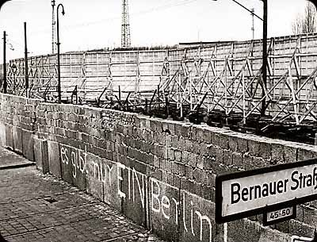

# 教育是沒有牆的，教室才有

花了三個月左右的時間，沉思了臺灣的教育問題，先不論太多教育制度面向的問題，而是回歸到個人面，比起十二年國教，其實我們更擔心這個：身為學生的學習態度。

「教育是沒有牆的，教室才有。」

在討論十二年國教的時候，我們都「預設」了制度的改變，就可以改變「教室」內的現況，於是「教育」變跟著改變了。

在討論「數位教育」的時候，我們的觀點常執著於如何改善透過「科技」改善「教室」內的現況，而非改善「教育」的情況。

再接著，教育的改變，可以帶來國家的改變。

但是，如果個人學習的態度不改變，制度何以真正帶來改變？國家何以革新？

**教育跟教室有什麼不一樣？**

講到「教育」就想到教室，或許是「義務教育」出現以來，最成功的洗腦魔術之一，由「民族國家」強力推動的義務教育，成功的把我們從「一個完人」分解成了各式各樣細瑣的碎片，國文老師常常看不見文章背後的歷史、地理、科技、經濟、法律、倫理等等的意義，數學老師教你數學，但不太懂得跟你解釋學數學背後代表的是科學的基礎，學物理的會叫你算題目，卻常忘了跟你說物理在講解的是「世界」運轉的理論，學歷史的老師也不會跟你說歷史形塑的是世界觀，更是一個鑑往知來的鏡子，而在義務教育裡，歷史不談政治，卻淪為政治的囚徒。

我們一提到教育，你是否想到「一科又一科的科目，在不同的教室裡，寫著不同的考卷？」

那從不是教育，那是教室。

之前有提過，我們的偏見是如何形成的？一來是「訓練」帶來的制約，二來是「媒體」提供了我們腦袋絕大部份的背景知識，我們的思考嚴重受到「經驗」跟「媒體」的支配。

而在長大成人的「教育之路」上，我們在「教室裡接受教育」、「課本加老師，就是強大的媒體」，所以許多人跳不出課本跟老師的框架，而我們一想到教育就想到了教室。

透過這樣「片面」的「教育之路」，不只是我們身為一個完整的人該有的「系統化思考」被切割成片段，我們做學問、為人、謀生，都被牽引在「教室系統」這個巨大的引擎當中，這個引擎轉著轉著，我們踩在履帶上，進到「教室」，加工後就長出了某個固定的模型。

再多加一題「制約反應」的測試，多少大學生一畢業，是不是就在想「找什麼工作」？

很可惜的，「大學」設立的意義本不為「教室系統」服務，然而在政府的教育制度的強力推動下，好比臺灣，大學卻淪為了「高等加工區」。

透過以上的講解，我們恐怕都已經瞭解了「教室系統」這個大引擎，有著強大的影響力，讓我們來猜猜，為什麼會有「教室系統」（義務教育＋轉形成為義務教育的延伸機構）的存在呢？

為什麼大學這麼早出現，可是卻不及晚出現的「教室系統」，一出現，就有這麼巨大的影響力呢？

**啟蒙與服從**

或許我們可以從第一線的教育工作者身來借鏡。其實我們從之前在「好奇心」一文當中提到，許多老師在面對小孩們的時候，常常面臨一個兩難，如何讓小朋友明白，讀書的時間安靜是為了別人好，而不是為了聽話？一些教育工作者如果懶一點，他就不用擔心這個，他只要小朋友知道「聽話」的重要，而不是「同理心」的重要，但懷有熱忱的老師往往會陷入一個痛苦：我該如何繞過叫小朋友「服從」，讓小朋友自發的替別人著想？

為什麼會有這樣的矛盾？因為在教室裡，老師同時面對了雙重的推力卻無法察覺，一邊的推力來自民族國家推動的「教室系統」，另一個是身為老師所信仰的「教育的價值」。

這個「教育的價值」，我們可以從Oxford的字典來看，「Education」這個字有個特別的用法，就是「An education」（一個education），哇？什麼是「一個Education」？意思是 an enlightening experience，一個「啟蒙的經驗」。

不想孩子只懂得服從，而是懂得自發的為人好，老師想「啟蒙」孩子們，但他同時面對了教室四面八方傳來的壓力，他得「讓小孩服從」。

如Seth Godin在「教育」的影片裡所提到的，我們小學一年級，上課的第一天在幹麼？起立、立正、敬禮，老師好，儘管我們還不懂得尊敬的意義。

近代民族國家的形成，有賴於繳稅、守法、聽話，服從某個價值觀的順民，如果沒有「教室系統」，民族國家難以維持基本盤。

而民族國家很快就發現了「教室系統」的殺手應用。這也是導致了為什麼我們「一畢業」就想到「找工作」原因。

在Seth Godin談「教育」的影片裡，有稍微提到這個「殺手應用」，而我會開始去思考這一整個議題，其實也是先注意到這個「殺手應用」開始的。

約一年前，曾經給過一生要修行的四個R的導師，那時候要求我們每個禮拜都要交一篇類似blog的post給他，我也給了他字數差不多等同現在Wondero每篇文章字數的文章，當時想說寫也是白寫，便開始研究「工業革命」，誰知道在「工業革命」裡，見識了這個「教室系統的殺手應用」。

教室系統的好處在於，可以教出一堆訓練有素的專家，這些專家只要做好眼前的工作，填補產業的缺口，好支撐國家的產業。

之前常分享給大家的「如何衡量你的人生」的影片中，講者開頭提到的便是一個「巢狀系統」的理論，好來解釋他後面要講解的內容。你去觀察社會的運作，你可以假設社會是巢狀、有階層的，最上層、最大的是國家，國家裡有產業，產業裡有各式各樣的組織（公司、NGO、團體），組織，組織裡有團隊，團隊裡有個人，個人則有他的腦袋、思想與心智，層層相依，有如齒輪般的互相影響。

強盛的民族國家需要強盛的產業，強盛的產業需要充滿活力的組織，而在當時，就算必需要有足夠的「Employee」來補齊工業革命的大量的工人需求，民族國家腦筋一動，最好的方法是什麼？最好的方法就是透過「義務教育」，透過「免費」、「識字，吸引國家內的下一代，而且預測下個十年，我們的產業需要怎樣「不同」的工人，就教他們不一樣的東西，最好還有「科學家」可以在一旁研發最先進的技術，資本家到時再吸納先進的技術跟勞力（甚至是人才），跟其他國家的資本家捉對廝殺，並且創造國內的就業機會，人人都有薪水領的時候，自然就有稅金，有稅金？那就可以繼續補貼教育、補貼先進的技術、維持軍隊的武力、給資本家租稅（近代還多了匯率跟央行）的優惠。

中間還有很多的細節，隨著年代不同的，但大致的迴路就是這樣。

以下會拉比較遠，但最後會拉回「教室」與「教育」，請耐心觀看一下

**民族國家的競爭公式**

這是民族國家的競爭公式，要維持強悍，起點便是「義務教育」，以及不幸也被抓進來的「高等教育」，加起來便成了「教室系統」，於是樹起一個又一個牆壁，把學生放進了教室裡，希望他們在成熟之後可以成為良好的戰力，好比臺灣，九年義務教育政策是跟後來的「經濟起飛」綁在一起的，而「普設大學」亦是跟後來現在檯面上的四大產業亦是習習相關的（你唸理工的，會不會有股莫名的聲音，叫你去大廠工作？唸商的，是不是要去當個大公司的管理階級？）

簡單來說，教育政策跟產業政策幾乎是不分離的。教育為產業培養了「一堆」專家，這些專家被特化成了只看得見自己領域的事情，被四散到了產業裡，這道理很簡單，量產的工廠裡，一個工人專心顧A螺絲，另一個工人專心顧B螺絲，我們只是被特化成了不同領域，但情況是類似的，因為這樣很有「效率」。

當這樣的「公式」有效的時候，不只就業率高、人民薪資飛升、國內有大量的就業機會，而政府補貼大公司的錢，雖然花的是老百姓的錢，還會降低老百姓的Welfare，但大公司強悍的時候，這些都會被因為大公司會把賺來的錢，回饋給社會（不只繳給政府錢，像福特在當年主動加薪，且當年西方的公共財，像是圖書館、燈塔、疫苗、公園、港口，政府力有未逮，都是資本家出錢、想辦法）

這一套的公式可以很有效率的讓國家飛起來。

但很慘的，以臺灣來說，光是我們隨便能舉的，就有四個大問題。首先，政府要如何預測未來？在西方花了數百年以來綁在一起的「全球化」的今天，未來哪是幾個官員跟專家說了算？再來，商人無國界，他可以透過享受了一切，但不一定要回饋給母國的社會（聯福的工人、你們凍漲的薪水，何嘗不是如此？）再來，補貼學術界，不代表就可以在技術上領先，其中有很多「細節」的問題，像彭老師的部落格講了很多，就不多說了。

第四個問題，回到「教室」與「教育」。

當民族國家這套「勝利公式」不works，那我們該怎麼辦？

**舒適圈與勇氣區**

教室系統帶給我們的學習，養成了各式各樣的專家，但這樣的專家是在教室裡養成的、被動訓練的、在舒適圈裡學習的，常常難以適應變動的世界。

以為「教室」等於教育的人，缺少了那麼點彈性，但不只看到教室，看看到教育的人，卻能隨時從世界的運行、變化，習得經驗，而能夠常保彈性，這些人，可能會在自己的公司裡帶起一分新氣象（前提是公司還沒那麼腐朽）、成為社會的力量，去革新社會裡政府與商業看不到、甚至害到的角落，可能會成為創業者，創造新的產業，成為新的政治領袖，透過民主的程序，由人民選擇他，領導大家做出「正確而非妥協的決策」。

但這趟過程說來輕鬆，但得歷經很常一段時間的革命，因為大多數的人都活在教室裡，在學習的舒適圈裡，慢慢的通過民族國家預設好的路，一關接一關，成為了只看得到眼前的「專家」，而且還有供過於求的情況，同樣的專家排隊、擠在一起，等著某個工廠般的存在來把他放到他唯一識得的位子上，讓他專心在螺絲A身上。之後我們都估且稱這種活在舒適圈、以教室為尊長大的專家叫螺絲A好了。

先不管螺絲A，回到我們身上。

在勝利公式裡，我們先是活在教室裡的牆之中接受「教育」，再進到公司的牆裡工作，下班了，回到家的牆壁底下，到哪，都在牆的陰影下，我們依賴著牆壁，定義出一個舒適的範圍，在那個範圍裡，試著爭第一，卻不曾想過走離那個範圍。

於是，我們在教育我們的下一代，要一生活在牆的保護之下。從義務教育開始，上學的第一天會覺得不自由、會怕、會哭，但久久就慣了，有牆真好。

但問題在於，世界變化的太快，這個「牆」太容易倒了。

在牆倒下的年代，這時候需要很多的人一同走到黑暗的路上，協力一同築出新的未來，然而，我們從「上學的第一天開始」，就習慣了「牆」的存在，現在牆倒了，卻沒有人敢踏出當初圍下的界限，守著窠舊，守著安全感，寧願淋著雨吹著風，也不願意跟其他人進到勇氣區裡，一起蓋起新的屋頂。

人類的歷史上，每個文明三不五時就會走到這個節骨眼，這時候需要勇於挑戰的精神、社會的互信、人心的坦誠、遠見的領導者帶著大家一起離開舒適圈、懂得回饋的態度、同理心，才能一同攜手走過，而不是依賴著空頭的制度、補助經費、研究。無論是制度、金錢、先進的技術，都是「人」在用的，缺少了身為社會的本質，人都不和，這些玩意根本運作不了。

身為一個學生呢？能不能跳出舒適圈？「教室」就是你最大的舒適圈，要重拾教育，而不只是專心在教室。分數是個簡單的衡量機制，是「教室系統」在訓練專家的時候很有用的衡量方法，但想想上一個專門做螺絲A的專家，在螺絲A被淘汰掉之後，該怎麼辦？

萬一做螺絲A的專家，在當初的時候，可以知道螺絲A背後藏有更多的知識、經驗、應用，他思考一下、學習一下，是不是能夠Pivot，做出螺絲X、螺絲Y？甚至他根本不做螺絲界的專家了，而是應用背後的經驗去做別的？就像賈伯斯後來把「字體學」應用在麥金塔上面？

如果可以超脫舒適圈的牆壁，專家不會再被稱作螺絲A，他會有了自己的名字，而不再自稱、被世人只記得叫專家。

認識的人以學生較多，所以用認識的學生們來總結一下這一整篇文章。

**不一樣的學習態度，不一樣的方向**

想要適應這個快速變動的世界，從歷史的軌跡來看，活在舒適圈裡不是個好選擇，捲起袖子走到勇氣區裡才是，然而從「學習」的時候，卻已經分成兩種人，而學習決定了成長，學習決定了一個人的行為，學習決定了一個極限，舒適圈的學習帶來舒適圈該有的極限，勇氣區的學習帶來了不止息的改變。

之前曾經在Wondero上發過一個狀態，那時候寫著「我發現身邊的學生，有的已經畢業了，卻不知道自己要幹麼，但有的還在唸書，卻已經試著透過解決社會的問題，創造價值，從中養活自己，也就是說，他們已經在創造自己的工作了。」

這兩種的學生，是接受同樣的一套「教室系統」，還可能唸一樣的科系，卻朝著完全不一樣的方向。Why？

我們來以這段觀察收尾。

我發現前者活在教室裡，後者活在教育裡。

前者負責把分數跟升學搞好，順著水道流到了阻塞的產業渠道，後者的分數跟升學不一定比前者差，卻花了更多的時間在教育自己。

前者遇到了沒被教過的事情會不知所措，後者遇到了沒被教過的事情，會試著找出辦法。

前者活在群眾裡，後者擅於獨立思考。

前者唸著該唸的課本，後者則用好奇心看著世界這一本大書。

前者關心牆裡的世界，後者關心世界。

前者喜歡依賴牆壁的保護，後者喜歡為他人蓋起遮雨的屋頂。

前者以為教室就是教育，後者知道教育是沒有牆的。

** **   Edit by Paul 

採編：Vanessa 責編：余澤霖

