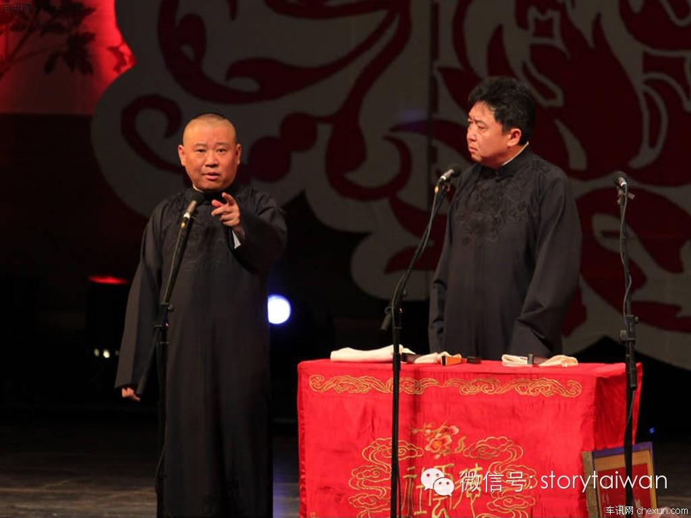

# 文艺与政治：从春晚相声说开去

**【来源：马军的公共账号“今马讲”。】**

80 年代来临前的几年,中国做好了正式起跑的最后准备。安徽凤阳小岗村的十八个手印,后来改写了中国整个的农村政策,当年十一届三中全会的召开,为这个迷茫的国度指引出了一条道路。当然,艺术界也在改,艺术家赵丹临终前和党中央书记处书记胡乔木的遗言“管得太具体,文艺没希望”,被人民日报发表。人民日报历来是最高指示的源头,此文一出,文艺界便开始摩拳擦掌,跃跃欲试。虽然社会上“左”的思潮依旧强大,但是向来冲在社会改革头一线的文艺界,却想第一个跳进河里,看看传说中能保着人们过河的石头,到底好不好摸。

而相声,则更是文艺界的先锋。

这么说其实并不为过,49 年建国以后,文艺界要进行改造,上讽刺官员显贵下讽刺农民小市民的相声几乎断绝。除了极少数能够与时俱进的将曲艺改造成政治宣传工具之外,几乎所有的曲艺演员和曲种都遭受到了不亚于灭顶的灾难。北京的单口大王刘宝瑞的《君臣斗》的全本录音至今也未凑齐,也许注定无法凑齐,刘先生本人的死因和遗体,至今也无从知晓。天津的大师马三立被发配到农村改造,一度曾认为自己一生无法回到舞台。传统段子《八大改行》的场景再次回到现实。

然而首当其冲的,往往是最早复苏的, 文革结束在文艺圈的最早迹象,也发生在相声中。收音机里传出的王佩元的《挖宝》、姜昆的《如此照相》、以及常贵田的《帽子工厂》让人久违了那种直逼最高层的政治批判型的相声。虽然是批判政治,但是谁也无法否认这三个段子并不纯粹,充其量只是对政治失 事一方的安全的落井下石。但是对于当时的社会,只要是批判的, 就已经够了,人们压抑的久了,突然有了相声这么个管道,于是相声就被捧得很高很高。相声在八十年代,迎来了自己的黄金十年。

于是 198年有了春晚开始,相声的比重远远超过其他艺术类型。正式节目之前,晚会还安排了相声大师侯宝林单独的讲话环节。主持人马季和姜昆还代表相声界像全国观众问了好,要知道,当时有这殊荣的,只有王景愚和刘晓庆。

相声在当年的重要性还能在节目的数量上体现出来,那一年,马季和姜昆各自说了三个段子,侯宝林侯耀文父子两个也各说了一个。说当年相声是春晚的半壁江山,应该没有人会有任何的意见。只是当年的段子还都比较保守,马季和姜昆还没能从当年的歌颂型相声走出。然而我们也不能太过苛责,毕竟是春晚的第一次(不算 1960 年那次),政治上保守一些,还是情有可原的。然而即便如此, 那一年李谷一《乡恋》中的气声唱法,还是被批成了靡靡之音。

然而相声在民间显然受到了鼓舞,一时之间,无数的前无古人 可能也后无来者的段子被创作出来。在 1984 年,《并非讽刺裁判》和《糖醋活鱼》的出现,给爱相声的人们着实打了一针兴奋剂。少马爷也一度以《纠纷》和《五味俱全》杀进了人们的视野,牛群冯巩更是犀利,《我错了》《小偷公司》也成为了难得的作品,春晚上牛群的那句“领导,冒号!”也成了当年的流行语。九十年代《曲苑杂坛》曾经拍了一系列的相声 TV,其中大部份的段子,都来自于八十年代的那段黄金岁月中。

春晚的相声进步的速度虽不及民间,但是稍逊的进步速度乘上 春晚极大的传播力,给人的影响却能大过民间的声音。1984 年马季用唐山口音说了一段单口的《宇宙牌香烟》,夸大宣传和虚假广告成了被讨伐的对象,人们也笑的前仰后合。87 年的《五官争功》则更是经典。姜昆似乎也受到了师父的启迪,从80 年代的前期不疼不痒的《看电视》《夸家乡》《照相》之后,一下子贡献出了《虎口遐想》《电梯奇遇》《捕风捉影》等佳作。然而最终还是出了事儿, 89年的相声《特大新闻》竟猜中了当年的大事,成为了中国历史上非常罕见的“禁段”,具体为何,请各位看官自行 Google,恕不详写了。

历史从1988年直接跳到1990年,那消失的一年,只存在于人们的心中,并不存在于历史当中。他们以为,人民总是健忘的,若在健忘之上加上恐惧和希望,那过去痛苦的日历,简直太容易就被一翻而过了。那一年,中国举办了亚洲运动会,北京的路修到了四环;浦东新区的开发,也从计划变成了实实在在的工程。然而这些并没有解除人们的忧虑,国际的封锁,外资的撤出,保守派的全力巩固,让刚见起色的中国经济,似乎到了最危险的时候。于是1990年的春晚,竟像极了近日之局面,相声小品虽多,却一个个战战兢兢,内容上除了学唱歌,便是学广告。唯一能勾起人们一些联想的,竟是小品里陈佩斯的那句:“队长,别开枪,是我”,以及午夜时分江总书记和李总理的到场讲话。

人们的担忧并非没有道理,当时北京的戒严还没有取消,东长安街上国贸中心大厦的玻璃墙上,还能看到当时的痕迹。虽然时隔半年,空气并没有因此而变好。让人们更加担心的,除了北京,还有远在万里之外的欧洲,从德国到苏联,从保加利亚到罗马尼亚,一夜之间,世界好像变了天,人们都在思量着接下来会不会轮到我们。然而中央还是HOLD 住了局面,亚运的成功转移了人们的注意力,一首《亚洲雄风》点燃了人们的爱国情。民族主义从此被频繁的使用,不论是此后的南联盟轰炸还是南海撞机事件,小泉参访靖国神社还是汶川的地震,同样的场面,我们见过太多太多了。

那几年有不少让人骄傲的事情,葛洲坝修好了,三峡也开始修了。秦山核电厂修好了,大亚湾也开始修了。欧洲的动荡和中国的发展让那句“只有社会主义才能救中国”的口号悄悄的变成了“只有中国才能救社会主义”。随着市场经济的进一步深化,人们对物价的上涨也不再像当年那样的冲动。前几年人们经常讨论的官倒变少了,但这并不意味着权钱勾结没有了,只是一是因为官倒们更聪明了,二是因为双轨制的渐渐消失,让人们最常见的那部分官倒看不到了。上涨的物价被紧缩的经济政策限制了一些,政府的工作中, 也开始提到了“菜篮子”和“米袋子”这样的工程。以前人们对物价上涨的敏感,此时却成了相声中讽刺的对象,姜昆在1991年说的《着急》,成为了少见的佳作。

然而消失的那一年始终不曾散去,只是换了一种形式存在于人们的脑海中。写诗的年轻人不见了,人们对文字的热爱转移到了盛行的文化衫上。年轻人似乎个个都成了王朔前几年笔下的顽主,不得不让人感慨这个天才作家的敏感。而王朔本人在这几年则写了 《动物凶猛》,还没老,就开始怀念过去了。

这样的精神也传染到了相声当中,当年那深刻的犀利的幽默, 如今却变成了廉价的油嘴滑舌。当然这正符合人们的胃口,人们不再需要深刻和犀利,油嘴滑舌正是人们需要的,牛群冯巩的《办晚会》正是油嘴滑舌的代表之作。正是在这样的局面之下,春晚相声似乎又迎来了一个小得高潮,闫月明的《论捧》,李金斗的《跑题》 虽然还有八十年代的样子,却始终没达到《五官争功》一半的功力。

而《8 字谜》《点子公司》则宣布了金钱时代的到来。至于牛群冯巩的《拍卖》简直把那个时代刻画到了极点,只要有钱,赵本山的帽子巩俐的毛驴,甚至施大爷的白头发,都能卖。记得牛群还卖过冯 巩牌子的猪脑和口条。这话竟成了精彩的隐喻,那之后,猪脑编不出好的段子,能逗大家笑的,便只剩嘴里的那根口条了。

1994 年,中国足球职业化,甲A联赛让范志毅郝海东们的身份,从体制内的体育工作者,变成了市场化的职业足球运动员。联赛初始球迷们爆满的人数和热情,几乎在向所有人宣誓,我们迈进了人性的正常状态。精神上的压抑,似乎开始慢慢远离了中国人。换句话说,中国人民彻底摆脱了意识形态的束缚,彻底统一了思想决定一心向前看,当然,你也可以悲观的说,彻底被统一了思想, 决定一心向钱看。

进入正常化的,除了中国足球和人民的精神状态,还有中国的国际形势。五六年过去了,当年的事情该忘记的都忘记了,没忘记的也不再提了,还再提的基本上也都被压住了,中国重新对外国展示笑容,外国还是忘不掉中国庞大的市场,决心和中国打交道。这几年,克林顿来了,留下了支持“一个中国”的立场,江泽民也去了美国,跟华莱士谈笑风生。当然,叶利钦也来了,留下了著名的熊抱照片,江泽民也去了俄罗斯,把东北的一片土地,彻底留给了北极熊。

中国终于走进了世界,世界又终于接受了中国。中国的老百姓们一部分赚到了钱,一部分看到别人赚到了钱。前几年还在用的粮票粮本,已经和邮票一样成为了收藏家们夹子里的古董。此时的百姓们的生活,真的像 95 年春晚上解晓东的歌词:团圆饭七碟八碗 围成一火锅,不知道吃啥喝啥大伤脑筋。

然而更伤脑筋的,应该是中国当时的相声演员们。那个时候, 正是小品火的时候,赵本山赵丽蓉两个大咖基本上每年都能贡献出精品,而正应了 94 年黄宏《打扑克》里的那句“相声明显干不过小品”,相声在这几年更像是担任了另一种意义上的主持人,97 年 便出现了《送春联》《送祝福》《送你一支歌》三“送”同年登春晚的相声。这一送再送的出现,像极了《黄鹤楼》里的一句台词:“山人送主公,再送主公,还送主公”“再送,再送就把我送台下去啦!”

其实在这几年,相声所经历的转折期当中,还是让人能多少看到相声有复苏的一丝丝可能。毕竟当时的舆论抑制,远不如近日之严重。不断成长出来的新生事物,也为相声的创作提供了更多的题材。虽然原有的批判型相声越来越少,但是还是有奇志大兵《白吃》 这样的佳作出现。只可惜这一对当时的闪亮新人,之后的好作品都留给了《综艺大观》,迅速成名之后又迅速裂穴分道扬镳了。当然, 我们不能强迫他们怎样,毕竟他们只是长沙人民的剁椒,不是全国百姓的鱼头。

春晚毕竟是春晚,政治上的限制,总还是有的,96年的军事演习,轰出了几颗飞弹,也彻底轰远了台湾人民的心。于是那两年的春晚先后出现了将全国各地收集来的土混到一起以及将长江黄河日月潭的水倒在一起的政治宣誓类节目来忽悠大陆,意淫台湾。

于是乎,春晚只能在形式上进行改革,1985 年春晚走出演播大厅失败之后,1996 年的春晚选择了在北京上海西安三地连线直播的形式,着实还是让人眼前亮了一下。当年的姜昆换掉唐杰忠,第一 次和戴志诚上台,便根据当时火爆的球市说了一段《其实你不懂我的心》。记得当时台下分别坐着国安队和申花队,范志毅耸着肩膀笑的差点儿抽过去,不料想第二年,就被国安九比一狂扫,彻底没了笑脸。

当时紧抓时事的好段子,还有侯耀文石富宽的《京九演义》, 虽是主旋律相声,但红的不让人感到恶心。这点功力后来的相声演 员们都做不到,反倒是多年之后北京电视台春晚郭德纲的那段《北京你好》,能让人听出当年侯三爷的神韵来。

最让人可惜的,其实是牛群和冯巩。其实这几年,能和赵本山赵丽蓉在春晚上抢笑声的,相声圈也就冯巩和牛群了。但是由于牛群去了蒙城做了牛官,冯巩也变换了搭档,00、01连续两年推出佳作之后,02年起便开始走了下坡。牛群回来之后,上了几次春晚跑龙套,表现的也都差强人意。毕竟做过官的人,再重新回到台上扮演小丑,架子一端上,便卸不下来了。
应该是从02、03年起,中国人开始在春晚上找不到乐子了。

00年以后,冯巩的相声和小品没了区别,春晚也再没了像当年“忽悠”“拐了”等在社会上流传一整年的经典语录。除了“我想死你们了”这种自以为是的陈词滥调,便是开始捡网络上过气的词汇来凸显自己的“与时俱进”。前一年的春晚之前曾经不少网友押宝预 测哪一个傻逼第一个说出“给力”一词,结果不出所料,一向被调侃的朱主持人军光荣中枪,这似乎是那一年的春晚,最好玩的笑话。

于是从那以后,春晚的相声便进行了形式上的创新,除了台上一个捧哏一个逗哏之外,台下还多了一个捧好的观众。不知道是央视有意为之,还是现场遴选,每次大声喊好的,总是一个坐在前排肥头大耳的胖子。我对胖子并无成见,面对如此乏味的相声,也理解春晚导演安排卧底鼓噪喊好的良苦用心,然而让我厌烦的是这个胖子每次的好都喊到逗哏的人的腮帮子上,让整个节目的节奏非常诡异,往往一个“好!”能让捧哏找不到搭茬的节骨眼儿活活憋死。 我曾经许愿希望让这个喊好的永远从电视上消失,结果不幸愿力发的太偏,没击中这个喊好的胖子,反倒打重了另一个胖子。没错, 就是你们知道的那个,穿背带裤的大胡子。

这也并不难理解,2001年的中国人似乎把最近五年的高兴事儿 全都HIGH完了,申奥成功入世成功足球冲出亚洲成功,再加上拉登成功的撞了美国的俩大楼,中国人一瞬间感觉中国成了世界强国。在中国,放纵的机会很少,安全且政治正确的放纵机会更是少得可怜,于是那一年中国人彻底的HIGH了,713和107,两个夏天的日子,人们放了比冬天还多的炮竹。那年的春晚,郭冬临用天 津话大声的唱着:“甭管是巴西土耳其,哥斯达黎加,场场踢他们三比零,大家说好吗?”“好!”“那就这么定啦!”结果第二年的夏天,中国队未赢一场未得一分未进一球,三场比赛被灌了九个球, 灰头土脸的回了国。平均下来,真是场场三比零,只是语态,变成了被动式。之后的中国足球掉进了泥潭,春晚的相声,比中国足球, 掉得更深。

足球的失利给社会带来的沮丧,远不如非典时期的团结,给人们带来的希望。02、03年起,人们对国家的期待越来越高,新的领导人新的姿态,中国好像要打着“新政”的旗号准备大干一番。房价从那时候开始涨起,当然,强拆的新闻,也开始多了起来。然而,与前几年还算让人满意的状态相比,从那之后的春晚的相声跌进了一个马屁成风蹑手蹑脚的怪圈,这几年,侯耀文三次上春晚,说的相声几乎没有一个让人记得内容。当年和黄宏《打扑克》的那个犀 利的侯耀文不见了,取而代之的则是《马年颂马》《十二生肖大拜年》《鸡年说鸡》三个无聊的段子。光从题目就能看得出来,这三个段子的变化,可能比从“我想死你们了”到“你们让我想死了”还要小,而且小得多。姜昆的相声,也没了九十年代的批判精神, 转而去掏网络上剩下的笑话,拼凑出一个勉强叫做段子的作品。这些北京的演员,还是放不下京派相声的架子,死要面子,活活挨骂。天津的冯巩则聪明的多,从那之后开始耍词汇上的流氓,顶着相声 的名义演小品,躲着小品那头的赵本山,回回拿的都是曲艺类的一等奖。只是质量和前几年的完全没得比,老百姓们这个时候才开始痛斥冯巩的滑头。由此也能看出,中国人的生活哲学:只要有乐, 叫相声叫小品无所谓;一旦内容不好玩了,就有人开始拿名头做文章。我想,这种心态也大概能够解释一种现象吧:只要经济还在涨, 至于别的,也就可以先放一放了。当然,这也可以从另一方面去解读:一旦经济停了,拍桌子骂娘的,就该层出不穷了。

05年,中国第十三亿个公民诞生。十三亿,不知道这是不是点燃地火的最后一个火苗,民间的力量在这一年也喷薄而出。中国一个草根火了,她叫李宇春。春哥是第几个登上时代杂志封面的中国人,这个我没做过统计,不好乱讲。然而除去政治人物,以纯粹民间人物的姿态登上时代的,即便再有先例,李宇春也应该是前几名。

那一年,火爆程度不次于李宇春的,在文艺圈,恐怕只有郭德纲了。放在一年以前,如果有人认为世界上还存在着会贩卖相声票的黄牛,那这个人的智商应该比牛还要低。然而郭德纲火了之后, 天桥德云社的剧场外的黄牛们,都恨不得自己真的是牛,可以吃一顿饱三天的天天守在德云社的门口,买一张郭德纲的票。

于是乎,中国的民间开始呼唤着能在春晚上看到郭德纲。

从那时候起,民众的呼唤还是变得有效而激烈,而且是越有效越激烈。除了年纪大到民国时期就成年的老人们,大部份中国人一辈子都没见过选票长什么样子,连居委会主任是谁,都无法决定。但是随着草根力量的崛起和网络通讯手段的普及,中国人可以决定电视台上的漂亮姑娘帅小伙子们谁是冠军谁被淘汰了。于是中国人的选举热情在这一点上爆发,据说有人花 50 万买手机卡,就是为了给李宇春增加几千张票数。那一年的长沙,经常有粉丝团上街为自己的偶像拉票,听说不同的粉丝团见面时还爆发了冲突动了粗。由此也能得出一个结论:别总笑话台湾的立法院,等咱也有了能吵架的议会,打架的事情,不会比台湾少。

面对着民众的呼声,郭德纲显然比周立波更沉稳,也更聪明。 郭德纲从未说过自己只是“京津人民的小菜”,不当“全国人民的水饺”。而是用了更草根的方式从根儿上断了自己上春晚的可能, 那就是一个《我要上春晚》的段子。

于是我们便知道了,郭德纲是不会上春晚的了,但是不知道是有意安排,还是无巧不成书。那一年的春晚央视从台湾找来了一个叫做朱德刚的演员,像模像样的穿着大褂说了出《绕口令》,如果没记错,上一次春晚还有人穿着大褂说相声,应该要追溯到1999年的超级新人奇志和大兵。不知道这里头是不是包含着一种隐喻:我们丢掉的自我,只能去台湾,才能寻得到。

这几年的中国大师陨落,中国相声最大的两个团——中广和铁道的顶梁柱马季和侯耀文时隔半年先后去世。象征着主流相声圈子最高水平的旗子倒下之后,相声在民众的心中,彻底的和郭德纲画上了等号。那时候的郭爷穷人乍富,十几年的存货一夜之间倒给了中国的观众,彻底给 01 年过去,08 年未到这样一种精神上青黄不 接的时代集体补了HIGH。而下一次中国人在文化上集体狂HIGH, 应该都要排到《让子弹飞》了。

中国的未来在民间,中国的未来在草根。草根不及想让谁火谁 就火的体制,草根想出头,靠的必须是自身的真本事。草根郭德纲的兴起,除了时代之外,更多的原因,还是自身的能耐足够HOLD住观众。可惜有的人就是认不清楚这一点,刚半火不火,就想扬名立万。郭德纲的大徒弟何云伟和郭的师弟李菁单飞之后上春晚说的段子,除了段子不好笑之外,一切都充满了讽刺的幽默感。春晚想借捧红两个“叛将”来跟郭德纲叫板,结果更加巩固了郭爷的地位。他们不知道,郭德纲早把观众们的口味养刁了,相声圈子再也不那么好混,没点真绝活,真的没办法上台混了。不知道何云伟李菁二人现在是不是懂了这个道理,不过不懂也没关系,因为还有人儿比他俩更不懂,比如李伟健和武斌,比如贾玲和白凯南,还有一个我看到就会转台的小白脸,周炜。

人民的口味越来越刁,春晚也越来越难做。难做的原因不只是人们早已厌烦春晚将近三十年基本没变过的形式,更是因为众所周知的原因,能说的东西越来越少,不能说的东西越来越多了。92年 维族演员克里木还在春晚上说过相声夸过党中央的民族政策。现在来看,即便是一个亚克西,都显的无比讽刺。相声脱离了讽刺,也便没了生命力,这不仅是相声的悲哀,也是整个时代的悲哀。当年马季的《五官争功》多么的犀利,而转而回想下马东的《新五官争功》,最能让人记住的,似乎还是董卿把马东说成马季的那个口误吧。

现在的中国,一大群波兹曼和赫胥黎的背后,站着九个奥威尔,我们多希望董卿的那一句不是口误,多希望马季能够回来,更希望马季的那个年代,也能回来。
（编辑：刘瑞祺；责编：杨修）

**【马军，北斗知名撰稿人、专栏作者，现《凤凰周刊》记者】**

**（原文链接：http://mp.weixin.qq.com/s?__biz=MjM5MjQ0NDM0NA==&mid=203167326&idx=1&sn=faed653124dc1551bc82f7b04121870b&scene=2&from=timeline&isappinstalled=0&key=d0d98cc194e6b96f15b45fc416087bbfc4ed575d94f7087df7e2e609b38e64c255e36ba21c2c2e7d4e90a9ec77a6b438&ascene=2&uin=MTU2OTA5NDc4MA%3D%3D&devicetype=android-19&version=25040032&pass_ticket=nOCYUHc6ujd7PrBFURXGCqPSZacSPigsjo0pxmYQLJYaJT2i73O%2BqhW1glKIyENU)**