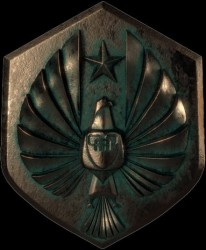
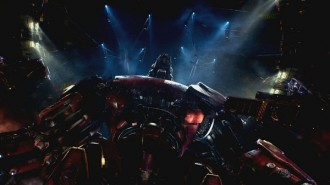
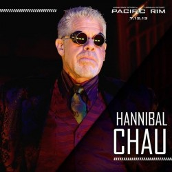
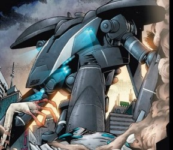
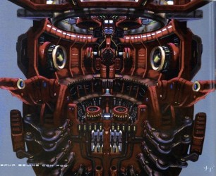

# 新泛太平洋国防文件解密：《环太平洋》世界观与科技纵览

《环太平洋》讲述的是2012年一种类似与哥斯拉的巨型怪兽（kaiju，民间译名“开菊兽”*）由太平洋海底的一个洞穴中出现，攻击了人类城市。此后数十年间，不断有怪兽从海底的未知世界冒出，攻击洛杉矶等太平洋沿岸城市。怪兽的数量和种类越来越多，攻击次数也越来越频繁，破坏程度越来越严重，人类世界始终笼罩在死亡与恐惧的阴影下。

kaiju来自一个遥远的星系中一个叫做“Anteverse”星球，那里乌云密布、大地贫瘠、没有河流只有岩层。大气为黄色。岩层中生活着一种外星人“先驱”。这是一种殖民生物，通过不断侵占其他星球来繁衍生息。先驱掌握着极高的制毒化学和超空间技术，可以通过建立“虫洞”的方式将其他星球与本地进行桥接，从敌人内部渗透攻击。它们制造了一种体型庞大、浑身剧毒的生物兵器，作为入侵其他星球的部队，即“开菊兽”。

电影中，为了抵御海洋怪兽们越来越频繁、破坏性越来越大的攻击，人类启动了一项名为“贼鸥”（Jaeger）*的军事计划，建了一支配备有最顶尖科技装备的军队对来犯的怪兽进行有效还击。组成“贼鸥”军队的个体是武装到牙齿的巨型“机甲战士”。

《环太平洋》这部电影很特殊，特殊之处在于原创了一个宏大的世界观，从各类事件、生物类型、组织机构、科学技术、人物相关等等都有一套完整的体系。类似的电影很多，比如《第九区》、《异形》、《铁血战士》等等，说穿了，电影展示的只是世界观中的一小部分，也就是说，这部电影的“剩余价值”非常大，自由空间很高，况且该片在海外票房也非常显眼，假如要拍续集的话很容易，拍前传甚至连剧本都不用写。除去世界观，周边产物又是个来钱的噱头。像是很多有着类似世界观的作品，《星球大战》、《异形》这些，模型手办一直买到了现在，更不要说《复联》《指环王》这些了，sideshow、hottoy购版权后每年卖到一定数量还得给授权方钱，这都是白拿钱的买卖。《环太平洋》一部电影就有机甲五个，怪兽7、8只，假如拍续集的话多加几个怪兽和机甲又可以翻新，可以想象下里面的利润。这部1.9亿制作的大片，想亏本，没那么容易。

在电影的最初世界观设定中，人类先后生产出五代共31台Jaeger（猎人）机甲，分别来自不同国家，电影主要出现了五款型号（其他26款机甲都是漫画或在电影中打酱油）。中、美、日、俄、澳的机甲战士，有设计蓝图，有性能数据，有点病毒营销的意思。

对于如今的科幻电影，世界观的设定已是不可分割的前提和鉴赏乐趣的重点。本文主要研究的即为《环太平洋》的整个世界观，相关资料来源于官方设定、前传漫画等处。

**第一部分 环太平洋联合军防部队（Pan Pacific Defense Corps）**

成立时间：2014年

总部：香港

环太平洋联合军防部队，简称PPDC，这是一个泛太平洋国际性的军事组织，性质类似于“北大西洋公约组织”，是美国、中国、日本、南美、澳洲等泛太平洋国家和地区为实现有针对性的防卫协作而建立的一个国际军事集团组织，以整个环太平洋地区的为防御体系，以遏制、打击、消除开菊兽的威胁，确保全人类免受灭绝为共同目标。PPDC成立以来，已吸纳了21个成员国。

**一、怪兽战争**

什么是怪兽战争，自从开菊兽首次入侵地球开始，怪兽战争就开始了，就像《真人快打》的开场白“Mortal Combat Begin！”这个很骚的名字不知道谁起的，很早就有。娜奥米·索科洛夫▼也是用其作为自己采访稿回忆录的书名。

这里要提出一点，自从人类与开菊兽对P以来，大部分人对怪兽战争持有肯定态度，直到后期机甲节节败退，人类当中分为了支持战争与反对战争的两派，后者主张建立“反怪兽墙”▲。就像三国中曹操要灭东吴，以张昭为首的投降派和以诸葛亮、周瑜为首的主战派之间的区别。

PPDC成立于“旧金山事件”之后，并在香港建立了人类的第一个PPDC基地——Shatterdome。后来科学家加斯帕·谢菲尔德打算要研制对抗开菊兽的巨型机甲，当时的小负责人斯泰克·彭蒂科斯打算资助这个项目，并命名为“猎人计划”。

PPDC的资金来源于成员国财政，项目之初一波三折，险些就因预算问题嗝屁。多亏在2015年，人类历史上第一款机甲“吵小子育空”在加拿大成功击退了一只开菊兽，该计划也得到了各国政府的认可。PPDC先后在世界各地建立了八个Shatterdome基地，大量机甲被研制出来，驾驶机甲的人员被称为“游侠”，他们驾驶着机甲与开菊兽展开正面冲突，怪兽战争时期到来。

随着开菊兽越来越多，体型和攻击力越来越大，危险等级越来越高，机甲难以与之为敌，纷纷败阵。同时每年支持猎人所耗费的人力、财力、物力也是个天文数字，导致该项目入不敷出，就像一个资金的无底洞。最终PPDC将猎人计划搁置，Shatterdome基地相继被关闭，战略方针发生了改变。

新的战略方针是在各个太平洋沿线国家建立厚重、结实无比的“反怪兽兽墙”，建造人员声称，该城墙能够抵挡迄今为止出现的最强大开菊兽——四级开菊兽的袭击。此方案得到了相关政府的拥护。

在一篇采访中，PPDC将军斯泰克·彭蒂科斯声称，由于各国领导人切断了猎人的资金来源，猎人计划将不屌他们，自己申请了八个月的资金维持PPDC总部最后一个基地——香港Shatterdome基地的运作。并且他号召所有不愿意龟缩在高墙内、希望与开菊兽对打的人们，团结起来，给予猎人计划最后的支持，在八月内一举歼灭开菊兽。

斯泰克的话虽然听上去有点冠冕堂皇，但让人泄气的还在后面。在澳大利亚悉尼，那面号称能抵挡四级兽袭击的“反怪兽墙”，不久之后便被一只叫做“病毒”的开菊兽轻松击垮。

随后的故事就是——《环太平洋》。

**二、PPDC主要成员（电影中的时间）**

**1、官员**：

达斯汀·克里奇——秘书长（小说）

斯泰克·彭蒂科斯——将军

凯利·汉森——接替斯泰克成为将军

**2、怪兽科学部**

牛顿·葛泽尔（Newton Geiszler）——科学家

赫尔曼·戈特利布（Hermann Gottlieb）——科学家

**3、机甲技术部**

蔡天童（Tendo Choi）——首席技术顾问

**4、游侠**

危险流浪者：

杨希·贝克特

罗利·贝克特

森真子尤里卡

突袭者：

凯利·汉森（原）

查克·汉森

暴风赤红：

魏氏三兄弟（不知道贾女士翻译成“唐氏兄弟”是何居心，英文能翻译错，中音译也不会了？）

切尔诺阿尔法：

阿莱克斯·卡德诺夫斯基

萨沙·卡德诺夫斯基

**三、Shatterdome基地详解**

Shatterdome是建造、维修和保养猎人机甲的工厂，最早的基地从2013年开始建造，全球共八处Shatterdome，都建立在开菊兽肆虐严重的地区。2024年，人类遭到开菊兽的猛烈攻击，战略计划的调整，资金走向发生变化，泛太平洋联军转而建立厚重无比的“反怪兽城墙”来防御开菊兽，七个Shatterdome基地被关闭，守护在其他基地的其余机甲也退役并被销毁。

**1、香港**

建成时间：2015年11月25日

机甲配置：

“地平线勇士”（阿拉斯加造）

“少林游侠”

“暴风赤红”

有史以来建设最早，也是规模最宏大的Shatterdome基地，共可容纳六个机甲。基地位于青衣岛的南端，俯瞰维港，基地设施豪华。香港是2024年全球唯一没有被关闭的Shatterdome基地，泛太平洋联军的总部额外的拨出了八个月的资金用于维持香港基地的运作。2025年中旬，也就是电影中的时间，开菊兽进攻香港，仅存的猎人机甲集结此地，在“怪兽城墙”建成完毕之前，展开最后一次对开菊兽的猛烈攻击。

电影里这里翻译有误，香港基地只能存放6台机甲，下图里清楚的看到有6个机库，电影中所说“这里曾经存放30台机甲”完全错误，而是所有八个Shatterdome基地一共有30台机甲。

**2、利马**

建成时间：2016年08月09日 关闭时间：2024年10月18日

机甲配置：“暗黑拦截者”

“美洲狮”

“斗牛士之怒”

（日本第一款机甲“隐形浪人”也在这里建造完成，后被部署东京）

西方国家、南半球的第一个Shatterdome基地。

**3、安克雷奇**

建成时间：2016年11月23日

关闭时间： 2024年10月12日

机甲配置：“吵小子育空”(PPDC试验场建造)

“铬金将军”

“危险流浪者”

阿拉斯加海湾基地，由于地处北极圈边缘，被工人戏称为“冰箱”。

**4、海参崴**

建成时间：2016年12月4日

关闭时间： 2024年12月11日

机甲配置：

“切尔诺阿尔法”

“伊甸园刺客”

“新星土卫七”

俄罗斯基地位于金角湾港口，周围由俄罗斯太平洋舰队守护，其任务是与日本基地战斗群联合，防御、保护远东战区。被关闭。

**5、东京**

建成时间：2016年12月15日

关闭时间：2024年10月19日

机甲配置：

“隐形浪人”（利马建造）

“探戈狼”“回声军刀”

日本基地，是遏制开菊兽在太平洋东西纵横的第一道防线。

**6、悉尼**

建成时间：2017年5月25日

关闭时间：2024年12月29日

机甲配置：“火神幽灵”“尤里卡突袭者”

悉尼基地，位置相对孤立，作战半径最为广泛，任务艰巨。

**7、洛杉矶**

建成时间：2017年7月11日

关闭时间：2024年12月20日

机甲配置：“忧蓝罗密欧”

“猛犸使徒”

该基地作战半径广泛的覆盖了美加地区和中美洲区域。

**8、巴拿马**

城建成时间：2017年11月29日

关闭时间：2024年11月9日

机甲配置：“科林斯巨蛇”

“美洲狮”

尽管规模不大，但战略意义颇重，该基地在保护全球航运枢纽的巴拿马运河及周边起到了至关重要的作用。

**四、机甲战术**

1、死亡冲刺

这是开菊兽从海中出现后，登陆沿海城市的最后一段距离。具体是指距离海岸线十英里的距离。机甲与开菊兽战斗，要提前出动，必须阻止开菊兽进入“死亡冲刺”范围之内，否则无论哪一方，都会影响到沿海城市。

2、打击群

每个基地都配备了几个机甲，他们并不是单独作战，战术区域可以覆盖整个太平洋。比如南美利马基地和巴拿马城基地覆盖了整个南美地区，海参崴基地和东京基地负责远东战区，东京基地同时要兼顾着悉尼基地，因为后者老哥一个孤零零的在南太平洋。洛杉矶和安克雷奇基地可以覆盖整个中北美地区，这些基地统一听候香港总部的调遣，因此很多时候，都是两台甚至更多的并肩作战。

机甲的主要任务按照主次分为三个：

首要任务：

负责保卫基地所在的城市，之所以在这些地方修建基地，就是因为这里是怪兽肆虐严重、城市较为发达、人口密集的区域。机甲必须时刻保护城市不受开菊兽的侵犯，比如“暴风赤红”，就是保卫香港

基地任务：

在不与第一个任务冲突的情况下（每个基地不止一台机甲配置，就连最小的巴拿马城也有美洲狮和柯林斯巨蛇两台）。在特殊时期（比如对开菊兽攻击时间的预测），机甲之间要负责基地所在海域沿线的防御工作，沿线海域范围比较广、覆盖面稍大一些，需要机甲离开近海深入远海区建立防线，通俗一点的说，就是值班，轮流换岗。

战区任务：

在不与前两个任务冲突的情况下，基地之间也互通有无，一个战区一般都是两个基地负责，战区内一旦出现开菊兽，可火速动员两个基地的机甲力量合兵一处，假如一个基地因前两任务脱不开身，另一基地的机甲可以提前出动，在远海区域拦截开菊兽，阻止怪兽威胁到近海安全。

战区协作：

东亚、东南亚太平洋区：香港基地负责，悉尼协助，作为总部，还负责协调所有战区的合作和临时调动

远东战区：海参崴基地负责、东京基地协助

东西向太平洋链岛：东京基地，洛杉矶基地负责

南太平洋战区：悉尼基地负责、东京基地协作西太平洋太平洋区：洛杉矶基地负责、安克雷奇基地协助

中北美太平洋战区：安克雷奇基地负责、巴拿马城协助

南美太平洋战区：利马、巴拿马城基地

非洲太平洋战区：悉尼基地、香港基地负责

4、历史上的合作（只是有记载的合作，很多没有记载）

2017年10月17日，洛杉矶：美国“流浪者”、“猛犸使徒”合作击败山岚

2019年12月19日，马尼拉：四级兽首次露面，美国“流浪者”、中国“地平线勇士”、澳大利亚“尤里卡突袭者”合作将其击败。（男主角罗利与澳洲老爹凯利首次合作）

2021年10月9日，夏威夷：澳洲“尤里卡突袭者”、机甲“探戈狼”合作击败破浪

2024年11月30日，渤海：澳甲“突袭者尤里卡”、中国“暴风赤红”合作击败鬼车

2025年1月2日，悉尼：澳甲“突袭者尤里卡”、“火神幽灵”、日本“回声军刀”合作，四级兽病毒灭掉”、“火神幽灵”“回声军刀”之后首次突破“反怪兽墙”，“突袭者尤里卡”灭之。

2025年1月8日，香港：电影时间，四级兽尾立鼠、棱背龟击毁“暴风赤红”，“切尔诺阿尔法”，美帝主角大发神威。

2025年1月12日，虫洞口，电影结尾

**五、基地下属机构**

1、驱动器装配室（Drive Suit Room）

驱动器装配室位于Shatterdome基地的最高点。这里是存放着各个机甲的驾驶和控制中心——操作舱（Conn-Pod），大多是机甲的头部，除俄罗斯机甲另类。这里配备高级技术人员，他们为驾驶员“游侠”完成出站前最后的装配，包括检验系统，测试“Drift系统”，帮助他们穿上操作服，这些工作必须在7分钟内完成。一旦检测无误，所有人员撤离装配室。操作舱下降与机甲结合，完成出站。

2、任务指挥室（LOCCENT Mission Control）

又称为命令中心，PPDC的高层人士在这里向机甲下达进攻/撤退指令和战略方针，同时这里也是命令终端系统所在地，技术人员在调试完毕后，最后激活“Drift系统”，链接游侠与机甲，同时监控机甲的行动和游侠的身体、精神状况。

3、K-科学实验室（K-Science Lab）

生化研究室，开菊兽被歼灭后，大卸八块的尸体经保护措施被运到这里解剖和研究。牛顿·葛泽尔和赫尔曼·戈特利布是这里的主管，根据开菊兽的毒性和放射性破译出它们生物信息。牛顿负责研究它们的行为和属性；赫尔曼则致力于开菊兽的习性和遗传信息。二位的工作的目的，一方面为了推测出开菊兽发动攻击的频率和地点，另一方面找到开菊兽的弱点提供给军事武器部。

K-科学实验室中配备了以下实验设备：

提取机——用来从开菊兽的腺体内提取有毒化学物质，以便更好的分析开菊兽，这个仪器是牛顿·葛泽尔引以为傲的发明。

保存皿——这是一个盛放氨基液体的玻璃器皿，用于保存从开菊兽身体切割的器官和组织，氨基液体与开菊兽的体液相近，可提供长期的化学保护。

扫描仪——使用核磁共振成像系统的扫描仪，扫描密度很大，可扫描开菊兽的器官、骨骼和软骨。

检验室——由于开菊兽具有毒性和放射性，检验室处在一个封闭的环境中，检验人员必须通过机器手臂才能检验开菊兽的毒性和生无异常。

4、格斗训练室（Kwoon Combat Room）

这里并不是培训学员的地方，而是强化“游侠”战斗能力的地方（猎人学院也有这种机构）。 由于驾驶机甲与开菊兽搏斗需要娴熟的格斗技巧和强大的精神抗压能力，“游侠”们在这里接受不同风格格斗术的训练，包括中国功夫、泰拳、MMA（综合格斗术）、摔跤、柔道、拳击等，也包括一些长/短距武器如剑术等的训练。这里汇集了世界顶尖的MMA教练、海军陆战队员和神经生理学家，为了提高“游侠”们每天必须花14个小时进行强化，提高自身的身体和心理的极限。格斗训练室的目的并不是培养一个优秀的驾驶员，而是为了在“游侠”之间建立良好的合作基础。

**六、PPDC官方组织**

1、猎人学院（Jaeger Academy）

地点:科迪亚克

岛成立时间：2015年7月24日

这才是训练学员的地方，由PPDC所建立并领导，位于阿拉斯加的科迪亚克岛。

历史：

自从人类第一款机甲“吵小子育空”在加拿大干掉一只开菊兽后，猎人计划被认为是消灭开菊兽的有效方式，第一代最后一台机甲“隐者浪人”建造完成后，开始招募学员，该学院也随即成立。斯泰克·彭蒂科斯从“游侠”退役之后，进入学院负责指导和训练学员。

猎人学院作为招募和培训“游侠”的基地，主要训练学员们的身体和心理素质，而且训练内容相当残酷严格，所有学员来自世界各地，男女比例为2.6:1，他们要经过紧张的层层筛选，才能进入下一阶段的训练，筛选一共分为三个阶段：

第一阶段：平均指数

身高：178cm

体重：78公斤

学历：高中

第二阶段：学习技能

驾驶机甲的相关知识

短期与长期记忆能力

身体和精神抗压能力

练习与自己的合作伙伴（有血缘或无血缘关系）的协调和同步性

一对一格斗技能战斗

模拟训练

第三阶段：上机测试

机甲作战的相关战术学和数据处理

抗压能力深化训练

“Drift系统”同步测试

一对一格斗技能地狱训练

战斗中的冷酷培训

只有通过了以上三个阶段的训练，超越了自己的极限，才能成为一个合格的“游侠”，通过率就不提了，几乎没有，所有学员能留到最后的只有零星几人，成为正式“游侠”。

2、PPDC试验场（PPDC Proving Ground）

地点：科迪亚克岛

猎人计划正式立项后，主导项目的科学家加斯帕·谢菲尔德和凯瑟琳·莱特卡普的所有的工作转移到了PPDC试验场。在这里，他们被给予了充分的设施和预算来建造机甲、完成机甲相关研究的测试。在这里共进行了三项测试。

测试一：“庞斯链接”（2014年12月）

结果：人机链接，斯泰克·彭蒂科斯亲自参与实验，只激活了机甲的一只手臂。成功了一半。

测试二：首个一代机甲原型机“吵小子育空”实验。（2015年1月30日）

结果：机甲暴走，驾驶员之一凯西·亚当死亡。失败。

测试三：“Drift”系统（2015年2月18日）

结果：成功链接两位驾驶员的脑神经，达到极高的同步率。成功。PPDC试验场的结果验证了猎人计划的可行性，也“吵小子”经过了实战的考验。计划从此开展，第二台机甲“地平线勇士”也在这里建造完成。

3、遗忘坟场（Oblivion Bay）

地点：加利福尼亚州奥克兰

这里是机甲的坟墓。2013年第一只开菊兽“入侵者”在这里被核弹击毙，毒素污染了整个大地，此后这里就成为了在战斗中严重受损或毁坏机甲的墓地。

遗忘坟场面积广阔，起初存放了除俄罗斯第一代机甲“切尔诺阿尔法”之外所有第一代和第二代被毁、退役的机甲残骸，后来第三代机甲也被仍在这里。

2020年“安克雷奇事件”中，罗利·贝克特因违反操作导致美国第三代机甲“危险流浪者”被三级兽“镰刀头”击毁，驾驶员杨希·贝克特死亡，罗利被PPDC开除。“流浪者”的残骸被扔到了遗忘坟场。后来在斯泰克·彭蒂科斯的干预下，“流浪者”又被挖了出来，修复后重新投入使用。

遗忘坟场墓碑记：

“入侵者”遗骨

吵小子育空

探戈狼

隐形浪人

暗黑拦截者

火神幽灵

回声军刀

危险流浪者（后被挖回）

**七、非官方组织**

1、猎飞党

并不是什么黑社会团伙，而是一帮迷恋机甲和“游侠”的脑残粉。他们大都是一些学生，女性为主，收集各种机甲的信息，并张贴“游侠”们的海报，这其中就包括贝克特兄弟共同喜欢的女孩——娜奥米·索科洛夫。

他们始终是猎人计划的拥护者，当该计划被终止之后，他们反对声也最高。

2、怪兽补完组（Kaiju Remedies）

地点：香港 一个非法的地下组织，总部位于香港的一家中餐馆。通过打捞开菊兽的器官和组织，在黑市上出售，牟取暴利。其首领是汉尼拔·周。

内脏：可以预防心脏病和中风，治疗失眠、中年谢顶、抑郁症和焦虑，甚至还有抗癌效果；

脊髓：能防治焦虑症、精神衰弱；

生殖器：可医治孕妇产后无奶、大小便失禁；

骨粉：壮阳；

粪便：富含大量氮磷钾，极好的农用肥。

怪兽补完组拥有很多先进设备，可以中和开菊兽的毒素和酸血，让工作人员轻易将器官摘除。但这个非法组织一直没有被取缔，因为他们得到了PPDC的斯泰克·彭迪克斯将军的暗中资助。

怪兽补完组拥有很多专业人士，他们对开菊兽的了解和解剖技术甚至要比军方还有高级，比如他们知道用氨水浸泡寄生虫能够让它们在脱离宿主之后还能存活，这一点没人知道。有时候PPDC会暗中与他们交易，获取一些器官进行科研和军事用途。

**八、反怪兽墙（Anti-Kaiju Wall）**

反怪兽墙的概念最早在2020年就提出了，在环太平洋沿线建立厚重的城墙防御开菊兽进入沿海城市。建立墙的拥护者主张防守，这与PPDC的猎人计划是完全对立，但由于只是假设，没有坚实可靠的验证，后来不了了之。

直到2024年猎人计划遭遇重创，“建墙派”死灰复燃，并且这种相对“节俭”的方式得到了各国政府的支持。随后人类不再利用机甲与开菊兽大战，而是以防御为主。

反怪兽墙需要的资金并不多，但工程量浩大，主要依靠人力物力完成。建筑工人们有着世界上最危险最严酷的工作环境，并且工资也不高。反怪兽墙给人类提供了一个“虚拟”的安全措施，为什么是“虚拟”，因为建造者声称，反怪兽墙能够抵挡四级怪兽的冲击，没想到2025年1月2日，在悉尼一只四级怪兽病毒只用了一个小时就突破了反怪兽墙，并且由此让人类对这项工程有效性产生质疑，在全球范围内引发游行和抗议。

**第二部分 机甲代系、系统详解**

**一、创造 **

机甲是由科学家加斯帕·谢菲尔德设计的，其创作思路起源于第四次开菊兽袭击——“悉尼事件”，他灵感乍现，找到了一种避免核武器攻击，有效的杀死开菊兽的方式。而机甲内部驾驶员与机甲链接，并且进行同步，则是由脑神经科学家，也是加斯帕的地下情人凯瑟琳·莱特卡普开发的，这二位的故事在《英雄记》里会详细叙述，比《暮光之城》还要刻骨铭心。

第一代机甲原型机“吵小子育空”战胜了开菊兽卡洛夫之后，PPDC立刻开始批量生产机甲，首批型号有五个，横跨太平洋部署。

**二、代系**

机甲的代系主要按照时间来划分，当然随时代系越高，机甲也越厉害。全部五代机甲从2015年开始建造，在2019年全部建造完成，先后一共33台。

第一代机甲由于研发时间紧迫，很多问题没有得到有效的解决，比如核动力机甲的辐射会给驾驶员带来极大的影响，斯泰克将军就是因此而患上癌症的。随后几代机甲这个问题也得到了解决，但使用核动力的机甲并不多，只有“探戈狼”、“地平线勇士”、“危险流浪者”等是已知的核动力机甲，其余诸如“暴风赤红”（柴电驱动）、“尤里卡突袭者”（涡轮驱动）都是常规动力机甲

2016年：第二代机甲，避免了核辐射的问题

2017年：第三代机甲，从此之后都采用数字化操作舱

2018年：第四代机甲（只有一台）

2019年：第五代机甲（只有一台）

除了中国的“地平线勇士”是批量型号之外，每个机甲只有一台。不同机甲没有标准的设计模板，因为开菊兽也没有固定的形态，也为了体现配备和战术的多样性。每台机甲的造价是个天文数字，比如澳洲的“突袭者”，不算游侠的培养，单是机甲建造就数百亿美元，其价格是核动力航母的十倍以上。

**三、垮台**

到2019年底，一共有30台机甲处于服役状态，自从2020年“安克雷奇事件”中，美国机甲“流浪者”被毁之后，机甲开始被第三、四代开菊兽完爆。在2024年，开菊兽袭击频率是历年的14倍，共有8个机甲被灭。于是PPDC终止了猎人计划，一些老式型号也随着Shatterdome基地的关闭而退役，仅有香港基地还存着现役的四台机甲，也就是电影的故事。

**四、五代已知机甲**

第一代机甲MARK-1

1、吵小子育空（Brawler Yukon）

生产国家：美国

出厂日期：2015年1月30日

参数：不详

状态：2015年4月23日退役

准称人员：2人

杀敌数：1只

出处：《环太平洋：从零开始》前传漫画

设定：

人类的第一款机甲，主要作为技术验证，演示和驾驶员思想桥接的测试，并在测试中付出了一名驾驶员牺牲的代价。Yukon是加拿大地名，该机甲在渥太华战场投入实战，成功击退了一只入侵的开菊兽，打响了反击怪兽的第一战。

2、地平线勇士（Horizon Brave）

生产国家：中国

出厂日期：2015年12月22日

身高：238英尺

重量：7890吨

操作系统：Linux模块化处理器

动力核心：CCLO神经元能量核心，核驱动

格斗风格：自由搏击

必杀武器：绝对零度冷冻炮

准称人员：2人

状态：被摧毁

杀敌数：2只

出处：《环太平洋：从零开始》前传漫画、《环太平洋》电影

设定：

中国第一款机甲，在香港青衣岛建造完成，后部署阿拉斯加科迪亚克岛南端。它是人类首批正式投入战役的机甲，根据漫画中的设定，“地平线勇士”很可能是量产型号，不止这一架，有自己的生产线，很符合“中国制造”的模式。

2019年，“地平线勇士”在马尼拉遭遇一只四级开菊兽，眼看体力不支，最后被“危险流浪者”所救，杀死了开菊兽。在香港，“地平线勇士”杀死两只开菊兽后被击毁。

3、切尔诺阿尔法

俄罗斯第一款机甲

4、探戈狼

第一款在日本本土研发而成的机甲，2022年11月6日，在圣劳伦斯岛被毁

5、忧郁罗密欧（Romeo Blue）

生产国家：美国

出厂日期：2015年12月15日

身高：225英尺

重量：7775吨

操作系统：“跨越轨道”处理器

动力核心：“火焰熔炉”核动力

格斗风格：反关节骨法

必杀武器：胸前远程加特林火炮

准称人员：2人

状态：被摧毁杀敌数：2只

出处：《环太平洋》电影

技术参数：速度：2力量：7护甲：6

第二代机甲MARK-2

1、暗黑拦截者（Diablo Intercept）

生产地区：南美

出厂日期：2016

出处：《新泛太平洋国防文件解密》

设定： 南美第一款机甲，无图，只在漫画中提到过，在“隐形浪人”被调往东京之后接替其工作，守卫南美利马基地，与其他一同守卫南美的机甲部队被称为“利马突击队”。

2、太阳先知（Solar Prophet）

生产地区：南美

出厂日期：2016

出处：《新泛太平洋国防文件解密》

设定： 取代“暗黑拦截者”的南美第二款机甲，任务同上。

3、美洲狮（Puma Real）

生产地区：巴拿马

出厂日期：不详

出处：《新泛太平洋国防文件解密》

设定： 巴拿马机甲，一直守护在巴拿马城Shatterdome基地，似乎并未投入战场，直到2024年退役。

4、伊甸园刺客（Eden Assassin）

生产国家：俄罗斯

出厂日期：不详

出处：《新泛太平洋国防文件解密》

设定： 俄罗斯第二代机甲。

第三代机甲MARK-3

1、“危险流浪者”

2、斗牛士之怒（Matador Fury）

生产国家：墨西哥

出厂日期：2017年9月14日

状态：不详

出处：吉尔默·德托罗的推特

设定：

导演吉尔默·德托罗来自墨西哥，墨西哥机甲当然会有，据称假如有《环太平洋2》的话一定会有墨西哥机甲。虽然该机甲没有任何数据和图片，但导演和编剧被粉丝问到为什么没有自己祖国的机甲，前者放出话来，时机未成熟，并且对其的设定还是蛮详细的：

“_驾驶员是监狱中的两个重刑犯，而且这两个罪犯名字都想好了，假如他们持续驾驶机甲，就会被无条件释放。由于要展现很多背景人物和故事，该机甲在电影中不得不被放弃，但斗牛士之怒将会是体积最大的机甲，也是造价最昂贵的机甲_”。

小说中，该机甲2024年被毁。

3、少林游侠（Shaolin Rogue）

生产国家：中国出厂

日期：不详状态：不详

出处：《新泛太平洋国防文件解密》

设定：

中国第一款第三代机甲，瞧着破名字起的。驻扎在香港基地，与“深红台风”并肩作战，在2024年，也就是电影的前一年，“少林游侠”在战斗中被毁，其操作舱被打捞回来，牛顿·葛泽尔用来测试“庞斯链接”，电影中这位与开菊兽进行链接，头上戴着的那套装备就是“少林游侠”的。

4、火神幽灵（Vulcan Specter）

生产国家：澳大利亚

出厂日期：不详

状态：不详

出处：《新泛太平洋国防文件解密》

设定： 澳大利亚第一款机甲，直接跨入三代行列。一直守护在悉尼Shatterdome基地，在2025年，第四怪兽病毒袭击悉尼，在“反怪兽墙”之外，“火神幽灵”与“回声军刀”在海上拦截，一块被毁（电影中只展现了病毒突破城墙后死于突袭者之手，剩下都是小说中的）

。5、铬金将军（Chrome Brutus）

生产国家：加拿大

出厂日期：不详

状态：不详

出处：《新泛太平洋国防文件解密》

设定： 加拿大第一款机甲，一直守护在阿拉斯加安克雷奇Shatterdome基地，2024年退役。

第四代机甲MARK-4

“暴风赤红”

第五代机甲MARK-5

“尤里卡突袭者”

其他机甲（不知道第几代和型号的机甲）

新星土卫七（Nova Hyperion ）：俄罗斯机甲，守卫海参崴基地，2024年退役。

回声军刀（Echo Saber）：日本机甲，守卫东京基地，2025年在悉尼被四级兽病毒摧毁。

猛犸使徒（Mammoth Apostle）：美国机甲，守卫洛杉矶基地，2024年退役

。科林斯巨蛇（Hydra Corinthian）：巴拿马机甲，守卫巴拿马城基地，2024年退役。

塔斯马尼亚探戈（Tango Tasmania）：小说中澳大利亚机甲。

幸运七号（Lucky Seven ）：中国机甲，只在小说中出现，澳洲老爹凯利·汉森驾驶的第一台机甲。

**第三部分 机甲系统详解**

**一、操作舱（Conn-Pod）**

这里是“游侠”控制和操作机甲的中枢，机甲的每一个动作指令都来自于这里，是每台机甲的核心区域。

1、启动

在机甲被装配完成之前，操作舱是个独立平台，位于Shatterdome基地顶部的任务指挥室。“游侠”们在其中将操作服与仪器链接后，启动主管程序。操作舱关闭，下降到机甲舱，进行对接，“游侠”才能驱动整台机甲。

大部分机甲的操作舱都是机甲的头部，也有例外的。俄罗斯机甲“切尔诺阿尔法”的操作舱位于胸部，头部是反应堆。在《环太平洋》中出现的四台机甲，每台机甲几乎都配备了逃生舱，位于机甲肩膀部位，俄罗斯机甲也是例外，他们没有逃生舱，因为“切尔诺阿尔法”唯一服役的第一代机甲，也借着老毛子的战斗精神，不是你死就是我活，他们的驾驶员在战场上没有退路，只有胜利。

操作舱是机甲最脆弱的部分，随着开菊兽级别的升高，它们的智商也很高，通过战斗开菊兽也开始有针对性的攻击机甲的操作舱，导致很多被毁的机甲都是“平顶侯”（中国评书中对掉脑袋倒霉蛋的戏称，侯，古代一种爵位。）。

2、内饰

操作舱的设计风格体现了一个国家的美学概念和科技水平，里面的装饰可谓多种多样，但布局基本大致相同。在游侠驾驶员的正前方是数字抬头显示器，让游侠立刻进入到视野和战术布置中。两位游侠之间，偏上方的位置是武器和机甲状态控制面板，操作舱四周遍布着机甲冷却液。

中国机甲“暴风赤红”是例外，因为他们是三人驾驶，研发者之一凯瑟琳·莱特卡普亲自设计了中国机甲的操作舱，共有三个平台和三重神经接入口，最上方一个，其余二者分列左右。

**二、“Drift系统”**

也被称为神经搭桥系统、同步系统，为的是让两名驾驶员操作一台机甲，彼此之间达到高度同步。

（“Drift系统”并不是本片首创，《变形金刚》官方漫画里就有，组合机器人用的就是类似的东西，将五个或六个机器人组成大家伙，变成一个意识。比如大力神、混天豹、冲云霄，他们的组员都有很高的默契度，只有求雨鬼除外，龙头部队纪律涣散，组合的求雨鬼是五个思维，之间还互相争斗，动不动就散架了。）

1、概念

机甲起初被设定为是一个人进行驾驶，结果实验发现一个人无法驾驶机甲。人体与机甲链接之后，驱动机甲返回的大量数据和指令一个人的神经系统无法承受，必须两个人。但两个人也是彼此独立的个体，2015年1月30日“吵小子”机甲第一次真人实验失败的原因就在于此，其中一名驾驶员由于想美女来着，所有数据信息都压在另一名驾驶员凯西·亚当▼身上，导致其神经系统紊乱，死亡。所以也就有了将两位驾驶员的神经系统相连的概念，也就是“Drift系统”。

2、同步过程

同步听上去简单，操作相当困难。

这是一种类似心灵融合的技术，两名驾驶员彼此分享记忆、感觉、情感甚至本能。说穿了，这才是真正地“合体”，把两个人当成“一个人”使用，其中之一成为左半脑，另一位是右半脑。所有的思想、动作和行动指令统一完成。

这对两名驾驶员有着非常高的要求。并不是随便选两名“游侠”就能组队，驾驶员之间必须有着高度的默契度，就是同步率。同步可选范围如下：

血缘关系

最好的一种选择，同步难度较小。亲兄弟、父子、兄妹等等，血缘关系越近，同步率越高，就像双胞胎之间的那种互相感应功能，大家估计都看过《双龙会》。

长期默契

比血缘难度大一些，但选择范围稍广。比如和睦的夫妻、从小玩到大的死党、闺蜜之间，他们的脾气秉性和兴趣思维经过长期的磨合，也能有着很好的同步率。

共同志愿

不是很好的选择，选择范围也最小，但如果没有以上两种，只能找这样的搭档。两人的“共同志愿”必须足够大，足以超越各自的性格和本能，比如两个从未见过的人都跟某某有着杀父之仇，这种愿望非常强烈，也能促成同步率，但由于各自的原因，这种配合容易发生危险。

身心素质

无论以上哪种，二者有着相近的“身心素质”是必选项，就算亲兄弟也不能一个活蹦乱跳一个奄奄一息。身心素质可以通过后天培养，这也是“格斗训练室”的内容，可以将搭档之间有着相近的身体和精神属性。

3、顶端空间

当“Drift系统”完成同步后，驾驶员与机甲融为一体。这时他们之间的同步状态就是“顶端空间”。这是一种非常抽象的概念，不好表述。类似于潜意识功能，两位驾驶员无需通过口头交流和商量，在不知不觉中就能达成一致，比如走路的时候先迈哪条腿、什么时候摆架势，什么时候挥拳，两人的行动一模一样。这时同步的一种表现，两位驾驶员做到真正“二合一” 。

当机甲被激活后，“Drift系统”开启，系统会在驾驶员 立刻进入混沌状态。

4、常见的失败

“追小兔”

这个词语来自《爱丽丝漫游仙境》，爱丽丝为了追一只兔子掉进了仙境中。这里指的是“Drift系统”开启那一刻时，两位驾驶员必须做到脑中无物，智能传送缓冲器（RABIT）会捕捉你的脑脉冲进行链接。假如此时有一人胡思乱想，脑脉冲频率会发生变化，致使传送器完成无法捕捉，导致同步失败。

遮羞反射

当完成同步之后，可以稍微发散下思维，但这里要避免“遮羞反射”。一个人有很多隐私，比如其中一位昨晚撸了一发，这种事肯定不愿意让别人知道，但“Drift系统”让各自都进入了对方的大脑，这种事有时候避免不了让搭档知道，会非常尴尬，产生信息处理延迟。在猎人学院的模拟测试中，就是因为杨希·贝克特▼知道了弟弟与自己喜欢同一个女孩▼后，产生“遮羞反射”，导致行动出现迟缓，最终测试失败。

记忆迷失

“追小兔”的终究形式，一般出现于默契度不高的驾驶员之间，同步之后，当其中一人想起了一段印象深刻的往事（比如目睹亲人死亡或中彩票），他就会深陷自己的记忆中回不来了，由于“Drift系统”会让驾驶员进入混沌状态，这种情况类似于做噩梦、鬼压床醒不过来。最可怕的是，当一人陷入记忆，另一位由于与之同步也会跟着去了，然后发现进入对方的梦境里出不来了。因此“记忆迷失”很可能导致两人一同精神紊乱甚至死亡，猪一样的队友啊！（电影里有）

幽灵同步

这是“Drift系统”的副作用，当结束同步后，两位驾驶员会觉得自己的大脑仍然与对方相连，有时会出现幻觉、幻听。“幽灵同步”并不会造成同步失败，而是一种精神强迫症，是驾驶员的后遗症，这个概念由凯瑟琳·莱特卡普▼博士提出，并且至今没有有效的解决方法。

**三、“Drift系统”全套设备**

1、庞斯链接（Pons）

庞斯是拉丁语“桥”的意思，指的是人与机甲相连，最早被研制出来具有革命性的链接方式。并不是真正的往大脑上插根管子，而是读取驾驶员的脑电波数据，在电脑上复制一个大脑意识，机甲AI相连的这个虚拟大脑。

2、脊髓夹（Spinal Clamp）

机甲，严格上来说是操作舱，真正与人类相连的地方。通过脊髓夹与人体相连，机甲电脑才能读取你的脑电波，完成“庞斯链接”。平时脊髓夹都被泡在装满生理盐水的容器里，在装配阶段，脊髓夹转存在充满泡沫的密封箱里。

3、继电凝胶

完成同步所需的介质，类似于电池的电解液，传输彼此的意识和思维。

4、神经搭桥

“Drift系统”的最后一步，两名驾驶员完成彼此同步，人机合一。

**四、操作服**

“游侠”驾驶机甲穿的服装，不但遍布着与机甲相连的接口，而具有保护“游侠”免受伤害的功能。

操作服共分为两层：里层为电路内衬，黑色的紧身衣，内部有电路传感器，当“人机合一”后，驾驶员的动作会通过传感器传递到机甲上。外层为战斗装甲： 材料为高密度聚碳酸酯（高分子聚合物，抗热性、抗氧化性高，常用于建筑、制造、航天、医疗器械领域，是五大工程塑料中增长速度最快的通用工程塑料），质地轻，具有优质的抗冲击性，抗热性，对在剧烈搏斗中的驾驶员身体起到保护作用。

别看操作服样式多种多样，但每个国家的头盔都差不多，基本上全罩式树脂面窗头盔。头盔可以存储继电凝胶，也可连接氧气。俄罗斯的依旧除外，俄罗斯头盔看得有点像《辐射3》里的装备，而且不是全罩式，肯定不能通氧，幸亏提前挂了，否则最后海底大战也没他们什么事。

当然并不是美国人拍电影故意黑老毛子，无论是机甲还是操作服，都体现了非常具有美感的重工业造型，不但与俄罗斯的风格很像，也很标新立异。在《环太平洋》的维基“最喜欢的机甲”投票中，俄罗斯机甲已经把排名第二的美国机甲甩开一段距离了。

**五、理疗药物（Metharocin）**

这是为了缓解前几代机甲辐射问题的药物，分配给从第一代到第三代的所有机甲“游侠”。

由于第一代机甲动力核辐射会影响到游侠的健康，让驾驶过机甲的游侠身患癌症，虽然第二代、第三代机甲辐射的问题得到了有效的控制，但还是以防万一，所有驾驶员必须按时服用该药物。但服药并不是有效的对策，在防治癌症方面人类的医学没有100%的把握。比如斯泰克将军早年间因长时间驾驶第一代机甲“探戈狼”，导致搭档患病死去，自己也命不久矣，这种药物只能起到缓解病痛的作用，无法治愈。

因此不少机甲都放弃核动力转用常规动力，美国除外。在小说中，主人公罗利·贝克特就必须服药。

**附 录**

最初，官方，也是导演吉尔莫·德托罗在片尾有一个致谢名单，但最后这个名单被删除了，删除动机不知。导演吉尔默·德托罗自己也承认，本身自己就是一个《哥斯拉》《高达》这些日本电影、动画的粉丝。不说别的，单看电影片尾字幕的长长华丽的鸣谢名单，就知道这部电影受哪些电影影响了。

剧组感谢名单，有活人也有死人（后来仅仅剩下富野由悠季、永井豪和大卫·柯南伯格，IMDB数据）：

Hideaki Anno .... very special thanks （庵野秀明：EVANGELION福音战士总监督）

Toyoo Ashida .... dedicatee 芦田 豊雄 北斗之拳的初代监督

Alfonso Cuarón .... special thanks 阿方索·卡隆：「哈利·波特与阿兹卡班的囚徒」导演

Alejandro González Iñárritu .... special thanks 亚历桑德罗·冈萨雷斯·伊纳利图：「巴别塔」导演

Ishirô Honda .... dedicatee 本多猪四郎：哥斯拉、宇宙大戦争※超有名的东宝特撮电影监督

Yuji Iwahara .... special thanks 岩原裕二：「古城荆棘王」插画家

Kazuyoshi Katayama .... very special thanks 片山一良：「风之谷」演出助手「APPLESEED」监督

Shôji Kawamori .... special thanks 河森正治：「Macross 」监督、映画监督

Seiji Mizushima .... very special thanks 水岛精二：钢之鍊金术师香巴拉的征服者, AppleSeed苹果核战记, 钢弹OO剧场版

Gô Nagai .... special thanks: Dynamic Pro 永井豪：恶魔人、铁甲万能侠、三一万能侠

Ryôsuke Takahashi .... very special thanks 高桥良辅：装甲骑兵、太阳の牙、苍き流星

Yoshiyuki Tomino .... very special thanks 富野由悠季：机动战士高达

Yoshikazu Yasuhiko .... very special thanks 安彦良和：机动战士钢弹 THE ORIGIN、王道之狗、宇宙战舰大和号原画

Hajime Yatate .... very special thanks 矢立肇：Sunrise企画部

Mitsuteru Yokoyama .... special thanks 横山光辉：铁人28号、六神合体

Katsuhiro Ôtomo .... very special thanks 大友克洋：阿基拉

（采编：莫桂兰；责编：佛冉）
