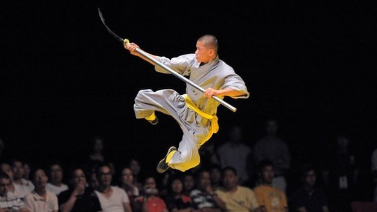
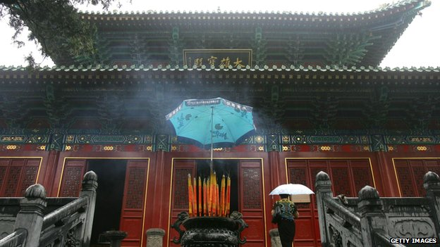
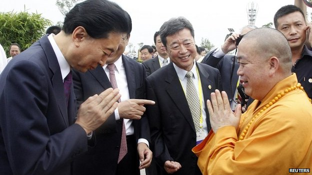
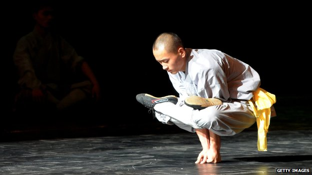

# 方丈的奋斗

 
少林僧人以武闻名数百年

**以功夫闻名的少林寺如今已是一个庞大产业，而谁又是领导这个全球品牌的人物？**

用任何标准来看，方丈释永信都是一类很特殊的和尚。数年来他统驭着这座千年古寺的现代化进程，甚至为此读了个MBA。

但他也引起了广泛争议，许多中国人批评他“商业化”了这座以功夫闻名的古寺。

我并不是少林寺的粉丝或信徒，但与很多人一样，我也常常好奇与其中一位和尚会面会是怎样。

当电影《少林寺》于1982年刚在香港上映时，我还是个男孩，我完全被电影中李连杰等演员的精湛功夫征服了。

从那以后我一直以为所有少林和尚都是武林高手。

获知释永信方丈在伦敦时，我意识到这是个不可错过的绝佳机会，不仅因为他很少接受访谈。我还希冀或许能看到少林方丈本人的功夫秀，他会在BBC的新闻编辑室里飞檐走壁吗？或是一招一指禅？

到头来我还是失望了。

在采访过程中我真的请求了方丈露几手，但他简单地拒绝了我。

事实上这位少林方丈认为他现在的年纪已不适合这类活动了，虽然49岁的他其实比我还要年轻。

方丈说，他从小孩时开始练习少林功夫，但目前已很少进行体育锻炼，因此也不再表演少林功夫了。

然而，随后在这一点上他又出现了自相矛盾——但谁又会与一位大师争论呢？

 
少林是中国四大佛教圣地之一

可能确实是我少见多怪了吧，如今的少林是一笔巨大的生意，而方丈的日常生活已经与普通武僧完全没有可比性了。满世界赶场或许让他难以保持能够表演的身体素质。

释永信方丈是中国第一个获得MBA的僧人，毫无疑问，他在课程中学会的技能恰好能派上用场。

受益于方丈多年来在国内外的积极宣传推广，少林寺品牌如今已价值数百万美元。

 
释永信方丈于八月会见日本前首相鸠山由纪夫

美国，英国和德国也有一些寺庙。少林欧洲联合会（Shaolin European Association）于2010年成立于维也纳，释永信方丈担任主席。

在中国，释永信方丈兼负盛名与争议。他管理少林寺的特殊方式引人注目，许多人指其在经营一项生意而不是主持一座佛教寺庙。据一些媒体报道，他驾驶豪车，用ipad。

在中国的社交媒体上，还有关于方丈个人生活的各式各样的说法。

有的说他在西方国家有一些秘密银行账户和一些豪华别墅。

还有的说他有一个妻子和一个孩子。目前为止，他从来没有回应过这些说法。

我向他提起这些问题，但我再次失望了。

没有人们所预料的断然否认，释永信方丈给了一个非常哲学式的答复：“要有问题，早都成问题了。”

 
一些人指责少林僧人通过教功夫赚钱

我逼近一步，问这些针对他的说法是否都是谣言，他完全重复了刚才的回答，没有再作回复。

整个采访过程中，我完全感觉不到我在与一个正常的宗教领袖对谈，也感觉不到其应有的强烈宗教信仰和宗教智慧。

当被提问时，释永信方丈的说话方式和语言风格使得其更像是一位政治家或政府官员。

即使当我问他是否会考虑公开少林寺的财务账目，以回应公众对其商业活动的质疑。方丈说他不能这样做，因为这会牵涉到其他佛教寺庙。

不管怎样，少林武僧的技艺确实炫目，而他们的方丈已帮助他们扬名全世界。

不过，称他为少林寺的CEO而不是方丈或许会更合适。

**文章来自BBC China**

**原文作者：Raymond Li**

**原文标题：Shaolin Temple: The man behind 'cradle of Kung Fu‘**

**原文地址：http://www.bbc.com/news/world-asia-china-29561279 **

(翻译：张山骁，刘铮；责编: 刘铮)
 
