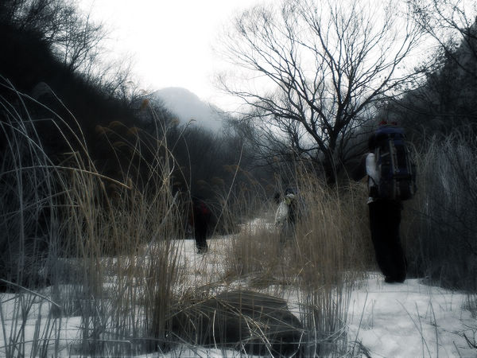
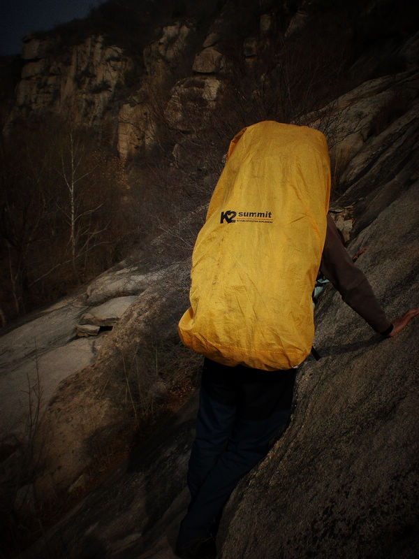
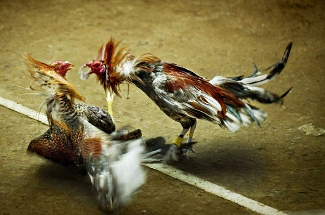
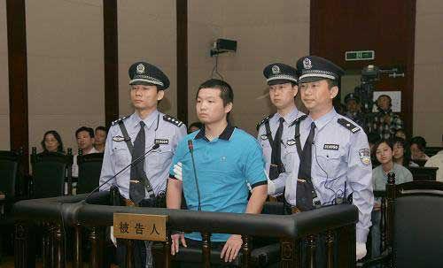
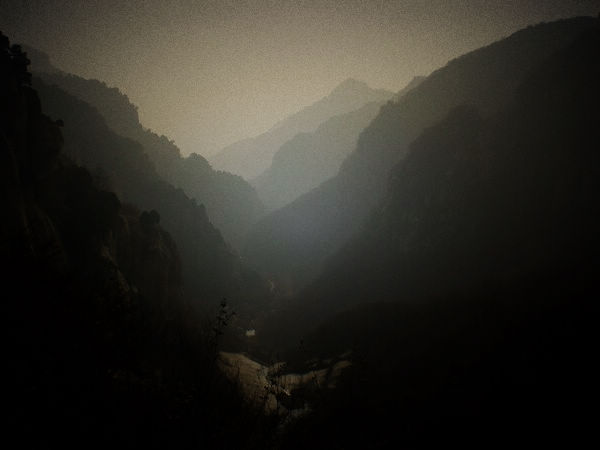

# 无产皆鸡的矛盾

** **

** ** 昨天晚上没睡着觉，就随便用手机写了点对复旦学生驴友黄山事件的看法。看法只是我的看法，我有自己的思考方式和价值倾向。说的仍然是我惯常的那一套“中国养鸡场论”而已。今天发现对此的争论还在继续，比如网络上同圈子的朋友说：“探险、逃票、警察救人、哀悼、名校，分明是五件事，一码是一码，偏生被混起来打包站队。”这是有道理的，但跟我的问题意识不同。我是习惯把这个事件所牵扯到的符号性要素混起来看，这也是我看社会的一种方式。当然，我不是为了站队。我不是在为复旦学生辩解，这里面也没什么可辩解的，他们本来也没什么错。 本来没想到这个事情会弄得如此沸沸扬扬，转眼间，网络舆论开始对复旦的这18个驴友进行责骂。网友评论说：你们这些学生故意添乱，无情冷血，破坏社会秩序，不道德，害死了一个年轻的警察。全国十三亿网民跟18个学生过不去，为什么呢？ 杨大侠手刃那么多警察，怎么也没见有人说他不道德呢，反而成了英雄。 首先，户外是项专业的娱乐活动。玩户外不是穿个冲锋衣背个包就能玩的，不行就是不行，哪怕穿始祖鸟巴塔也不行。没经过锻炼学习的人随便出去，只会把命搭上，或者把别人的命搭上。复旦的这些人，进个黄山最后又出不来了，肯定有傻逼的地方。要说一个资深户外驴友的，笑话他们一通，说丫的不懂还要去玩户外，就得了。但从道德出发，从社会正义出发去指责他们，犯不上。他们完全可以义正辞严地说：“这就是我，一个复旦人，一个中国共产党党员的选择。”我们社会现在还是比较自由，自己玩户外还是看少妇黑丝中出十连发，别人都管不着。要说为了救他们牺牲了一个警察，当然是令人遗憾的，但完全可能谁也不牺牲就把他们救出来。这个警察确实命不好。 

 我在驴友论坛户外板块看到，确实有很多资深的驴友开始骂他们无知者无畏啊。但是还有人这么说：“这些所谓热爱大自然的‘野驴’们中间，许多人士都是大公司里的白领、金领，管理层面的奇才，私企的老板，不愁钱花的大款！养尊处优的帅哥公子、高等学府里的高材生，雌姿雄发、嘴尖牙利的大家闺秀。”后面当然是说如何傻逼如何傻逼。你看，阶级矛盾就出来了。很容易地，名校学生被牵扯上了。我还见到网上有网友这么骂，说这些名校大学生真是高分低能。如果骂的这位不是名校大学生的话，又怎么会对名校学生的认识还停留在高分低能上？ 复旦学生，和普通学生或者没上过学的区别在哪？是前者高分低能后者低分高能的区别吗？不，这是精英和大众的区别。大学不光是教育人的，大学是为了社会分流。进了复旦，就有希望进上层，最差也是个中产。 一般人，对上好学校的学生羡慕嫉妒恨总归有一点，虽然骂起来底气十足，道德如何如何。这种骂声，是愤世嫉俗的声音，而非悲天悯人的呼吁。谁都不是在自己思考，尤其是没脑子的网络暴民。 教育，是现在普通人唯一能借助的流动通道。那么，网民骂得凶就是对这个社会分流机制不满咯？其实，这个机制虽然存在很多不公平，比如我们都知道很多人很傻逼但还是因为地域家庭背景等等因素轻松进了复旦，大多数人还是没什么不满的。大多数人，只是对自己在这个机制中地位不满。还有一种不满，人们有但他们自己没察觉到，就是对一般人来说，除了上名校，好像没别的什么机会向上流动了。我说的这种社会流动，是结构化的流动。当然一个没受过高等教育的人也可以奋斗做成大生意赚大钱，但这显然机会甚微。人的不满，都发泄在这个机制中混得比较好的幸运儿身上了。 中国有个问题：没有健康的阶级矛盾。本来应该是无产阶级和资产阶级的矛盾，结果成了混得好的无产阶级和混得差的无产阶级的矛盾。看到这里你会说，怎么还拿阶级斗争来说事。这里哪有无产阶级资产阶级什么事？ 

 中国的社会结构，是一种养鸡场的社会结构。人为场主，我为肉鸡，这是体制，是很清楚的事。其实世界也是这样。我们其实有三个相互竞争又分享胜利成果的集团，其一是非常小的集团，我们可称之为“超级积累者”（美国新左派社会学家，世界体系学说创始人沃勒斯坦语），就是养鸡场场主。其二是一个非常大的下层，也就是普通大众，也就是肉鸡。其三就是中产阶级，中产阶级是鸡场的管理者。积累者在剥削大众。但是这样体制是持续不下去的，下层会掀起反体制运动。于是体制变化了，让步和增选机制产生，体制给中产阶级增加了配给剩余价值的份额。中国改革开放以后，逐渐开始学到这样的体制。但是中国阶层的隐性世袭程度更高，阶层之间断裂更剧烈，博弈更不平衡。 复旦的学生，大部分都是普通人家的孩子，通过努力考进来的。但是，他们再聪明，也成不了只能在电视上看但实际中见不到的那种领导，或者大地产商，他们只能成为领导的走狗和大企业打工的。他们只能成为养鸡场的管理者。在养鸡场里，鸡和管理者的矛盾是主要矛盾。管理者也是鸡，增选在鸡中进行。复旦这些人以后成了中产阶级，户外正是他们中产阶级的一种生活方式，所以你再骂他们，他们以后还会去逃票爬山。 杨大侠是英雄，因为他敢于挑战体制。凤姐被嘲笑，也是因为她敢于挑战体制。但大部分人没有这个志向和勇气。据说有女网友表示誓死不嫁复旦男，那是她忘了复旦男以后能当公务员能当高管，等她想起来，她就会说：“复旦的哥哥都很好的，你们不要黑他们。” 

 矛盾被转移了，反体制运动就不会规模化发生。中国一直有群体性事件，但是，社会稳定还是破坏不了。我觉得大部分人听到这个事的正常反应应该是：“操，凭什么我就要在这拼死拼活地干活，凭什么我就没有假期和钱去玩户外呢？凭什么我辛辛苦苦干一个月的钱连买件好冲锋衣都不够。不行，我也要去玩户外，你看自己走丢了还有警察来搜救呢。” 

### 【注】

题目为编者所拟，原题目为“复旦学生黄山事件续评”。
