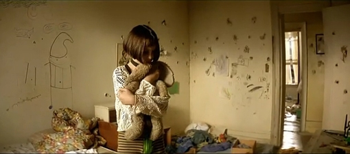

# 无标题

昨晚和妈妈闲聊的时候带出来一件我忘记了很久的事儿。

大概是三年前的冬天，我刚毕业没多久，工作不顺利，因为我胆怯懦弱的个性一直被上司利用，津贴和加班费数目不对也不敢提出疑问，这种糟糕的状况便愈演愈烈成为恶性循环，最后被拖欠工资，扛不住经济压力辞职了，数数身上只剩下不到两千块，下一份工作还没有着落，不敢为房租掏太多，就从当时条件还算不错的公寓里搬出来，找了另外一个住处。

在很长一段时间里我都不记得自己曾经有住在那里过，当时找房子只有一个条件，就是房租便宜，于是就看到了那里，在一个我不熟悉的区，很脏乱，下过雨后地面到处都是坑洼和泥泞，拐进小巷子里，会看到很多发廊和按摩店，晚上红灯齐刷刷打开，毛玻璃上面映出很多诱人的剪影。我住在角落里一栋五层楼的二楼，那是一栋很老旧的楼，到处都是黄褐色的斑点和水渍，除了防盗门，所有东西都是三十年前的样子，非常像旧的香港电影里那样拥挤忙碌又贫穷的小弄堂。那个屋子是三室一厅式，我住的房间是最侧面的一个狭长的小隔间，一般人会用来做书房或仓库的格局，只有一个很小的窗户，还是蓝色的玻璃，外面有一些乱七八糟的贴纸。

当时我都没有仔细的观察过那个房间就急急忙忙定下来了，因为两百块钱的房租实在太难得了。后来把东西全部搬过来之后才发现，房间里没有空调也没有安装空调的地方，墙上的插电孔只有一个，开着电脑就不能再开别的，没有衣柜或箱子，我只能把衣服挂在客厅的一个大衣柜里，有一半是另外两个房客平时不穿的衣物。洗手间也很狭窄，只容的下一个浴缸和一个座便器便没有多余的地方，所以洗脸池在厨房，用热水的时候要提前十五分钟打开烧水的水箱。我的房间只有一个桌子和一张床，但看起来已经非常拥挤，那时候我用的还是台式机，放在桌上后，便再也没有多余的地方。

这样我就正式开始住在那里，一个不管什么时候睁开眼都异常昏暗的地方，早上我跑到客厅找衣服，到厨房洗脸，然后出门找网吧，因为房间里不能拉网线，到网吧之后开始发简历看各种招聘信息，到下午累了回去的路上随便买点吃的东西带回去吃掉就睡觉，期间一次也没看到过另外两个房客，什么时候都像是没人一样。

第一次感到难过是一周之后，某天开始忽然下起雨来，江南的冬雨好像永远都下不完一样，气温骤降，本来因为有色玻璃就很昏暗的房间更是难辨白天黑夜，小区的道路也随着雨水前所未有的泥泞起来，我脚上穿的是小店里六十块钱买来的假ugg，平日看不出真伪的鞋子在雨天终于彻底露馅，不管我怎么小心的走路，鞋永远会进水，袜子一直被浸湿，搬家时候只留下的两双鞋中的另一双运动鞋居然也出现了这样的毛病，这样的天气，鞋子无法自然阴干。有一天我依旧穿着湿鞋回去的路上遇到了学姐，她跟我一起回到我的住处想和我聊天，进门后我发现她很尴尬，不知道往哪里坐，就一直站着靠在床沿和我说话，而我完全没注意她都说了什么，我一直盯着她的鞋，那时我满脑子想的，都是她看起来温暖干净的短靴。她没呆一会儿就走了，我连忙脱下鞋子跑到洗手间准备洗澡，脚已经很冰冷了，我打开花洒不到五分钟，水突然变凉，等了很久都没有再热起来，只好擦干出来了，然后在厨房看到水箱的开关已经被人关掉。当时，我以为是我没有设置好，第二天因为凉水我感冒了，一直睡到中午，爬起来想去拿一件厚衣服，打开衣柜发现我的衣服，挂的时候不小心越过衣柜中间的那些，被摘下来扔在下面，这时我才反应过来我那另外两名室友的存在。

回到房间我打电话给男友，跟他抱怨了很久，他听了一会说自己还在做作业，就挂了。事实上从搬进这和房间我每天都打很多个电话给他，有时会撒娇有时会抱怨更多时候是在哭，还有那么几次我强行让他来陪我，当时他在城市另一端，读大四，我们谈了好像只有一年，多数时候他都是在电话对面沉默，或者淡淡地劝劝我振作，但是没有怎么跑来陪过我，仅有的两三次也是匆匆来去，每一次都是迫不及待的回学校了，大概这个地方，连他也感到据促。

差不多接近一个月的时候，我还是没有找到合适的工作，孤单和挫败感让我的心情渐渐滑倒最谷底，每天晚上都要哭一阵才能入睡，有一天我哭到三点多，起来去客厅倒水，一打开门发现客厅餐桌的桌脚拴着一只博美，看到我打开门很凶地对我呲牙咧嘴，正在纳闷的时候听到对面的房间传出音乐声和一些男女的呻吟声，我心里感叹房子什么都破居然隔音效果这么好，赶紧转身回屋了。我以为是那位房客的男朋友（租房子时得知另外两个房客都是女生）来了，没有多想。后来我在网吧下载了很多美剧，晚上睡不着看，每天也还是会哭一会，这样半夜去客厅喝水或者上厕所的时候就发现，除了周一和周六，小狗都被拴在那里，每次我从这狗旁边经过的时候，它都发出低沉的吼声，一副随时会扑过来咬我的样子，以至于晚上上厕所成了让我很痛苦的事情。

有一天下午我没有去网吧一直躺在床上，听到我的两个室友一前一后进屋，门开开关关之后她俩站在靠近我房门的角落聊起天来，大概她们以为我不在家，所以说话声渐渐变大，从她们聊天的内容里我听出房间离我比较近的这个，是一位本地商人的二奶，因为商人最近生意下滑，已经许久没有来看她；另一个，也就是对面的房客，是一位高级妓女，也是那只博美的主人，每周固定接两到三个常客，多半是午夜或者下午带回房间。我还没有来得及从震惊中缓过神来，她们的话题已经变成了“新来的这个”，也就是我，从她们的话里，我听出来，洗澡的热水我用的比较多，所以她们听到我洗澡，就会数着时间出来关掉，因为我占用了客厅那个本来闲置的衣柜，她们故意把我的衣服摘下来扔在地上，而有几次我怎么也打不开防盗门不得不请开锁公司的时候，是她们故意把门反锁了，而那只博美几乎每天停在客厅的理由更加令人感到可笑，因为我总是晚上喝掉太多饮水机的热水，所以她故意把狗拴在桌角，暗暗希望哪天我喝水的时候，会被它的宠物咬上一口。

听到这里我简直不敢相信，对于我这个她们连面都没见过一次的人，她们居然有这么多的怨气，而好几次晚上我在外面敲门的时候，她们俩就各自稳坐的自己的房间里听着我砸门的声音幸灾乐祸。 我躺在床上气得发抖，很想冲出去和她们解释，哪怕是吼一声也好，但我想了很久，还是没有动，那天反而直到她们都出门了，我才起来。 之后的几天我过得更加小心，洗澡速度更快，衣服拿了大半放回房间堆在凳子上，晚上灌满了水在保温杯里，也不去倒水了，但是每一次我起夜去上厕所，那只博美依旧蹲在那里时刻准备凶我。

有一天上午我终于接到了面试电话，偏偏我刚出门又下雨了，踩着湿鞋子到了面试单位，心里还盘算着得买双鞋了。面试的过程异常顺利，是当地的一家软装公司，内部装修的很豪华，给出的底薪和福利也很诱人，我没加思索就答应了。第二天我满心欢喜的去上班时，发现办公室其他的同事好像都不怎么愿意理睬我，就这么无所事事的上网到下午，经理忽然在MSN上喊我去他办公室一下。我坐下之后，他先是笑嘻嘻的把我的所有状况和处境问了一遍，天真的我几乎都如实回答了，接着他有意无意的给我出示了很多自己在国外旅游时拍的照片，言语中一直夹杂着，只要你听话，你在这里的前途会很好，我已经隐隐的听出一些不对，但还是没说话，过了一会他站起来执意带我去阁楼，说那里有公司的藏品，都是珍贵的艺术品。我已经感觉到蹊跷，却还是懦弱的跟在他后面，直到看见他在我进门后准备去锁上门把上的小锁，巨大的恐惧感才降临了，我急忙推开他跑到办公室拿起自己的包逃命一样在所有人的注视下跑出门。

再回到自己的房间时已经是傍晚，我犹豫了很久，还是没有给父母打电话，怕千里之外的他们会乱想，还是给男朋友打了电话，现在回想起来，那时的他也只是一个毫无社会经验，而且正烦躁于自己的毕业设计的学生而已，所以他没有给我任何我预期的反应，甚至有些怀疑我的话，因为在单纯开心的学校里他身边的任何人都没有遇到过这种事。他不经意的怀疑让我情绪彻底崩溃了，接连一个多月的打击和阴沉的生活仿佛吸干了我身上最后一点点乐观，在那样的情况下我甚至没有钱去买双干净的鞋子。

那可能是我一生中最狼狈的时刻吧，缩在肮脏狭小的房间，一个木板搭起的床上，在我铺满廉价的褥子和自己的一堆衣物中间，一手攥着不知道能打给谁的电话，一手还抓着自己湿乎乎又冰凉的脚，哭得内脏都快掉出来了。就在我抽泣开始渐渐停止的间歇间，我听到对面的女孩回来了，带着一位客人，两人嬉笑着打开门的时候狗也叫起来了，我猛的跳起来把门打开一个缝想看看他们的样子，女孩笑着摊着手，男的红着脸从包里拿出一大叠钱放在她手里，小狗在他们的腿中间窜来窜去，接着女孩把小狗照例拴在桌脚上，然后跑进房间把门关上了，那一刻我居然心生羡慕，“做妓女也好过像现在这样。”我被自己这个念头吓了一跳，却实实在在地这样想了。

门后很快的响起了音乐声，这香艳的一幕冲淡了我半小时前的心碎，我想了想决定去洗脸喝水然后先把自己喂饱再作打算，就在打开门准备往厨房走的时候，横在我和饮水机之间的博美忽然冲我大声叫起来，一边叫一边用力的刨着地面，因为房间很昏暗，我仔细看了一下，才发现它脚底下垫的，是我当时被扔在地下的衣服中的一件，我漏拿的一件，那是我妈妈花了差不多一个星期的时间照着杂志上繁复的花纹给我织出来的毛衫，已经被它踩得全是污痕，线头也抓的到处都是，那一刻我心疼又愤怒，站起来要去砸这女人的门想和她理论。

待我刚站起身，她把门打开了，大概是因为小狗的叫声，她看到我站在那里，只是稍稍愣了一下，然后对着博美做了一个坐下的动作，那狗就乖乖的趴在我的毛衫上面不动了。我看了看那件衣服又看看她，憋了很多话还没有说出口，她看到狗蹲下了，抬头淡淡扫了我一眼，对着两眼挂满泪痕的我，露出了一个轻蔑又寡淡的微笑就把门关上了。连衣服都没穿整齐的她的那个饱含嘲弄的笑意就像一把尖刀一样瞬间刺进我心中，连日来所有的委屈，不满，失落，猛的燃烧起来，我把目光落到那只随着主人进屋之后还在对我呲牙咧嘴的博美身上，做出了一件日后每每想起都会语噎的事情。

我一把扯下了拴着它的链子，揪起它的脖子把它拎到洗手间的浴缸旁边放着的一个用来存水冲厕所和洗拖布的大桶里面，用尽全力把它的头按在水里并死死的捏住它的脖子，小狗发出了我以前从未听到过的惨叫声，因为淋着水我已经分不清它的四肢和毛发，只是狠命的把它往水里按，不到片刻小狗就发不出什么声音了，脖子也迅速的肿起来，最后我忽然看到从它眼睛转过来眼角全是湿湿的眼泪，从嘴角也流出来一些黄红色的液体，那液体让我一下子清醒了，随即把手放开了。小狗以极快的速度挣脱开我，不知道躲进了哪个角落，再也没看见。

我哆哆嗦嗦地躲回房间，强行压制住自己狂跳的心，已经做好了她的主人和客人随时会冲过来和我拼命的准备，但是我一直坐着等到半夜，对面都没有一丁点声音。我也因为巨大的情绪波动累得睡着了，没想到那一晚睡地却出奇的安稳。第二天第三天，我一直等着她们会找上门来，但奇怪的是始终都没有动静，晚上我再打开门，小狗也没有再出现在客厅，当时我还绝望的想着，也许我真的失手把它杀了。

一周后，我又接到了另一个公司的面试电话，这一次做好的全部会搞砸准备的去了之后，意外的发现是一个环境和员工都很随和的漫画公司，而且他们提供员工公寓，当天下午我便签下了租约。 傍晚我走回家的时候，第一次怀着轻松的心情仔细的观察了一下那个地方，对面有一个埋在灌木和小树后面的小公园，我一直没有去过，楼下的便利店和水果店，我好像也一直都没有留意到过。进屋后我第一次没有迅速的关上门，而是大敞着坐在里面收拾东西，离我比较近的那个女孩回来了，看到我在收拾东西，过来跟我寒暄了一会，又回房间拿了些零食让我带着。最后搬家公司到达楼下的时候，对面的女孩终于也回来了，她低着头从我面前匆匆走过，好像根本没留意到地上的箱子和我的杂物，我帮着工人把东西往外抬的时候忽然看到了让我心跳加速的一幕。那只博美正安静的趴在那女孩门口的垫子上，毛发整齐又干净，看到门口的动静忽然抬头往外面看，也许是辨认出了我，它忽然受惊一样跳起来飞快的躲进房间的角落里了，我抬头看了看那女孩，她只是平静地看着我，把身子往里面欠了欠，好让在搬我的东西的人能通过。我曾以为看到她和小狗我会心生悔意，或者会感到很脸红，但是那一刻，她们眼中的惧怕和忍让居然使我得到了极大的满足。

就这样，两个月，我搬离那个房间，住进了员工寝室，这件事我迅速地忘记了，在很长一段时间里没有跟任何人说起过，新的繁忙工作和同事把我之前的阴霾一扫而光。从此之后的每一天，我一次也没有在睡前因为想到自己的境遇而哭过，也没有再因为男友或者朋友对自己言语的怀疑感到过一次难过。那件看起来好像没有什么，也没什么值得诉说的事情却仿佛是我人生的一个微妙的转折点，从那之后的几年里，虽然挫折和打击依然发生着，所有的事情却渐渐地好转起来。

因为我知道在那个晚上，虽然我没有杀掉那只小狗，但我把自己心里的某个部分，某个一直阻碍着我拉扯着我前进的部分，那个时不时让我自怜让我哭泣，时不时让我不自觉的对别人产生依赖的部分，狠狠的按在那只注满脏水的木桶里，淹死了。

（采编：刘铮，责编：刘铮）
