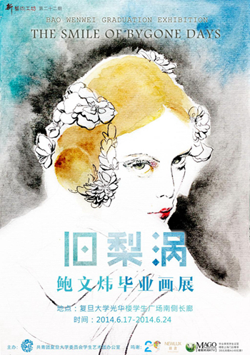
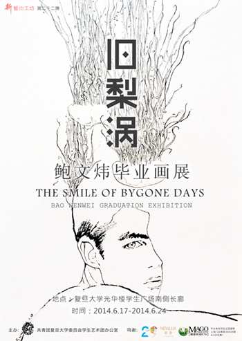

# 旧梨涡·鲍文炜毕业画展

这是一个普通复旦人的个人画展，也是许多复旦学生共同的情感呈现；这是一个毕业生四年的笔耕成果，也是他所能想到的、献给母校最郑重其事的一场告别。

画展主题“旧梨涡”选自清代黄景仁《绮怀》组诗第十四首最后一联：“从此飘蓬十年后，可能重对旧梨涡。”意思是从此飘蓬离散，不知道未来是否还能够重见故人容颜。点点颜色，都是四年厚积薄发的情感宣泄；缕缕线条，都是在镌刻面临告别的一片深情。

人面桃花，自有情深；梨涡浅笑，常入梦魂。

###【主题】
旧梨涡·鲍文炜毕业画展

###【时间】
6月17日至6月24日

###【策展人】
郑雅君

###【参展人】
鲍文炜，2010 级文博系学生。曾获历史系才艺大赛冠军，班团文化漫画大赛银奖，复旦大学校名礼品设计大赛十强，产品版权亦被同时收购。2012 年赴香港中文大学人类学系交流，期间曾任中文大学博物馆“文化大使”。2013 年成为上海博物馆首位独立设计宣传单片并印制发放的实习生。

###【联合参展】
张雪菲，2010 级社会学系学生。与鲍文炜系高中同窗，并共事于复旦大学学生艺术团，复旦大学ECHO 混声合唱团。曾为ECHO 创作平面设计与唱片封套，《我有一个恋爱》（本次展览展出）。2012 年赴美国加州大学圣芭芭拉分校交流学习艺术史，期间于I.V.Theatre 展出作品《The Mermaid》。

###【地点】
上海  复旦大学光华楼学生广场南侧走廊

（采编：万晓华；责编：万晓华）