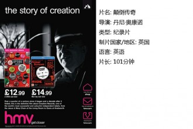

# 时代的噪音（独立影像第五十期）

纪录片与摇滚乐的结合是一个奇妙的现象。一贯以负责态度著称的纪录片仿佛为深为家长们厌弃的摇滚找到了正名的途径，而一旦与富有浪漫色彩的地下故事结合，这种容易流于枯燥的电影形式也顿时成为了众多青年们的圣经。太多人在其中找到了自己的启蒙导师，也在严肃而克制的镜头中找到了幻想的空间，而摇滚乐六十年苦闷挣扎的历史在这种幻想中充满了史诗的意味。

接下来的这三部纪录片，从不同的角度点缀了这种现象。我相信一部优秀的纪录片不但可以回顾过去，也能引发对未来的思考。特别是摇滚乐这种具有某种悲剧英雄色彩的艺术类型，或许更需要一些温和的启发。

**一、24小时疯狂派对**

虽然从主题上来说，这是一部关于地下音乐厂牌“工厂”创始人Tony Wilson的传记电影，讲述了由他一手创办并推动的摇滚事业。但正如Wilson在影片中自己说的：“我只是个小角色，这是一部关于音乐的电影。”

从影片开始，性手枪最早的现场在一串快速闪现的金光四射的名字中回放，加上源于安迪沃霍的厂牌名字，仿佛营造着一种仪式感，仿佛开门见山地提醒你“我们在创造历史”！

但我们最好还是把它理解为一部献给Joy Division或者工厂唱片粉丝的电影，而不是一部可以让人深刻理解从朋克到新浪潮之间到底都发生了什么的纪录片。从性手枪到Joy Division再到庄园倒闭，好像重要的环节都被省略掉或者快速掠过了。而如果你对以上那几个名词都觉得比较陌生，那么可能很快就分不清舞台上那几位到底是Ian Curtis还是Ryder了。一个又一个长得都很神似的白人走马灯似的轮番轰炸，让人通篇看下来可能也记不住几个名字，盯着某位在“庄园”现场手舞足蹈的观众思考这又是哪路神仙的事情层出不穷。当然，如果以上都符合你的观影感受，那么我打赌你对着影片开头那个“他……是一位邮差”的梗也笑不出来。

可以说，这绝不是一部摇滚知识普及电影。

设想观众都是对“工厂”这个传奇厂牌具有一定了解的人——相信应该是大多数，否则怎么会摸到这部电影呢？难道是24 hours这个已解散的西安乐队歌迷？

是的，你熟悉Joy Division，知道New Order跟他的关系，也明白Happy Fridays这个乐队名字是对Blue Mondays的嘲讽，那么，你又会看到什么呢？

我相信，最基本的观影体验，也就是那种重新体验历史的神秘热血感。虽然并没有像其他摇滚纪录片那样花大力气描写令人热血沸腾的标志性现场，但那个处于朋克，或者说后朋克年代，既沮丧又蕴含希望的曼彻斯特仍然通过这部电影展现了它的峥嵘岁月。恰到好处的政治背景交代，和官员之间打交道的零星片段，毒品横行的RAVE现场，都能让人感觉到时代碾过的混乱又深刻的痕迹。而作为影片真正的主角，那几个传说中的乐队生活片段，也通过没有野心的描写还原在了每一个热爱他们的人面前。加上英式幽默作为地方特色调料，增味许多。

英国人的电影是绝对不会少了黑色幽默的。制作人Martin帮助Joy Division录制第一张专辑时,鼓手在阳台上打了一晚上鼓，牛群中莫名出现了一只鸭，还有作为剑桥大学毕业生的Wilson夹杂着叶芝，凯撒和威廉布莱克的诡异旁白都令人感到又黑又冷。乐队成员之间，经理人之间的插科打诨也比比皆是，主要讲述人Wilson时不时还会跳脱出戏指着真正的Wilson（在电影中扮演一位电视导演）说：“那才是真正的我。”……而这一切都在影片结尾Wilson看见上帝的时候得到了B级的升华。

其实，在观影之前最最令我担心的一点，仍然是它到底会怎样表现Ian Curtis之死。相信每一个真爱Joy Division的人都希望在那里酝酿泪点，但这恰恰可能使整个影片的情节失去控制——毕竟Ian在电影开始一半不到就自杀了,可整个厂牌仍然得继续。在这个关节上打煽情牌实在是太容易打进阴沟里去了。

可事实上，我的担心是多余的。Ian之死的哀恸在影片中表现得十分克制，没有各路人马纷纷悼念的壮观场面，也没有歌迷哭倒在地的狗血镜头，叙事节奏基本原样继续，甚至还添加了一些滑稽成分。直到后三十分钟，Martin的死亡被一场突然出现的葬礼浓缩（当然也不忘加点儿不合时宜的笑话），我才敢肯定这其实也是导演的态度。

也许这和我的个人口味有关：作为一部传记电影，不论故事的内容多么cult，手持DV抖得多么厉害，乐手们的生活多么Rock ‘N ‘Roll，我仍然希望讲故事的人是个脑子清楚的人，可以保持比较平静的叙事基调。而这也是我，一个对Joy Division，以及那个年代所有优秀乐队保持着极大尊敬的人对这部电影的最大的赞赏。

对于死亡这件事保持Less is more的态度，是高贵的。

我相信每个人从这部电影里都能找到自己的观影角度，对于唱片业的兴衰，对于某个年代的无限向往，或者对朋克们所谓“性与毒品”生活的偷窥，什么都可以，什么都有。而我在Love will tear us apart的片尾曲猛地响起的时候却突然什么都想不出来了……

**二、合成器英伦**

如果说《24hours party people》作为一部喜剧电影的意义大于纪录片的意义，那么BBC出品的一系列纪录片可以说为英国流行音乐历史盖棺定论。从史诗般宏大的《摇滚七季》，到微观的披头士乐队纪录片，尽管有作为英国媒体具有地方色彩的偏颇之处，但资料的翔实与线索的清晰仍然使它的每一部作品都堪称精品。这部《合成器英伦》正是以合成器在英国流行音乐的发展为线索，展现了独立实验音乐，后朋克，新浪潮等等音乐流派的发展面貌。

朋克与合成器可以视作英国工业社会日愈发展诞下的两个私生子。并且，他们的胚芽孕育在嬉皮末期。

1971年 库布里克《发条橙》的“英国社会的未来主义与暴力感”时代精神向大家描述了一个充满后现代感的预言，同时，它那“充满疏离感”的背景音乐第一次向大家展示了合成器的魅力。

1975年Kraftwerk第一次出现在英国电视中，他们在英国的出现为英国早期合成器爱好者奠定了基调：知识分子的冷峻面孔，一丝不苟的西服，geek似的偏执与充满未来感的音乐现场。直到现在的北京鼓楼，在各类噪音实验现场，也总是有这样形象的人，以那种完全与摇滚乐无法联系在一起的形象，扛着上百公斤的设备开始演奏。

这部纪录片将早期合成器实验音乐描述为“割断了自然生活和自然规律的人做的音乐”，这也是为什么合成器最终会成为后朋克的宝藏的原因：冰冷的音色，无限重复的loop，机械的嗡嗡声——没有什么比这更像时代的噪音了。

1978 OMD与工厂签约。此前，这样的乐队是在英国各个地方出现的小规模实验，并没有汇聚成声势浩大的某种运动。这次签约标志着一场运动开始被归类

当Tony Wilson（工厂唱片老板）认为OMD是流行乐的未来时，乐队甚至认为这是一种侮辱。

在这场运动中，有的人表示自己并不反感自己的朋克出身，"虽然我们是朋克，但我想写下我在这座城市听到的音乐”。当时，有钱且技术高超的前卫人士才能玩儿得起，正是鼓励大家放手一搏的朋克运动激励了对合成器感兴趣的人自己去勇敢尝试，汲取DIY的精神，把它们放在了其他的音乐形式中。而有的人却想和朋克划清界限：“我们从来不是朋克，我们是工业噪音”。相对嬉皮对田园生活的热爱，70年代末的城市复兴使他们更热衷于对城市生活的描绘与预言。不管怎么说，整个七十年代的音乐，无论是朋克，还是安迪沃霍，还是OMD,Kraftwerk,从气质上都是反嬉皮，反乌托邦的。

1979年,英国第一家专营电子乐的独立厂牌MUTE成立了，这场零星的运动最终汇聚成了河流。同时，第一位合成器偶像登上了历史舞台。他就是嘉里纽曼，他被描述为"典型的孤独者"。从他口中终于明确地说出了：“我不为人民说话，我甚至不认识他们”，“我就是愿意做一位流行明星”。纽曼的成功使合成器摇滚的精英标签更加凸显，与工人阶级的分野也更加明显了。而在Joy Division的同名纪录片中，也有相似的话语：“在那（朋克流行的）时候，人们都只愿意用简单的句子和和弦表达愤怒，但总有人想，要是我们把句子说长一些，表达更加复杂的感情会怎么样？”后朋克和新浪潮年代就在人们在对朋克乐的怀疑和探索中慢慢孕育出来。尽管从一开始，不管是Joy Division还是纽曼，与朋克都有着千丝万缕的联系——在Joy Division还叫华沙的时候，他们的音乐跟The Clash几乎没有什么区别。

而新浪潮时期的真正到来，是在80年代。物质文明压倒了一切，人们对精神世界的追求开始转向感官享乐。Depeche Mode和The Human League变得非常流行。"他们的歌迷不看他们的表演，只是跟着他们的音乐舞蹈"。每一支乐队都在毫不避讳地谈论商业成功与电台节目，令人们觉得影片开头的朋克时代是不是来自另一个世界。宠物店男孩和New Order的出现将合成器运动推向了高潮。与此同时，锐舞文化在青年中流行起来，歌舞厅中充斥着画着眼线的英俊主唱加合成器二人组，新浪潮运动无可避免地流于商业与无脑狂欢，许多乐队都开始产生了自我怀疑。后朋克与新浪潮作为一场运动的祸胎就在这短短十年不到的时间里显现了出来。

从兴到衰，任何一场运动最终都无法逃开这样的命运。而音乐永远是向前生长发展的。青年们与社会的关系从激烈反抗，到精英式的嘲讽，再到某种意义的友好妥协，每一个阶段都是无可厚非的，而它们也为音乐的发展提供了最丰沃的土壤。

**三、颠倒传奇 **

<Upside Down the Creation Records Story>作为独立音乐厂牌the Creation的纪录片诞生于2010年，集合了Jesus and Mary Chain, Ride, Primal Scream, My Bloody Valentine和Oasis等等英国传奇名团的访谈。然而由于他们死不悔改的恶劣口音，在国内迟迟无人做出中文字幕，以至2012年底由国内音乐推广无解放映会，这部电影才为大部分的国内爱好者所了解。然而在我看来，由这部纪录片折射出来的独立唱片业环境与国内唱片工业的借鉴意义比Noel的不分场合的无下限耍宝更珍贵。

完完全全的地下，混乱的卧室DIY录音，学校里默默无闻的怪胎，各种极端风格的交叉影响。这些组成了第一批独立乐队的关键词。各种独立音乐在英国各地乱糟糟地出现，并没有什么厂牌愿意将他们归纳其中。朋克精神的影响使他们对音乐的态度从对技术的追求转变成了想法的创新：后来成为JAMC鼓手的Primal Scream主唱Bobby只会打两个鼓，然而谁在意呢?

1980年，the Creation的创始人Alan Mcgee来到了伦敦。“伦敦对任何一个趁年轻想碰碰运气的人来说，意味着要么彻底地失败，要么彻底地成功，you either love it or you hate it.”而他显然是热爱这里的。接下来的故事顺理成章，凭借着他毒辣的眼光与与众不同的品位，一个又一个后来载入史册的名字被发掘出来。显然Alan在伦敦之初对乐队的喜爱之情的表达方式很奇怪——在接触Television Personalities的时候，他偷走了他们在唱片店里所有的专辑。而the Creation创建的初衷，“只是为了派对，无休止的派对”。

旁人对ALAN的评价相当一致：“他是一个彻头彻尾的疯子，但也是一个非常强大的存在”。而ALAN自己觉得，不知天高地厚是自己做厂牌的主要原因。

在the Creation的历史中，许多前所未闻的风格被Alan挖掘了出来，盯着鞋一动不动的主唱，虚无缥缈的人声以及噪音实验的大胆使用，使人们意识到世界上竟然存在着这么酷的东西。the Creation的成功来得即幸运又理所应当。然而它的运营却也践行着最大胆的模式：乱七八糟也无人在意的乐队合约，充满药味儿的彻夜办公室狂欢，疯疯癫癫的老板和员工。Noel（Oasis）想起第一次进入the Creation的办公室的时候说：“我简直不敢相信自己的眼睛，这完全是个不伦不类的地方……我根本没有地方坐，人们在角落撒尿，或者做任何事情……而这时候他们已经发行了the Primal Scream 和Ride的专辑，它们都卖疯了！”“可我来了不到两分钟就已经爱上它了”。

而后，Oasis的巨大的成功使the Creation变得与以前不同了，新的办公室，新的录音棚，新的酒吧，办公室里充斥着大量闲人，每一个人都过着完全摇滚乐的悠闲生活。这段黄金时光使Alan变成了“职业瘾君子”，他在厂牌发展到巅峰阶段，也就是<Morning glory>取得空前成功的时候，因为嗑药过度被送进了ICU。当公司员工最终都只能坐直升机才能挤进Oasis在Knebworth的现场之时，Alan意识到，自己最终扼杀了独立音乐。The Creation已经不可避免地从一个莫名其妙的小厂牌变成了一家引起索尼注意的跨国大厂，再也不能靠几个眼光毒辣但却疯疯癫癫的人来管理了。一批对摇滚乐毫无热情，但却倾慕其名气的人被招了进来，仿佛一家疯狂飞驰的拖拉机被硬生生拉上了铁道。无穷无尽的合约问题开始凸现，Alan也因为自己极不靠谱的管理风格招到了其他人的敌视，很快，他就发现自己身边被安排了索尼的各色人等，权利几乎到了被架空的地步。一切都与以前不一样了。最终，他决定，不干了！ The Creation的历史就这样戏剧性地划上休止符。

在我看来，The Creation的发展史简直就是独立唱片的寓言。它所揭示的各种矛盾可谓是永恒的。从某种意义上来说，the Creation的成功与Alan的个人魅力分不开。他可以将签约乐队的眼光完全建立在自己的审美之上。要是当时他发现Noel的爱好名单上还有U2的话，他甚至压根儿不会签下Oasis。而在JAMC拿着自己的唱片四处求出无门的时候，又是他将其归入门下。天才般的品位与卓越的执行能力是不可兼得的。我无法想象一个能精明控制资金流的人能满不在乎地做到这一切，也无法想象一个结构明晰作风硬朗的唱片公司管理层如何与自大狂妄的独立乐队磨合，而不管是一个不向商业妥协的公司，还是一个导致旗下乐队众叛亲离的公司，都显然无法健康生存下去。

如今的北京与当年的伦敦是何其相似，机遇与挑战吸引着全中国所有优秀的音乐人。回观国内的唱片公司：摩登天空的老板沈黎晖是个音乐人，但却对管理层几乎不闻不问；兵马司的老板Michael Pettis虽然是一位拥有卓越品位的银行家，但他那挑剔的审美眼光与对乐队无条件服从的态度使他几乎推倒了自己在金融领域的所有形象，让我不禁觉得是在重蹈the Creation的覆辙。友谊唱片的负责人朱尔摩斯曾经对这种矛盾发表过“不要在乎细节，让对的人做对的事”的宣言，然而具体操作又该怎么进行呢？

有时候我会尤其悲观地想，独立唱片唱片也许永远只能做为辉煌一时的存在，一个又一个的厂牌交替为具有常青能力的乐队服务。而这真的是一种宿命吗？是否还有人们的眼光未能触及到的地方，是否还有另一种生存模式存在呢？我想这其中的探索应该还远远没有结束。

 **【如何下载】** 请加入独立影像流动分享群，在群邮件中下载本期所推荐的独立电影！ 1. 请加群187213480，入群请注意以下几点哦： 2. 流动群专供北斗读者下载本栏目所推荐的资源，验证身份时请注明“北斗读者”。 3. 当期资源自发布后14天内可以下载，到期后工作人员将手动删除以上传后续资源，请注意时间。

(采编：黄楚涵；配图：卢静；责编：黄楚涵)
