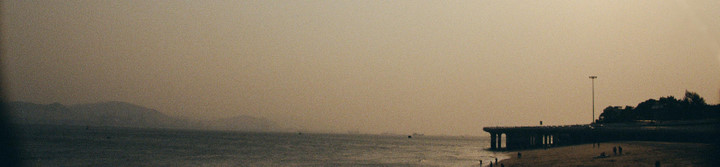
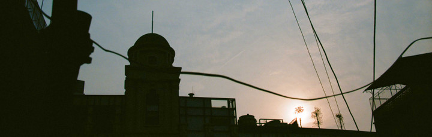
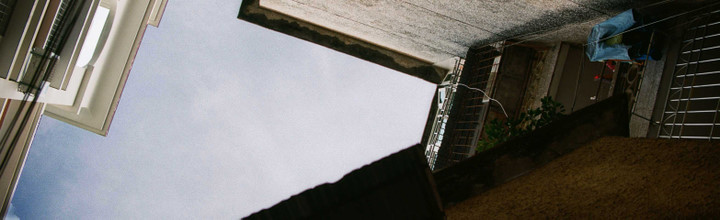

# 时光去

** **

我至今不肯承认秋天已走远，就像等到9月都不肯承认夏天已来过一样。

我至今贼心不死地还在各种公园各种枝头各种草坪搜寻着该是属于金秋的那些黄灿灿的叶子，和树根下鬼头鬼脑的蘑菇们。我总觉得在这个城市的某一处，某个我从未到过，像爱丽丝的梦境，潘神的迷宫，纳尼亚的传奇一样的那么一处，至今都保留着我完美的梦境一样的秋景，等着懒惰而拖沓的我，带着至今没研究透的小单反去和它约会。

我至今都不肯正视这像是被人拧成了粗绳还蘸了蘸盐水的风，把一个一个我喜爱的月份都驱赶出境，眼下，被驱赶的不只是月份，还有站在各种恋恋中不肯走的我。因为这些荒唐无稽的“至今”，我从未仔细看过时间的影子，听过它咔嚓咔嚓从这块大陆踩踏而过的声音。

直到下班回家的傍晚，看到市政厅广场竖起灯火通明的那棵圣诞树。然后好像一个拖沓了很久未能准备好一场隆重告别的小孩儿，在所有的惊讶里，埋藏着各种丝丝缕缕的慌乱和不甘。

Routine是重要的。 Rountine让这削尖脑袋四处乱窜的时间忽然撞见照妖镜。就像小时候街心花园每年春节的花灯，就像大学时元旦夜只去过一次却年年觉得不可或缺的游园会，就像研院圣诞节那天广播台一定要刺激人寂寞神经的圣诞曲，也就像汉堡这棵才入十一月就华丽的不可一世的圣诞树。

如果曾经体验过，或许没有人能够形容，也没有人能够忘记，一个人在一个全然陌生的国度最初着陆的那些日子。2009年的11月，雨已经频繁，雪即将落下。这个城市，每个转身的街角都好似藏着各色的包裹，炸药，或者礼物。每个相遇的眼神都好像传递某些可能，阴险的，或者美好的。有时候会痴迷于这千里跋涉的本身，想到自己借助着自己智商全然不能够理解的飞行技术，将千百年前古人的数月苦渡压缩在24小时之内，都是一样的为了看看传说中的“远方”，为了打着手势比划着表情，在陌生的人群里体验诡异的存在，这跋涉本身，就已令人着迷了。

那个时候，好像一只珊瑚礁啊，在异国的寒冷空气里展展的伸开了所有的敏感触角，去触碰，也被触碰。

来德国之前已经在德国帅院长哈色的率领下，经历过北京四合院里的圣诞节。但是来了才知道，就好像异国的春节怎么都过不对味一样，北京的圣诞，味太轻。你看不到时间从圣诞广场的红酒Gluewein蒸腾的样子，也听不到它躲在所有大小门店的圣诞广告后偷笑的声音，即使面对的是比德国还正宗的杉木圣诞树，还是有种过家家一样正式不起来的游戏感。2010年从中国返回德国的时候是12月初，下了飞机那种无处不在的圣诞感，像是圣诞老人的一场恶作剧，拿了只口袋铺天盖地的蒙住了我，在中国无声无息经历过我却从未被我意识到的时间，在圣诞的照妖镜面前又一次诧异的显形，那一刹那，我又是那个拖沓了很久未能准备好一场隆重告别的小孩儿，在所有的惊讶里，埋藏着各种丝丝缕缕的慌乱和不甘。

我的今天，我知道，这一年要去了。我看得见它溜出门角一点点消失中的长长裙裾。我看得见它站在圣诞树的顶端眼看着展翅要飞。我看见它偷了我一大包的笑容一大包的眼泪，不忘了临走还往怀里揣几张我的旧照片。它笑的又浅又轻又得意的要去了。它要去了，我有各种形态的茫然，庆幸，感伤，感动，辛苦，幸福，然而看着它离去，我一句话都说不出来。

我只好站在这城市的一个角落，也好似站在这城市的所有角落，这样广袤又无语的看着它。这所有人的恋人，所有人的小偷，所有人的天使和所有人的魔鬼。

说不出话来，只好写这不知所云的文字，酸不拉几的口吻，无迹可寻的思绪，赠送就要溜走的它。

每当变幻时，便知时光去。

 

（采编：应鹏华；责编：麦静）

 
