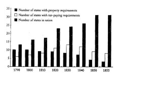

# 时震、普选与铅笔社

** **

事情的缘起是我的一位朋友推荐了铅笔社李子旸的某条微博，如下：“无代表则不纳税这句话反过来的意义也应该成立，应该在现实中被坚持，那就是‘不纳税、吃救济，就无公共事务的投票权’。靠别人养活的人，应该为还能活着而庆幸，根本不应该让他们再去决定别人的生活。”

对这个从历史故纸堆里冲出来的观点，我有点吃惊（虽然我知道哈耶克就持这个观点）。如果这个意见成立的话（姑且假定纳税是纳所得税的意思），那么许多抚养孩子的单身母亲、身体残疾者、临时失业的人群、贫困地区的部分人口、还在还助学贷款的学生等等，都将丧失对公共事务的发言权。更有甚者，社会福利（救济）将根本不可能，因为谁一旦领取救济，就将被排除到“公民”之外。而且我很怀疑，李这个观点会迅速过渡到“只有有一定财产才有投票权”的阶段，说不定还会坚持“财产越多，投票权越多”（从铅笔社过往的倾向上来看）。

但我的那位朋友在跟我很认真的辩论这个意见。他坚持李观点的正确性，认为这再好不过的体现了自由主义“自己对自己负责”的态度。我的另一位朋友后来也参加了这个讨论，他认为谁出钱谁就有权控制国家，“搭便车的人无权决定车往哪开”。

说实话，这种争论一开始就给我一种时空倒错的感觉。我恍惚置身于十七十八世纪的沙龙里面，同头上带着假发、腿上套着丝袜的贵族在说话，这还是一个大众政治运动还没有诞生的年代，大革命与现代社会还在懵懂的未来。

我在恍惚中去跟老麦教授到Campus Union喝咖啡，向他提及李子旸这个建议，他是以极度古怪的眼神看了我一眼，然后对我说，这种意见也许在150年之前还在可以严肃讨论的范围之内。

我倒是明白这种恍惚感的来源。因为该发生的公共讨论，在中国从来没有发生过。我们似乎直接跳到了结论部分，推导过程被省略掉了。而我们的社会，也从来没有经历过“近代”以来的阶级冲突。

于是就发生了一个很奇特的现象，看起来最现代的学术话语同非常陈旧的观点混杂在一起（虽然未必没有合理性），以十分傲慢的态度讲出来（这就很糟糕，在于好走极端）。现代政治安排中的种种细微考量、折冲斟酌、历史沿革与经验，及其背后的社会变迁都被无视化，变成“套中人”。虽然我那位朋友跟我很严肃的说，普选也是相当晚近的事情。但是我知道，在美国，自1810年马里兰州始到1856年，所有的州都逐步取消了将财产和纳税额作为选举权资格的规定，承认了白人男子的普选权。英国稍微晚一点，经过1832、1867、1884、1918年历年的改革，彻底取消了领取失业补助金者无选举资格的限制。一个百年以上的政治实践恐怕不能轻易用“晚近”这个词来形容吧。这样一个百年实践，不是说不能批评，但恐怕已经不能用一条或几条原则的推导轻易否定吧。

但即使我明白这点，都无法改变那种“时震”的感觉。

在现代讨论这个话题，不管怎么样都让我觉得滑稽。所以在想象中，我乘坐脑中的蓝色小警亭，去往1861年的伦敦，停靠在约翰密尔的家门口。跟他的养女说过几句话说明来意后，被带进客厅见到了正在修缮《代议制政府》的这位瘦削的老人。

在听完我的叙述之后，他沉吟道：

“对于任何一个人，除非为了防止更大害处，在他和别人同样关心的事务的处理上不给他发表意见的通常特权，是对他个人的不公平。如果他不得不交税，如果他可能不得不当兵打仗，如果他必须无保留地服从，他在法律上就应该有权知道为什么，有权要求征求他的同意，要求按照其价值(尽管不是超过其价值)对待他的意见。在一个充分发达和文明的国家里，不应当有贱民，不应当有被取消了资格的人，除非由于他自己的过错。无论哪个人，当别人不征询他的意见，擅自掌握限制他的命运的无限权力的时候，他的地位就降低了，不管他知道不知道。即使在人类思想不曾达到过的进步得多的国家里，遭到这种处置的人也不会受到和有投票权的人同样的公平对待。统治者和统治阶级不得不考虑有选举权的人的利益和愿望，但是对于没有选举权的人的利益和愿望考虑与否，他们有选择的自由。因此，凡是专横地排除任何人或任何阶级的选举权的做法，都不能长久地令人满意。”

但他也附加道：

“表决全国或地方税的议会，应专由对所加的税作某些支付的人选出。不交税的人，通过他们的投票处置他人的财产，就很有可能造成浪费而不会想到节省。就财产问题而论，他们保有任何投票权都是违反自由政府的根本原则的。这等于允许他们为了他们认为适合于称之为公共目的的任何目的而把他们的手伸进他人的口袋。

我认为领取教区救济应绝对取消选举权资格是基本原则所要求的。不能靠自己劳动维持生活的人无权要求随意取用他人金钱的特权。依靠社会其他成员维持生活，这人就放弃了在其他方面和他们具有同等权利的要求。他赖以维持生活的那些人可以正当地要求专由他们管理那些共同关心的事，对这些事他无所贡献，或贡献不如他取走的多。”

他最后做出结论，只要李先生的立场不继续后退到“财产资格”上，他同意将“纳税资格”作为选举权的基础和必要限制条件（当时英国的选举制度还是以财产资格为限制条件）

谢谢你，密尔先生。你的言论代表了那个时代许多人的想法与担心。问题是，为什么英国和美国在这些年前后都最终抛弃了“纳税资格”原则？为什么已有的选民拱手将选举资格扩大，让原来不是选民的人成为自己的同伴？他们都被骗了吗，没有看到其中的坏处，甘愿自己的财产权受到侵害？如果是全体被骗（非常不可能），为什么在这之后的一百多年里，没有尝试恢复到原有状态（就像法国人做的那样，在普选与有限选举之间来回震荡）？

为了回答这个问题，我再次发动tardis，让自己置身于弗吉尼亚州詹姆斯麦迪逊的种植园中。众所周知，麦迪逊先生在费城制宪会议上大力呼吁将选民局限在有产者之中。

这一年是1821年，这位宪法之父已经满头白发、双颊削瘦。他正好也在讨论选民资格的问题。我站在那里静静的听了一会他的演讲。他在一开始就申明，制宪会议以来，他的看法已经有所改变，也成熟的多。

接下来他是这么说的（请原谅我做了一些删节）：

“选举的权利是联邦宪法中非常基础的条款，对它加以规定就是需要异常精心考虑。如果我们把这份权利仅限于有产者，那么人权就可能遭到压迫。如果将它扩展到所有人，那么财产权就有可能被无产者大多数伤害。

在一个公正和自由的政府里面，财产权和人权应该得到同等保护。假如有产者和无产者拥有同样的权利，那么他们就会因此受到限制（至少是更少诱惑）不去侵犯后者的权利。在这个世界上满是例子：富人有种种办法可以压迫穷人，以财产来压迫自由。因此，对这种危险，穷人应该有防御措施。

另一方面，有产者所面临的危险也不是假的，如果他们对无产者毫无防范之力的话。

在所有的政府中，都有一种权力足以进行压迫。在君主制和贵族制国家，压迫来自政府对人民,负责任也没有同情之心。在大众政府（Popular Government）里，危险在于过度同情以及多数对少数也不负责任。美国政体的优越之处就在于其权力的组织与分配，既使政府对大众意愿负责，（比跟大众政府比）又能够防止多数起来压迫少数。

以下有三种可能的方案：

1.将选举权利仅限于地产所有者或相等财产者。拒绝这一方案的理由是显而易见的。它违反了一个自由政府的重要原则，那就是被政府法令所约束的人们，应该对制定这些法令有话语权。如果这些选民只是社会中的少数的话，那么这种侵犯就会更加惊人的不公正。这将会导致许多人奋起抗争，威胁公共权威，只有用常备军才能压制下去（这么做对任何一方都是致命的）。

2.将政府一个分支交给有产者选举产生，将政府的另外一个分支交给无产者选举产生。这种安排将会给双方都带来看起来对等的保护（但同时也会带来不同分支之间的侵夺）。但实际上是不会对等的，因为他们要保护的对象并不相等。在一方是财产和人，在另一方只有人而已。因此带来的诱惑是不对等的。这大概会导致以有产者一方为牺牲的立法滥用。将国家分为两个阶级，每一方都掌握有独立的权力机构，就会导致争夺与厌恶，将会类似于罗马的贵族与平民之争。

3.将议会中的一院交给有产者（选举），将另一院交给有产者和无产者共同选举。这样，就会给有产者以保护，同时又不会剥夺无产者参与公共事务的权利。如果有产者因此得到了双份代表权的话，也不要忘记他们有双重抵押在里面，他们的财产和他们的人。

关于这个话题，无论从什么角度来看，大众在制定其必受其影响的法律（或选举地方的治理者）之时一定要有发言权。如果非要在全民普选和限制选举权之中做选择的话，那么较好的方法是剥夺那些有产者一半的影响力，而不是剥夺无产者全部的影响力。（注：即选择前者）”

麦迪逊同密尔一样，担心在普选下，无产者将会利用此政治权利侵犯和剥夺有产者的财产权（麦迪逊的同乡好友托马斯杰斐逊，比起他来说，对穷人剥削富人的担忧要少得多，在1816年他写信给弗吉尼亚选举资格改革运动的领导人，认为应该取消一切经济限制，让所有的白人男性都拥有选举权 ）。他可能也赞同以“纳税资格”限制选举权的做法，但是他无疑也敏锐的意识到，将无产者排除到政治之外是危险的，任何一个只是被统治的人是国家是很难发展出尊敬之情的。他也指出，消灭可能的多数暴政的做法，不是直接取消“多数”，更好的做法是增加“少数”的分量，提高多数压倒少数的难度。

在麦迪逊先生做这个演讲的前后二三十年中，美国各州相续废除对选举资格的经济条件限制，先是将选举权的标准由“财产资格”转换到“纳税资格”，然后干脆取消了“纳税资格”。

从被动的一方来说，在当时，一个非常重要的原因之一就是兵役问题。1812年美英战争的教训就是，联邦政府和各州政府在征召士兵方面面临严重困难。在康涅狄格，州政府表示州所辖部队表现不好，“因为服役者对他们无权选择的政府也没有保卫的激情”。 在马萨诸塞，政府官员担忧“无投票权者被征召保卫国家的时候......会敷衍了事。”在其他各州，人们也表达了同样的观点。里士满的一份请愿书中写道：“危机时刻﹐他们不对弗吉尼亚男儿作令人反感的区分。花名册不经审核﹐不参照土地登记簿﹐不考虑剔除那些在有产者行列以外的人。如果说﹐没有土地的公民在和平年代被从投票站耻辱地驱开﹐那么在战争年代他们被起码是慷慨地召集到战场。”（当然，在废除选举资格经济条件限制这件事上，各州也有一定的私心。南方奴隶州时刻面临镇压黑奴动乱的重任，需要白人团结一致，边疆州希望用选举权吸引移民，增产增值）。

从主动的一方来说，是来自整个社会观念的转换。在英、美，普选不是无选举权的人从有选举权的人那里抢来的，而来自原先有选举权的人的主动让予（罗德岛也许是个例外）。1808年到1812年，连续两届威廉玛丽学院的毕业生都在毕业致辞中宣布支持普选。 请注意，在那个时候，威廉玛丽学院是标标准准的上层精英培训基地。当时的人们日益觉得，个人对国家和公共社会的贡献，除了有形的金钱之外，还有相当一部分无形的素质，这包括对法律的遵守，对公序良俗的尊重和对社会团体、活动或组织的参与。人们开始意识到，作为一个社会共同体，时时刻刻通过投票权突出阶级分野，是相当不妥的。“不给他们权利，你就使得他们反对法律，授予他们公民权，你就解除了他们的武装。”时人说。

本杰明富兰克林有次幽默的说道：“今天一个人有头公驴﹐价值50元﹐他有权投票﹔但驴在下次选举前死亡。与此同时﹐他本人变得更有经验﹐对政府原则的了解以及对人生的认识更广博﹐因此更能胜任选举当权者──然而驴死了﹐他不能投票。各位先生﹐请告诉我﹐选举权属于谁﹖属于这个人﹐还是属于这头驴﹖”这段妙语在这个时代传播很广，这或许代表了这个时代人们的一种共同观点：政治不仅仅是各个阶级为自己牟利的工具，作为一种公共事业，它有超越阶级的涵义，因此其参与者也需要被当做公共人——整个社会平等的一员来对待。

各州可自行其是这一联邦制安排相当有利于经济资格与投票权脱钩这一新观念的传播。因为随着一个州又一个州自行废除了经济条件限制，后面的人就可以从前者的试验中看到，扩大选举权并没有造成什么公共灾难。

好吧，也许十九世纪中期的某人可以说，这是因为美国是个新大陆，阶级分化不严重，所以普选没有什么害处。那么在旧大陆，密尔的故乡——英国，又怎么说？为什么英国的选民也抛弃了对选举权的财产资格和纳税资格的限制呢？

答案之一是应付宪章运动，答案之二是财产本身不会自然而然的带来良好的投票习惯，富人并不更好的关注公共治理。在1832年英国议会改革之前，英国政坛以贿选臭名昭著，到处都是“猪肉桶交易”和等级-附庸关系，花在公共设施上的资金被挪用。因此在1832年英国政治精英们也希望用扩大选举权的方式来增加贿选的难度，减少选举中的私人利益交换关系，让政见而非利益成为竞选的主要工具。

在下议院，议员发表演讲：“这项改革会终结目前腐蚀选举的那些影响力。这项改革会肃清那些选民已遭腐蚀的地方。大人与平民，地主与佃农，主人与仆人，都将拥有一个共同的利益——一个好的政府。”

一项研究（lessandro Lizzeri and Nicola Persic, 2004）表明，在1832年开放选举权之前，是没有所谓党派忠诚这一说的，在开放之后，选举关系要变得更公开、透明，也要清廉的多（相比之下）。在开放之后，也并没有发生大幅度的财富直接再分配，花在公共卫生设施、公共道路、公共教育上的金额倒是增加了不少（这体现在地方政府支出份额的增加上）。后果是，无论哪个阶层，平均寿命都在提高。由于公共教育的普及，工商阶层也因此得到了更高素质的劳动者。社会运动的暴力程度也在减少，社会更安定。

从历史上来看，一旦财产资格松动，纳税资格也就必然接着松动。原因很简单，因为当财产资格松动到一定程度，这两者就涵盖的几乎是同一类人群——下层。对他们来说，纳税与否，很大程度上是取决于个人经济运气好坏。那么既然可以容纳前者（运气好者）而无害，为什么不能容纳后者（运气差者）呢，因为他们就是同一个人啊。

其实，十九世纪中期的“财产、纳税”之争纠结的无非就是一个“自立”问题。近代以来通行的政治观念就是，一个好的政治社会是由“自立”者组成与管理的。所谓“自立”者，就是能够自己依靠自己的人。据说，那些不能自立者，如果放任他们进入政治，要么被人收买，要么就是对那些自立者的一种拖累。这是一个好的想法，从纯粹逻辑上也说的通。问题是，什么样的人，才有资格被称之为自立呢？

一开始“自立者”被认为是在经济上不依附于他人的人，在这个范畴之中的只有贵族和地主，治人而不至于治于人。然后放宽一点，是那些有一定财产的富人，比方说工厂主和商人，据说因为富有不至于受到诱惑去剥夺别人的财产。再放宽一点，是自耕农阶层，是在社区中拥有一定地产和房产（固定资产）的人。放到这一步，对当时的许多人来说就是底限（按照这个标准，李子旸先生恐怕有很大可能不够资格参政问政），因为这些人之外的人，都是“靠别人养活的人”。

到了约翰密尔先生这一代的时候，足以谋生的劳动者（纳税人）也被添加到“自立者”的行列中了，尽管他们在经济上确确实实上是依附者（我相信，读这篇文章的大多数人，都在某种程度上依附着其他某个人或某些人）。

随着“自立”与经济条件之间联系的不断减弱，十九世纪中期的改革家们问了自己一声，“自立”的底限和标准在哪里？一个遭到坏运气或者禀赋不佳（此处的禀赋同智力无关，同个人能接触到经济和社会条件有关）的人，是否就是“不能自立”者？这种客观上的“不能自立”同主观上“不愿自立”是否可以等同？人们是否可以只是因为贫穷，只能被影响、被决策？

至少我们可以说，在十九世纪中期以后，人们已经不太那么确定“财产”与“自立”的必然关系了。仅仅因为一种可能，就去剥夺他（她）参与政治、发出自己声音的权利，就成为问题。

于是现代的我们看到的就是现在这个百年政治实践。

好，穿过虫洞，回到现在。我是觉得，铅笔社中人虽然号称自己是“古典自由主义者”，但矛头都往削减人民的权利方向走，怎么看怎么觉得有些不对劲（不是不能削减，但不能以这种傲慢的理由来削减）。他们到底是怎么看民主体制的（各阶级的战场，还是一个供协商、供妥协的地方）？将自由限定为财产的自由，这么做真的“大丈夫”？

原文链接：[http://www.douban.com/note/248687582/](http://www.douban.com/note/248687582/)

（荐稿：佛冉；采编：彭程；责编：彭程）

