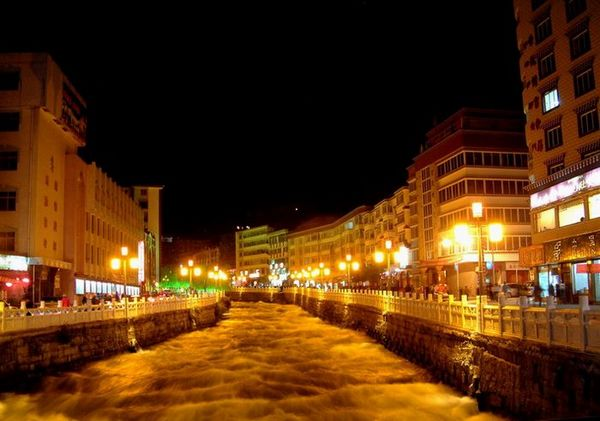
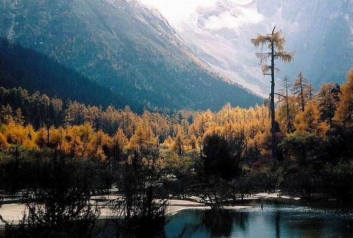

# 春天不会有世界末日

** **

#### 第一节 看不见的城市

在春天的雨夜里，我背负简单的行李走进了康定城，在历经了所有风尘仆仆的往事之后。街头灯火阑珊，远处雪山的气息浸透不再少年的骨骼。这片段像许多年前，我们曾经在一个风和日丽的午后，看见一个少女手执课本在通往学院的路上，广播正好放起那一首哀伤的情歌。但是我不再有如此缱绻的情绪，就像在分开的时候，我嘱托你一定不要忘记那些往事。然而已注定在那一刻，你必然将所有累赘彻底抛却，然后在时间的粉饰中，如同新鲜的生命，光泽动人。

多年以后，我与往事在看不见的城市里重逢。春天雨夜里的甘孜地区在传说中继续迷人。我沏上温热的酒与往事倾杯，四野浓重的山影覆盖了这座峡谷中的城市。我忽然不知如何自处，在这个异乡的风情里独自饮酒，仍旧无法解开混沌的生命，在某一个时刻忽然顿悟，然后忘怀和抛弃过去的自己，获得俗世的快乐与祝福，像你一样结婚生子安稳地停泊，偶尔想抒情和感慨，也无法触及这个甘孜峡谷里看不见的城市。

康定的街上仍然肆意春天的雨，寒意浸入骨头，酒意化为乌有。山脚下的旅馆里，我静静的躺在床上，前尘往事在半梦半醒之间全部涌入脑海，深夜的河水在静谧中暗涌前行，想象着水花击打在石头上无人问津。但我始终无法透彻，无法完整地讲出一个爱情故事，甚至无法叙述这一段冷漠的旅途见闻。与二十六岁的生命别无二致，毫无睡意地写下这些矫情的词句，甚至拿不出真心与之交换。

这里远在国境的西南，此时并不是旅行的好季节，晴天在意料之中洒在窗格子上。街上的阳光如此直接的映入眼睑，温度却并不高。因为爱情而闻名的那座山，此刻春天来得稍晚一些，积雪仍未消融，并没有像情歌里一般著上爱情的颜色，而我悉获的是结局。这个美好还未至的康定，并不是一个适合旅游的季节。跑马山上看不见溜溜的她，寺庙的金黄屋檐在阳光下寂寥，附近的农家饭馆生意略显冷清，但当时我并不知道会写下如此寡淡无趣的旅行笔记。

#### 第二节 出埃及记

第一次离开故乡的时候，并不知道那意味着天长地久。当汽车驶过西陵峡，两岸的重山峻岭藏在浓重的绿色背后，江水碧波。后来逗留一个又一个地方，因为爱情或者因为不爱，但流浪和漂泊仿佛如此不安定到一个安定的人身上。当暮色笼罩在康定地区的时候，我是如此想念故乡的夏天和瓜果。在成长之后的生命里，我已经忘记了故乡漫山遍野的油菜花，直至那些在夏天里坚韧的向日葵。

康定的油菜花还没有盛开，我想我是来的稍早一些，有时候觉得自己好不起来的时候，却不知道故乡的桃花已经开了。这是一个春天，我想春天的康定依然是纯美景致，脚下的木板路会出现无数拥挤的人，雀跃着洒下欢笑。我所留恋的地方，迟迟不肯离去，它是看不见的城市，在我忘不掉的少年的梦里。许多年前一个风和日丽的午后，少女拿着课本，耳中响起那首哀伤的情歌，不知道如何许下山盟海誓的诺言。然后它会如何在一个异乡的夜里，汹涌地响起。

我想如果回到北京后，沉重的雾霭在这个城市里压得喘不过气来，暗黑色的血迹在每一个街道之间流转不息。那是一个不能带情绪的奴才之城，你问我用如何情绪写下那样的句子，我也在想用什么样的情绪写下这短暂的行程。我也知道在后来，遇到过许多地方，独自喝过许多种类的酒，却还是会以矫情的字句叙述人生的痕迹，仿佛多年以来自己从未改变过。不过是几天的时间，没有顿悟足以改变生活的轨迹，而我已记不清旅行的意义，仿佛少年时候的场景记忆，不会再复发。

春天不会有世界末日，虽然等不到康定的春暖花开。我想许多年后，会不会在一个无法自由的时间，再也无法突发奇想地任性跑掉，不必告诉任何人，独自去往一个只存在记忆里，看不见的城市。然后看到这些伪文艺的记叙，想着原本也没必要如此对待自己，那美好的永远仍旧在那里，谁也丢不掉，谁都得不到。即使当时已用尽全部力气，在这样一个陌生的、美好的康定的夜晚。

2012年2月 康定城的小旅馆

前一天北京的暮色下，不知何处传来的康定情歌，

伪文艺的出发，矫情记录的句子，短暂浏览，兴尽而返。

 

（采编：麦静；责编：麦静）

 
