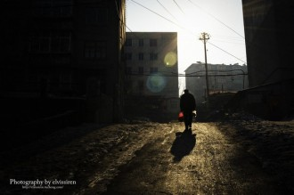
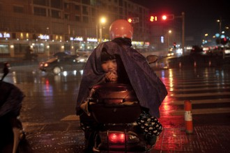
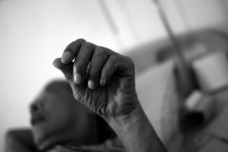

# 春天里的好故事

我的政治学老师是个平和的人，至少在那年春末之前是这样的。

这个离了婚的老男人一贯慈眉善目且喋喋不休，尽管他的课堂像个廉价罐头——空洞而粘腻。这才是政治学应该有的样子，好比有人在空荡荡的电梯里放屁，自己苦笑了之，倘若换成一截乌烟瘴气的车厢，即便有一点点味道，也会招来一片叫骂，就好像大家都怀揣着香囊。这当儿，老师瞅瞅台下星星点点的听众，挥挥手打个哈哈，试着憋出几句俏皮话：“我老婆昨天去买菜时……你们猜怎么着？”

他没有老婆。

课代表放下笔，四下看看，边咳嗽边附和着笑了两声，悄悄把手伸进裤子的后兜，狠命抠了几下，又拿起笔，刷刷记录些什么。

就好像他真的懂一样。

老师在这所偏僻的大学里埋头了二十年，虽然因微薄的薪水跑了老婆，可他的健谈却与日俱增，至少，我断定他是个快乐的人。他每天中午嚼着前一日准备的盒饭，用半个小时打个盹，没课时便反复读着一本磨掉了皮的《改革与新思维》，那是戈尔巴乔夫替敌人写出的东西。偶尔老师也翻看几眼《谈因》，佛教读本。老师信佛，我是不久后知道的。

信佛的人有很多种，一种是和尚与尼姑，出家之人，充耳不闻窗外事，一心唯有乔达摩；一种是慈悲之士，日行一善，斋戒焚香；还有一种，手腕上有念珠，于是信佛。老师是善人，见我与他关系良好，就在课余之时与我谈些政治之外的东西，诸如菩提本无树什么的，或者吃素有益健康之类的，亦或……他的党费从没有拖欠过，并始终坚信这微薄的一小笔支出又为壮丽的事业增砖添瓦。由此我相信他是真正的善人。

老师看了看扉页中戈尔巴乔夫脑袋上的地图，在尚未读完的章节折了个页角，伸了个懒腰，起身去接女儿。说到女儿，老师总会把眼睛眯成一条缝：“她每天边喊爸爸边扑向我，我整个人都酥了……”他满脸陶醉，嘬了口茶。

那真是个活泼的小姑娘。我来到她所在的小学时，她自己趴在桌前画画。我希望看看她画了些什么，她撅起小嘴，急忙把画压在胳膊下面。

“讨厌！”她调皮地翻翻眼皮。阳光透过窗户，我看清了她脸上细密的红晕，像只刚刚被切开的苹果。

老师发了疯，他榨干了自己最后一丝耐心，转而不断向一个账户汇款，而他拨打的那个陌生人留下的电话号码从未有人接听。我知道他爱女心切，当然，他的希望仍旧残存微弱的光亮：把最后一笔钱放在车站大厅最后一个垃圾桶旁，到时候女儿会在那里等他。那是一段用代理服务器发来的神秘网络留言。老师依然去备课，讲课，那几天学生的出勤率出奇的高，每个人的脸上都挂着难看的微笑，告诉他，会好的，会好的。老师的神经质已经承受不住他的平和，课讲了一半，扔了粉笔，蜷缩在讲台上呜呜地哭了起来。会好的，会好的。他喃喃嘀咕着，大家连忙点点头。课代表不慎放了一记响屁，我看到周围一小撮人强忍住尴尬的表情，转瞬间臭味弥漫开来的课堂又恢复了哀恸、焦灼与肃穆。

“老师。”我拍拍他的肩。“记得《谈因》吗？”

“现在说这个又有什么用。”“你当然可以把那笔钱放在车站，可是……”我瞥瞥他的眼角，上面布满蛛丝一样的淤血。“就算这钱到了劫匪手上，他们也未必会释放你的女儿，或许会提出更多要求，为何不报警呢？”我能感觉到他的背在颤抖。“你把钱给他们，日后，他们会对更多孩子下手的……”

“报警？报警，万一他们对茵茵……怎么办？”“这个……终归要试试的……”“你他妈的告诉我，万一，怎么办？你说啊！万一，懂不懂？你说啊！”

他的确疯了。

可怜天下父母心，我摇了摇头。我想起老师上学期讲过的政治斡旋，或许，这就是政治家和政客的差异，政治家捍卫道德，失去诚信是道义所不可容忍的；政客捍卫政治，恪守诚信是要受到惩罚的。

总之，老师还是把钱送到了。他终于恢复了理智，选择了报警。几个便衣警察埋伏在附近的小巷里，对街的楼层里还有一名箭在弦上的狙击手。老师把装钱的袋子放下，转身走开，一个穿着工装迷彩服的男人不久后走近了袋子，踢了两脚，低头瞧瞧，刚要提起，两个便衣从柱子后一跃而起，试图制服那人，不料一人被锤子抡中前胸，另一人拔出手枪，与狙击手同一时间将那男人击毙。

老师女儿的尸体是在自家的垃圾桶里被发现的。清洁工清理垃圾时从中滚出一个被煮过的头颅。大批记者把街口围了个水泄不通，以至于警察都难以挤进去一探究竟。

“你有没有想过这世上有些事是无因的？”那是我最后一次见到老师，他躺在病床上，医生给他注射了安定。“那是你的钱，很遗憾，我并不需要这些。前提是你可以找到的话。”我点燃一根烟，没有抽，放在床前的桌上。“你的女儿很可爱。她哭着找爸爸，我差一点就心软了。”我笑了笑，烟灰落在病床上。

我看到老师的眼睛瞪得很大，他脸上的呼吸机与安定的药力已经不允许他说话了。“至于怎么做到的，我可以慢慢告诉你，不过，现在不行，过会儿还有一堂考试。”烟灰在床单上烧出一个洞。“你当然可以去控告我，只是，这需要证据，况且，我也许是胡说而已。要知道，车站被打死的，是我的同伴，或者……”我看见老师的咽喉一阵剧烈抖动。“一个路过但贪财的工人。”老师的表情很复杂，像是在发笑。他举起一只手，又瞬间跌落下去。

烟熄灭了。

“病房里严禁吸烟！”护士对我大喊。

“呵，我开玩笑的。”

那一年的五月，我成为了整个计算机系唯一取得政治学优等成绩的人，当然，新老师同样不是个严苛的人。这天他告诉全班同学，同区另一所学校为地震灾区捐款的金额已经超过了本校，号召更多同学，更大金额地为处于困境的同胞们现出爱心。

没有人理解我为什么把一沓冥钱混在另一沓钞票里塞进了捐款箱，同样，也包括我自己。

“这代表了愿逝者安息，愿生者坚强。”我说。随即是一片掌声响起，就好像他们真的懂一样。

_ _ _ _

“……至于苏联的解体，那是一场地缘政治的灾难……”

“老师，或许列宁本就不希望这个联盟长存，一切仅仅是一场满足他好奇心与欲望的游戏呢？”

“为什么这么说？”

“没什么，我开玩笑的。”

(采编：孙梦予；责编：孙梦予)
