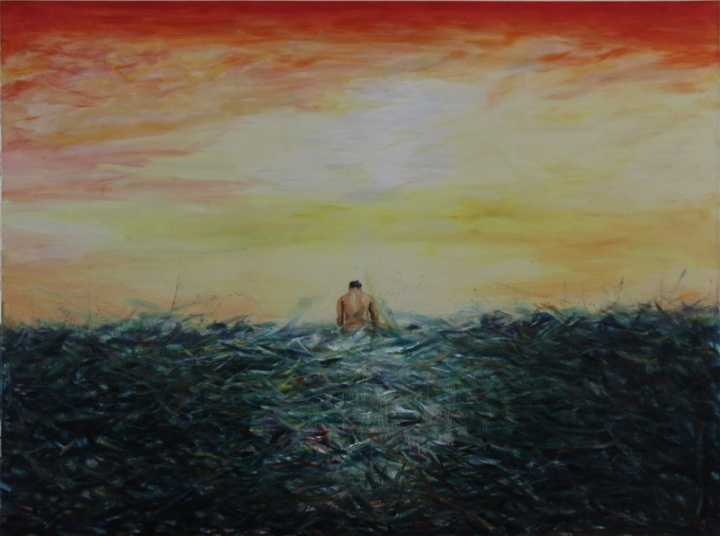
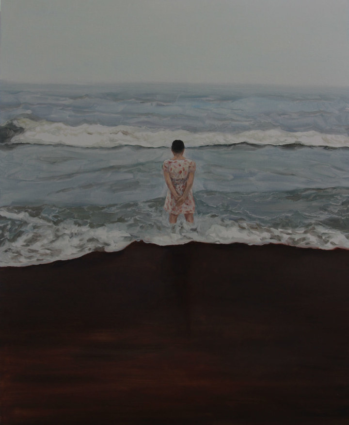

# 昼夜的结果（上）

** **

### 昼

我站在尼古拉斯的湖面凝望着来自地狱的众生嬉笑怒骂

我闻到了一股掺杂了克拉斯气温的迷人香气

这种气味伴着幽幽的刺激传入我宽大的鼻翼

夏日里寂寞的草丛流淌着翠绿色的浓汁

上面一道闪亮的柠檬黄穿越了像列兵般的熟褐灌木丛

我脚下踩着银红色的凤兰汁液

粘稠的凤兰汁液缓慢的流淌与另外一股迷茫相遇最终流向何方

我昂起了尊贵的头颅，招呼交错着的伊拉伯乞丐，施舍夏威夷的风，馈赠贫困的人们。

你的相机里没有孤独，喧闹也远离了你，你把愤怒化作沉默，披下粗糙沉闷的黑发，用一双铺满钴蓝的手，攫取废弃的宝藏。

我透过伊斯坦不湾的灌木窥探你的消息，这时硕大的乳房挂满树梢......

这是昨夜的梦，这样的状态持续了9个夜晚，我的头脑像钢丝球挂满坑脏的饭渣，我真想有人拿起刚刚开封的84消毒液浇灌我闷热的大脑，从昨天算起我已经有一百九十三个小时七十八分钟十一秒没有做爱，时间还在继续无聊，一分一分等于两分，我数着秒针分针，好像捆缚在气球里，闷。

我掀开衣服露出肚皮，坚硬的腹部隆起整齐的肌肉，被两条垂直的凹陷打破，晶莹的汗珠顺着腹部缓慢的流过凹陷处紧接着的加速再次缓慢如此循环，我静静地看着习以为常的腹部，跟随汗珠一起进入交叉弯曲的阴毛里，像装饰的黑线条直达硕大的阴茎。每天我早就习惯这样的生活，这样的自恋，我爱欣赏自己的身体，像古罗马雕塑般的曲线，紧绷的古铜皮肤下面时常凸起粗壮的血管，当我吞咽清甜的唾液时，尖锐突兀的喉结会随着鸡皮疙瘩上下蠕动，我会担心自己低头时触碰到尖锐的喉结，我的头发总是短的，只是因为坚硬，如钢丝般的坚硬，茂盛的粗壮的发丝会扎伤心上人的肩膀。我只会穿宽松的裤子，紧绷的牛仔裤会让我的下体尴尬，无法承载我过分的性器，只好歪歪扭扭的摆着扭着，难受极了......

我想对于我这样的人衣服是多余的，再美的衣饰对于我来说只不过是为了低调罢了。

我的职业俗称“鸭子”，周旋在夜晚的包厢里陪伴孤单的女人一起消耗身体与金钱，今天晚上我结束无聊的休息，蓄势待发，穿上闪亮的皮衣，换上令我尴尬的牛仔裤，重复下楼，发动汽车，堵车，到达夜总会，把钥匙交给服务员，上电梯，与陌生的女人调情，电梯里面的反光映射自己扭曲的脸，那变了形的身体透出许多无奈，我这样的人注定是孤独的，每一次情感投入的越多只会带来加倍的伤害。

推开熟悉的门，同样的喧闹，我们站成一排，任人挑选，在我的对面做着五位女士，最左首的女人披着夏威夷海浪似的长发，长长的脖颈像简约的瓷器，突兀的黑痣长在与脖子垂直的黄金分割线上，闪着亮光的不透气的蓝色连衣裙包裹着膨胀的肉体，她交叠着双腿盘坐着，差一公分就会露出屁股的末端。老辣的眼神乜斜着我们。这是一张二十世纪脸，立体，突兀，扭曲，缺少内涵却充满着欲望的肉脸。紧挨着她的胖子，看似稀松平常，穿着刚从菜市场采购回来的衣服，可是他手指上的鸽子蛋泄露了她的资本，一片可有可无的乳沟，随意地晃动着招摇撞骗，老骗子。中间是个拥有校园气息的姑娘，青春，消瘦的女孩，与其说她消瘦，不如说她像是禁欲的代价，她假惺惺的青春来源于瘦弱吗？冰冷的锁骨冒着寒光，寒光下是瀑布一样的胸膛，直泻千里，连接着突起的肋骨，顶着肚脐。我的正对面是个阳光的老女人，这片阳光显然是来源于全球变暖，她有着一张印度混血的脸庞，实在的美人痣，灵动的大眼，一身波西米亚异国装束，像巫婆，像艺术家，那么肥大的胸脯像什么呢，或许我想多了。我右边的女人平淡无奇，一颗,唯独一颗朱砂痣长在嘴角下，那么冷漠的身子骨，显然是第一次来这样的地方。

我看着眼前这些女人，做出狎昵的笑，目不转睛的射过去热情的火焰，我不喜欢这样的工作服，衣服这样的东西，除了取暖对于我而言只会掩盖自身诱惑，我顺势脱下黑色西装，扔在墙角，紧绷的肌肉眼看就要把胸前的扣子撑垮，我的腹部即使穿着厚实的衬衣也掩盖不的一块块的硬疙瘩，夏威夷女，阳光印度女，和胖子，已经被我这几下弄得神魂颠倒，阳光印度女吹起了口哨，张开放肆的嘴狂笑，我厌恶这样的笑。接下来，她们三个开始哄抢，我逐个职业的向其微笑，没想到这时右边的瘦弱女突然起身迅速的拉起我的手抱着我的后背，我瞬间感到一股海绵的质感加香甜的热度递到我的腹部，她的舌头像敏捷的蛇钻入我潮湿的黑洞打起转来，一气呵成，我第一次碰到这样的女人，如此突兀固执，比她激烈的多的是，可是她却像断了线的风筝，突然焦躁，我被她拉到沙发，另外的四个女人狂笑，音乐响起，越来越大，闪烁的灯光下我还是看到了她忧伤的脸，不过忧伤对于她的脸是轻佻的，更多的是迷离。她一身黑色纱裙，像刚刚参加完葬礼，我们开始拼酒，一杯接一杯，再换烈酒，越来越烈。烈到烧心......

夜晚的我是个遭人唾弃的鸭子，我对面的迷离女没有因为酒精导致昏迷，反而越发清醒，而我的双眼早就开始不听使唤，这份卑贱的职业迫使我机械的微笑，卖醉，痛饮，今晚我算是碰到对手了，我面前的迷离女看起来越发清醒，周围早已是一片昏迷与狼籍，如果关闭声音，点亮屋子，我们像是滑稽的木偶，孤立单薄，自娱自乐？往往现实世界充满幻想，矛盾就是和谐，我身边这些剩了半瓶的酒，之前价格不菲，现在却一文不值，他们贴着商标，两瓶就是我一天的薪水，如今跌跌撞撞瘫倒在桌面上应和着瘫倒着的人，我身为一个鸭子竟然也会暗自思考起了价值，我们与金钱构筑的价值，在短短的时间里坍塌继而重组，如此周而复始的轮回，我真想了断，如同了断时间，我走神了，“今晚我包了你吧。”这七个字把我拉回对面的瘦弱女，看着她炯炯有神布满血丝的水汪汪眼珠子，我鬼使神差的点了点头，干完这杯已经尝不出味的酒，我们跨过瘫在地上的尸体，像一对恋人离开这间黑屋子。

恶俗的大理石，假模假式的西洋四手宫廷式装修，本身就已经热血沸腾的我借着酒劲顺手拿起一块现在已经想不起是何物的物件猛的摔成粉碎，我们像两块弯了腰的麦秆无力的靠在一起，期盼该死的电梯落到该死的十一楼，期间我看着在我面前经过的秃顶男人，大波浪女人，印度女，摩登男女双双经过，他们彼此亲昵得像恋人，不过空洞的眼神泄露了秘密。我转过头看着旁边的迷离女，打着酒嗝，我只能看到她油脂分泌旺盛的发髻线。电梯门总算开了，面前的镜子里我看到了这样一对男女，他们靠在一起，十指相扣，女的头发垂到胸前，一副圣女的神情，该是酒气塞满脑子的缘故，男人上身夸张的礼貌，倾斜着身子，一副没有表情的脸，我与这个头一次见面的女人相互依偎，在旁人的眼里也许像恋人，人与人之间的关系形成之迅速，分离之突然，全因为宿命的交集，如我眼前的二位也许是头一次的会面，伴着酒气，他们十指相扣仿佛贞洁的恋人，电梯里的镜子反射人的各个角度，我窥视到那位圣洁的女子耳后暗隐着一片皱起的皮肤，直直的延伸到衣服遮掩的深处，定是烫伤，孩提时落入开水中的烫伤，我想起自己孩童时的伙伴，大中午院子里用着蜂窝煤煮着面条，他颠颠撞撞地滚入锅中，尖叫，皮肤瞬间通红皱起，一根根的面条垂着身子敷贴在他的身体上，滑落的面汤在光的折射下晶莹剔透，他半仰着头赤红着眼睛朝天尖利哭泣，太阳纹丝不动。再往后，我看到他卧在床上，身上敷着药膏与烫糊了的皮肤纠结成了篝火燃尽后的黑炭的模样，我呆看着那块伤疤，顺着头发，稀疏的发丝乖巧的披向脑后，镜子把头上的发卡颠倒成像，电梯上的暗灯打在未完全退掉的黄色发质上，那个身旁的礼貌男人突然抽搐了一下，脸拧向右侧的肩膀，鼻血顺着鼻孔流到了肩膀，他熟练地用手上的帕巾遮住，随即举起左手，昂着头，我看到他深大的鼻孔，像两颗瘦长的蚕豆，在笔尖的位置猛的一缩，粗大的毛孔含着黑头，那一双严谨的眼皮，长长的眼角拖施至太阳穴，容貌在手术台修正过，手指短粗。我瞬时感到厌恶，觉得这样的长相不该拥有如此粗鲁的手指，地面上点缀几颗烟头......

 

### 夜

我搂着身边这个清醒的瘦弱女孩走出了电梯，望着门外的夜晚，车流，行人，寂寞极了，迈入夜色。我们彼此并不打量对方，牵着手无虑的行走着，心里好像拥有着幸福。道路两旁的树木被绿色的灯光刷成了鬼魅的效果，路上也仿佛飘满了光的云朵，我想起了自己的初恋，那个发育良好的女孩，在农村的学校，一根孤立的国旗，教师们因为农活抛弃了这个原本就寂寞的课堂，我不是那些刻苦读书的学生，我是一个被欲望充斥的男孩，我恋上老师，女孩，小卖店的女老板，一切引发我性欲的异性甚至同性都可以让我兴奋，我服帖地跟踪那些发育良好地姑娘，任何角度总能找到满足自己的窥视。村子里的夜晚，几声犬吠，虫鸣，剩下的就只有无尽的欲望，我时常走在夜间的路上，手里拿着刀子，盼望着一场艳遇，其实我不懂得艳遇的遭遇，艳遇即便来临，我也不知道如何处理这一场艳遇，我拿着刀子，伴着虫鸣，走在黑漆漆的路上，脚边的尘土悄悄地升腾，我拖拉着鞋子，仿佛有了鞋子的陪伴就可以装起胆子，在我锲而不舍的行走的日子里，有那么一天，我遭遇了有生以来头一次的艳遇，这一天如同往日，我拿着那把生了锈的刀子，不过是比平日攥得更紧，尘土依旧漂浮在脚边，也许是因为我拖拉的脚步声终于奏效，这个并没有足够壮起胆子的行为，却招惹了这场艳遇，也许是我许多个夜晚拿着刀子的伟大身影连同性感的脚步声激起了胡同中的隐隐呻吟的姑娘，那个女孩，我们中学发育最好的姑娘，两条粗壮的辫子垂到胸前因为放大的起伏而突兀拱起，夏季，女孩被光所泄露的衣服里，透过那白色的小背心，裹着的乳房奔涌着冲撞那些如我一般的男孩的心脏，两颗坚硬凸起的乳头于光天化日展现，她的眼神可以随时燃起一堆稻草，点燃整座村庄，当然，在我的眼里，她那火辣辣的眼神可以燃烧我所知道的任何地方，她仿佛只有自己被窥视，她甚至乐意或自己绽放自己的性欲，而那些动作与行为完全出自一个女孩欲望的施展，如同果子熟透自然香甜，果子自己散发的香气与本身的颜色足以让一个饥饿的虫子与饥渴的人鼓足勇气将她摘下，是的，这是人自由的施展，是真正的天赋人权，哦，人权怎么会来自天赋呢，人是生灵的一部分，人是自由的交合的产物，人却因为群居，人害怕孤独的本性，所以造成了自由的限制，那些圣人组建的伦理道德，那些至高无上的独裁者编制的法律，那些无所顾忌的替天行道促使一部部法典与历史， 而如今我在历史中定格，前进。我攥着刀子，饥渴极了，欲念零零散散的撒着火星，一根微弱的如同一根甘草似的欲望对象，都可以瞬间点燃我的生命，燃烧我的饥渴，此时，我听到了一声鸟鸣，在我行走了这么多个夜晚，我头一次听到鸟鸣，这一声劣质的鸟鸣像极了猫叫，甚至像是呻吟与召唤，是的，在漆黑的夜晚，我的眼睛仿佛获得了一种奇异的功能——透视，假如有一面镜子，我猜想我的眼睛会像狼的眼睛闪着蓝光，也可能如同坟地里鬼火，绿绿的呼呼飘荡，至今我才知道我孩童时所看到的鬼火与极光没有什么区别，无非一个在小山包样子的坟头，一个是在那个遥远的冰冷的被人渲染成奇幻色彩的极地，而真相是这样，在极地看极光的人与在坟地看鬼火的人会一样的遥远，并且，那些获得意外惊喜的裹着羽绒服的现代都市人并没有我孩童时靠在爷爷的爸爸的坟茔上看鬼火时那般刺激，对于我这个不知道神圣的孩子，我看到鬼火的一瞬比起若干年后的若干年以及我目前与瘦弱女还要往后的日子里看到极光更加绚丽，起码在我的心里，鬼火，磷的把戏比磁场的作用更加有趣。

人所模拟的猫叫与鸟鸣迫使我转过头去，我一眼望向了那个能够点燃我，点燃整堆稻草与城市的女孩，她木讷地直立在胡同的中间，两排房屋之间的甬道之上，她穿着那件透明的白色衬衫，月光配合着我那双至今也极佳的眼睛透过了那一副健康的胴体，一条火红的秋裤像是流淌着鲜血，橙色的脚面像极了焰火，她赤着脚，就这么火辣辣的看着我，我继续攥着刀子，一步步地向着她的方向走去，两颗心此时同时的乱跳，我的脖颈子，脚面子，小腿肚跟着一起跳动，呼吸被一层薄薄的膜盖住了似的， 竟然带着甜丝丝的味道，窜到我的鼻子里，嘴里，唾液都甜腻腻的，在我走到距离她两步远的地方，我看到了她足以排山倒海的胸脯上下激烈翻滚，上下起伏的力量与气势点燃了我的下体，我听到了她那粗粗的喘气声，呼哧呼哧，两根辫子消失了，一头乌黑的头发差点与黑夜混为一体，高亮的额头，从眉间就开始凸起的鼻梁，一张笑盈盈的嘴角，我扔下刀子，一把将她抱住，两个迸发的心瞬间冒着热气敷贴柔软，软绵绵的超越了欲望的沉重，我感到整个人变得轻盈，轻的令我想到童年，欲念相交的时候我想到自己的童年，此刻我把甜丝丝的嘴唇拢在她的嘴上。我遭遇到破天荒的艳遇时我没有做好遭遇她的准备，我不过是拖拉着鞋子握着刀子做好了一个与胆子较量的准备，手顺着她水一般的身子上下摸索，呻吟的声音让我的耳朵空空的鸣叫，我甚至摸索到她的下体，滑溜溜的下体和着麻酥酥的手指一同把我这个饥渴的男孩掀翻，目前我要面临结束艳遇的开始，她笑着握住我的阳具，让我捅死她，而我只知道我刚刚扔下的刀子可以捅死人，身体的阳具捅向何方，我与她都不知道，我们本能的知道欲念要在此处寻找出口，可是我们并不知道欲念如何的善用技巧，在这个连床都没有的户外野合，尝尽了各种办法，我们一无所获，火焰铺陈周身，如今缺乏枯草，她抓起我的手要到她家里尝试，我想起了她那个拿着屠刀的父亲，我获得了理性，我退缩了，她继续央求，最终一盏灯火与一声咳嗽结束了这场艳遇，我捡起刀子，立在墙边，下体流出了类似鼻涕的东西，我认为那是罪孽。

 

### 回忆

此刻是凌晨一点，我与瘦弱的姑娘走在路上，这个在三个半小时之前与我舌吻的姑娘，全无念想地被我牵着，我的回忆与她没有任何关系，她在我回忆时是否也在回忆她的故事，这只有她知道。我猜想，她的回忆应该与我同样的刺激，也许是一种折磨，因为一个与自己相貌反差分裂的人必然经历过一个迥异的童年，那是一个比我所在的农村还要边缘的驻地，在西南的边陲临近缅甸的地方，她说起了她的童年，她用着自己独特的沙哑嗓子告诉我这个苦难的故事，出生在一个机关单位的她，父亲是高级工程师，母亲则是一名转业的文艺兵，父亲的性格倔强，孤僻，喜静，心肠柔软，母亲性感，亮丽，多姿，喜动，善舞，爱疯，唯独一致的就是心肠柔软，这对从小生长在同一个机关的男女，跨越了父母之间的过节，她的母亲挣脱了家里的拒绝，任性的嫁给了这个长她十岁的男人，原因有两点，一是他高且帅，在南方边陲，一米八的个子配上她父亲儒雅的长相，完全可以让这个倾城的女人掏心掏肺掏身，身子柔软丰满，在瘦弱女的身上看不出一点母亲的踪迹，那个貌似贞洁的年代，他的父亲于洞房之夜发现这个丰满靓丽的女人性事驾轻就熟，无疑，对他来说是一份压抑。他洁身自好的脾性在此时转变为孤僻，他昂着高傲的头， 黟黑的脸，目不斜视任何一个炙热的眼神，而他的妻子，更加变本加厉，在市里的歌舞厅寻欢作乐，好在没有在床上怎样，她无非是跳舞，自己的芊芊细腰被另一个男人深深的搂住，那一对饱满的乳房随着舞步的摇摆，不停地撞击着另一个男人的胸膛，她天真的认为，我不跨过性事的位置，我不过是在欢乐，我即便与他深深拥吻，也没有进入他的身体，是的，她就是天真得模糊。终于，孩子，这个瘦弱的女孩，在他父亲深沉坚硬的撞击中奏效，她的母亲长达五个月没有跳舞。孩子如约诞生，一声啼哭是个姑娘，父亲掩面抽烟，爷爷早已死去，父亲盼望着一个男孩，一个延续香火的男孩，而结果是如同他妈妈一样的风骚的闺女，不过结果毕竟不是如此，一个人的性格部分受到环境的塑造，环境将瘦弱的女孩塑造成一个压抑性欲的人，她的母亲在乳汁还未称职的流进孩子嘴里的时候，险些流进了别的男人嘴里，她无休止的外出舞蹈，瘦弱女的父亲终于酗酒且仍旧保持忠贞，他在一次次的酒醉后变换了一张禽兽的嘴脸，操起了手掌，拳头，器具，殴打他一直深爱的妻子，这个爱跳舞的女人饱尝了男人的暴力，一家四口蜗居在一栋老宅子里，奶奶睡在隔壁的小床，在夜晚他的父母做爱的时候，整栋楼都被回音震动。整栋楼只有这四口之家，有一天她的父亲醉酒，殴打完将要外出跳舞的妻子，风雨交加，一声惊雷，停电的房屋配合着做爱的畅快之音让这个家庭飘到了云端，父亲用着性事抚慰受伤的妻子，她的母亲，瘦弱女的奶奶坐于床边，想起了自己的过往，她想起了自己二十郎当岁时的风情，两条粗壮的辫子拖到屁股，她是布依族，自小生在寨子里，那个潮湿的地域，风情至极，她早早的尝尽了性爱的快慰，在她即将结婚的时候她趁着夜色爬上雉堞，翻过高墙，翻山越岭，跑尽体力，三天三夜之后卧于城镇的边缘，被她如今死去的丈夫，国民党的炮兵，叛逃分子，抱回家中，如此成亲，她再也没有饱尝过性爱的快慰，这个炮兵没有完美的履行自己的指责，如今风雨交加的夜里，伴着雷声，她听着自己的儿子用着胜过他父亲百倍的能力补偿了自己的妻子也补偿了她。

瘦弱的女孩渐渐长大，在自己乳房还没有发育的时候，她伴随着搓麻将的声音悄悄地长高，她长时间的与奶奶相依。父亲并不爱她，甚至恨她，母亲整天寻欢。在她记不得的一天，她说那一天回想起来仿佛有人掐住了她的脖子，外面出现了罕见的阳光，她坐在整栋楼的门前，抬头望着天空，如今她的记忆将当时的自己与环境修改成了黑白，天空涌现罕见的彩色，她看到了自己的母亲搂着一个陌生的男人踏进家门，与他的父亲谈离婚协议，从此原本就扭曲的童年离开了自己，而自己又变得敏感而暗藏心机，其实，她是坦然接受离婚的日子，每日的争吵让这个破碎的家庭淹没在搓麻的声音里，她判给了母亲，母亲那天搂着的那个男人是个屠夫，一个穿着不像屠夫的屠夫，屠夫也有一个孩子，男孩，所以她与母亲卷入这个新的家庭以后，再也没有体会到快乐，而且她那敏感的心思致使痛苦无边的袭来，屠夫之所以穿着的不像屠夫是因为他已经垄断了整个城区的屠宰事业，屠夫与瘦弱女的母亲一并住在全市最大的屠宰厂里，瘦弱女从此听到的是猪的惨叫和大清晨一推开门的鲜血，行屍走肉的猪死在自己的地方，瘦弱女每日聆听猪的歌唱，一股股腥腥的气味儿，一幅幅挂在她眼前的尸体，她的母亲每日疲于生计，连跳舞都抛之脑后。貂皮大衣，时兴的大哥大她拥有几个，盘起的头发，烈焰红唇，貂毛顺着脖颈一直铺缀到高耸的胸脯之上，皮裙，赤条条的大腿，这是一个同样可以点燃稻草的女人，首先，她可以点燃屠宰场，那些沾满鲜血的小屠夫，叼着血腥的烟卷，斜眼望着这个诱惑非凡的贵妇，她们恨不得扒开她的衣服，甚至直接强奸了这个风骚的妇人，在这个妇人手拿算盘身着貂皮婀娜的立在屠宰场之时，她那风骚的模样迷倒了一群杀猪如麻的屠夫，屠夫手握着杀猪刀拼尽全力博得无效的眼光，可是世俗，家庭的责任与道义让她的母亲变得沉稳许多，她想尝试过上一个安稳富裕的日子，之前的离婚对于她来说多少是一份遗憾，她的天性与之前的丈夫是相悖的，她并没有一次越过伦理的桎梏，可是自己孤僻的丈夫郁郁寡欢长期酗酒，性爱时口吐酒气让她感到恶心，终于她下定决心离开这个家庭，离开这段开始就没有遭到祝福的婚姻，对于女儿，瘦弱的丫头，一个自出生就没有给她带来一丝美好的产物，不过是需要尽上一份义务罢了，目前她要面临的境遇是给这个新的家庭带来温暖，新的孩子，男孩，带来后母的关爱，她用尽了浑身的爱意，包括她那对丰满的乳房给这个新家温暖，而她唯独忽略的就是自己亲生的姑娘，瘦弱的女孩时常发呆，她唯一期盼的就是母亲的微笑，她谨小慎微的保持自己不犯错误，她唯一能做的就是隐忍，一个年幼的孩子学会隐忍是一种折磨，她把一丝丝小快乐藏到心里，自言自语，她学会了把自己的愿望藏起来，甚至她会获得一些局部的智慧，用一些善巧的方式说出自己的愿望，她在意自己的要求，重视承诺。当她鼓足勇气，瞅准时机在母亲兴奋地时候提出周末一起去公园的邀请后，母亲随口答应，那一天她自己换上了心爱的小蝙蝠衫，坐在门口等待母亲，太阳在她煎熬的等待中消沉下去，她假如知道自戕，也许她那个时候的沮丧足以让她结束自己的生命，而她就是默默地藏在心底，强装微笑，照顾那个顽皮的新弟弟，眼看着新弟弟被自己亲生的母亲宠爱，而那一天她的性感母亲于一个落日的傍晚远远的望到一个身着蝙蝠衫的女孩托着腮如同一个小雕像之时，两行冰冷的泪水顺着脸部落到牛皮鞋子上，滑落到肉色丝袜上。

 

（采编：孙梦予；责编：徐海星）

 
