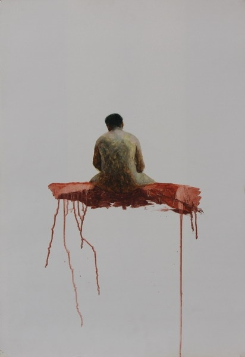
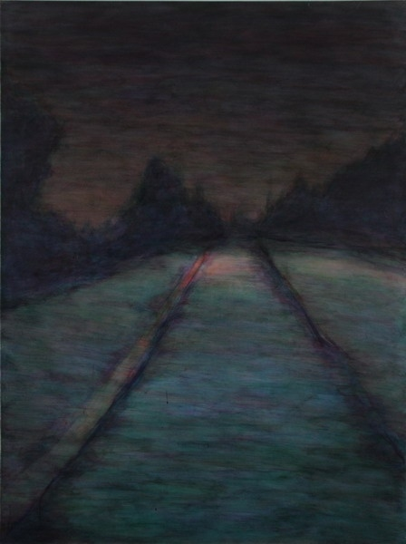

# 昼夜的结果（下）

**他们把相依错当成爱情，他们认为信任就是爱情，那么爱情又会在以后的岁月与忠贞捆缚在一起，爱情与信守，坚持，责任，道义拴在一起，爱情其实早已溜走，剩下的躯壳仍有人去填补，人的执着将爱的躯壳填满，填碎，连躯壳都破碎，爱在实意与虚意上皆亡，爱又悄悄爬上了隔壁的房间，等待下一个人与另一个相遇的时候，上身。**

 

# **昼夜的结果（下）**

## **文/郑皓中（中央美术学院）**

 

**顽强的良善**

我在瘦弱女的钱包里看到一张她母亲年轻时的照片，身着紧身的白色毛呢短衫，发式一丝不苟的盘到脑后，像极了芭蕾舞者，羊皮短裤无法再短，红色的皮靴，红色的嘴唇，突兀的胸脯，笑容下两个小小的酒窝，那个年代的中国边陲，这样的穿着该招惹多少是非，身旁的男人举着酒杯腆着笑脸纷纷向她望去，她的母亲那时就开始饮酒，酒量大且每次必醉，那些搀扶着她的男人终于将手伸向他们梦寐以求的地方。并且在以后的日子，她的母亲跨越了伦理的边际，躺在了多个男人的床上，洒脱的将手握住一个个男人的阳具，狎昵的笑容下藏着无奈与忧伤。

富裕的日子垂危，终于因果奏效，财富被新任丈夫在赌局中渐渐挥霍一空，她的母亲已经在这个城市远近闻名，是非的风吹垮了这个坚强的女人，她收拾好了行囊，舍弃让她遗憾的家乡，背负罪名，踏上了南下的火车。女孩被奶奶收留，回到了那个充斥着搓麻声的房间，父亲的冷漠，家庭的的冷漠，让她原本就敏感的心一次次的变形，她认为整个世界都嫌弃自己，没有一个人是真正爱她的。少年多因为发育才会变得忧虑，而她早早的忧虑早已充斥得无法再满，她勾画出周围人对于她的鄙夷，她极度缺乏安全感，父亲经常将额外的怒气倾泻到无辜的女儿身上，故意延迟送女儿到学校上课的时间，任性的将女儿锁入房中谎称遗忘，女孩仿佛一个无中生有的气体，连吃饭都变得牵强。她感到自己的多余，感到这个破旧的潮湿的屋子无法装下瘦小的自己。姑父与姑妈以及堂哥一家也按时在奶奶家吃饭，和谐的一家人令女孩羡慕不已，她望着堂哥贪婪的吃着父亲夹过去的饭菜，而自己从未品尝父爱，她从羡慕转到嫉妒，一家人的举措只能添加了更多的悲伤。亲情与关怀也许会造就人的同情，而女孩缺乏这些应有的补偿，人的良善与同情不同，同情来自于自我的肯定。自我的安全感得以同情弱者，女孩的良善是从长期的冷酷中所生长出的顽强，她渐渐地学会了面对这些残酷，用良善而不是包容不是同情去持续的活着。

法国人说两个人静默的时候是因为头顶有天使飞过，我们行走在夜色中，忘记了时间，忘记了诉说，各自猜想窥视，大约是因为天使上身，两个因为苦难而生发的男女继续行走，地上的砂砾被脚面摩擦出悦耳的声响，夜晚因为我们的静默而丧失了恐惧的隐患，夜晚的声音全部隐匿在深处，汽车的疾行冲破空气也并未擦出应有的声响，灯光画出的光晕扩散成圆圈、影子、抽象的星点，世间的风景都消失的无影无踪，男人与女人的身体包裹在衣服里，就如同欲望包裹在肉体中，假如拥有假如，男人与女人是否会互换彼此的身份，尝试各自的沉默，沉默抵挡了多语的音声，多语是因为尴尬之迫使，失语才是人生中的难得，男人和女人经历过肉体的渐变，在这个鼎盛的年纪获得了鼎盛的身体，命运并没有让他们遭受到肉体上的苦难，他们保有着无痕迹的肉体，各自具有男性与女性富有的性感，当我伸向她的乳房，我才知道，她原来具有的美丽，她与她的母亲一样拥有性感，我之前被她那副清癯的模子欺骗了。欺骗源自自欺，我双手握着肥大的乳房，感到切实的温暖，她被我的手紧握却没有感到丝毫的安全感，长期以往的流离令她丧失了获得安全感的觉知，安全感来自于自信，自信与自恋又难以区分，女人的经历致使她无法拥有自信，她说当她望着镜子，看到镜中的她，感到无比的难堪，这个镜中的人怎么这样陌生，恐惧的感觉竟然令她不敢放下手中的镜子，她从未像那些自恋的人一样，譬如我，每每经过可以反射自己影像的镜像都会侧目正视，悠然得意。她甚至憎恨自己的来历，她忖思自己不应该来到这个世间，可她从未想到死亡。

**痛苦**

死亡是一记重锤，也许会是一份奖赏，死亡也可能是轻描淡写的一阵微风，也许死亡对于一个人足以是场末日，在我们交媾的时候，我品尝到死亡的味道，那是一种深深的沮丧，我长期的对于性的释放在此时竟然不能挺起，我在进入她身体的一刻，一阵酥麻过后我陷入了空无，在我这幅诱人的身体与阳具背后竟会阳痿，这确实是一个如同死亡的消息，好在我拥有富裕的体力，这个夜晚我们足足折腾了八次，每一次的时间都令我尴尬，最终我用手满足了这个瘦弱的姑娘，她纤细的腰部，隐隐露出的肋骨，托举着不相称的乳房，我想起那个夜晚我扔下刀子，与那个可以点燃稻草的姑娘丧失艳遇的结果，而我的结果就是依靠着墙壁流出了罪孽，此后我靠着药物，酒，获得了坚硬的虚表，麻木着下体，迷惑那些想让我捅死她们的女人，我的下体并没有彻底的丧失真实的力量，在我不使用他的时候，他总在一些我所意想不到的时刻显示分量，弄得我措手不及，继而使我知道自己无比的强大，而当我真正需要他的时候，他却突然地沉默，如同一阵刀子般的寒风刺骨冰冷，那个漆黑的夜晚我抑制这罪孽返回家中，敞开那间开了十多年的房门，家里的人昏昏欲睡，我的父亲不属于家人，现在他已经爬到隔壁女人的床上，或者躺在那个艺术团跳舞的女人身上奋力起舞，他稀疏的头发沾满汗珠，一粒粒晶莹剔透，月光泛着蓝色透过没有玻璃的窗户射在一对兴奋的男女身上，一对像斑马的男女体验着人生鼎沸的时刻，粗粗的喘息冒着白烟，嘴里是一股甜蒜的味道，人与人交媾的最佳就是肉体滑腻柔软，下体坚硬爽滑，两个人忘记了时间与世间，放声喊出欢乐的呻吟。我早已摸清了父亲偷情的地方，这些地方的得知来自母亲，我的母亲是一个眼里揉不得沙子的人，其实这句修辞是有问题的，谁的眼里甘愿揉沙子呢，可是我的母亲一贯的聪慧，她不会放过蛛丝马迹，生活的细节在她的手中被掌控的体无完肤，她把自己全部的体力、能量、智慧、理性运用到生活的管理，唯独忽略了性事的感受，她是一个厌恶性的人，母亲时常向我控诉父亲的罪行，她把所有的冤屈倾诉到我这个少年的身上，我甚至成了母亲的探子，充当监视父亲一举一动的战友，我痛苦的夹在父母的中间，过早地知道了性与苟且的联系，我把性当成了可怕的恶心的对象，我心中暗暗发誓我不再向父亲那样坑脏，可是当我的身体开始发育，当我第一次目击自己的下体肿胀，爬满了弯曲的血管，散发出一股股热烈的骚动时，我用手不自觉的轻轻摆弄，一股股的酥麻，柔软，温情，快乐的感知袭来，最终伴随颤抖释放出的液体，就像释放了我淤积多年的忧愁，所以我开始疯狂的自慰，一次次的用着各种方式释放心里的痛苦，现在想来，那时我的痛苦该有多么的强烈，致使我不停地一天多次的用自慰来排解忧愁，我望着父亲夜晚出走的背影，我知道他将要去释放自己的忧愁，我听着母亲倾泻到我思想中的愁苦，我也只好用自慰，我唯一知道的可以速效解决愁苦的方式来释放。我从厌恶性，厌恶父亲，到自慰后宽容自己，体会父亲的愁苦，因为我知道自己也是一个充满欲望的人，我知道释放欲望的迫切，我在开始监视父亲时同样获得了一种快慰，那是一种获得更多安全感与骄傲的方式，偷窥可以获得一种类似得意的情绪，也许是因果的转迭。有那么一次，我爬到高墙之上，听到了水的声音，一个缝隙冒着白烟并且发出滴滴答答的声响，我爬在缝隙的地界，我猫着身子望见自己的母亲，拿着水舀子泼洒自己赤裸的身子，水顺着她的肌肤缓缓落下，我的心里生出了一种恶心的情绪但是出于窥视的得意，我竟然挪不动腿脚，仿佛有一条绳索将我的身子捆缚在树干上，我这样直愣愣的看着，冒着虚汗，就像我冷眼看待一只羊被屠夫熟练地剥皮，开膛，清理下水，最后我被眩晕的感受弄得慌了神，跌跌撞撞的回到自己的床上，我望着旋转的屋顶，周围的空气好像生出白雾，我什么也看不清，昏昏沉沉入了梦境。梦里是彩色的，自己站在一座废旧的城市里，周围都是钢架结构的锈铁，路的劲头被一座高楼阻挡，高楼贴着浑浊的白瓷砖，一块块整齐划一，抬头望天，黑色透着藏青色的夜空，没有一点暧昧的光，突然，一声荒凉，沙哑，如同电锯割裂木板的刺耳声音划破恐惧，进而让我站立在梦中的点上无法动弹，我忍受着幻境中的恐惧，回音造成了一次次的冲击，我被声音晃得如同稻草，摇摇欲坠，终于我看到背后的鬼影，一个硕大的红色怪物，奔袭着滴着鲜血向我扑来，我奋力地喊叫，挣扎，终于，我被自己的呼喊惊醒，背后尽是湿漉漉的冷汗。

**幻灭**

路的中间横卧一颗孤立的岩石，如同一把擎天的刻刀削下来的巉岩，上面站着新鲜的杂草，草顽强的生命直到现在也根根挺立。我与瘦弱女牵起了手，脑海里闪烁着酒精的作用，头部比以往在感知上大且重了许多，鼻腔里塞满浑浊的气味，浑浊本身就是一种气味儿，就像干净也是一种味道。血液比以往更加粘稠，流动的很慢，所以我们彼此的动作也放慢了许多。耳朵荡起了声波，嗡嗡的就像远处拖拉机向着朝阳前进的声音，然后，微微的刺痛搅动着耳膜，自上而下天尽头洒下了由我们幻觉所造成的锐音，类似金属撞击的音效，我们抬起来头，上天没有像故事中的样子，下起白色的雪，假如有雪花作伴，或者我们可以跳舞，这个瘦弱的姑娘生于西南边陲也许没有见过白白的扑朔的雪花，雪花捧在手里晶莹剔透，由之前的洁白渐渐透明，然后透明才能显示出他的骨骼，一根根搭建而成的造型，无规律却又符合人对于构造的假想，所以，美就如此产生。美其实是一种骗术，是一种哄骗人愚痴的招数，当美不在为了取悦于人，人就无法看到了美的样子，人的脑子无法认知不取悦自己的形象，所以，人是苟且的，人的伟大都是自我所认知的磅礴，人一层层编织出越来越厚的高明，结果，当稍有不在其磅礴范畴中的印象，不奏效的，就不是合理的，不合理的就会遭到唾弃，谋杀，丢弃，而又因为没有绝对，就会有一小部分人类坚韧的捡起那些被磅礴所唾弃的印象，他们又偏执的爱上了不取悦，而这样的选择又再一次形成价值，形成观念，观念一旦产生，实则是自掘坟墓，我们就在这个泥塘中越来越脏，最终我们认为脏就是干净，或没有干净，干净是一种变态，如此的一场雪，让两个彼此舌吻的男女产生了爱情的幻觉，他们把相依错当成爱情，他们认为信任就是爱情，那么爱情又会在以后的岁月与忠贞捆缚在一起，爱情与信守，坚持，责任，道义拴在一起，爱情其实早已溜走，剩下的躯壳仍有人去填补，人的执着将爱的躯壳填满，填碎，连躯壳都破碎，爱在实意与虚意上皆亡，爱又悄悄爬上了隔壁的房间，等待下一个人与另一个相遇的时候，上身。是的，上身，爱假如潜入脑海，爱就不会形成躯壳，爱就会成为一个人的实意，扩散为良善，爱不是同情，爱是一把尖锐的刀锋，刺向别人的同时也划破自己的躯壳，真实显露，真实又不重要，我们把生活磨破，把苦难坐穿，仅仅换来了坦然，这就是天地不仁。

**童年**

我看着瘦弱女的眼睛，鸭蛋青眼白，褐色眼睛，神情中自有尊严，我望穿了她的童年，也映出了我的童年，我们的童年，人的童年都是忘乎所以的，童年的时光是一段隔绝爱情的时光，爱情来了童年走了。童年中我唯一能记起的就是泥土的气味，我躺在襁褓中，看着大人们高明的神态，他们的眼神中透露凶狠，我从他们的瞳孔里看到自己，一个闪着黑眼珠的孩子，我看到房梁上赤裸的木头，我听到一阵阵的咳嗽，时光甚至把记忆改变成一口水缸，水缸里的水面倒映着一个留着童花头的老妪，又倒映出一个怀抱着孩子满脸愁苦的女人，或许是一个沉默的男人一声叹息。时光将我的童年幻化成一个黑黑的影子，我游荡在一个又一个房间，早晨，光透过窗帘印在水泥地面上点点斑斑，一张被油漆刷过的白色大床，被子由下面的人经过一夜蹂躏成了生活，被子下面传出呻吟，一高一低的呻吟平稳吟唱，呻吟置换成高低不一的讴歌，呻吟混作尖叫，床也跟着撞击墙壁发出声响，那个孩子蜷缩在墙壁的角落，用被子堵住耳朵，而每日的声响和清晨的阳光一样顽固苍凉。空气在光的照射下生出模样，微笑的灰尘像是生活在一个圣洁的地方，随着光的效应，绰约有姿的缓缓飘荡，微尘在空中旋转、流动、起伏，有如同古琴般的节奏，人的节奏打乱了微尘的节奏，人起床开始了一天的奔忙，人的奔忙不仅仅是行走，造业，人睁开眼睛，即便是发呆也开始了一天的劳顿，童年是没有角色的，而自从人有了角色，有了分别，童年走了。人开始为了一个角色行使自己的劳顿、萎顿、暴躁、苍老。窗台的下面，有一条热闹的短街，一个小卖店里，两个大缸，装着酱油和醋，一声催促，我就抱着两个或一个瓶子悠闲或疾奔到窗台的斜下方，距离大约三十米的地方，那个小卖部里有两只狼狗，大的与豹子差不多，我的印象中老虎也就这样大了吧，狼狗的功效是增添得意与安全感，而宠物的功效是给人一个合理的自言自语的方便，我每天穿梭在那一条短街，这样有些言过其实，我会被反锁在家中独自绘画，那是我的童年，那时的岁月我用绘画的行为解决孤独，而不是用着自慰，童年解决孤独的手段中没有性，若童年解决孤独中有了性，童年走了。我拿出一张白纸，一支笔，就可以忘掉一切，电视在他没有出现之前，绘画可以更直率的忘记忧愁，绘画可以任意的被自己感动，而电视是自己甘愿被感动，被忘我。那一条生龙活虎，热闹喧天的短街，尘土都沾染上世俗的味道，人的造型迥异，在我的眼里，大人们像猛禽一样的蛮横，偶尔闪过一个暴露的女人，当我露出贪婪的眼光时，我的童年走远，而当我望向那条小的不能再小的溪水，童年又返回原地。争吵是可以击破童年的，童年面对咆哮与争吵，恐惧到来，我所面临的争吵与日俱增，父母之间的狰狞，时常令我慌不择路，我呆立在远处，那时总会有人问我，是爸爸好还是妈妈好，此时我会狡黠的回答，都好，当我掩饰自己的真实时，我知道，童年走了。风吹动着那条短街，一股股的油烟顺着鼻腔吸入肺中，烧烤的香气弥漫成氤氲，一只可怖的鸡患着重疾跳着走过，柳树上拉着长丝倒悬在空中的吊死鬼，被我用手熟练地剥开，拿出这个黑色的肉虫，他们无辜的身子瘫软于我的手里，我愿意接近这些不具有攻击性的生灵，我可以在他们那里获得安全。我疯狂地截取这些自己可以轻易得到的生灵，我的贪婪与日俱增，我横扫一条条街，扑捉无辜的虫子，这不是童年，当人开始贪婪，童年踏上行程。童年惧怕黑暗，在黑暗中，无依无靠时，童年紧跟着恐惧，可当我开始对抗恐惧，忍受恐惧时，童年不在。漆黑的房间，燃起一根蜡烛，母亲安坐在身旁，低声抽泣，孩子茫然的看着母亲的举动，心里比黑暗还要黑暗，孩子看到了一扇门扉，光线透过缝隙射出，这是一个孩子应对伤痛的幻想，他倾听着母亲对于父亲的控诉，他感到自己无助的立在风里，外面下起了磅礴大雨，雨水在他的周围形成帷帐，雨水唯独没有淋到自己，而自己却不能行动，雨大的仿佛永远都不能停止，母亲诅咒父亲的声音渐渐平息，转而面露喜色，而孩子却仍旧立在风雨里，站得累了，跪在地上，他开始厌恶起自己的童年，他把童年当成了此刻，其实他短暂的童年早就走远，远的即便登上家中的房顶也望不到了。来自于父亲的嘲讽悬挂在房梁上，稍有不慎，掷地有声，也许在某个措手不及的时刻，一句挖苦可以断送许久的快乐，孩子在面对极度的不堪之时，只有压低头颅，低到胸前，或涨红着脸，强扭出一种怪异的笑容，其实在笑容的之上，那双黑漆漆的眼睛早已布满了齁咸的泪水，压挤在喉咙处，把哽咽的力气用在撕拽自己衣角上，逃避，一次次的远离家庭的气氛，一个人坐在隐蔽的位置，静静的自言自语比一切人都安全许多，我知道有人的地方就充斥着多端的变异，刚刚看似美好的氛围会急转为暴虐，刚刚的静默也会变成挑衅与挖苦，所以不如自己把背影留给家庭，反正童年已经走远，我学会了猜疑，嫉妒，节日的时刻，一家人模拟节日的氛围，用行为和语言仿照快乐的模样，可是，正是因为难得的团聚，母亲会开始控诉，父亲或许早就想甩开这个原本就是羁绊的节日，远离家庭，所以节日也会被迫停止欢乐，饭菜的可口因为胃经的闭合导致嚼起来无味坚硬，吞咽着充满暴力和哭诉的饭菜，我想起了一头嚼着干草夜晚反刍的老牛，我的神情也像老牛一样目中无人，无苦难的印记，因为苦难已经被我吃进肚子里，苦难变成了营养，被我的心灵吸收。我想起那天仍然停电，几颗生日的蜡烛派上用场，烛火可以造就温馨亦可成就悲惨，当晚的烛火成就了两项功能，悲惨在后，悲惨令我的鼻子泛着酸味，哽咽的喉咙被饭菜呛得难以忍受，我的耳畔是自己撕裂的哭声，我记得自己的嘴唇被哭声，极端的无助与压抑许久的痛苦扯成了一条红肠，我仰着头尝试眼泪顺着太阳穴流向后脑勺，我第一次感受到一种周身弥漫的无助与荒凉，那是我第一次感到慌乱，在我还是孩童的时候，我学会了宣泄，攥紧拳头击打墙壁，荒凉被我的拳头换来实在的疼痛，终于我意识到自己的表演，我感到自己是在刻意沉浸于悲伤，我开始学会冷漠的观察这个家庭，我出离于家庭的沼泽，我置身事外，当我再一次听到母亲诅咒，控诉父亲的时候，我没有站在雨中的景象，而是一个人走进了金黄色的麦田，看着远处的乌鸦，听着她的鸣叫，我昏昏欲睡，我学会了忘记，而往后的经历告诉我其实我错了。

**孤独**

童年匆匆疾行，我把无助的苦痛磨砺成了仇恨，一股乖张的戾气伴随着我的忧愁，思绪里如一团紧紧拧住的乱麻，车轮行走在貌似平坦的路上，一圈圈的轮回于情愫的边角，一个微微的触碰，就可以让我狂喜或愤怒，这样的反差让我渐渐熟悉，过后的日子我也渐渐适应了自己无端的执拗，早上我蒙在被子里，措手不及的阳光，对于我而言当我思维被紧拧时，全身毛孔紧闭，人的身心如泡在胶水中，这时所有的变化都是措手不及，我可以因为这一点点的措手不及突然看到了灭亡，我看到了一团火焰吞没了自己，我自己烧灼在火里，全身的火令我暴虐起来，我荒唐的想让周围的一切都一起灭亡，每每如此，当我微微屏住呼吸，总会有一点点自然地温情，令我消沉，转而面向了一片荒芜，那是一种连灭亡都无法对抗的感知，因为强大的灭亡走过我的面前也被我的荒芜所吞没，我坐在一处，任何的外力也无法将我觉醒，我的身心被刚才的火焰烧成了一团死灰，呼啸而来的狂风也不能吹起这一团死灰，因为，死灰已经粘附在我的头脑之中，我拥有一套熟练地方法应对着自然与人群，我望向了哪里，哪里都可以变得沉默，在我的心里，终究是一滩沼泽，欢喜与愤怒都会陷入泥潭中，我又无法想到过去，过去也都是难堪，再往未来想想，未来也是一片片的踌躇与迷茫，在我年少的时光中，我通过毁灭来让自己忘记荒芜，我任意的破坏自己可以破坏的生灵，那时，我会微微吞咽下舌底甜丝丝的唾液，让时间迅速的快进，我可以一个人面对墙壁长达几个小时，嘴里挤压着空气，把腮鼓起来，左右借用力暗自拿捏成节奏，我沉浸在自己的节奏里，我轻轻的撩拨手指，手指在我的幻想中变成了一个士兵或侠客，我模拟着影像中的声响，幻想着自己与这个骄傲的侠客一样孤独且所向披靡，我的身体可以任意的变换成山峰河流，峡谷巉岩，山涧瀑布，我沉浸在自己的世界中消磨时光，在这个自我构筑的年少光景里暗暗地消磨，我面对着一片水泥墙壁，出神的盯着一片片水渍或岁月形成的印痕，我可以看到自然形成的图像，一只雄鹰，一个怪物，两个衔着烟斗的长者，或者是一副田园的风光，我望向地面，那些忙碌的蚂蚁一只只的搬运事物，我想象着自己在其中，我模拟着蚂蚁的声响，指挥这千军万马如何直捣黄龙。我也可以任意的行走，路过一处栏杆，一段距离的地砖，我换算着他们的数目，在我头脑中固定的数目之间停止，再继续前行，倒退，往返。一片落叶足以让我观察良久，一阵风的掠过可以让我幸福片刻，我的伙伴不拘泥于人类，我的伙伴就是自然，寂静的自然让我获得良善与安全，我在一颗大树下与其交流，询问大树的喜乐，我与大树倾诉，告诉他我的所有心事，地砖下面的虫子也不断地令我惊奇与神往，他们精彩的生活栖息地，令我羡慕已久，假如这个世界就这样停止前行的动力，假如我永远的锁定在那段时光中，我会永远的独处，我也不会面对以后身体给我带来的困惑与能量，我也不用卷入无边的忧愁。如今，这个夜晚，我与瘦弱女路过一处水潭，月亮的倒影与月亮本身呼应，湖水在月光的映射下幻变成了群青的色彩，孤寂的黄色被光亮的白色覆盖，月亮自己的消亡是宿命的消亡。我们望向月亮，湖水望向我们，我想起孩童时，时常玩耍的花坛，一个用花岗岩砌成的圆形花坛，直径大约六米，花坛的中间并没有花，只有几颗高大的松树，花坛与松树之间被圆形的死水隔断，深有一米多的湖水即可让我消亡，我时常冒着风险来回跨越这道死水，也许我想用这样的行为撩拨死寂的心，我试着忘掉那些童年消失的忧愁，我变换的方式越来越危险，终于我的潜意识到达目的，我被自己绊倒，坠落池中，我终于陷落在自己期望的绿水里。我张开眼睛，看到了自己，一个黑漆漆的眼珠被团团的绿色水草虚掩，微小的气泡一颗颗的粘附在水草的周围，水草的边缘泛着像鬼火或极光一样的黄绿色，一双红彤彤的小手更加鲜明，我在水里呛了几口水，那滋味就像是节日点起烛光的时候，家庭的破裂时我哽咽的味道，我继续沉入水底，连续的呛水让我的耳朵听到了打雷的声响，我感到恐惧，我看到了死亡，那是一道光亮的门扉，周围闪烁着炫目的光，这时在我即将打开这扇光亮的门扉的瞬间，我被一股气力升腾，我浑身的苦痛变成了一种本能，我这样活了下来，至今，与这个月光之下，湖水之上，我的身子与瘦弱女一起浸入湖中，我感到如同二十多年前一样的冰冷，我不知道当时我是如何的浮在水面，如何的跌跌撞撞活到现在，我的眼前，就是月之倒影，而自己所幻想的瘦弱女早已消亡，是的，我孤独的行走在夜里，抵达了宿命的终点，我与二十多年前的死水交集，湖水将我吞没，月亮与其倒影皆在我头之顶端，我抬起头，望着月光终结的方向，太阳，白昼将在我消亡时升起，一个被孤寂吞并的人，是经不起光照的，可是，我看到了那一扇透着光的门扉，并且，这一次，我终于打开门，看到光。

簸锜唢呐河里的光

男孩与人的忧伤

千万条池中鱼啄食尸体

万千张网捕猎自我的神往

是一片现实将我毁灭

是的

是的

是的

我的心里拥有恨

我面对恨

面对爱

面对死亡

我看到光

这是一篇呕吐出来的小说，这篇小说尝试着叙述本身的悲剧，这篇小说冲破了语言的羁绊，又自设陷阱，这又是一篇将比喻与拟人两种修辞方式淹没的小说，我尝试着在语无伦次中抵达真实，这样的举措类似神话故事，比如夸父追日，愚公移山，而且这篇小说是对阅读者的一次考验，不仅仅是大量的叙述本身会造成快感的窒息，而且叙述的内容也是黑暗的，是谈虚的，是书写糟粕的，这里面没有醍醐，没有牛奶和面包，可是这是真实的一部分，并且重要，有力。

假如你能够读完，并且感到了世间的苍凉中微露的光芒，这是来自于你的造化，假如对于你来说这部小说是一次恶心的眩晕，那么这也将说明黑暗的角落里的光点永远都是令人胆寒且拥有尊严的。

 原文地址：[http://blog.renren.com/blog/255191867/879181755?bfrom=011300082](http://blog.renren.com/blog/255191867/879181755?bfrom=011300082)  

（采编：孙梦予；责编：徐海星）

 
