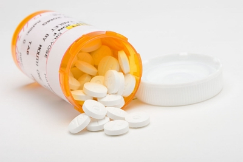
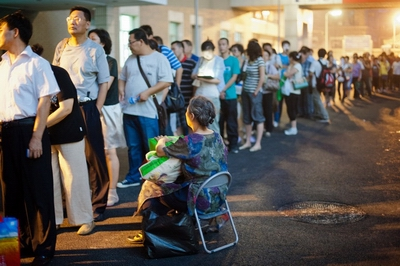

# 普通人的病与痛

普通人的病与痛，很可能就是普通人一生命运的晴雨表。

在任何一个社会里，就抵御病痛而言，上层和底层是不一样的。或者更极端的说法是，对所有人来说，病是相同的，但病所带来的痛苦却是不同的。但对于经济状况基本一致的阶层来说，病痛引起的也是基本一致的悲伤和难过。在普通人那儿，生病不仅意味着病人遭受的身体和精神上的折磨，还常常意味着一个家庭陷入困境。家人的内心一样要面临考验：也许病可以医治，但却负担不起高额的医疗费用，而只能眼睁睁看着亲人离世。对有权

或有钱者来说，痛苦只在病本身，区别只在治好或者治不好，他们不会陷入金钱这种世俗的无奈和绝望里。所以，很多相同的病症导致了不同的结果，穷人是因为无钱医治而死，但富人总是因为医治无效而亡。

就在我为这篇文章做草稿的时候，师大的学弟学妹们在微博上为自己的同学发起了捐助行动，一个师妹不幸罹患白血病——这不是那些狗血电视剧的情节，是真的遭受病痛，她是个公费师范生。了解这个事情的人都清楚的很，很少有家庭情况较好的孩子选择读公费师范生，这个看似在帮助贫困学生的政策，其实是一种变相的青春绑架，而被绑架的总是最弱者。这种政策资助贫困学生读师范专业，但是提前要签协议，就是你毕业后必须回到落后地区从事中学教育十年，一旦违约，则必须偿还所有的学费等费用。表面上看，签署协议，毁约赔款，似乎是一件很公平的事，但事实上大部分选择签约的学生都是被逼无奈。可以想见，毕业后到落后地区去教书，十年之后，这个年轻人很难再有改变命运的雄心和勇气了。这与教书这件事本身无关，与是否为自愿选择有关，被迫的奉献，是一种可耻的非正义。就是这样一个普普通通学生，患上了白血病，家里不可能承担高额的治疗费和手术费，她的同学和老师，发起了救助行动。这就是普通人的病，不是绝症，但常常会把人们拉向绝望。因而，我要写普通人的病与痛。我无力也不敢过多揣测其他人面临病痛时的内心，只是从我自己、我的亲戚朋友们所遭遇过的病痛，来说说这件事。可笑的是，无论我这篇文章写得多么好或多么坏，对于所有的病痛都毫无助益，但它至少帮助我认清自身，帮助我理解日常生活里的这些不可避免的痛苦，也许，别人也能从中看到相同的情感。

1 

虽然父母告诉我，我在8个月大的时候就做了一次大手术，但幼小时的病我一点也不记得了。我对病痛最早的感触来自于祖母。四五岁的时候，我基本都住在祖母家里，有时候祖父去山上干活，十天半个月不回来，就只有我和祖母睡在家里。 有一天早晨，我起来后，平日早起的祖母还在睡着，我直接回自己家吃饭。饭桌上，有人急匆匆来找父亲。父亲跟着他走了。吃过饭后，我回到祖母家，却看见村头的赤脚医生正在给祖母输液，父亲、三叔、四叔都在屋里，父亲看着我，瞪着眼睛骂：你咋回事，睡死了？你奶奶偷着吃药你都不知道？我惊恐地看着父亲，还没弄清状况。后来我才知道，在夜里，祖母偷偷吃了十几粒索密痛，她不想活了，要离开这世界。我已记不清那时候祖母究竟有多少病痛，只记得她的哮喘厉害，每喘一口气，都很费劲，好像要从一个破旧的风箱里拉出风来一样。祖母整夜整夜因为呼吸不畅而睡不着，还有头疼的毛病，要常年吃索密痛来止疼。也许在那天晚上，她再也忍受不了这种折磨，吞了一大把药片。那时，我还不理解一个人何以会不再留恋活着，我也不明白究竟什么样的痛苦能让她想去死，等我理解这些时，祖母已经去世许多年了。等我自己经历了一些病痛，更看过了更多的遭受痛苦的人之后，我终于可以想见，一个年迈的老太太，经受一生辛苦和疾病的折磨，看着她熟睡的孙子，把药片吞咽下去的心情。那需要多大的决心和毅力啊。只能是，活着那点微弱如煤油灯的欢愉，已完全不能照亮照暖她内心的黑夜了。她觉得死是一种结束，一个新的，没有痛苦的世界的开始。

祖母被救活，又活了好几年，她没在自杀过，我想，祖母生命里的最后时光，应该都是为了儿女在活着，她不想因为自杀而让儿女们陷进一辈子的自责，而选择了一个人承担生的重累。

我第一次感到自身的病痛，是在读小学时。一个雨天，我在骑自行车上学的路上摔断了胳膊。村人把我送到在村东的医生那里。医生给我端正脱臼的手肘，把一个看热闹的村里的妇女吓晕了过去。我现在仍记得彻骨的疼，但并没有太多痛苦。当时反而有一种奇怪的兴奋感，因为我一下子与众不同起来。父母不再批评我，所有人见了都表现出关心和同情，甚至我包着绷带的手臂，在班级里都成为一种权威。老师不再提问我问题，没交作业也不会被骂，小伙伴们一下课总是围住我，问这问那。断掉的胳膊成了我的资本，我可厚着脸皮玩耍，跟父母要钱买几块糖吃。世界因为我的断臂，变得前所未有的温柔了。后来我知道，大部分病人都会有一种“骄纵”，疾病成了他们的挡箭牌。我们常常听人说：别和他一般见识，他有病，或者你对一个病人那么苛刻干嘛？问题是：疾病在多大程度上能成为一个人超越常规的通行证？

病也不总是通行证，还会是某种禁令。

05年，本科毕业前一周，突然得了水痘，半夜宿舍的兄弟带我去北医三院，回来后一早就被隔离在了校医院里。因为水痘具有传染性。我的水痘，就传染自公共浴池。我被彻底地隔离在了二楼的一间病房里，除了医生和护士，几乎不能见任何人。身体长满了奇痒难忍的痘，脸上也是，我每天的主要工作就是一次又一次地给自己涂药，然后看着镜子里面目全非的自己，陷进一种前所未有的烦躁和恐惧里。那时候，医院外正是同学们的毕业季，收拾东西，办手续，远行的远行，出国的出国，执手相看泪眼，火车站送别……我只能每天站在后窗边，看着楼下的学生来来往往。病好得太慢了，我的耐心几近崩溃，有一天在和一个护士聊天时，她说，校医院里有效果更好的药，大概一周左右就能出院，而我现在每天涂的中药，最少要半个月。我问她为什么医生不给我开好一点的药。她说，你这马上就毕业了，能享受公费医疗就不错了，还想用进口药？因为我是个穷学生，不配用这个药。半个月左右，我拎着东西走出医院，在迎接阳光的一刹那，我甚至有了退归去的念头，我发现只不过十几天的囚徒生活，我就对外面的世界有些陌生了。从校医院到宿舍的路布满了奇怪的感觉，等我走进西北楼432，发现里面一片狼藉，到处是丢弃的书本和纸，有几个兄弟已经彻底搬离了宿舍，留下的也打好了包，即将搬走。我就这样错失了唯一的一个本科毕业季。

2 

病痛总是在摧毁你已经习惯的一些信念，然后用它的力量，把你的人生转弯，让你不得不去建立新的信念。

有一年，舅舅给我打电话，劈头就说：你姥姥住院了，你回来看看吧？我连忙问姥姥怎么了？大舅说是脑溢血，已经做了开颅手术，但还没过危险期。当时学校里课紧，请不出假来，我说我想办法，看能不能尽快回去一下吧。三天后，我打电话过去，问姥姥怎么样了。母亲说，已经度过了危险，没有大碍了，我说那我先不回去了，寒假回去再去看她吧。那时候，不敢轻易回家，固然是因为请不出假来，还是因为书读得太穷，我连来回的路费也不齐全，要回去一次，只能向同学借钱。 姥姥保住了命，但半边身体行动不便了，左手常年蜷在前面，左腿也不听使唤。春节回去，姥姥看着我和弟弟，哭起来：姥姥完了呀，成废人了，完了。我们只能说：姥姥，别哭了，这不是正在恢复嘛，恢复得挺好的。姥姥用她那只还能动的手抓着我的胳膊：你在北京听没听说过啥好药，我一吃了就能好，就能走道的？我看着她深陷的眼窝，心里难过，可不知该怎么回答，我当然知道世上并没有这种药，但就这么告诉她吗？让她知道真相，然后绝望颓然地坐在土炕上哭泣？我说：姥姥，也没准外国人发明这药了，我回北京打听打听，你现在好好吃现在的药。姥姥眼睛里闪出一点光亮：真没准有，外国人啥都能造出来。

回到北京，我找不到这种药，有一段时间甚至不敢打电话给她。大概姥姥内心虽然期望，但也知道真相，也并没有让人来打电话追问我这件事。我曾想象过，一个人接受自己不能正常行走和生活需要经历的内心痛苦。但再切身的想象，也和身在其中的人不一样。母亲和我讲过，从医院回到家里那段时间，姥姥常常摔在地上，因为她下地时仍以为自己手脚利索，可以自由行动，她以为她的腿已经迈出去了，而实际上并没有。然后，在一次又一次的摔倒之后，摔倒的疼痛和屈辱终于压倒了那个完好的自我意识，深深地埋藏在了她的脑海里，她渐渐习惯了半身不遂的身体，也开始使用拐杖的辅助。

家里人为此难过，但人人心里都会暗暗想，姥姥已经六十几岁了，是老人了，幸好她已经是老人了，在经历过中年守寡，独立给三个儿子娶上媳妇的苦难日子之后，遭遇病痛，内心还是有着岁月磨砺过的坚强，只要她心里头对病屈服了，日子还是能过下去的。我知道，这坚强是用流血流汗流泪所凝固的老茧武装起来的，它可以帮助姥姥抵抗现在的苦痛，可这坚强本身，又是何等让人心里难过啊。无论如何，和所有遭受长久病痛的人一样，她渐渐接受了自己的情况，至少在外人看来是这样的。 第二年春节，我再去看望她，姥姥已经不再问我灵丹妙药了，她会跟我说我拎去的牛奶、罐头哪个更好吃，问我女朋友怎么样。她穿着棉衣棉裤，坐在炕中央，因为左边身体不能动，她在炕上半趴着，总是挨着炕那面的衣服更脏一些。姥姥的眼角有些眼屎，我想给她擦去。她说不用了，一会还得睡，睡睡醒醒的，擦它干啥。

我注意到，挨近顶棚的墙上，贴着一个用写对联的红纸做成的十字架，透明胶带歪歪扭扭，有一些已经被不远处的炉筒熏得发黄了。我问姥姥这是什么。姥姥说：这是主。我忽然想起来这之前，舅妈似乎和我提过，姥姥现在信教了，神神叨叨，谁说也不听。她信教了。姥姥下地出去方便时，嘴里念念有词，我细细地辨认，听出她在说：主啊，保佑孩子吧，保佑孩子能和以前一样走道吧。她自认是主的孩子，主会庇佑她。我没有再问姥姥，没有像别人那样劝她不信，我心里涌动着复杂的难过。我能想象出，村里头来串门的老太太，和她宣讲了所谓的基督的教义和神迹，拉拢她信教。她们肯定和她说：心诚则灵，主会救你。而且她们会告诉姥姥，远方的某某村子，有一个人和她情况一样，信了主，然后腿就好了。姥姥在平静的绝望中看到了一缕光，仿佛是专为照耀她才出现的，她抓住了这虚妄的稻草，虔诚地相信并祈求神迹发生在自己身上。我看得到，她在念着“主啊，帮帮你的孩子吧”时，是如此的全心投入和旁若无人，她真的相信有一个全能的神在看着她，在考验她。我欣喜于她找到这希望，可我又知道这个主帮不了她。我只能安慰自己：没关系，也许时间长了就好了，她就不信了，也就不再承受失望了。

去年春节，我们去给她拜年，姥姥搬回了自己的小屋，那个雇来照顾了她多年的老太太还在照顾她。姥姥坐在炕上，神态平静安详，话也多起来，衣服的左大襟上缝着个口袋，她不时把能动的右手伸进去，掏出几颗瓜子，丢在嘴里。挺好，我现在挺好，姥姥说，你们都不用惦记，我现在能吃能喝，没事就磕磕瓜子，看看电视。我们聊起了弟弟即将出生的双胞胎儿女，聊起她的孙子，我的表弟。姥姥不再因为谈起什么事而莫名地哭泣，她享受着一个单纯的老人的生活。这一次，我看到脑溢血和后遗症在她身上划开的流血的伤口，终于结上了不再怕碰的疤痕，她平心静气地安坐在自己的土炕上，坦然接受着一切。不再祈求灵药和神明，只是半麻木半安然地把一切都当作无可逃避的命运，并且最大限度地当成生活过下去。活一天算一天，活一天就自在一天，她说。在多年的病痛折磨之后，姥姥终于在那个原来的世界之中，建立了自己的新世界。  3

2009年春节过完，我坐长途汽车从老家回到北京。车行12个小时，那一年找了同学帮忙，买到了卧铺客车票，但并不比坐票舒服。上班第三天，右脸颊的颞颌关节肿了起来，咀嚼食物困难，嘴巴一张一合之际，耳朵里会有细微的咔咔声，我最初以为中耳炎又复发了，心里烦躁，但并不觉得怎样，毕竟有过治疗的经历。到海淀医院检查，医生说不是中耳炎，但也说不出是何原因，只是建议我到北大口腔医院去检查。

凌晨3点钟左右，到口腔医院去排队挂号，然后拍了片子。医生说是颞颌关节除了问题，问题不大，但是个问题。我便在网上检索相关的信息，看得心情郁闷，有很多人说这种症状不难治，但很容易复发。在医院里候诊的时候，旁边坐着很多得了这种病的人。有一个女人，又愤怒又好笑地告诉大家，她之所以得了这种病，就是因为过年回老家时，吃了太多核桃。她总是用牙去咬核桃。另一个男人，用手端着自己的下巴。他爱人说：他的关节已经卡不住了，有时候说着说着话，就会掉下来。我听得胆战心惊，忍不住猜测自己的也会变成这种样子。

那段时间，朋友也告诉我一些方子，比如经常拿热毛巾敷关节处，或者注意吃东西咀嚼的时候换到另一边牙齿。我都一一照做，无论如何，症状开始了好转。正当我欣欣然觉得一切都好转时，突然感到左膝渐渐开始酸麻，小腿无力。我想，大概是着了凉，或者不经意碰到了，从药店里买了几贴虎皮膏药贴上，然而并不管用，酸麻里开始掺杂了疼痛。会不会是痛风呢？那时候和我住一块的阿亮说。我就在网上搜，有人说，经常喝啤酒会引起痛风，症状大概就是膝盖酸麻。更何况，我之前有一年的时间，都在坚持冲冷水澡，从夏天直到冬天。啤酒也喝了不少。

我想，得去医院了。最开始是去了最近的海淀医院，医生并没说出所以然，只是开方子，去拍片子吧。当时似乎是别无选择的，只能去拍了片子，然后拿着片子再去找医生，医生看了看，说开点药先吃着，再观察观察。于是就观察观察，但情况越来越糟，我只能去北医三院。总是半夜去排队，可因为膝盖无力，不能久站，只能一会蹲着，一会站着，站着时重心只能是右脚。辛苦排队的成果就是，我终于挂到了专家号，专家也没说出所以然，看了看X光的片子，说：片子看不出什么来。我说：可是腿很不舒服啊。他说：那只能去做核磁共振了。我听了一惊，那时候，我甚至连核磁共振是什么都不太清楚，但一想到这种仪器，便会心里生出点恐惧。预约的时间到了之后，我打车到北医三院，躺在核磁共振的仪器上，听着机器吱吱嘎嘎地扫描我的左右两条腿，心里有种说不出的怪异。

一周后，我拒绝了老婆，一个人到三院去取结果。因为心里忐忑，不知道结果是怎样，我害怕太出乎预料，老婆可能会比我还难受。检查结果的单子上写着：髌骨软化。骨头？软化？难道我这条腿要废掉吗？不，是两条腿，右腿也开始了同样的酸痛。

在复诊的等待中，我和另一群腿脚不便的家伙站在三元医疗运动中心的诊室外，相互聊着病情，同是天涯沦落人。一个女人跟我说：髌骨软化？天哪，我有个朋友就是这病，遭老罪了，每个周都要去往膝盖里打一针，没别的办法，只能做手术。我假装做出一副一切都还未定，我未必就要如此的表情，但我深知自己说话时底气虚得不能再虚了。医生说，你可以自己选择，要么做手术，当然做手术也要排队，最快得一个半月才能排上，要么保守治疗。我想了想，还是选择了保守治疗，他开了一些吃的敷的药。这些药，在我眼里开始被附着神圣的期待。我期望它们是刚好完全对症的神丹妙药，每吃一次，每涂一次，我都暗暗想它们正在改变着我身体的坏的那部分，让它恢复正常。我全部的身心注意力，都开始向膝盖倾斜，几乎每隔十几分钟就会排除所有杂念，让自己全心全意地去感觉膝盖是否好了些。抬一抬腿，假装不经意地站起来，微微用一点力，做和正常一样的行走，努力从所有的可能中寻找着它正在好转的痕迹。每天睁开眼的第一件事，就是微微动一下自己的腿，想看看它是不是比昨天更好一些。如果我的期待被证实，哪怕只是微小的一点，内心都泛起一阵谨慎和不安做底色的狂喜：天哪，它在好转，天哪。可是，没人来保证这些征兆都是让你满意的，有时候它只是变得更糟。每天正常上班，但一路都在感觉行走不便的痛苦。办公室的饮水机没水了，同事说：刘汀，没水了，换一下水吧。我很为难，说：我的腿不太好，不敢吃重。同事会笑着说：挺大个小伙子身体这么差了，这点活都干不了。我有些愤怒，掺杂着羞愧，但却没法跟人家证实我的腿是多么的不舒服。他们当然知道我的腿出了问题，但没人会确切地知道它到底有多严重，更不要说感受了。很明显，你能来上班，你也能跟着走出去吃饭，没有显得多么病重的样子吗。这不是他们的冷漠，而是所有人的共性，太多的时候人们都以这种态度面对别人的病痛，我们会有难过，心疼，同情，但是不可能有体验。

四月的时候，为了更好地照顾我，我从还没到期的出租房搬到了老婆的宿舍里，一间小小的屋子。周末的时候，她去办公室加班，我一个人在宿舍里敷药，带着无望的心情练习腿部肌肉，心里充满着愤怒和绝望。我想过了，也许将来我会变成一个不能行走的人，我只能坐着轮椅。我看史铁生的书，希望从中寻找安心的力量，但是不能，他是已经既定的，而我是在通往命运的恐惧中。我现在不记得是否为此哭过，好像没有，因为在病痛面前眼泪实在毫无意义。

近三个月过去了，膝盖并没有明显的好转，我接近崩溃，开始认认真真地考虑做手术这件事了。这种病的折磨，让人宁可选择摔断腿、骨折，至少你知道它真的可以渐渐好起来。我想我要做手术了。在此之前，我没有和父母提过。可真要做手术，不能不告诉他们。终于有一天，我给母亲打电话，和她说了。我没有说那么严重，只是说腿不舒服，走路没有力气，可能得做手术。母亲并没有我想象中的惊慌或着急，她像听平常的感冒一样听我说完。母亲说，没啥大事，做什么手术啊，我的腿也疼过，和你的一样，我吃了几副汤药就好了。后来我才知道母亲其实是着急的，她放下电话，就跑去村东问了村里的老中医，老中医开了几种药，让我自己买了吃，北京没有的，他让母亲寄来一些。

母亲的腿也这样疼过，而且现在好了，这是我能看到的最好的例子，我心里重新燃起希望。这时候春天来了，天气转暖，在各种药物的作用下，膝盖比原来稍好了些。

8月份，老婆放暑假，我请了假，带她回老家举行乡村婚礼，顺便找村里的老中医王杰看看病腿。王杰摸了摸我的膝盖，说：啥髌骨软化，你这腿没事，挺好的。然后他找出一台破旧的理疗仪，给我做理疗，我在家五天左右，做了五天，不知道是否刚好对症，行走已经没有了问题。

今年夏天，一个同事因为不科学的运动，膝盖也出现了和我当年很类似的疼痛。这个现病友，开始常常和我这个前病友讨论膝关节的酸痛问题。经过几个月多种检查和治疗，她的症状好转，行走已无问题，但到彻底痊愈似乎有很漫长的恢复期。有好几次聊天，她都痛苦地说：烦死了，烦死了，烦死了，怎么还不快点好。如果不是在办公室，她可能会哭出来。看着这个同事，几乎就是在看着几年前的自己。她经常问我：你的腿是多长时间好的？我告诉她，至少半年时间，才真正好转了。她说我这已经半年了。我说，冬病夏治啊，不要着急，明年春暖花开，地气上升，肯定就好转了，这不是其他病，急不得。她当然也知道这只是一种可能的说法，没有足够的科学依据，但和我一样选择相信，倘若连一个可能也没有了，人又能拿什么来抵御病痛呢？但过几天，她还是会再一次感到烦躁和痛苦，因为日常生活的每个细节，会时刻提醒这病痛的存在：下楼梯时得缓慢而小心翼翼，走一小段路就要休息下，即使一动也不动地坐在那儿，也会隐隐地感觉到酸痛。病痛就是那样一种东西，不分日夜地用痛苦向这个生病的主体宣告：我在这儿，我在这儿，我在这儿。所有的这些我颇能感同身受，而烦恼还不仅是病痛本身，它会以其他形式延伸到生活的各个角落里。比如，她说，因为腿上的伤，她没法参加同学和朋友的聚会，他们会在电话中问：有那么严重吗？她很难回答这个问题，因为无论是肯定还是否定的答案，都不能解救她于困境。说是的，很严重，就会立刻和对方陷入一种准尴尬境地，因为善意和感情将促使对方表示关心，而关心在敏感的病人那里将某种程度上增加心理的沉重感。说没事，没那么严重。没那么严重，你为什么好几次都不来参加同学聚会呢？

就是这样，有时候，疾病会让人们陷入到人际关系中的两难境地：生病的人既不能说出全部真相，可又不得不一次又一次地说；其他人总是要表示关心，可又无法掌握关心的限度。除非双方都是病人，只有以病作为基础，人们才能抵达无障碍的沟通。除了痊愈，病人的第一心理需求就是同类者，同病相怜在心理学意义上是完全有价值的，只有同类者能让人们感觉的相对的平衡和安全，健康人的所有关心，都摆脱不了隔靴搔痒的嫌疑。

4 

09年，我回去办婚礼，兼去老中医那儿看腿。简单的乡村回礼就在我们村头的小饭店里举行，亲戚们都来喝喜酒。三姥姥家的一个舅舅也来了，喝完酒，他们蹲在路边的大石头上，等着回去的车。表弟和这个舅舅开玩笑：你这个铁脑壳，脑子坏掉了。我才知道，这个舅舅的脑袋曾经做过一次大手术，据说摘掉了一块颅骨，换上了钢板。那次手术之后，他的头脑就有些坏，经常说傻话。我问他，到底是怎么回事呢？他不愿说。表弟告诉我。那时候，表弟还在北京的郊区开车，这个舅舅到北京看病，他带着他到协和医院去。可是他们排了三天队，也没挂上号，舅舅蹲在地上呜呜哭，觉得自己要完了，表弟也急得难受，可是没有号，又能怎么办呢？后来，表弟给舅舅出了一个主意，这个主意救了他。舅舅按照表弟的指挥，跑到他们要挂号的那个大夫的诊室，直接给大夫跪下，哐哐哐先磕了十几个头，然后哭嚎着说：大夫你救救我吧，我爸死了，我妈有病，我们家穷得吃了上顿没下顿，我排了三天都没挂上号，你发发慈悲，给我看看病吧。那个大夫大吃一惊，赶紧给他加了一个号，而且仔仔细细地帮舅舅瞧了病，安排他入院治疗。说起这事，表弟和舅舅都乐开了，仿佛是在讨论电视上好笑的小品，我想象这个情景，也忍不住跟着笑。可笑过之后，一丝酸楚涌上来，这就是我的贫穷的乡亲们，在面临病痛时只能做如此无奈的选择。是的，舅舅还算是幸运的，因为他近似疯狂的作为，没有被医院当做精神病轰出去。和在城里的人相比，他们就是这样卑微，没有人是生来平等的，特别是在那些生死攸关的紧要关头，人和人的差别，会一瞬间判别活着还是死去。

我的腿刚刚显出酸痛的那段时间，我接到老家老姑父的电话。老姑父说，小表妹亚娟大概因为吃了小卖店里恶劣的零食，患上了紫癜，治了好久，也没有痊愈。他们从一个大夫那儿打听到，北京儿童医院自治的一种药效果最好，让我想办法去给开一些。我从没去过儿童医院，但它的名声却早有耳闻了，北京最难挂号的名单里它总是前几个的。还是凌晨3点，我出发去医院，4点左右到那儿。我本以为这时节儿童医院应该是静悄悄的，但刚进去就吓了一跳，几乎到处都是人。能看得出，大部分是外地来的，他们背着包裹，抱着生病孩子，一脸茫然，或坐或卧在楼道里、楼梯上。

我打听到排号的队伍，站在那儿排着，这时有人走过来问我：哥们，有号了吗？我一愣：这不是正排着呢。他笑了：没用，这个医院要挂上号，得排两次号，先得拿到挂号的资格号，有了资格号，你才能挂号。我说怎么可能，从来没听说挂号还要资格。那人看我不信，摇摇头说：等会你就知道了。他走到另外一个队，向别人推销他的资格号了。我跟前后排队的人达文，才知道号贩子说的是真的。他们确实拿着写着号码的纸条，原来这个号竟然是提前一天放的，有这个号的人，第二天才有资格排挂号的队。看着全面的队伍，我知道自己今天挂不上了，但我又不能等到下午放明天的号，怎么办呢？我想到了先前和我说话的票贩子，开始在院子里四处找他。终于在一个角落找到他，问他是否有排队号，他说有两百块钱一个。刚才还一百啊？我喊道。刚才是刚才，现在两百都有人抢。我毫无办法，只能从他那里买了一个号，然后挤进挂号大厅去挂正式号。终于走进诊室，和医生说明了情况，大夫倒是好说话，给开了二十天的药。

等我拿到药的时候犯愁了，不是草药也不是盒子，而是一个个小瓶子装的液体，四十个，我怎么往老家寄呢？我拎着药，跑了四个邮局，没有一个愿意邮寄的，后来终于找到一个，工作人员说你这样是无论如何也寄不出去，就算寄出去，到家也都碎掉了，你必须得用什么东西包起来。我跑到金五星，买了四十条毛巾，把玻璃药瓶子用毛巾包起来，外面套上塑料袋，然后才打包进箱子里，邮寄了回去。十天左右，老姑父收到了药，小表妹的病也终于痊愈。

我忍不住想，倘若没有亲戚朋友在北京，老姑父又该怎么办呢？大概，他只能带着全家一年的积蓄坐车来北京，四处打听，找到儿童医院，然后不分昼夜地排队挂号，最后幸运地拿到药。我很痛恨自己找号贩子的行为，可在那一天，除了找他们，我没有其他办法保证表妹早一些拿到治病的药。我也痛恨票贩子，可很多时候没有他们人们就回不了家。很清楚，出问题的不是看病的人，甚至也不是倒卖号和票的贩子，是那些生养着他们的肮脏的根。我们作为在肮脏空气中生存着的枝叶，眼巴巴地用着根输送的营养，几乎没有回手一击的能力。

新年放假的几日，我和老婆在大钟寺，又一次接到老姑父的电话。来城里之后，每一次接到老家亲戚的电话，心里都会生出一些陌生恐惧，我知道每一个电话都肯定都传达着不寻常的事情，每一个事情都是沉重的担子，甚至都是我的肩膀完全挑不动的担子：孩子考大学，借钱，看病，他们总以为我们在首都北京，能耐大，说安排个什么事情就安排个什么事情，不晓得我在几千万人口的城市里，比他们在村里还要渺小虚弱。看到老姑父的电话，我知道，一定有事情了。果然，他告诉我说，表妹最近学校体检，查出很可能是先天性心脏病，遗传的。在农村，没有人给孩子每年做体检，如果有，很早就能查出来了。老姑父说：我听说北京武警总医院还是什么医院有一个免费给儿童治疗先天性心脏病的，你帮我看看，能不能给她治治。我说我回去查一下吧。回到家，我从网上查了查，前几年确实有免费治疗的相关报道，但丝毫找不到头绪，也没有查到这个项目还在继续的消息。我汇报了情况，老姑父说，不管怎么样，我得带孩子到北京去，好好做个检查，就算是自己掏钱，也得把手术做了。我说好，来了再给我打电话吧。老姑父说，肯定得给你打电话，你得帮我们安排看病。我在这边苦笑，大概我也只能提前挂号而已。

10号，老姑父带着表妹到京，11号一大早，我带他们到医院去看病。在医院的预约取号窗口，我递上验证短信，里面的工作人员说：这个医生今天不出诊。我愣了，喊道：不出诊？提前十天预约的，你现在告诉我不出诊？我们从几千里地之外的老家跑到这来，你现在告诉我他不出诊？护士说，我也不知道，反正不出诊，你跟我喊也没用。我看了看不远处等着的老姑父和表妹，他们似乎意识到什么，我实在没有办法告诉他们预约的专家今天不在。我跑到一个角落，给预约挂号打电话，看能不能转到其他专家，或者能不能挂到最近几天其他医院的专家号。最后，我们无奈地接受了到这家医院另一个大夫那儿去看病的结果，虽然看先心病不是他的专长。整个过程中，我强忍着不表现出发生了点小意外的失望情绪，我很担心他们会更失望。老姑父自己的心脏也遗传了这种病，但他只能带着它，他无论如何也不会舍得花几万块钱去给自己做手术。万幸的是，表妹检查的结果虽不是毫无问题，但还尚好。  5

我不能不去想，对于老姑父这样的老百姓，究竟该怎么去抵御生活里的病痛。辛苦一年的收入不过万余元，要柴米油盐，要给孩子交学费，要应付日常生活，一旦某个人生病，就可能把整个家庭拖到深渊。所谓的农村合作医疗，看似一个乌托邦似的美梦，但你一旦有紧急情况，它未必帮得上忙。有关这个国家的医疗体系，我们看到感受到的太多了，似乎已经没什么话可说。国家有的是钱，但从来不愿把这些钱好好的花在老百姓身上。即使不能做到全民的大病医保，能不能让全国的孩子都能享受免费治疗？给他们一个享受全部人生过程的机会，并不是件多么奢侈的事。一个高干病房，一年几百上千万都花出去了，就是不愿分给老百姓分毫。难道还让我去相信某些既得利益者义正词严的鬼话：咱们是大国，咱们人口太多，要理解政府。没有人会期望实现绝对的平均主义，但在力所能及的范围内，给每个人活着的机会和尊严，这应该是一个国家给国民的最起码的保证。

所有人在生病的第一个念头就是：怎么会这样？为什么偏偏是我？它所带来的第一个难题不是治疗，而是接受，你必须接受自己生病的事实，之后才是去治疗的问题。因此，我们希望医生对自己的病给出合理的解释：我病在哪儿了，为什么会疼。只有可理解的解释，我们才能接受自己的病，尽管这是被迫的。人们不但要知道是什么病，还想知道是怎么得的：饮食不规律，吃了有毒食品，遗传，被人传染，等等等等，必须有一个可靠的来源。没有缘由的病，是人最大的恐惧。

人人都会遭遇病痛，人人也都会死于此，或早或晚。这是唯一的最后的平等。不平等的是死之前面对病痛的人生，穷与富，官与民，所有社会意义上的差异，都可能成为导向生命意义上差异的管道。而一个完善的国家，就是做到让所有人在面临病痛时是基本平等的。十月份去欧洲，在所谓的真正的社会主义国家瑞典，导游说：在这儿，谁生病都一样，老百姓怎么治，部长高官也怎么治，完全一样。在这种情况下，所有人只遭受疾病本身所带来的痛苦，而不需遭受社会差异所带来的悲伤和绝望。我们希望所有人都无疾而终，而不经受疾病的痛苦，但又清楚这希望是空中楼阁。日复一日，总有人因此而离开人世，既然这不可避免，那就期望着因病而逝的人都是医治无效，而不是无力医治吧。

PS：很多朋友问起，我的腿伤是09年，早已复原，谢谢大家关心。

PS2：有和我膝盖相同症状的网友问我当时治疗的问题，在这里统一回答一下：当时病痛持续时间较长，看了好几家医院，各有各的说法，中药西药都有吃，我自己也难以确定哪种药起了效果，不过我可以确定的是，一个好的心态和精神状态，对恢复是有帮助的。另外，当时我做了一段时间理疗，感觉也有点效果。大家根据自己的情况来选择，希望病友们都能早日康复。

（采编：王怡然，责编：佛冉）
