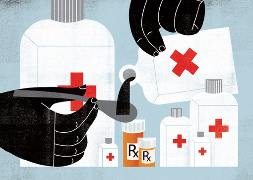

# 普通人的绝症

今天去医院等血小板时，在治疗室门口碰到了半年未见的老张。五十多岁、原本虎背熊腰的一个山西老汉，现在清瘦了不少，几乎是四仰八叉地躺坐在治疗室门口的长椅上，依旧让他三十多岁的儿子忙进忙出地办着各种治疗、检查的手续。看到我，老张先是愣了一下，打量了我一番便又恢复了方才呆滞、涣散的目光，有气无力地与我打着招呼。不必问也看得出来，他的身体情况大不如半年前刚刚住院、与我相识的时候了，想必是治疗的效果不好。攀谈了几句，问起我的情况，我说我最近情况也不好，前期的恢复已经慢慢减退，身体也一天不如一天了。老张闻言，沉默良久后，似苦笑又似叹嗟地“哈”了一声，好半晌才说了一句：“也不行哈。”然后便垂首无语，到办完了穿刺预约手续前都不再说话了。

我与老张相识是在今年五月，那时我因身体不适而入院检查的，虽然知道可能会是比较严重的血液病，但还没有确诊，住在住院处的三人普通病房里，每天吃药、输血，做各种检查。入院第二天，左首床的病人出院了，便搬进了老张。老张是山西人，五十多岁，高大魁梧，身形比自认为健壮的我还要大出一圈。那时他与我一样，也没有确诊，只是住院检查。据他说，他是因为身体不舒服去了他们当地的医院，医生一会儿说是肾衰竭，一会儿说是淋巴瘤，左看右看看不出个所以然来，这才来北京求医。他在协和的主治医怀疑他得的是骨髓瘤I期，便把他安排到了血液科病房住院检查。

那个时候，我跟右首床的、患了IV骨髓瘤的一位老爷子每天都要昏睡个小半天，总得来说，血液病病房的各位病友大都会因贫血而面色苍白、全身乏力，连说话声音都不大。唯独老张，不但面色黝黑，四体勤健，说话更是气若洪钟，而且是一张嘴就停不下来。平时我跟老吴醒着，便找我们聊天，我们若睡了，他便跟他那来陪护的儿子说。两个人都是一口浓重的山西腔，且从不会因为屋里有其他的病人而减小音量。不堪其扰的我时常会出言劝诫，让他们小点声。然而老张每次答应了之后，也不过悄声细语地注意几分钟，等见我不出声了，他便粗声依旧，让人十分无奈。每天喋喋不休的内容，也不外乎就是对自己病情的猜测，以及一些相关的、类似“我年轻时身体多么多么好肯定不会生大病”的闲话。初听老张的话，感觉他对自己的身体状况还是蛮有信心的，然而几天几夜这么听下来，便觉不是那么回事。以我个人的经验来看，一个真正在某方面有自信的人，是极少大张旗鼓反复强调自己在该领域的优势的。老张的表现在我看来，只是一种“心虚”的体现。果不其然，当诊断结果出来时，老张在对骨髓瘤这一概念毫无认识的前提下，只是听到了“化疗干预”四个字便立即崩溃。他那年过三十的儿子也在一旁茫然地流着泪，仿佛父亲的生命就这样被宣判了死刑。其实，当时大夫说得非常清楚，大致地讲解了骨髓瘤这种疾病的知识脉络和老张的病情程度，并没有危言耸听或者太多“不食人间烟火”的专业术语。是老张自己的关注点出了问题，他不在意医生阐述的种种情况与意见，把全部的精力都放在了对“化疗”的想象中去。眼看着老张“过激”的反应，我跟晚期骨髓瘤的那位老爷子不禁面面相觑，没有想到这么一个年过半百、连孙子都上了初中的大男人竟然会如此的脆弱不堪。大夫离开后，老张沉默良久，黯然神伤地自言自语道：“完啦，得了骨癌啦。”我跟旁边的老爷子又是一阵无奈，赶忙开始细细地跟他解释骨髓瘤与骨癌之间的区别。我们俩一个是对血液病有些了解的年轻人，一个是切身得了骨髓瘤并接受多期化疗的患者，共同的详细讲解很快让老张的心情宽愉了不少。特别是了解到自己的病情其实极其轻微、完全有治愈可能的时候，老张的眼中才又多了几分的神采。他的儿子也不再哭泣，而是忙不迭地向我们两人道谢。这样，刚刚陷入绝望的老张父子很快地被我们俩“拉”了回来，决定安心治疗了。我跟老爷子这才松了一口气，一切似乎又恢复了正常。

然而在接下来的几天里，我才开始认识到老张带来的“问题”其实远没有结束。住院生活的枯燥无味其实是可以想象的，除了协和医院严格控制家属探视和病人外出之外，三人病房里也并无任何的娱乐设施和通讯设备。这对于老张这个行动能力远比我们这些虚弱患者强的病友来说无异于一种折磨。老张的饭量很大，每天除了在医院订饭，几乎顿顿都要让儿子跑出去买更多、品种更全的食物来充饥。吃饱喝足之后，便百无聊赖地坐在阳台口上长吁短叹。最常说的话就是“七窍闭了六窍，就剩下吃饭睡觉。”但凡开口，大都是抱怨的话，一会儿叹息自己每天在医院遭受的无聊折磨，一会儿谴责大夫说话用词太过专业，每次还得让我们这些病友“同声传译”他才能听懂。今天指责病房设施不全，明天埋怨治疗费用过高，甚至连日常抽血都成了他心情不快的诱因，总觉得被医院吸了这么多的血，是被占了便宜。不过，最让人难以接受的是，他经常抱怨自己命运多舛，觉得老天不公，时不时就来一句“我没做过什么伤天害理的事儿啊，怎么就得了这么个病呢”。这让我，特别是右床的老爷子心里极其的不舒服。因为按这个理论来看，病情远比他严重的我们俩必定是十恶不赦而遭了报应才住进来的了。有时他们父子出去遛弯，我和老爷子能得片刻的清净，总是很无奈地交流着，说这个老张真是活宝，每天吃饱喝足积攒好了体力就是为了给别人添堵，可是关于自己的病情、治疗、出院后的生活调养、注意事项，他却丝毫不关心，放着现成的大夫和病友，从不交流。大概在他看来，把他的病治好完全是大夫的责任，跟他一点关系都没有。这样的人即使得到了及时的治疗，也真的很令人担心啊。几天后，我因为治疗方案已经确定，准备搬去单人间做化疗而离开了三人病房，便与老张和老爷子告了别，直到这次来输血小板才重新相见。

在医院等待了半个小时后，老张的手续办完了，我的血小板仍然未到，便与之闲聊了起来。老张这半年已经经过了四期化疗，总得来说骨髓瘤的病情控制得不好，总是反反复复，但身体的其他机能却因为化疗而日渐衰弱，精神也一天不如一天了。我打听之下，才知道每次化疗时，老张心里都充满了恐惧与抗拒，特别是对于化疗后身体的不良反应，他总是胆战心惊，且惯于发挥他抱怨不断的个人才能，将不良情绪的效果发挥到了极点。然而，当化疗进入休息期，老张回到家中后，依旧过着“肆无忌惮”的生活。喝酒，抽烟，饮食无度，通宵棋牌。想也知道，这种对自己极度不负责任的治疗状态真的很难有非常理想的治疗效果。我在听着老张怨声载道的描述时，心里确实很不是滋味。因为在老张看来，自己病情的“恶化”完全出自于大夫的无能和贪婪，他觉得仿佛所有的人都在拿他的病占他的便宜，盘剥着他每况愈下的生命。此时，我已经没有再多鼓励或劝慰的话想对老张说，因为我知道，老张的病是治不好了。这病不是骨髓瘤，而是源自骨子里的自私与冷漠，以及对于人生思考、专注的极度怠惰。

我自患上MDS以来，历经数次住院抢救和两次大剂量化疗，认识了无数形形色色的病友。除了血液科病房最常见的骨髓瘤、淋巴瘤、白血病三大主流疾病外，他们大多都患有我称之为“专注度与心灵寄托缺失症”的毛病。说白了，就是他们在治疗过程中对自身表现出来的冷漠与愚钝，着实让人心寒。许多患者在治疗过程中，对大夫极为不信任、不配合，充满了苛求与敌意。在病症咨询时，他们总是一问三不知，也常不耐烦，却总是催促大夫做治疗、下结论，一副“不就是个病嘛，你给我治好了不就完了，哪那么多废话”的意思。而当治疗方案确定、治疗副作用开始作用后，他们一个个喊爹叫娘，将全部的不满发泄给了大夫和亲属，又是一副“不就是个病嘛，瞧你们给我治得这么难受”的样子。我在协和西苑住院时，曾见过一位四十多岁的男人在骨穿时，因为全身极度紧张而剧痛不已。他患病再生障碍性贫血两年，骨穿早已不是做了一次两次，却每一次都因自己的胆怯而不甚顺利。当大夫告诉他，凝血过快，需要再抽一针时，他趴在床上破口大骂了起来，粗俗不堪的东北骂从嘴里流水一般地倾泻而出。大夫们只能极力安慰，好不容易才完成了骨穿、迅速退了出去。这个男人已是两个孩子的父亲，大儿子十八岁，小女儿才四岁，样貌都很讨人喜欢。我在旁边的床上对他说：“你好歹有一儿一女了，都那么英俊可爱，你紧张的时候应该想想他们啊。昨天你女儿打电话来，我听着她叫你爸爸都觉得好温暖，你这个大老爷们应该给她做个表率，勇敢坚强一些她将来才能指望得上你啊。”那位病友闻言，没有丝毫的表情，只是很冷漠地摇着头说：“不想，想不起来。我儿子也不想，女儿也不想，老婆也不想，我就想快点治好病，别再遭这份罪。”听了他的话，我又是一阵心寒，什么也说不出来了。中国人对于亲情的羁绊大多甚为重视，而像这种连亲情都无法成为坚强理由的人，跟他谈理想、人生、责任甚至是觉悟来鼓励他积极向上就完全是浪费时间了。他们几乎什么都不关注，几乎什么都不在意，他们从不认真聆听自己问出问题的答案，更加不在意别人对自己提出的问题。人生过得浑浑噩噩，享受就是吃吃喝喝。而当疾病来临，这唯一的追求都不能被满足时，他们所表现出来的负面力量真是令人叹为观止。可悲的是，这样的人现在竟不在少数。他们不是堕落在社会幽暗角落的畸形，而是堂而皇之、人山人海一般行走于我们当代社会的普通人。他们的“绝症”，比血液病更难缠，更根深蒂固，也更有“伤害力”。这种心灵的冷漠与怠惰，毁去的不止是鲜活的生命，更是一个个原本可以朴素闪耀的灵魂，一段段原本可以意义非凡的人生。

这一天，我又没有等到救命的血小板，只好明天再来。回家的路上我选择了速度最快的地铁，戴着口罩站在拥挤的人群之中。想起白天跟老张的遭遇，想起他那意味深长地一声“哈！”和之后的那句“也不行哈”。心里颇有感触。老张的意思很明显，你这么“乐观积极”，这么“博闻强记”，对自己的病不是把握得很好么？不也一样不行了。可见一切都是徒劳的，病是好不了了。我实在不愿意跟老张多费唇舌，解释我的“乐观积极”其实是源自坚持到底的觉悟，而不是稳操胜券的信心；我的“博闻强记”是不想白病一场，多少要收获些知识与乐趣；对病情的把握是对自己的负责，也是对身边所有关心自己的人的回报。至于最终行或者不行，那不是什么特别要紧的事。只要活着一天，就有一天的责任与奔头；只要活着一天，就有一天的乐趣与享受；只要活着一天，就有一天的创造与价值。协和西院的一位大夫曾说，看着我不像病人，并非是因为体型健壮、头发黝黑，而是因为眼神始终平和而专注，看不到很多病人眼中的疲惫与绝望。我说，如果以这点为标准的话，现在大街上到处都是病人，个个都比我严重得多。只是他们自己意识不到，即使意识到了，也不觉得是自己的责任罢了。城市如斯烦躁，可推卸责任的地方太多了。只是把灵魂病弱的责任推尽之后，做个无责任失败者，是不是会比平和、专注、勤勉而有觉悟地活着更轻松，这我就不得而知，也不愿尝试了。

扁鹊曾说，病在骨髓，司命之所属，无奈何也。我今病在骨髓，仍然没觉得以后的事情都是命运的责任。在这场特别的修炼中，我依旧收获良多，进步良多，享受良多。况且，但凡读过《扁鹊见蔡桓公》的人都应该知道，桓侯的“绝症”，从来都不在身上啊。

注：[MDS](http://baike.baidu.com/view/721784.htm)（myelodysplastic syndromes），学名为骨髓增生异常综合征，是起源于造血干细胞的一组异质性髓系克隆性疾病，特点是髓系细胞分化及发育异常，表现为无效造血、难治性血细胞减少、造血功能衰竭，高风险向急性髓系白血病（AML）转化。这是一种疑难血液病，因为发病率较低，全世界范围内目前还没有统一、系统化的治疗方案，所以每个患者都只能个体治疗。

（采编：佛冉，责编：佛冉）
