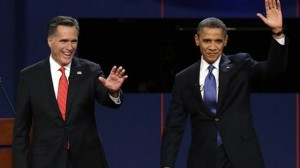
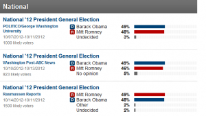
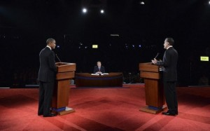

# 最关键的时刻，最糟糕的大选

** **

**一**

原本这是一场似乎越来越失去悬念的比赛，但10月3日晚上在丹佛大学举行的那场美国总统竞选电视辩论使剧情又重新回归扑朔迷离。

这是11月6日投票前要进行的三场总统大选辩论中的第一场，主题聚焦于国内政策。第二场辩论将于10月16日在纽约霍夫斯特拉大学以市民大会（town meeting）的形式对内政和外交展开辩论；最后一场辩论将于10月22日在佛罗里达州林恩大学举行，辩论焦点为外交政策。

之前外界普遍认为，撇开意想不到的重大事件发生的可能性，这三场辩论是民意支持度一直落后的共和党总统候选人米特·罗姆尼“咸鱼翻身”的最后机会。显然，有备而来的罗姆尼没有让机会再一次从手边溜走。

在那场电视辩论中，米特·罗姆尼表现得和蔼可亲、平静沉着，远远胜过了虚弱疲惫的奥巴马。两人在辩论中阐述了各自对联邦政府截然不同的愿景，切中双方分歧的核心问题，在减税方案、赤字削减计划和金融业监管等问题上展开了还算不失绅士风度的交锋。他们都宣称自己的方案才是恢复经济增长、帮助中产阶级的最佳方式。

不过，在当晚的大部分时间里，奥巴马都是在为自己执政的四年以及眼下正在推动的计划——“奥巴马医改”(Obamacare) 耗掉了最长时间——进行有气无力的辩护。他几乎没有力量对自己的下个任期作出什么鼓舞人心的展望，这与四年前响彻世界的“Yes，We can！”的豪气形成了鲜明反差。而罗姆尼则在辩论中明显地向中间派选民靠拢，这与他在共和党内初选以及大选前期竭力取悦保守派的做法同样形成了鲜明的对比。

美国有线电视新闻网 (CNN)进行的即时调查显示，三分之二的受访者认为罗姆尼赢得了这场辩论，只有四分之一的受访者认为奥巴马表现得更好。甚至民主党内部有实力的大佬和那些同情奥巴马的观察人士也大多认为罗姆尼的确在辩论中占了上风。

当然，奥巴马一方在辩论之前和之后已经一再为自己减压和开脱：这是一场在任总统与反对党候选人之间的不对等的辩论，“作为总统，几乎不可能找到大块的时间，别的什么事情都不干，只准备辩论……世界不会等着让你为辩论会做准备的。”但除了死忠民主党的铁杆左派，普通选民并不会因此而给予奥巴马更多理解和同情。

**二**

事实上，本次大选从拉开帷幕至今的一年多来，市场调查机构和媒体所做的民调都显示，现任总统奥巴马的支持率一直高于任何一位共和党候选人。尤其是去年5月本·拉登被击毙后，奥巴马的支持率更是出现跳涨。即便是罗姆尼经过一年多来的艰苦鏖战，跌跌撞撞地从众多党内竞争对手中脱颖而出、赢得共和党大会的正式提名后，他的民意支持度也仅仅是出现了短暂的提振，仍未有机会赶上奥巴马。

随着民主党大会的召开、特别是民主党前总统比尔·克林顿热情澎湃的鼓吹演讲，进入关键的9月以后的民调显示，奥巴马相对于罗姆尼的优势进一步巩固和扩大。就连在奥巴马的短板——哪一位候选人最有能力改善经济状况——的问题上，他的得分也追上了罗姆尼。包括路透 / 益普索和《华尔街日报》 / 美国全国广播公司（NBC）等发布的多项民调数据均显示，奥巴马对罗姆尼的领先保持在5个百分点，优势日益显著。根据以往的历史，在9月中旬的民调中领先的候选人通常会在最后胜出，落后者逆转的机会很小。

更令共和党人沮丧的是，民调结果还显示，罗姆尼不仅在传统的“摇摆州”明显落后，也未在任何关键州显示出超越迹象。罗姆尼竞选团队一直将艾奥瓦州视为希望较大的州之一来予以关注，但NBC新闻频道 / 《华尔街日报》/玛丽亚教会学院的联合民调显示，奥巴马在艾奥瓦州有着8个百分点的优势。而他在俄亥俄州和弗吉尼亚州这两个重要战场的民调结果也不升反降。甚至在北卡罗来纳和内华达两州，罗姆尼也毫无胜算——前者与南卡罗来纳州并列，拥有全国第五差的失业率数据；后者则拥有全国最高的12%的失业率。

此外，最新公布的一系列正面的经济数据似乎也显示美国经济好于预期，出现强劲的企稳复苏征兆。如果这种趋势得以持续，也将十分有利于奥巴马在11月的大选中胜出。

因此，民主党内逐渐弥漫起一股仿佛“大局已定”的乐观情绪。有自由派人士甚至已经信心满满地预测：从当前的进程来看，选情正在向奥巴马第一任期内的“现状前进”。可能性最大的结果是，奥巴马将在11月6日成功连任，而共和党将在众议院保住多数党地位。换句话说，白宫与国会的力量格局将维持现状。

基于这种判断，民主党和奥巴马现在要做的显然只是不犯错误，巩固当前的形势；并祈祷未来几周内不要发生类似9·11这样的重大变故。而罗姆尼则需要使尽招数逆转整个大势。现在看来，罗姆尼迈出的“绝地反攻”第一步近乎完美。

**三**

从阶级、种族、性别、宗教和意识形态裂痕来看，最近的十多年里美国政治的主线不是良性合作，而是不断两极化和激进化。奥巴马当选总统后，曾经短暂地试图逆转这种“美利坚分裂国”的趋势。但随着在医改——尤其是令人记忆犹新的去年夏天的那场提高债务上限的谈判——等一系列战场上的激烈战斗，残酷的现实已经证明，他所提出的“后党派总统”实在是一个天真幻想。

相反，由于金融危机余波未退、失业率依然高企、茶党运动在全国各地持续开展、与之针锋相对的“占领华尔街”运动波澜不兴……社会的裂痕正在令人绝望地进一步加深。正是在这样的背景下，美国迎来了可能是历史上最重要、但又最糟糕的一次总统大选。关于这一点，在几乎每一个社会经济问题上都尖锐对立的自由派与保守派，倒是达成了高度共识。

著名的专栏作家、畅销书《世界是平的》作者托马斯·弗里德曼曾在全美最重要的自由派报纸《纽约时报》上撰文说，“我记得好的年代有差劲的大选，也记得在坏的年代里有好的大选，但是我不记得有比今天更糟糕的年代和更糟糕的大选。”无独有偶，保守派专栏作家、曾担任过布什总统顾问的佩姬·努南(Peggy Noo-nan)也在《华尔街日报》发表文章，认为这次总统竞选“非常重要，同时又非常乏味”。

他们的观点很好地代表了大多数美国选民的看法：这场竞选的两个主角，一个是工作不力的现任总统，一个是难以扛起总统大任的可疑的挑战者。除了相互抹黑外，罗姆尼的竞选政策什么实质内容也没有，而奥巴马总统的竞选则完全是见招拆招的应付。于是，它就变成了一场“矮子里面拔长子”的低水平竞争。

说到底，这次大选其实是对奥巴马过去4年执政的一次公投，而不是一次明辨未来4年前进方向的抉择。这其实也是多年来最“弱”的共和党候选人罗姆尼所希望的，当然，他内心里真正想要的公投范围可能更小：一场只针对奥巴马经济管理能力的公投。

客观地说，“理想主义者”巴拉克·奥巴马的表现是不合格的，他没有在危机时刻展现出国家需要的领导力，更没能延续他那关于希望和改变的激动人心的故事主线；反观挑战者米特·罗姆尼，商人出身的他除了空喊那些迎合共和党保守派意识形态的口号之外，根本就没有形成一套听起来符合逻辑的务实可行的表述，特别是在理应是其专长经济问题上（有关这次大选的经济主题，我会在之后的文章中进一步专门阐述）。

拥有数十万张选票的美国的三大汽车公司——包括在华尔街金融海啸爆发之初曾获得政府数十亿美元援助的通用汽车和克莱斯勒集团以及没有接受政府救援资金的福特汽车公司——就早早地宣布，它们将不允许两位总统候选人的任何一位在其工厂做竞选宣传。这充分流露出了美国人对这次大选的失望之情。

**四**

美国的每一届大选都会被媒体称为几十年来最重要的大选，而这一次，似乎确实如此。原因正如我前面已经说过的，两条截然不同的通往未来之路正呈现在极端分裂的美国面前。英国《经济学人》杂志的评论恰如其分：两名候选人和他们身后的政党之间存在着一条不可跨越的鸿沟，而且这道鸿沟的宽度和深度达到了30年来之最。

在有关减赤与税收、移民、外交、同性恋婚姻以及美国宪法规定政府无权干预的诸如宗教意识形态等几乎一切领域，挑战者罗姆尼都摆出与奥巴马南辕北辙的姿态。他似乎觉得，只要在每一个问题上反对奥巴马，就能够顺利当选；又或者，只有在每一个问题上反对奥巴马，才有可能当选。

而奥巴马对抗罗姆尼这种缠斗策略的方法则是将对手妖魔化——奥巴马竞选团队把贝恩资本的前老板罗姆尼描述为一位根本不了解美国普通人疾苦的“脱离群众的高富帅”；一只商界寄生虫，从收购的公司内吸取高额利润，同时把大批员工解雇，且让公司背上巨债；他们还对罗姆尼不愿意公开2011年之前的税收文件大肆质疑，声称罗姆尼当上总统后只会为富人牟利，对中产阶级、尤其是贫困的弱势群体弃之不顾。

美国皮尤研究中心 (Pew Re-search Center) 公布的最新民调结果显示，罗姆尼凭借第一轮竞选辩论的优异表现，已经抹去了奥巴马的领先优势，甚至有可能反超奥巴马。毕竟，即使奥巴马已经保持了长久的民意领先，但自哥伦比亚广播公司（CBS）和《纽约时报》今年1月联合开展民调以来，任何一方都未曾领先对手6个百分点以上，差距并未拉开到像当初奥朗德对萨科齐那样不可逆转。况且，罗姆尼竞选团队一直不承认这种差距，他们不无道理地宣称，被左翼自由派把持的媒体严重偏向民主党和奥巴马，而其内部数据显示两者的支持率比民调显示的结果要接近得多。

当然话又得说回来，不管受到巨大鼓励的罗姆尼在接下来的两场辩论以及他的竞选搭档保罗·瑞安(Paul Ryan)与副总统拜登即将展开的电视辩论中表现如何，这些努力究竟能对最后的结果产生多大作用，是颇值得怀疑的。因为几乎所有的民调都显示，目前尚未拿定主意把票投给哪位候选人的选民不足10%；而已经决定了立场的选民中仅有6%的人表示可能改变选择。这意味着，绝大多数美国选民并不会根据电视辩论来决定在11月6日那天的行动。

但选战中发生的上述所有抹黑所造成的伤害都不是短时间内能够弥合的，因此，无论11月6号的结果如何，美国在这次选举之后都会成为一个分歧更加严重的国家。

几乎已经可以预计的一个事件是，如果奥巴马成功连任，那么共和党掌控的众议院（依目前的形势看，共和党在同时举行的国会议员选举中有把握做到这一点，甚至他们还有望增加在参议院的议员席位）将会更加激烈地抵制出自白宫的任何一条政策，以补偿他们当初“选错”了总统候选人的心理懊恼。这将立刻使民主党政府在年底即将展开的新一轮“财政悬崖”的谈判中处于非常不利的位置。届时，面临美债偿付违约危机的全球金融市场又将不得不面对一次巨大动荡。

 

（采编：彭程；责编：佛冉）

 
