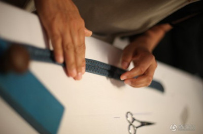
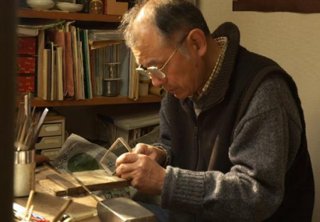

# 木匠的手

台北故宫为了推广自己，曾请大导演侯孝贤出马拍了一组纪录片。侯孝贤的第一部片子只有55分钟，他做了整整一年，并且亲自上阵担任解说配音。片子的名字叫《盛世里的工匠技艺》。

在浩如烟海的绝世藏品中，侯孝贤选取了三件乾隆时期无名工匠制作的器件，对它们展开了细微的刻画和久远的联想，你仿佛可以看到，在那三位无名工匠专注、温暖、细腻的手工下，三件作品是怎么样一一登峰造极的。乾隆好奇巧工艺，一般器件很难入眼，这反而成了一种巨大的助推力量，迫使工匠们把手工艺发挥到极致。

侯孝贤说，文化的历史在很大程度上就是手工技艺的历史，“我们之所以喜欢古的东西、手工的东西，是因为我们的美感来源，就是由这历时久远的技艺中，逐渐形成”。所以在片子中，他反复引用斯特劳斯的那句名言：“技艺，是人在宇宙中为自己找到的位置。”这部片子的深刻，在于他选的是三位无名工匠，他们被淹没吞噬在岁月人潮的洪流中，但是他们的手艺却留了下来。

在所有职业中，我对手参与最多的职业最为佩服，比如木匠、手艺人、樵夫和厨师，都靠手吃饭。我小时候，家中做家具桌椅、盖房子、锯木料椽子，或者堂姐出嫁打嫁妆的时候，往往是我最兴奋的时刻，几乎总会跟在木匠们的屁股后面，嚷嚷着要做一个木刀或木枪。即使不给我做，只是帮着他们按住墨斗里线头的另一端，看着刨子里刨出的木花，闻着钢锯新拉出来的锯末，也会有一种莫名的快乐。

有个邻居是木匠的好手，不但做的桌椅四平八稳，打的嫁妆结实美观，而且甚至可以一整件家具不用一个钉子，完全用的是他自己砍削的楔子，钉上去不露一点痕迹和缝隙，看上去就像是一整块木头。我那时就在想，怎么可以有这样精妙的手艺，被遗落在这穷乡僻壤里？

不单单是木匠，我以前还见到各种各样的手艺人，做炮药擀制烟花炮竹的，给十里八乡刻碑的，游街串巷给各家憔猪的，到新去世的人家里扎纸车花圈的，还有挨家挨户补锅修伞的，他们凭着一双粗糙的手和精细的手艺，在乡村世界里建立起了一道技艺的风景，用手赢得了糊口谋生的微博收入，也用手艺赢得了四邻的需要和些许的敬意。

我小时候家里的锅破了、伞裂了、铝盆儿穿孔了，总要再修一修、补一补接着用，那时候补铁锅、磨剪刀的江湖手艺人天天走街串巷，在院子里每每听到外面有人拉长了音在喊：“补铁锅嘞磨剪刀，补铁锅嘞磨剪刀。”父亲就让我连忙出门拦下。而每次我都搬个小板凳，端坐在那里看他们怎么修怎么补，我对他们零乱但丰富的工具箱、对他们手下的一举一动有着超越我年龄的、异乎寻常的兴趣和热情。

后来有一次，在动手心切驱使下，我竟把家里唯有的一个手表拆了，我的初衷是弄明白它的工作原理，然后再一点一点装回去，殊不知无论怎么努力，那些散落一桌子星星点点的零碎部件，都安置不到表壳里去了。那时候，我甚至还异想天开，拆了随身听里的小马达，用硬纸板剪成螺旋桨的形状，要制作能飞的模型飞机，但是因为不懂原理，怎么都飞不起来，只能眼睁睁地盯着螺旋桨在呼呼空转。

虽然安装手表和造飞机都没有成功，但那时候的我却对此有着极大的热情，我甚至可以一整天一整天地在房间里摆弄。我至今记得，午后的阳光一点点的在墙壁上移走，天色慢慢地暗下去，屋子里极其安静，我几乎可以听到鼻头呼气的声音，可以感受到心脏的剧烈跳动。

到今天我也弄不明白，少年的我何以对手工操作有那么大的兴趣，是天性？是熏染？还是单纯的好奇和玩耍？后来是读书了，整日沉浮在课本和课堂里，对这些手工的摆弄一日疏远一日，最后竟兴致全无，每每想起从前的种种不觉哑然失笑，笑自己当年的无知无畏、闲得发慌的打发时间，亦或者是笑长大了就丢掉了最初的虔诚和兴致。

在拆装手表和制作飞机模型的过程中，我感觉到手的力量和精细，感觉到手的婉转自如。而少年时在田野里的少年游，我闲不住的手不是握一根藤条横抽竖抽，就是拾起石块和泥土用力扔向远方，看着它们被抛上去又落下来的曲线，或者是爬树时用手把住粗糙的树皮树杈，也都让我觉得跟手有一种相亲，觉得在什么工具都没有的时候，在山穷水尽的时候，这双手就是最好的工具、最好的柳暗花明。

人类在直立行走之后，最先解放出来的工具就是手。在漫长的使用、纠正和打磨中，手对我们来说，就像是心底生长出的一对须，帮我们感触的外面的世界，在一握一按一摸中，实现对周遭的把握和改变。我们常常说“十指连心”，指尖的疼痛不是疼在手指上，更是直接疼痛在最心底，这其实就是一代代的使用和沉淀所建立起来的一种对应，它们最细微的感受都是通于心底的，心中一思一念、一爱一恨都可以通过摩挲、挥手、抚摸和握拳表达出来， 每一个手的动作，其实都是心的动作，只是它们太紧密了，紧密到你根本觉察不出来。

对我们来说，手在生活中的功能，是任何别的工具都代替不了的。通过手获得的快感和成就感，达到的效果，也是别的感官完不成的。

明朝的皇帝大多都不寻常，明熹宗朱由校也是。这个一心想当个木匠的皇帝，他不但心灵手巧，对制造木器有极浓厚的兴趣和天赋，宫中凡是刀锯斧凿、丹青髹漆之类的木匠活，他都不假他人之手，要亲自上手操作，他手做的漆器、床、梳匣，均装饰五彩，精巧绝伦。

明代天启年间，匠人们所造的床都极其笨重，要十几个人才能抬动，用料多，样式也普通。朱由校便自己琢磨，设计图样，锯木钉板，用了一年多工夫造出一张床来，床板可以折叠，携带移动都很方便，床架上还雕镂有各种花纹，巧夺天工，连当时的最好的木匠都叹服不已。平时在宫里，他还用木材做小玩具、小木人，他做的木偶无论男女老少俱有神态，五官四肢都备具，动作表情惟妙惟肖。

朱由校不但自己做了高兴，还派内监把他做的玩具木偶拿到集市上去卖，赶集的人都以重金购买，他因此更加高兴，做木工活更加勤奋，常令太监做助手，他自己干到半夜也不休息。朱由校还喜欢在木制器物上发挥他的雕镂技艺，在他做的十座护灯小屏上，就雕刻着他费心费时构思的《寒雀争梅图》，逼真到活灵活现。以至于有人为此写诗道：“御制十灯屏，司农不患贫。沈香刻寒雀，论价十万缗。”

不但做木工，朱由校对双手能雕琢把握的东西，都很在行，他雕玉石也颇精工，他常用玉石雕刻成各种印章，赐给身边的大臣和太监。

手在与自然的摩挲中长了老茧，老皮脱了又生，这是用手去触摸万物，去获得赐予。我觉得明熹宗就是，他用手接触的世界带给他的参与感和成就感，要远远大于帝王这个职位带给他的满足感。用马斯洛的话说，他是在做木匠的过程中找到了最高层次的自我实现的需要。

无独有偶，我那在东莞做黑社会的堂哥，平时有个雕刻的爱好。春节的时候回家碰到他，闲聊中发现他早已厌倦江湖中事，平日里唯两件事放不下，其一是喝茶，另一个就是雕刻。他买了几千块钱的工具，没事时就自己在家里雕，雕花雕鸟，开石凿木，有一次为了雕一个大件，他在房间里不吃不喝雕了一天。他说：“雕东西费手费脑子，不过雕完后就觉得值了。”也许他和明熹宗一样，在一个手工的江湖里找到了自己，找到了在生活中、在这个世界上能安心的价值。

今天的工匠和手艺人越来越少了，虽然在我们的生活里，手依旧扮演着极其重要的角色，但是其登峰造极的能力似乎在慢慢下降了。

我有时候到偏远的地方旅行，总喜欢看看街头巷尾的物什零碎，喜欢在山坡上孤立的坟头石碑前看那上面一笔一划的字，喜欢看庙宇廊柱或者牌坊上的雕刻，那些无名的乡间手艺人，他们的体温、汗渍和用心都沾染在这铁钩银划的字、栩栩如生的花鸟中，一年一年的风吹日晒雨淋，岁月青苔漫漶，总应该等来一个虽然迟到、虽然陌生但是却热心切意的驻足观看者吧!为了那份手艺，那一个时刻的开凿和雕刻，为了那钢刀和铁钎，我有时候会看很久，会想拍下来带走，不舍得那样的用心孤独地伫立在风霜中。这是一种怀念，也是一种祭奠。

对于拥有完整双手的我们来说，很难理解独臂人的经验，也很难想象如果哪天我们自己失去了一只手，或者两只手都失去了，生活会是一种什么样子。也许等到失去的那一天，我们才意识到双手很多细微的重要，意识到手还可以被开发出各种各样、无穷无尽的潜力空间。

我见到很多独臂或者双臂尽失的人，他们有的在路边摆个破碗乞讨为生，有的用双脚代替双手，不但能衣食自理，还能用脚趾夹着毛笔写字，我的意思不是说乞讨比自力更生低等，也不是说双脚为手就更值得高看，而是我们没有那样的经验，甚至一辈子都不会有。那么，我们有什么资格去说哪一种行为更高贵，哪一种行为又更低贱呢？

目盲的人听力会很好，嗅觉会很发达，直觉和第六感会很灵验，耳聋的人视力会很好，四肢会很灵活，身体平衡能力很强。失去一只或两只手的人，当然也会在五官和下肢上有所开拓，只是不是所有人都用脚写字刷牙，他们的开拓深藏体内，我们未必能全部看到而已。

今天，在敲击键盘和触摸手机屏幕时，看到白皙细嫩、无茧无斑的双手和十指，我突然发现它们和生活的距离、和心的距离、和汗水的距离是那么遥远，我对小时候拆装手表、做飞机模型、削铅笔、紧握锄头的那双有粗茧厚皮的那双手，是那么的怀念，而对在山坡石碑上刻字、在庭院里刨木锯树、在宫里雕花雕玉的那些手，又是那么的遥不可追，唯有空怀一腔遥远的敬意和感慨，聊聊以为祭奠吧！

（采编：孙晓天，责编：佛冉）
