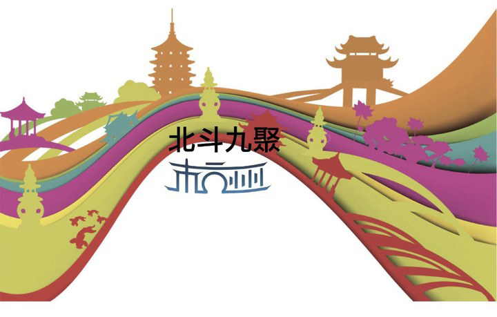

# 未尽的发言：北斗是什么？北斗为什么？

** **

（按：本文是我为九聚读者开放日准备的致辞。聚会因故取消了，我这简单的发言也没有完成。但整个北斗就是在铁屋子里一场长期的发言，我们要把这个坚持下去。）

各位北斗同仁，各位读者：

下午好。

欢迎大家来到美丽的杭州参加北斗九聚，我是北斗新任理事长刘一舟。在此是我代表北斗向大家说一声欢迎，但是有点冒领功劳的感觉。为了这次聚会而不辞奔波的热情地主和不辞琐碎筹划组织的工作人员，更有资格说欢迎。非常感谢你们的付出！北斗能走到今天，第九次聚会了，靠的就是许许多多的人愿意不为利益而是为了信念、理想、友谊等的确确实实的付出。正是这个世界缺少的东西。

其实呢，我和大家一样，对致辞这个东西感到有点不适应。因为致辞在印象里好像是前面说我代表XX表示热烈的祝贺，后面说祝这次大会圆满成功就完了。中间不论多长的内容，概括成一个词：就是“虚伪”就可以了。而这正是这个世界多余的东西。

我们在座的各位，肯定都有一个共同点，那就是热爱自由和纯粹，讨厌当政者公开鼓吹意识形态私下玩弄权术的那一套。我一直觉得，北斗立命之处，不是心有多大，而是赤诚相待。坦诚！是我作为新任理事长向大家做的一个承诺。那么今天我也不讲什么冠冕堂皇的东西了，我是想作为一个北斗的老人，跟大家谈谈对北斗的一些思考。主要谈这么几个问题，言简意赅的，就是北斗是什么？北斗为什么？

至今为止呢，我们还没有对北斗是什么进行过理论性的思考。我们在说北斗这个词时，语义是非常复杂的，它可以指我们的事业，也就是我们致力于打造的人文思想平台，也用以指我们组成自己的这个群体。在这里，北斗的所指就有模糊的地方。北斗既指北斗网背后的运作团队组织，也可以指由这些人推延形成的圈子。这说明我们这个群体，既有规范化的组织性，也有私人化的圈子性。这就有点纠结，因为当我们想按照理性与科层化的形式来进行组织运作以更高效地工作时，圈子的特性牵入进来。而这个圈子边界又是不确定的，徘徊于网络的虚拟互动和现实人情之间。那么我们该如何认识自身的现实？在中国社会世界的一部分已经在网络中复制和重构的环境里，北斗无疑是个新现象。

那么该用一个什么名字来概括这个整体性的北斗群体呢？我倾向于北斗共同体。北斗共同体是一个由现实事业聚合起来的自发性的群体。这个事业也把我们和一般的网络社区或者朋友圈子区别开来。北斗共同体存在的意义在于维持这个事业。因为这个事业，我们要有组织性，而在组织中，就有人际性。作为北斗共同体的一员，或多或少，都要参与到这个事业中，这即是我们的选择也是我们的被迫。这个共同体比较接近community原意。滕尼斯在提出community的这个词时，他的意思是要和社会相对应。Community指的是前现代那种内部团结的社群，社会指现代这种，社会都是密不透风的隔间的这样的形式。齐格蒙特鲍曼就说：共同体是一个温暖而舒适的场所，一个温馨的“家”，在这个家中，我们彼此信任、互相依赖。然而，“共同体”不是一个已经获得和享受的世界，而是一种我们热切希望栖息、希望重新拥有的世界。这是一个失去了的天堂，或者说是一个人们还希望能找到的天堂。我觉得在北斗中我们重新找回了这种世界。什么能比一个事业而非利益的共同体更温暖的了呢？

这个事业，也就是我要谈的第二个问题。北斗为什么？在我们网站上原来写有这么一句话：北斗网（ibeidou.org），致力于在当代中国大学生中间弘扬人文精神、普及社科常识，推动当代中国大学生的自我启蒙。这个口号很好。但我觉得应该补充说明一下。这个致力，到底形式是什么样的呢？那就是提供服务。以前有人批评说北斗想给当代中国大学生启蒙，这个有点姿态太高了。我们不是启蒙，我们是服务于启蒙。我们是为启蒙必需的思想的交流与传播服务的。北斗一直以来就是为了提供一种服务，把好的文章介绍给大家，这半年来尝试的自主办栏目，也是为了知识和观点的传播。

网络改变了中国。网络让中国的公共性有了空间。在现实社会里，中国没什么公共性，突破口不大。社会控制是非常严格的，不仅仅是政策控制，还有文化控制，每个中国人，都要按照当权者制定的那套规矩来，这就是每个中国人的命运。但是网络，让人们有了自由言说的机会，虽然还是受控制，但比现实行动受到的限制要少了许多。但是大家发现没有，网络环境是很混乱的。中国人本来没有公共生活的实践，现在一开始进入一个比较自由的网络中，不混乱才怪。北斗处于网络环境中，不能不应对这个情况，我们不仅仅是要应付，还要去主动改变。就是在混乱的网络环境中，哪些是有意义的东西，哪些是理性的讨论，北斗都要把它梳理出来，提供给大家，这就是我们承诺的服务。在这个过程中北斗本着公平的立场，以普世价值为准则。北斗不敢言大志，但网络中的良性角色秩序，也会影响到现实的，这是肯定的。

北斗发展到现在，是一个历史的过程。历史，自然有其结构性也有其随机性的因素。结构无法克服，随机无法估计，我们并不能掌握它的发展路径。这就和人的命运是一样的。同时2012来了。我以前就说过，2012这种荒谬的预言，为什么会流行开来。这个玩笑里的严肃成分是什么呢？就是一些宏大叙事破产，意识形态虚伪性被充分认识到，人类迷茫情绪的体现。这也给我们启示就是，与其觊觎一个理想的未来，不如珍视我们的遗产和当下。守株待兔等不来船票。我认为，有坚持才有未来。哪怕2012真的来了，我们也已经够本了。坦诚、务实、行动，是我认为北斗团队的新气象。

希望大家也能利用难得的相聚机会畅所欲言。谢谢大家！

 

（采编：徐海星，责编：黄理罡）

 
