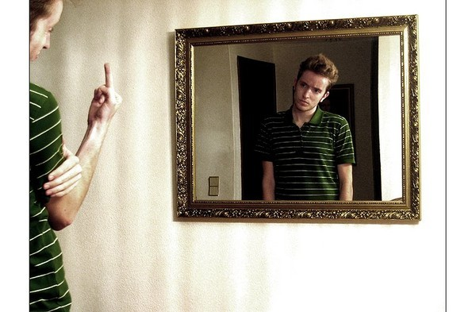
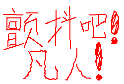

# 果核与中国盒——对于道德虚无主义者的回答

**超越一切个体头脑中偏见与盲区的绝对真理如果真正存在，其存在绝不可能是被位于某一特定时间地点的某一小群人的有限理性所推证出的，因为真理不是暂时的和相对的，其存在是自证的，并且永远存在于人类理性认知的下一秒，即未来范畴。我们想要用自身理性证明的，或许不是真理本身的存在，而是我们自身理性亲近与求索真理的能力。**  

# 果核与中国盒——对于道德虚无主义者的回答

## 文/ 李兰希（Boston University）

  牛顿定律是现代文明的开端。“相对”这一具有不可思议魅力的概念，被后现代文化过度解读，迸发出摄人心魄又愚不可及的美丽。现代人们无法验证绝对空间的存在，并因此陷入道德虚无，摈弃绝对信仰。但“相对”的意义也在于此：一切物理理论总是临时性的，永远不可能将它证明。永恒的真理宛如一颗被锁于层层中国盒深处的小果核，永远守望在人类理性的前方，在一片遥不可知的黑暗里向我们闪现着诱惑的光芒。 

——题记

1687年牛顿定律的诞生、相对运动和相对位置这一概念的到来，在行将步入现代文明的人类社会曾掀起一场信仰风暴，很大程度上摧毁了现代人对于绝对空间、绝对上帝的信仰。心灵脆弱的人们哀叹着“上帝已死”。善与恶也仿佛失去一个恒定的评判标准，由于参考系的不同而变得边界模糊。道德虚无的情景经常出现在我们后现代的社会生活画卷里，出现在一场又一场经典的诡辩中，一次又一次“成王败寇”的极权浩劫里，一代又一代人类对人类政治领袖的神化与崇拜中。

的确，我们所选择的坐标系通常决定了我们认知自我的位置。在矮人国的世界里，我会被矮人们称作巨人，而蚂蚁被他们称作矮人。而在巨人国的世界里，我会被巨人们称作矮人，而矮人被他们称作蚂蚁。但若我用比例尺将矮人国放大一定倍数，我可以发现，巨人国也不过就是放大版的矮人国。每个国度对于身高的标准看似千差万别，毫无比较的意义，但这些无法统一的标准实际上是可以通过一个确定的缩放倍数在同一比例尺上彼此连结的。这说明，并不是一切都是虚无的相对的，总归有一种终极不变的绝对实在，在一个个千差万别的相对世界之间建立起一种确定的绝对联系，使不同的人们有了相互理解并达成某种统一共识的可能。

一些道德虚无主义者常常通过强调个体立场的独立性和差异性，以此确定价值判断的虚无，拒绝一切绝对道德标准。但我认为有一点是不能忽视的：人类社会中每一个相对不同的头脑并不是完全彼此孤立隔绝、毫无联系的，人与人的思想、感知之间是存在共鸣的，即所谓交集，而追求唯一真理的道路，只不过是将这些交集不断精确罢了，有些像一组彼此无限嵌套的中国套盒，当每一个盒中之盒被拆开得越多，就越接近那个最核心的盒子。

一个缔造了宇宙规律的绝对实在，或许就存在于所有相对的虚无存在之中。在我们通过自身理性所感知到的时空内，一切相对的标准互为标准，一切不同的坐标系互为坐标，一切个体心灵以自己的好恶映照出他人的好恶。对于不同的人，不同的思维方式或许使他们探求真理的路途千差万别，但对同一终极目标的渴求最终都引领他们通向他们自己的圣殿。宇宙内有多少颗拥有理性的心灵，就有多少座这样的圣殿。每一座圣殿都构筑在另一座圣殿的穹顶或是脚下，每一个个体的心灵圣殿是通往他人圣殿的一部分，甚至被构筑在他人圣殿之中。正如亚里士多德之于伽利略和牛顿，麦克斯韦之于爱因斯坦和彭加勒，每一个头脑里的思想风暴都与另一个头脑里的思想风暴有所交集，每一个伟大的思想站在另一个的肩膀之上，站在离真理更近的地方仰望那未知的浩瀚苍穹。通过与他人比较，任何智慧或愚昧的个体都不再是孤岛，在对彼此的传承或批判中，从隔绝走向统一联合，得到一个个离同一恒定真理更为接近的答案。

由此可见，我们的心灵不仅是我们自己的参考系，同时也是他人的参考系，是被彼此评判和审视的镜子。在一个社会中，所有人无可避免地通过对他人价值观的评价来构筑自己的价值观，最终在一种虚无和混乱的表象中，通向某种超越一切的终极实在。这过程绝非任何个体的自由意志可以阻挡或者逆转，因为我们的自由意志，我们的理智和逻辑，本身就是这统领和俯瞰一切自由意志的，我们所想要探求的规律的一部分。

自人类历史诞生以来，我们的求知欲驱使我们以自身能力有限的理性去探寻真理。一代又一代人穷尽心力也无法走到人类哲学的尽头。我们的前辈未看见人类理性的统一终点，所以我们后来人始终坚称对宇宙规律的探索拥有无限远景，即使我们中没有任何人能够确定这条路是否真正有终点。

——那么我们又如何能够否定一个恒定的终极道德规律的存在？如果我们坚持自身理性不可见或不可证的就不是真理，如果一切本质和意义都归入虚无，为何我们仍要向那前方遥不可知的黑夜苦苦探寻，为何我们仍然宣称理性科学之路永无止境？难道不是因为我们内心早已**预设了某种信仰**——对于一个超越一切暂时性和虚无性、超越一切经验世界的规律表象、在一切时间的起点之前终点之终、得以概括世间万象的终极真理的信仰？

正如仰望星空的霍金所说：“人类求知的最深切的意愿足以为我们所从事的不断的探索提供正当的理由。而我们的目标恰恰正是对于我们生存其中的宇宙作完整的描述。”

而另一方面，现代科学的精神也启示我们：一切人类理性得出的科学结论本质上都是暂时性的，是有可能在下一秒的论证中被推翻的，这也恰好印证了我的观点：超越一切个体头脑中偏见与盲区的绝对真理如果真正存在，其存在绝不可能是被位于某一特定时间地点的某一小群人的有限理性所推证出的，因为真理不是暂时的和相对的，其存在是自证的，并且永远存在于人类理性认知的下一秒，即未来范畴。我们想要用自身理性证明的，或许不是真理本身的存在，而是我们自身理性亲近与求索真理的能力。

如果人类理性是一部认知世界规律的阶梯，我们验证着这部阶梯正通往真理所在的正确方向——在那里，永恒的真理宛如一颗被锁于层层中国盒深处的小果核，在遥不可知的黑暗里向我们闪现着诱惑的光芒。

于是最后归于这样一个问题：一个能够被应用于评判一切是非善恶的绝对标准究竟存在么？我的回答是——存在，但这评判标准的解释权并不仅存在于某一特定时代的一小部分人类头脑中，而是存在于人类宏观理性的博大共鸣之中，是人类历史上一切存在于过去、现在和未来的思想所呈现出的最终子集，是需要所有人的理性之匙才能开启的最后一层套盒。因此，原教旨主义者并无权利以绝对道德的名义去强行绑架他人的自由，但同样，道德虚无主义者也无权以绝对道德不存在的借口去行恶，伤害他人的自由以及生命。

**一把绝对的善恶标尺，其存在意义不是将人逼向极端，而是为人守住底线；一个绝对道德标准的存在，并不是为了帮助人们开辟一条通往天国的路，而只是为了帮助人们锁住身后的地狱之门。**

这便是我对于道德虚无主义者的回答。

（采编：陈锴；责编：陈锴）

