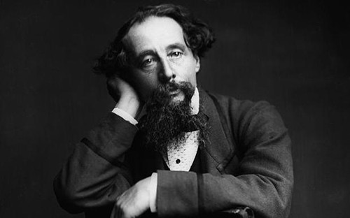
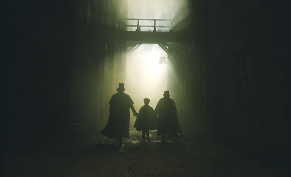

# 查尔斯和巧克力工厂

** **

十九世纪二十年代的伦敦，是最好的时代，也是最坏的时代。工业革命之后，在机器的轰鸣声中，不列颠在世界头号强国之路上高歌猛进，与此同时，在上流社会的纸醉金迷之外，是底层民众的哀号，衣不蔽体食不果腹，没日没夜地劳作，只为了一点可怜的薪水。在这群人中，有一位12岁的少年查尔斯，他来自小贵族家庭，却因为父母不善理财，过度消费，全家沦入负债者监狱，为了贴补生计，查尔斯在一家压榨童工的黑工厂没日没夜地工作，以至于其他孩子都以为他是被父母抛弃的孤儿。他学会了在哪里可以买到一先令的面包，哪里可以买到最便宜的黄油，童工厂的那段噩梦般的记忆，像魔鬼的影子一样伴随着查尔斯的一生。

查尔斯姓狄更斯，我们可以在《雾都孤儿》当中找到黑暗童年的记录。若说莎士比亚是英国的国民剧作家，那狄更斯就是英国的国民小说家。在他的时代，没有英国人不知道狄更斯，每个英国家庭都会有圣经，和他的小说。他只要动动鹅毛笔，写的无论是什么，必定洛阳纸贵，就是在遥远的北美殖民地，只要封面上印有狄更斯的名字，就是畅销的代名词。去码头迎宾的纽约掮客，也不忘“未完待续”的《老古玩店》，会迫不及待地冲着停泊未稳的英国邮船打听：“小耐儿死了吗？”每个时代都会有代表性的作家，正如菲茨杰拉德是爵士时代的伟大鼓手，而狄更斯则是维多利亚时代的首席记录者，在他身边，有萨克雷，勃朗特三姐妹，共同勾勒出一个时代的生离死别、喜怒哀乐、喧嚣与沉寂、辉煌与破败。

今年是狄更斯诞辰200周年，英国举行了为期一年的纪念活动。在200年后的今天，狄更斯的影响力毫无衰减。狄更斯的《双城记》仍保持着惊人的销量，仅次于排在第1 位的《圣经》，远高于第9位的《哈利.波特》。

曾几何时，对作家而言，写畅销书是一件被人诟病的事，甚至诺贝尔奖评选也更多青睐小众作家，但再好的文学如果无法传播，又有什么意义？狄更斯只写畅销书，但谁可以否认狄更斯是文学大师？文章写得没人看，未必是思想深刻，倒是文笔太差，词不达意，令人索然无味。矫情的只是骚客，能深入又能浅出，用大白话勾勒出思想体系的才是大师。

狄更斯的受欢迎，在于作品的文学性，在于会讲故事，更能将一个个生活中可能人人都会经历、人人身边都有的故事讲得扣人心弦，合理而非穿越，而菲茨杰拉德的成功也是因此。和官方文学评论家认定的“他主要以写实笔法揭露社会上层和资产阶级的虚伪、贪婪、卑琐、凶残，满怀激愤和深切的同情，展示下层社会，特别是妇女、儿童和老人的悲惨处境，并以严肃、慎重的态度描写开始觉醒的劳苦大众的抗争。与此同时，他还以理想主义和浪漫主义的豪情讴歌人性中的真、善、美，憧憬更合理的社会和更美好的人生。”不同，我不认为狄更斯写作有明显的感情倾向和政治倾向，狄更斯所抨击的，只是“恶”，而不仅仅是富人的恶，所讴歌的，只是“善”，而非穷人的善。狄更斯没有预设立场，他所同情的，永远是被侮辱和被损害的，在《双城记》里，农民被压迫，他同情农民，而当贵族受到过分报复，他又转而同情贵族。正是不预设立场，只说故事，娓娓道来，才让狄更斯的作品畅销各阶层，仁者见仁，智者见智，道学者见道学，艰辛者见艰辛。

也正为此，狄更斯受到了很多现代派文学家的诟病，伍尔芙就不喜欢他，虽然这种不喜欢很可能是贵族小姐对逆袭屌丝天生的反感。对狄更斯批评最力的，则是最有战斗精神的奥威尔。他在1940年出版的散文集《鲸鱼内部》中这样评价狄更斯：他厌恶贵族，这一阶层极少出现在他的作品中，他的作品曾因“缺乏描述绅士的能力”而被耻笑；他显然也不喜欢资产阶级，但却没能找到最有力的武器抨击他们。对于这多少有些狭窄的价值观的形成，奥威尔又解释道，狄更斯来源于英国的清教徒阶层，他们大部分是信奉上帝或耶稣的地主和农民，这一阶层在工业革命的早期阶段逐渐被城市化，随后发展为视个人成功为个人奋斗的结果的城市中低阶层。这一阶层直到今天仍在英国人口中占据着相当的比例，但这个阶层在政治上的软弱无力则一直是不争的事实。他们对政府的权力和作用始终半信半疑。狄更斯虽然着重描写乞丐和孤儿、小偷和妓女这些穷人的生活，但穷人的梦想则更多地是一种“过个体面的圣诞节”的中产阶级梦想，作为穷人代言人的他，因此并没有能够超出中低阶层的价值观。

话虽如此，文学毕竟应该回归文学，读者更愿意读的，是好故事，而不是大道理，即使奥威尔自己，也是以风趣的语言、有趣的故事见长，但凡能流传后世的，都只会是好故事。小说从来就不应该成为斗争武器，体现价值观的差异，文学不存在“进步”还是“反动”，只存在“好看”还是“不好看”，刻意为斗争服务的所谓“革命文学”，今天还有几人被铭记？而革命文学的旗手马雅可夫斯基，所流传下来的更多是爱情诗。狄更斯的“进步意义”，不是狄更斯本人及其作品的进步意义，而是被解释出来，被建构的进步意义，他只想讲好故事。

小说的意义，在于构建出悬置道德的空间，对任何人物、任何事件不作道德评判，只展现其全貌，只摆事实不讲道理，谁好谁坏，任读者自去爱憎。所以管你是王侯将相，还是贩夫走卒，读小说都能读到自己所想要的，正因为没有道德评判，才实现了话语权的均等，没有谁是绝对的好人，更没有谁是绝对的坏人，“一千个人眼中有一千个哈姆雷特”，小说的世界，是真正平等的世界，是每个读者都平等的世界。

当霓虹灯在玻璃橱窗上投射下光怪陆离的倒影，橱窗里的华服和首饰等待着他们的主人，也许我们的时代，所缺乏的正是讲故事的人，使我们且歌且行，如怨如慕，如泣如诉。让文学回归文学，生活自然就能回归生活，生活便是最大的巧克力工厂，你永远不知道下一颗是什么味，是甜蜜，是苦涩，都需要用故事来描述，将感同身受送向世界的每个角落。

在这艰难时世，愿雾都孤儿能有远大前程，而我，匹克威克，将和大卫科波菲尔一起围坐在荒凉山庄的壁炉旁，聊一聊我们共同的朋友，那浮生过往的双城记。愿这个时代是最好的时代，在严寒的冬天之后是灿烂的春天。我们面前什么都没有，我们面前什么都有。

 

（采编：周拙恒；责编：周拙恒）

 
