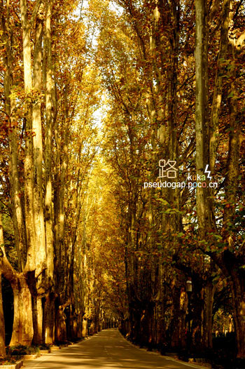

# 树木的死

** **

因为年幼也好，由于眼力有限也好，我从未见过路的尽头。比起无尽的路，天上密密的云朵们也是一样的。我常边走着边仰着头检查着它们细致的纹理：那和我见过的任何一样东西都不同，无论岩石、栽植的树木还是月光下的瓦片。我模糊地感到：只需我抬起脚，路便又像蛇一般向前爬去了，于是我总是可以继续走下去的——事实上，如果凑巧夕阳正把这世界染黄，路还能看上去更远一些。

我与路的幽会往往是在晚上，而这时我总是心有旁骛地看着一边亮着黄光的路灯。灯光向下撒去，空气里各种懒惰的蒸汽便在灯光里酣睡着，改变着光的路径。这场景时常令我产生某种微妙的幻觉：那些微小的水珠正凝结在那被照亮的地方，形成了一只欲滴的乳房。当然，我走过的街道和见过的路灯并不全是如此。在南京的街头，我也曾见过许多的路灯被道旁梧桐树浓密的树叶包围着，就像是历史上某个周末的巴黎正被海盗所包围一样。我幻想那穿着金色铠甲的奥多伯爵，他正跃马冲击黄绿色的维京人的阵地。奥多伯爵的突围想必是成功了——来自冬天的寒冷杀来，维京人手掌形的尸首便从攻城的云梯上坠落。风让他们落在南京的每一条街；雨让他们静静地躺在地面上，贴合如一，仿佛是某个狡黠的画匠在地面上留下的作品。有时候，即便风还躲在枝杈间，雨还躲在云里，他们也依然三三两两地逃离战场——也许因为寒意。而一切也就随着他们落在地上宣告结束，慢慢地，在平静中开始安居乐业。嗯，那光秃秃的树杈似乎从未有过树叶似的。

而当我回忆起淮安街旁年迈而坚实的梧桐树时，则是一种更加平和的感受：就像是一只伴随着我生命的钟表，他记录了我的第一次脉搏，倾听着我幼年的每一次呼吸。在我的成长过程中，他必定曾反反复复地唤过我的名字，欣喜地、失望地，或是怒气冲冲地。什么，梧桐不会说话？不，不可能。他会的，一定会，肯定只是我一时忘记罢了。同时，我也认定：从我不能预知的某个日子起，这种呼唤便不会再有了。他会老去，老到糊里糊涂忘记一切，老到忘记了我是谁——就像每个阿尔茨海默症患者那样。于是，他也许会看看眼前的这个年轻人，愣上半晌，却若无其事地走开了，丢下一个欲哭无泪的我。他注定也是一样要死的，反正到最后，或许只是来了个表情淡漠的医生，下定义似地昭告众人：“喔，又是一棵死于阿尔茨海默症的梧桐树。”

我想这医生应该也是一棵什么树才对，比如说是榉木之类的。而我曾认真地假想过一个属于树木的城邦。并且，这棵死去的淮安的梧桐树也是其中的一名市民。和其他的市民一样，这个假想的国度里每一棵树，最终都死于阿尔茨海默症，即老年痴呆。

既然是城邦，或早或迟，总是会陷入战争的。这些战争可以是在各个城邦之间的，就像雅典和斯巴达；也可以是城邦的总和与外敌之间的，就像希腊和波斯。总之在我的故事里，终于有一天，梧桐树所居住的城邦遭遇了可怕的战争。得到了命令，他和其他五千棵梧桐树一道，便动身前往千里之外、百越之南的敌邦。他们必须为了那棵被称为执政官的梧桐树眼里一切正义的理由，踏上敌人的国土，消灭一切可以看到的入侵者。而入侵者们，个个骁勇善战。

从他们去的那天算起，也许是半年后，或者也许是一年后，战事便宣告结束了。梧桐树和幸存的战士们回到了故乡。他们也许胸前挂着各色勋章，兴许路边还有热烈而又井然的欢迎队伍之类。可是，无论怎么数，这些梧桐树的总和都再也不到原先的五千零一棵了。

“不见的那些哪里去了？”——不会有人这么问，因为战争总是免不了要造成些许死亡，这是谁都知道的。再者说，即便问了，又有谁会知道呢？也许会有某棵梧桐树的遗孀找到了丈夫生前的战友们。 当然，她也是一颗梧桐树，手里应该还拿着丈夫的军衣——必定是她丈夫走前留予他们贫穷的家庭的，把自己可能的死亡所将带来的损失降至最低。月亮照在这寡妇流着泪的脸上，月光带来的苍白让她看起来如同处女般一无所知。战友们支支吾吾，自然，这其中也包括那棵我熟知的梧桐树。

“在战壕被炮弹打死了？被敌方平民用手榴弹同归于尽了？水土不服病死了？……还是因为被死亡吓破了胆子，当逃兵被军团长枪毙了？”——他们谁也不知道到底是怎么样。最后，军团长辟谣般地解释道：“喔，他是在战壕里被炮弹打死了。”是这样么？我也不知道，看起来也不重要：寡妇抹着泪眼回去了，和她拿到的抚恤金，一边掂量着未来的生活。而战争的另一边想必也是这样的场景：幸存的后辈和远方迁来补缺树木重复着父母们的故事。在每一个夜晚，他们以各式各样古怪的姿势交媾着。待到他们如同寒冬的雪，最终在土壤里慢慢溶解，他们的子辈又将重复这些故事——如此循环，就像齿轮一般转动着，永不停息。

而那棵梧桐树呢？他只是从五千零一分之一，变成了五千零一不到分之一。即便他与我来说意义重大，但是，他对于执政官和军团长无疑也是“意义重大”——正如他们的演说中说的那样。

而只有我知道：无论如何，他们都会在未来的日子里因为阿尔茨海默症丧生的，反正。而最后，只是走进来一棵表情淡漠的榉木，宣布道：“喔，又是一棵死于阿尔茨海默症的梧桐树。”

（采编：应鹏华；责编：黄理罡）

 
