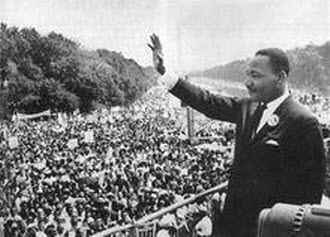
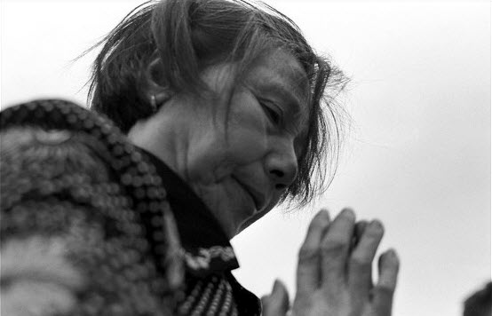

# 梦就是梦

只要是人都是依靠自己的知识与认知并被之束缚地生活着，那就是现实。但是知识与认知是模糊不清的东西，现实也可能只是镜花水月。人说到底都活在自己的执念中。

梦是美好的。某人睡觉的时候做了一个美梦。梦里，这个世界实现了他所有的愿望，他就是这个世界的主人。可是当梦醒时却发现，那只是一场梦，自己什么都不是、什么都没有。他愤怒地责问世界：为什么一切不是我想要的样子！当然不会有人去理会他，于是他站到了这个世界的对立面想用极端的方式改变这个世界。

后来就出现了两种情况，世界很快将他击败了，但是他向周围的人宣告：世界践踏了他的梦、他的自由。有的人信了，和他一起和世界作对。最终世界产生了分裂，陷入了混乱。世界毁了。他的梦呢？嗯，一定是实现了！不然不会有人凭他一句话就跟随他！第二种情况，世界屈服了，他成了世界的主人。可是世界并没有像他梦中的一样美好，不停地有人站出来想要改变他的世界。他当然不甘于再次一无所有，于是奋起反击，各种势力洗消彼长，永无宁日。世界毁了。他的梦呢？呵呵，一定是实现了！不然怎么会有多人同时在争夺这个美好的世界！

“他”可以代表生活中的一个人，或者一个群体、国家。几年之前T同学做了一个这样的梦，后来实现了不过他好像变成了红黄两色。去年L同学做了一个同样的梦，他好像也实现了，看起来还挺幸福。对了！还有前段时间最出名E同学，他也一样，最近听说他那还有百万人的游行呢，连法官都罢工了！真了不起！我还听说最近S同学也做了一个同样的梦，A和EU同学正帮他实现呢。原来实现自己的梦是这么简单，于是C同学也去做梦了。听说因为梦里有人跟他抢粥，他就醒了，现在正发火骂人呢。

生活中，一个人梦醒了会怎么做呢？我不知道。你们有听说有人因为梦而去违法乱纪的吗？可能你们也不知道。但是我觉得一个正常的人应该是一步步实现自己的梦，厚积薄发而不是期待能一下解决问题。我们已知的一直被“他”批评的历史中，社会最黑暗的时期不也是想要一步实现梦想造成的吗？想用一样的方式，“他”一定很喜欢走夜路吧。红太阳不是这样升起的！这样也不会让另一轮太阳升起！烈日正当空，半羽冠在顶。没有一步步的积累，想要实现梦是不可能的。吓坏了那一半的羽冠，自己连一片遮阳的地方都没了。

梦就是梦，醒了就醒了，要么回去睡，要么脚踏实地的实现这个梦。

（采编：郑萃颖；责编：周拙恒）
