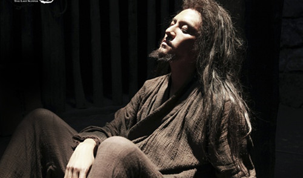
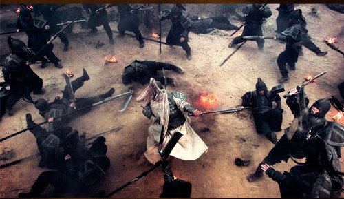

# 楚歌

“当时我只是急着回家了。”韩信这么对陆贾解释道。“因为天色很晚了，我必须回家去。”

这个理由显然不太能令汉国最犀利的辩士满足，要知道，就连刘邦本人都以曾和他侃侃而谈感到自豪。“尔等比陆公，相差可是不能以道里计了。”在面对南越民间使团的蓄意刁难时，刘邦很淡定地这么说。代表团们认为由中央政府来指定南越统治者是失约，但刘邦还是决定把陆贾派去南越，宣布对南越王赵佗的任命。这趟苦差事不花一年半载办不下来，于是陆贾决定走之前来见见韩信，顺便问一些困惑已久的问题。
 
“你就不要骗我啦。”陆贾说。
   
“这可是真的。天一晚我就想回家去，一直都是这样。”
   
“再搪塞我，我可就起程了，南越那地方瘴气多，听说最近还在搞运动，闹着要把使者扣起来杀头，指不定我就回不来了。到时候你可千万别后悔。”
    
“你这点倒是提醒我了，既然你此去吉凶未定，移动硬盘还是应该交给我保管，要不然可是人类文明一大损失，六世纪的江陵和前四世纪的亚历山大港都要甘拜下风呢。”韩信戏谑地说道。
      
多年之后，长安城中的著名旅游爱好者、公共知识分子、剧透学硕士与柏拉图爱情主义者司马迁在记载此次对话的同时，很是发了一番咏叹。他说，大家没想到的是，最终陆贾完成任务回到了长安，这时却得到了韩信已经被一根绳子勒死的消息，啊，人生是如此无常，所以大家要更加珍惜生命。就这样，读者又被剧透了。在剧透这门艺术的贡献上，太史公绝对是个中翘楚，描写项羽的时候，他的每个单词几乎都让人明白“这家伙最后一定会悲壮地失败”，对于一本书的主角来说，这种做法的丧心病狂程度就像艾伦·里克曼头上贴着“我是卧底”四个大字出场，或者让唐国强在片头耸耸肩说“抱歉我最后还是没能兴复汉室”一样。
    
这种做法后来终于触怒了武帝，在他被司马迁告知李陵其实是在苦战后才不得已投降的时候，一种被剧透的羞辱感充斥了他，因为详细的战报要在总参谋部那群人经过详细的研究之后才能出炉。最后他们给出的战报支持了司马迁的判断，那上面显示在塞北的天寒地冻中，机械化部队寸步难行的李陵面临的境遇甚至比1949年新年来临之际徐州地区的邱清泉还要窘迫。但是这进一步坐实了司马迁剧透的罪名，于是他得到了皇帝的惩罚。
    
这个故事给我们的启示是：剧透是一种不正确的行为。当然，在《变形金刚》开始前告诉家里的妹妹“擎天柱最后不怂了，打跑了威震天”，这样的行为还是值得鼓励的。

剧透之所以这么招人讨厌，最大的原因是它抹杀了未知的乐趣，据说这正是人类进步的源泉。不过，多年前游荡在淮阴街头的韩信未必支持这个看法，他生活中最大的不确定是不知道每天的晚饭在哪，而这种不确定显然会带来很多麻烦。

    
年少时的那种窘迫感常常占据韩信的内心，这甚至影响到他后来的指挥风格。最典型的例子当然是高祖三年的井陉会战，在那场战争中，韩信背水列阵，并最终击败了强盛的赵国军队。对此战的解释历来十分不一致，有研究者声称这只是当时地图绘制工业的粗糙误打误撞导致的喜剧结果，而西格蒙德·弗洛伊德在1910年第一版的《精神分析引论》中专门提到了这位东方将军的例子，他认为这样诡异的指挥是韩信从童年形成的某种隐晦性心理的曲折表达，并且这种作战风格很可能和同样善于将部下逼上绝路然后爆发出惊人战斗力的项羽有某种隐秘的关联。韩信仕楚时的史料发生了严重缺失，这进一步给这段历史抹上了迷雾。
    
不过这些当然都是后话了，在韩信生活的时代，心理学事业尚不十分发达，因此韩信得以避免被当做孤僻症患者接受强制的社区心理干预，这既是幸运，同时也是不幸。试想，如果Will Hunting得以生活在韩信的时代，那么他多半要被始皇帝拉去修长城，每天垒砖，至死方休。自然他或许可以被百夫长看中，演算一些诸如临洮到辽西的距离这样的东西，但这些也与大局无补。不论何时，闲着没事的年轻人总要找点什么事做，这其中包括修长城，打DOTA，或者闹革命。由此可见竞技游戏的发明为社会稳定作出了多大的贡献，而在此之前，不想去修长城的年轻人能选择的出路就很有限了。
    
在选择了第三条路的年轻人中，最出名的一个人便是项羽，他是个纯正的楚人，和韩信一样。楚人，这个名词在前二三世纪之交的名声大约和如今的拉玛西亚青训营有两点相通之处，一，那里的人都很聪明，很会用计谋博取胜利；二，那里的人都是小矮子。从他们的一生来看，韩信证明了第一点，项羽则证伪了第二点。
    
在渡江西向，投入革命的同一年，项羽在首轮第26顺位被大洋彼岸的印第安篮球联盟选中，选秀报告上赫然写着：“扎实的身体基础，惊人的爆发力与弹速，优秀的护框者，可以从两侧腰位运球发起进攻，破坏力极强，令人担忧的是射术尚不稳定，且往往过于自信而导致失误”。这份报告很好预言了项羽后来的结局，事实上，如果他的箭法能再准那么一点，广武山上的刘邦就提前成为一具尸体而不是子弹擦心而过的东条英机了。
    
由于正忙着跟随叔父闹革命，项羽没有当成运动员，这让他感到很遗憾，以至于后来他还对从那里退役回来的樊哙专门问起这件事，后者则一边切着牛肉一边豪爽地回答：“霸王，打天下这个游戏可比打球好玩多了。”
    
此时韩信牵着项羽的乌骓马刚好路过阶下，听到了这句话，他不置可否地走开了。如果可以选择，他更想过一种在阴天的日子里窝在自己家里的被窝中，一边看着本月新番一边吃着零食的生活。但问题在于，帝国疆域之内，不合法家信条的文艺作品已被禁绝许久，官方说法是它们已经全部在咸阳城外七十里的大坑中被付之一炬，若干不合规范的民间图书馆也被勒令关闭整改，虽说理论上说整改完毕后仍可恢复开放，但目前看来仍然是遥遥无期。但也有传说称，它们的副本仍被妥善珍藏在帝国图书馆的深处。据说该图书馆由无数太极形的回廊组成，中央有巨大的通风井，每层回廊上都可以看见上一层和下一层，就如这片土地上发生的革命一样没有尽头。
    
这个传言令韩信把进入咸阳，找到那些遗失的动漫当成了下一阶段主要的人生目标。他本想写一张纸条告诉收留自己的漂母这个消息，但他突然想到漂母并不识字，于是他唤来家里的秋田犬，拍拍它的头说：“我也许明天回来，也许永远也不回来了”，然后一直向北走。某日暮色四合时，他走到长江岸边，一支正在行军的庞大军队吸引了他，不过还没反应过来，他就被当作奸细被抓住了。他被带到项羽面前。
    
“你是哪里人？去哪里？”项羽居高临下地看着韩信。
    
“我是楚人，要去咸阳。”
    
“我们也要去咸阳啊，我们一起走吧？”项羽露出牙齿一笑，说。

啊……”韩信习惯性地犹豫了一下，“好的。不过，我们现在这是在哪里？我们出了楚地么？”

“还没呢。你没听到楚歌吗？”项羽勒住乌骓马说道。“天晚的时候，风里就会有楚歌的声音，所以我们还在楚地呢。”
    
“可是将军，我似乎没有听见啊。”韩信说。
    
“真逊啊，亏你还是楚人。”话音未落，项羽已经一夹马肚走远了。
   
“不不，我在淮阴的时候听得很清楚的，大概是这里人太多了吧……”韩信紧张地辩解道，可是落日下的马嘶声淹没了他的声音。
    
尽管江东的士兵们气势如虹，最先进入咸阳的却不是他们，这让韩信有一些失望。当项羽得到这个消息时，他刚刚率领士兵破釜沉舟渡过黄河，以雷霆万钧之势消灭了秦帝国的精锐集团军，其英姿有如在秋日的阿尔卑斯山前对战卡西乌斯的斯巴达克斯。“只要渡过黄河，暴秦便永远无法奴役我们！”这句战前誓言因此永铭史册。而与此同时，一支奇怪的武装力量正沿着黄河南岸飞速向帝国的心脏咸阳突进，而他们一路上遇到的抵抗比镜头前的麻仓优还要微乎其微——这后一句是韩信听到消息后懊丧的评论。项羽的表现则更为直接——他来到营寨后的山上，先狂奔着追到了一只赤牝鹿，又徒手制服了一群食人马，这才稍微解了一些气。
    
之所以说这是一支奇怪的力量，是因为这支力量的组成人员十分杂乱无章，至少在项羽方面看上去是这样，因此，在分兵的时候，他们根本没有考虑到这支力量会首先进入咸阳。这支力量似乎可以承担任何形式的任务，除了在一次战争中直取敌方首都取得头功。
   
“这就是你一开始对我们的印象？”萧何侧过头问韩信，此刻他们正坐在夜行汽车车站的候车室长椅上，远处的灯火渐渐明灭。
    
“对啊，当时霸王军中总传说汉王是一个郁郁不得志，除了人缘一无所有的怪大叔；子房君是一个写了‘引刀成一快，不复少年头’这样的诗句却总被猥琐男认成妹子来搭讪的少年；樊哙是一个冲锋时每次都要一边旋转着一边喊着“人在塔在”第一个上前去的退役篮球运动员……”
    
“这些在事实上都没有错。当然你也看到了。”萧何温和地说。

“额……当然还有您。当时我对您的传言特别感兴趣，原因是据说您……进了咸阳城后是唯一跑到帝国图书馆里去的人？其实我来咸阳的目的也是图书馆。他们当时说您唯一感兴趣的事就是各种数字，粮秣的，武器的，人员的，无论军队前进还是落后，您只是整日把自己埋在草稿纸里。”

“这也没错，我来咸阳的目的就是国家统计数据库，这对我来说意味着世界。不过真正见到以后还是有点失望，算法的效率还是偏低，现在正在进行全面的改造，希望很快能见到效果。”萧何推了推眼镜说。
    
“嗯，不过既然您只关心数字，怎么又会想到来追我？我是专门选择晚上的时间离开的，和我关系最好的灌婴估计此时还在睡大觉呢，更别说我和您在这之前根本没说过话。”
    
“那么我先来问你吧，你为什么要离开呢？”萧何反问道。
    
“因为我不适合这里，我还是只能听到旷野里的楚歌才能睡着。我觉得坐午夜汽车悄悄回家乡去，和隔壁面包店店主的女儿结婚，这对我个人来说是最好的结局了。”韩信说。
    
“我知道你不需要我们，不过我们需要你。”萧何说。“我建立了一个数学模型，对当前的情况进行了严格的模拟，发现如果我们要夺得天下，只差一个你这样的人了。我知道你想回去，不过既然你是跟着项籍过来的，就跟着我们回去吧，时间不会很久的。”
    
“天下？”
      
“对，天下。”
     
韩信看了一眼萧何，此时，他们似乎连走出关中都还希望十分渺茫。在这种情况下谈到“天下”两个字，多少让人觉得有些幽默，不过萧何恳切的语气让人很难有这样的想法。
    
“那意味着所有的河流，所有的村庄，所有的歌谣，所有事物的集合。”韩信说。
    
“不，还远不到所有。”萧何说。“你应该去学学数学，到那时你就知道，比起宇宙来，天下只不过是麻雀的脑髓而已。”
    
此时夜渐渐深了，灯火渐次零落，仅有路灯和霓虹灯仍然亮着，候车室内的大钟一如既往地走着，由于两个人都没有说话，秒针的声音似乎清晰可辨。
    
“在那种情况下，确实很难拒绝。就像在星期四的宁静午后，你吹着口哨路过棒球场，这时有一个容貌清秀的女孩子对你大喊道：‘我们还差一个捕手！’你这时候难道不该全速奔跑过去吗？”多年之后，已成为十万大军最高指挥者的韩信在垓下的战场上对灌婴说。
    
“可是，如果一群脑子里除了自作聪明的想法什么都没有的人对您说‘我们就差一个程序员了’呢？呃，我只是举个例子……”灌婴犹豫了一下，说。

“难道我们是这种情况吗？”韩信说。

“当然不是。不过，我想也不是您的那种情况。”灌婴说。

韩信不置可否地摇摇头，又说道：“不过你知道，我一直不太擅长拒绝，从淮阴起就一直这样了。”

灌婴明白，在大将军的世界观中，“拒绝”这个概念并非一个实在概念，而更多的是哲学上的概念。这里的“拒绝”分为两个层次，第一个层次自然是回绝他人，第二个层次，按照韩信自己的说法来说，是“拒绝那些自己应当获得的或追逐自己不该获得的”。正是因此，在战事达到高潮的时候，他向刘邦送去了请求被封为假齐王的信。
    
刘邦显然对此大为光火，一脚踢翻了洗脚盆，没有人敢接近他，只有张良大步上前说：“主公，您要知道，如果人不知道自己受到必然性的强制，他就不可能自由，因为自由只存在于对这种必然性的挣脱之中。”
   
“听不懂。这又是什么腐儒的蠢话，郦食其这种道理懂的最多了，可是他已经变成一道红烧里脊了。”余怒未消的刘邦说。
   
“这可不是腐儒之见。”张良对于刘邦的怒气早已习以为常，每当此时，他都会一直用自己那张俊美的脸盯着刘邦，直到对方消气为止。
    
于是韩信成功得到了齐王之位的册封，并随即率领大军南下作战。出征前，灌婴代替一向不喜欢作公开演说的韩信向士兵们训了话：“亲爱的小伙子们，过去的一年里，你们的足迹踏遍了北方大地，让所有的旧贵族都匍匐在我们的脚下。现在，让我们去彭城洗刷我们战争的躯体吧！”此时，全场的气氛达到了热烈的顶峰，但韩信却显露出满怀忧虑的表情。
    
“大将军，您在想什么？”曹参一脸憨直地问道。
   
“恐怕此刻也是我和诸君的人生巅峰了吧。”韩信说，“我只是预支了高潮来临后的感伤而已。”
    
“为什么要预支？”曹参追问道。
   
“因为那时候要忙着去死。”韩信答道。看到曹参震惊的表情，他说，“不要紧张，我是开玩笑的。”
    
曹参没有怀疑韩信的话，因为后者的幽默感并未随着多年的军旅生活而流失。在钟室听到死刑的宣告之后，他还最后幽默了一把，当然他自己并不这么认为。
   
“我能见见萧相国么？”韩信说。
    
屏风背后没有回答。
   
“转告他说，我还是走进那扇窄门了，这样挺好，我很满意。”韩信自顾自地说着。失去意识前，他一直想着“这样会让我感到很孤独啊，为什么不派很多人来参观对我的行刑，对我发出仇恨的喊叫声呢？偏要这样，真是的……”
    
听到回报之后，刘邦沉默许久，至于他最后说了什么，除了张良无人知晓。只有那天不小心闯入的一名侍者，看到了张良抚摸着刘邦的头，不停念着：“人类没有时间了解事情了，他们只能购买现成的东西，所以人类没有朋友，事情就是如此啊……”
    
三匹马依然站在山坡上，远处是层层叠叠的汉军，一直绵延到视线所不及之处。“您说从淮阴起就不知道怎么拒绝，这中间包括……那件事么？”尽管灌婴在一边不停地用眼神来示意，耿直的曹参还是问出了这句话，灌婴摇摇头想“不愧是汉军的米达麦亚啊……”，他担心地看向韩信，后者却仍然是一副没什么触动的死样子，简直让人想到凌波丽。
   
“你说的是我在淮阴从那个人的胯下钻过去的事么？”韩信问道。他又继续说，“那只是当时我想回家了，因为街巷的风里飘来了楚歌，所以我想回家了，于是就不和他计较了。”
   
“事情究竟是不是如此呢？不过也没有关系了。”灌婴想着，抖了抖缰绳，看向远方。隐约有楚歌的声音传来，不过听得不太真切。天已经黑下来了。

根据斥候的最新情报，项王将在今夜展开突围行动。

