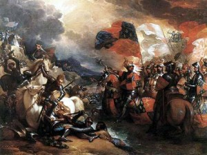
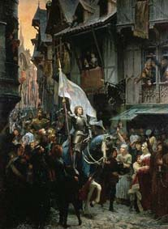

# 欧洲民族国家的诞生（上）——产生于战争的英格兰和法兰西

** **

我在《为什么民族主义发端于欧洲？》一文当中提出欧洲形成民族国家是因为其独特的地理特质，岛屿和半岛环伺欧洲大陆，形成天然的独立地理单元。欧洲早期的先民虽然有着各自民族和文化的差异，但是融合于一片于其他地域有着明显地理界线的土地，逐渐生成了利益共同体意识，成为了之后的民族国家。

这个理论似乎是很浅显单薄的，有人指责这只是一种肤浅的地理决定论。但就欧洲本土而言，英格兰、法国和西班牙是三个率先成为民族国家的地区，分别是岛屿、大陆独立地理单元和半岛。地处内陆、边界勘分并不明显的神圣罗马帝国则一直拖延到1870年才开始出现统一。可见是否是独立地理单元这一变量的影响有多高。

我们把眼光转移到熟悉的亚洲，会发现亚洲最先形成近代意义上民族国家的国度是岛国日本，尔后跟进的又有半岛韩国和另一个岛国台湾。日本一直到19世纪中叶依然是个标准的封建割据社会，其社会组织结构和西方中世纪有着惊人的相似。日本的崛起，第一步就是建立一个近代意义上的民族国家——这也许是明治时代的政治家们自己都没意识到的过程。其初衷动机和几个世纪前一些西方民族国家也有着很大的雷同之处，即由于外族入侵，激发了人们曾经尚未意识到的利益共同体的事实。从1868年明治维新伊始，日本在不到短短半个世纪的时间内走完了从中世纪封建割据—中央集权的王权国家—近代君主立宪民主国家的成长历程。这也就是近代欧洲民族国家形成的缩影。

观及中国大陆，由于其庞大而封闭的特质，在这片土地上论及民族，说法只怕笼统而混乱。事实上虽然中国的版图上很难根据独立地理单元的标准划分出几个真正意义上的民族国家胚胎，但是中国本身已经具备像欧洲各民族一样显著的地域差异。这些体现在语言、文化、经济发展、地理气候和族群内部认同等等方面。中国自古就是统一于至高无上的皇权。董仲舒为西汉帝国贡献的“大一统”思想，已经深深植根包括现在每一个时代中华帝国统治者的执政理念中，成为最为不可动摇的政治正确。中国的历史教育中上将国家的“统一”设定为古代君主对历史的一大贡献，实际上指的就是对外的征服和扩张。这种政治正确的意识通过历史政治教科书，将“自古以来”、“不可分割”之类的意识灌输给每一个中国人。让他们对所谓的领土问题极大地敏感，并相信中国必须维持现在这个版图，要有一寸土地胆敢宣告独立那就是极大的原则性政治错误。

民族国家形成的时期是中西最终历史命运的一大分水岭。当然，造成今天中西差异的原因还有很多很多，但民族国家的形成与否实是在所有其他变量产生效应之前，这导致了日后两者截然不同的国家结构组织方式。

有的观点认为西欧民族国家的发展是伴随资本主义的抬头。事实上早在资本主义萌芽之前民族国家已经凸显了自己的苗头。1337-1453年，西欧的两个封建大国英格兰和法国进行了一场人类历史上耗时最长，长达116年的战争，史称“英法百年战争”。

1066年，来自法国诺曼底公国的诺曼公爵，后世称之为征服者威廉的威廉一世，以血缘相近和之前的许诺为由，要求继承英格兰王位。在教皇的支持下，威廉带领大陆的7000精兵渡海西征，击败了奥格鲁—萨克逊时代的最后一位英国国王，哈德罗二世，夺得了英国王位，建立诺曼王朝。这是英格兰继古罗马人、盎格鲁—萨克逊人和丹麦人之后第四次被异族征服。威廉入主英格兰的数十年后，其子孙亨利二世通过继承的方式获得了大片领土，建立了安茹王朝。这个王朝也叫金雀花王朝。

“诺曼”的意思即“从北方来的人”，他们原本是斯堪的纳维亚的蛮族。在入侵法国后，皈依了基督教，并接受了法语作为自己的语言，以至于后世英格兰的统治阶层一直使用法语。安茹帝国地跨英吉利海峡两岸，英格兰国王同时也世袭诺曼底大公的头衔。这个帝国在欧洲大陆历史上最大的疆域几乎是今天整个法兰西共和国的西边一半。

843年，“秃头查理”和日耳曼人路易及末代君主“虔诚者路易”在凡尔登签订《凡尔登条约》，将帝国一分为三。这三块就是今天意法德三国的雏形。值得一提的是842年路易和查理在斯特勒斯堡宣誓反对查理曼大帝的长孙罗退尔，使用的誓言分别用古法语和和古德语写就，这是迄今为止所知的最古老的有准确日期的德语和法语文献。从一个侧面证明查理曼帝国的瓦解和勘分也是基于某种基础上的。

《凡尔登条约》堪称法兰西独立建国的标志，至此法国史才算真正开始。由于前帝国的分裂，防御力大大下降，外族趁机掀起侵略热潮。让法兰西人最为惶恐的是北方的诺曼人。作为法兰西的开国之君，“秃头查理”似乎在与其兄长争强斗狠时表现得智勇双全，但是遇上蛮族就疲软无力。其子孙“天真汉查理”于911年将塞纳河下游沿岸割让给诺曼人，授予其公爵。交换条件是诺曼人皈依基督教。

“天真汉查理”之后，其子的宫相于戈·卡佩建立了卡佩王朝。但是法国王室在西法兰克时期王权威信就已经被那几个无用的“查理”们透支得差不多。卡佩王朝诸侯坐大，国王连自己固定的首都都没有，常在巴黎和奥尔良之间换来换去。然而之后卡佩王朝的几位君主，从第五任路易六世起，王权才有所起色。加之之后国王挑头组织十字军东征等契机，路易七世才真真正正的当得像个国王。

回到我们之前提及的“金雀花王朝”。这个王朝究竟是怎样来的呢？至此我们已经可以看出英法两国早在战争之前有着什么交集。英格兰和法国的一部分都是诺曼人的征服得来的。截止到金雀花王朝的建立，这个王朝虽然血缘上继承自威廉一世（即征服者威廉），但是面积却比原本的诺曼王朝长出来不少。

威廉一世的子孙亨利一世虽然戴有英格兰国王的皇冠，本人大部分时间却不在英格兰，而是顾及自己在大陆的封地诺曼底。1120年，原本的王储海难丧生，亨利一世把王位传给了公主马蒂尔德，但贵族们不愿裙下称臣。亨利一世一方面稳定贵族们的情绪，一方面将女儿马蒂尔德嫁给安茹伯爵——这个伯国名义上的领主是法国国王。这桩婚事使得贵族们认为英格兰未来的领主将是非诺曼血统的安茹人，他们就更加不满了。于是他们拥戴威廉一世的外孙斯蒂芬渡过海峡加冕（英格兰国王），将马蒂尔德打发回了大陆。

1139年，亨利一世的私生子、艾利主教尼杰尔起兵造反，北部又有苏格兰王国举兵南侵。马蒂尔德趁机在内战中获取了英格兰的治权，当了一短暂时间的女王，之后又因贵族反对而回到了诺曼底。斯蒂芬虽然重得王位，但是与贵族的合作关系趋于破裂，在王位上勉强待了10年，鲜有作为。

1153年，马蒂尔德的儿子亨利（亨利一世的另一个外孙），凭借他在欧洲大陆的军事实力来到英格兰向斯蒂芬索要王位。斯蒂芬大概也表示国王难以胜任，很快将王位让给了亨利。

亨利的父亲是安茹伯国的伯爵左弗莱，母亲马蒂尔德则是诺曼底公爵亨利一世的女儿，现在又得到了英格兰的王位，同时又凭着自己的倜傥娶得了原本嫁给了法国国王路易七世的阿基坦公国女公爵阿莉艾诺，合并了阿奎丹、波瓦图和加斯科尼。这也就是我们前面提及的安茹帝国第一位国王亨利二世，他坐拥从父母和妻子那儿继承来的海峡两岸大片疆域。因为亨利二世和父亲都喜欢在头盔上斜插一枝金雀花，因此安茹帝国也得名曰金雀花帝国。

这边厢，对于法王路易七世而言，让法国人郁闷的是原本一个属于自己的伯国领主权已经不在自己手里，自己政治联姻又被亨利二世窃取。亨利二世在大陆的领土陡然间膨胀了许多，比自己王室的领土大出五倍。路易七世之前又加入十字军第二次东征，可谓人才两空。原本法王和诸侯间勾心头角已经够疲惫的了，现在面对的主要矛盾已经从诸侯身上转移到了与英格兰（金雀花王朝）——这个为另一个和自己身份对等的国王所统治的王国身上。

1180年，路易七世之子菲利普二世继位，在位期间新国王不仅使得卡佩王朝空前强盛，并且也开始着手恢复之前被英格兰人赚取的领土。菲利普二世先是挑拨亨利二世与“狮心王查理”、“失地者约翰”（这两位国王在英格兰历史上都非常有名。前者是第三次十字军东征的主将，后者被迫和贵族签订了著名的《大宪章》）兄弟之间的矛盾，坐收渔翁之利。1200年继承了王位的失地者约翰与菲利普二世签订古莱合约，承认自己为法王的封臣，并割让了大片土地。尔后菲利普二世又帮助狮心王查理的侄子阿瑟反对约翰，一举收回诺曼底、安曼、布列塔尼。

1214年，不甘心失地的失地者约翰纠集神圣罗马帝国和几个伯爵共同进攻法王，双方在布汶展开激战，最终法国人击败了声势浩大的敌军，甚至一直追击到了伦敦。这场战役很大程度上加强了法国王室的威信权力和法兰西民族的凝聚力。

1285年菲利普四世即位。菲利普四世趁着英王爱德华一世忙与苏格兰的战争（这位爱德华一世就是影片《勇敢的心》当中的“长腿爱德华”），吞并了原本属于英王的斯嘉贡地区。至此，法国基本已经连本带利占据了整个原本属于英格兰王国的封土。

1328年，由于卡佩王朝的最后一位国王膝下无子，王位继承遂成问题。当时觊觎王位的有两个人，一个是查理四世的旁系表弟菲利普·瓦罗亚；一个是爱德华一世的外孙，当年嫁给爱德华二世的法国公主（这个公主也在《勇敢的心》中出现过，苏菲玛索饰演）的儿子爱德华三世。在法国贵族的支持下，最终获得王位的是前者，是为菲利普六世。法国进入了瓦罗亚王朝统治时期。

卡瓦罗王朝的建立离1337年英法百年战争的正式爆发只有最后九年。战争的直接诱因就是爱德华三世的野心未遂。这位国王雄心勃勃，成长于王室和贵族的钩心斗角的环境之中。爱德华三世的母亲与情夫莫迪摩长期把持朝政，最后他处死了莫迪摩，监禁了自己的母亲。这样一位国王面临英格兰历史上一大重要的十字路口。金雀花帝国往昔的广袤已然不在，而此时的法国又咄咄逼人。法国人企图直接控制羊毛贸易和生产重镇弗兰德尔公国，法王授意弗兰德尔公爵监禁了该地所有的英国人，而英国也通过下令监禁在英国的弗兰德尔人并中止与弗兰德尔的贸易作为报复。此时的弗兰德尔不堪忍受法王沉重的赋税和欺压，投靠了英国和法国为敌。同时法国甚至悍然干涉起了不列颠群岛的内部纷争，支持起苏格兰的叛乱，这更激怒了英国人。

英国人一方面看到了此时法国的强势，另一当面英格兰的骑士们也从来没忘记曾经在大陆拥有的大片封地。1337年法王没收了英国在大陆的最后一块领土。同年11月1日，爱德华三世遵照骑士精神的传统，向菲利普六世下了一道正式战书。

英军似乎不像法国人预先认为的一样容易对付，打得更为顺风顺水。英军初期夺得了海峡的制海权，保证了战争补给，同时陆地上的长弓兵也大显身手，将传统的法国重甲骑兵攒射得稀里哗啦。

1415年，英王亨利五世御驾亲征，攻陷了法国首都巴黎。1420年两国签订特鲁瓦条约，规定法王的女儿要嫁给亨利五世，而且享有法国王位的继承权。这标志着这两个西欧大国已经呈现出了即将合并的趋势。几个世纪之后，带有征服者威廉血统的英格兰统治者，似乎即将完整祖先的梦想。

然而，前法国太子查理逃亡到了法国南部，自称查理七世，誓要与异族入侵者斗争到底。这时的法国绝大部分北部已经被地区被英王亨利五世占领，并当上了这片地区的国王；南部以布尔日为据点的查理七世还在苟延残喘。

1428年，英军进攻南部的重要据点奥尔良法，法兰西民族的沦亡与否在此一役。就在奥尔良城破的最后关头，一个少女站到了民族战场的最前沿，用她的意志和勇气成就了一段动人的传奇。

她就是圣女贞德。

贞德出生于1412年，出生于法国东部。自小目睹了英军的烧杀抢掠。贞德的父母是虔诚的基督徒，贞德自称13岁的时候听到了一些“声音”，是上帝派遣圣徒指引贞德拯救国家。奥尔良围城，贞德前往守军指挥部，声称是上帝让她来拯救法兰西民族。在奥尔良居民的资助下，贞德身披铠甲骑着战马觐见王太子查理。

1429年，贞德手持王太子赠与的长剑率领数千法军救援奥尔良城，奇迹般的解围了被围困290天的奥尔良。至此之后又连连收复失地。翌年七月，王太子查理顺利登基称查理七世。年轻的贞德也因为救国壮举，被奥尔良人称为“奥尔良的女儿”。

然而贞德的如日中天的声誉却引起了查理和众贵族的嫉妒和忌惮。后者甚至准备出卖贞德。1430年的贡比涅围困战，守城官兵将偷袭失利的贞德拒之城门外，贞德被英军的联军勃艮第人俘虏，后高价卖给了英国人。1431年，贞德被以“妖术蛊惑”等罪名处以火刑，终年18岁。

贞德牺牲后，被她的壮举所唤起民族意识的法国人民继续着驱赶外族侵略的斗争。1436年法军收复了沦陷17年的故都巴黎。1453年两国签订合约，英法百年战争以查理七世的法国的胜利告终。

而后查理七世的子孙们通过一系列武力和政治婚姻等手段，逐渐完成了法国的统一大业。今天法国的轮廓就是那个时期被勾勒出来的。法国贵族们的封土被国王或明抢或暗收。以巴黎方言为基础的法语逐步普及。这个时代法国王权专制制度已经初露端倪，而一个全新的法兰西民族国家也在这种王权的凝聚下越发明显。法国历史上那些专制和崇尚政治强人的包袱，其实也是在这个时候起慢慢背上的。

而英国人则最终在大陆什么都没得到，但是英国的外族统治者已经通过这历时一世纪的战争和贵族平民形成了牢固的利益共同体。英国王室无法再觊觎往昔大陆的领土，只能把治理的注意力放在已经成型的英格兰岛上。更为重要的是，英法停战不久，英格兰本身又卷入了分别以红玫瑰和白玫瑰为家徽的凯斯特家族和约克家族的王位争夺战，史称“玫瑰战争”。战争大大削弱了英格兰贵族势力，为英格兰历史上的王权专制时期——都铎王朝奠定了基础。

战争结束的两个前封建大国的共同点，即两者的贵族势力大大削弱，王权在兴起。同时国内经济基础也发生了变化，货币地租和庄园经济在生产力的发展和黑死病的作用下开始瓦解，取而代之的是新兴城市和自由民。所谓的“市民阶级”也就是之后资产阶级的前身。这个群体在政治经济各方面领域崭露头角，与国王贵族分庭抗礼。两国的民族文化也出现了发展，民族文学登堂入室。英格兰上层统治者原本使用法语，教育界和宗教界则使用拉丁语。而民间有乔叟和威廉·郎格兰用古英语写成作品出版并流传。法国则有《那列狐传奇》等反映当时市民阶级面貌，用法语写成的民间读物出现。民间语言渐渐成为该民族的统一语言。

英法两国最早形成民族国家，有着它们独特的历史机遇。在战争的催生下，统一王权得到强化和成型。而王权国家则是民族国家的前身和基础。王权国家的形成也不仅仅只会因为战争，而是有着其他历史条件的作用。这是下一篇文章中要介绍的内容。

（来自投稿邮箱；责编：佛冉）

 
