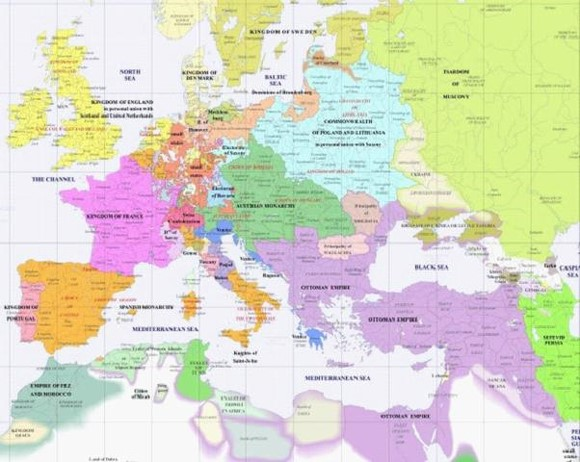
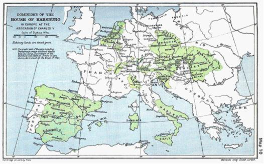
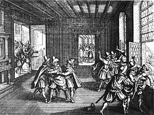

# 欧洲民族国家的诞生（中）1500年之后的欧洲王权国家系

** **

上一篇文章的主要叙述了英法百年战争，试图通过这场战争的沿革交待英法两国王室、贵族和平民在对抗外敌的战争中是怎样结为同一个利益共同体的。但事实上英法百年战争尽管在两国历史上具有重要历史意义或者说可以作为一个话题进行切入，还远不是民族国家形成的全貌。

1500年前后，是至今很多历史学者对人类历史的一道分水岭。这个时代的历史意义可谓是怎么夸大也不为过的。欧洲大陆告别了古老的神权时代，一种人类历史上前所未有的意识形态——资本主义初露萌芽。欧洲人登上了他们之前所不知道的两块新大陆，开启了人类全球化进程。

在以上种种翻天覆地的变化之中，王权（民族）国家的兴起还只是这这个伟大时代的一隅。然而它与上述种种前者间存在着内在而深刻的逻辑关系。

文艺复兴时期的很多学者，相对于当时的神权政治提出强化世俗王权，建立统一民族国家的主张。比较著名的人物就有“文艺复兴三杰”之一的但丁。他提出现实人的尘世幸福的前提是和平，而和平没有统一的国家做保障是不可设想的；要实现国家统一，就要依靠强有力的君主。这是基于当时的“人文主义”哲学思想所延伸到政治领域的产物。另一位积极鼓吹王权论的是意大利人马基雅维利（玩过《刺客信条》的都懂）。他早年在佛罗伦萨共和国从政，为他的君主洛伦佐·梅迪奇撰写了那本著名的《君主论》。马基雅维利赤裸地鼓吹性恶论和“无德政治”，要求君主兼具狐狸的狡猾和狮子的残暴。他认为人类自古以来就有共和制，像意大利这样混乱的国家，还是主张君主制比较好。马基雅维利同时也认为国家的利益至上，极其反感天主教会的干预。

文艺复兴之后的一个世纪，思想界又出现了以“民族国家”取代“王权国家”的思潮，意味着资产阶级要夺取传统贵族的政治权利，同时人民主权理论也应运而生。这种思想比纯粹反对教会的王权国家理论又进了一步。其中代表人物就是英国人约翰·洛克。洛克的学说受法国胡格诺派和加尔文教的影响，这些胡格诺派的理论家从借鉴中世纪经院学派和罗马法体系提出了一种立宪主义的观点。同时洛克也深受另一位英国政治哲学大师托马斯·霍布斯的影响。洛克赞同霍布斯关于人生而自由，国家起源和社会契约的论点，但反对霍布斯所谓在人们签订自然契约时放弃了所有自然权利的看法，也反对霍布斯所说的“一切人反对一切人”的原始状态。洛克的理论既强调“民主”，也强调“自由”，但实际上洛克是个自由主义者。他认为国家主权虽然属于人民，但为了保障各个人的各项自由权利，这种主权应该受到某些限制。如果限制主权，第一是保障人民的“革命权”，第二是对主权进行分割，划分为立法权，执法权和对外权三个部分。这之后又深深影响了法国启蒙运动时期的思想家。

所谓的民族国家，到底是什么呢？我们用一系列积极概念来刻画它。

相对于神权而言，早期的王权（民族）国家主权往往是掌握在一个强有力的国王而不是分散的诸侯或者被教会所操纵。民族国家内部的自我认同对象是“民族”而不是天主教或者新教。也有的民族国家诞生伊始就是被资产阶级民主化，而那些早期为国王所统治的国家最后也纷纷走上资产阶级民主制的道路。

相对于帝国而言，民族国家的疆域规模不及帝国，也非杂乱的多民族，有着自身统一的语言、文字和文化等方面自发的认同。简而言之民族国家是一个民族一个国家。民族是民族国家本身最基本的属性。民族国家有着一套完善的，现代化的官僚行政体系，保证自身的正常的国家生活。

相对于采邑封建而言，民族国家的最高元首是独立的，在这之上没有再高的封君。它或者是君主立宪制，或者是共和制，或者是开明君主或寡头统治。它的经济形态也和封建时代的庄园经济和农奴制大相径庭。支撑民族国家的经济主体是资本家和自由劳动者。

由于生产力的不断进步，就有的生产关系解体，奴隶主会发现货币而不是鞭子更能刺激奴隶和农奴的劳动，他们解放了农奴，利用雇佣的方式让他们为自己生产产品，而这些产品的最终去向是市场而不是制造者自身。事实上，这种以资本充实资本，寻求更高物质水平的过程，正是“资本主义”中“资本”一词背后的逻辑。

我们可以想象出这样一个样品。一个16或17世纪的欧洲国家。生活在这里的国民基本讲一种统一的语言，使用统一的文字。国王、教士、贵族和平民们会定期召开一个共商国是的会议。国王基本荡平了那些嚣张坐大的诸侯，也摆脱了教皇对自己头衔的控制，他积极颁布政策鼓励那些想要前往新世界淘宝的商人，和自治的城市也保持着不错的关系，为的就是争取到这些人对自己额支持。当然这些商人也市民也乐意看到以往伯国和公国的关税和杂捐得意废除，尤其是在重商主义背景下，来自政府的政策支持。他们也愿意充当国王的军队手持火绳枪推着大炮攻陷那些负隅顽抗的贵族们坚固的城堡。也许很多年以后当年支持国王的那些平民也会发现国王也有自己的小算盘，或许他们会发动另一场运动推翻或改良现有的君主制。——基本有着这些特征的国家，就是所谓欧洲近代民族国家，或者是近代民族国家的前身，民族君主国。

民族国家的国家组织结构、资本主义的意识形态、三权分立的具体操作手段等等元素，共同构成了500年以来人类文明的“现代性”。这种现代性彻底改造了人类的从精神世界到物质生产力的方方面面。

17世纪，欧洲基本上已经形成了一个民族君主国体系。

（图一 17世纪的欧洲）

西北角的不列颠群岛，克伦威尔的英格兰通过战争统一北部的苏格兰，不列颠民族国家也宣告基本形成，最终形成则要等到1688年的“光荣革命”。法国进入了亨利四世的波旁王朝，英法百年战争的主角之一，瓦罗亚王朝退出了历史舞台。早在上个世纪下半叶（16世纪）法兰西斯一世时代法国的君主制已经相当稳固了。西南的伊比利亚半岛1492年从穆斯林手中独立，产生两个民族国家，即西班牙与葡萄牙。更富有野心推广天主教和垄断海外贸易的西班牙在16世纪与英格兰都铎王朝的战争中铩羽而归，从此一蹶不振。东北部的斯堪的纳维亚地区，主要是在宗教改革之后信仰新教的丹麦—挪威王国和芬兰—瑞典王国。他们的东部是波兰—立陶宛共和国，面积远远超过今天的波兰。这是斯拉夫大家族第一个光宗耀祖的家族成员，甚至还迫使日耳曼人的神圣罗马帝国割让给他们土地，可惜没撑到本世纪末就衰弱了。在东部是另一个斯拉夫国家，莫斯科大公国。18世纪彼得一世的励精图治下，这个国家成为了俄罗斯帝国，他们也是上个世纪从[鞑靼](http://zh.wikipedia.org/w/index.php?title=%C3%C9%B9%C5%C8%CB%BA%CD%ED%5E%F7%B0%C8%CB%8C%A6%B6%ED%C1_%CB%B9%C8%CB%B5%C4%BD%D9%C2%D3&action=edit&redlink=1)人的控制下独立而来。至于欧洲的东南角，完全受制于勇悍的另一个帝国——信仰伊斯兰教的塞尔柱人所建立的奥斯曼帝国。奥斯曼帝国取代罗马帝国崩溃之后苟活了1000之久的拜占庭，控制着欧洲环地中海东岸的巴尔干和小亚细亚。

（图二 哈布斯堡家族鼎盛时期的势力范围）

至于亚平宁半岛和中欧的德意志兰，很明显他们还在状况之外。也许你们会问那一大块深绿色的地方是什么，那是奥地利哈布斯堡王朝的疆域，同时也是“神圣罗马帝国”的组成部分之一。这个发源于今天瑞士北部，最早出身居然是山地农民的家族所辖领土曾冠及欧洲。奥地利哈布斯堡家族从1282年从波西米亚王国（大部分位于今天捷克境内）夺取奥地利，就一直统治着这片区域长达将近550年，一直到第一次世界大战结束。虽然历史上这个家族的土地一直在大开大合地变化着，奥地利始终是哈布斯堡家族一直以来的大本营。

哈布斯堡王朝在我们的历史课本上似乎是一种完全没有存在感的存在，大概是因为这个家族所辖的国家近代史上也基本是些二三流的酱油角色。唯有奥匈帝国还有几分前帝国的霸气遗风。

17世纪的西班牙的王室同样也是哈布斯家族成员担任，他们和奥地利的哈布斯堡家族是远亲。我们从地图上看到的意大利南部部和萨丁岛以及西西里岛都属于西班牙哈布斯堡家族（意大利北部则是几个城邦国家，笔者在意大利旅行时到过前佛罗伦萨共和国和前威尼斯共和国），王位直到1700才被法王路易十四的波旁王朝家族取代，意大利南部及两岛也被交还给奥地利，后又辗转到拿破仑的法国。

西班牙哈布斯堡王室还曾经在欧洲北部拥有一块土地，大致位置在今天的荷兰境内，当时称之为尼德兰的地区。所谓的“Netherland”字面意思就是“下沉的王国”，今天的鹿特丹和阿姆斯特丹要是遇上足够大的海啸，就会全部沉入海底，因为这些地方平均比海平面低了2~16英尺。古代尼德兰地区大致还包括比利时和卢森堡以及法国的布涅洛。它最早是勃艮第公国（还记得是谁第一时间捕捉的圣女贞德吗？）的北部一部分，和东部的神圣罗马帝国有着臣属关系。随着勃艮第公国的衰落，尼德兰被哈布斯堡家族和法国瓜分。尼德兰的宗主权落入西班牙王室手中。

西班牙是通过大航海最先发迹的国家，但也是第一个在大航海时代方兴未衰就衰落的国家。尼德兰地区由于北海的鲱鱼生意和海上交通运输，建立了很多独立的自治城市和城市联盟。当西王要求他们称臣时，他们没有反应；当西王给他们行政规划时，他们也没反应；当西王的手要往他们的钱袋子里伸时，这帮渔夫和商人愤怒了。西班牙人擅自宣布尼德兰国家破产，使得银行家大吃其亏，还垄断本来属于尼德兰商人的殖民地贸易。另一个冲突的原因则是因为西王菲利普五世是个偏执的天主教徒，而尼德兰人笃信新教。事实上这些新旧教引发的国际战争或者内战，其背后的深层背景都是经济冲突和政治冲突。

1609年，尼德兰一些反对西班牙的城市联盟所组成的政权——荷兰共和国正式脱离西班牙的统治。这是世界历史上第一个真正意义上的民族国家，也是第一个资本主义国家。因为正如我们前面所说的，荷兰有着一套资产阶级民主体制，早于之后英国的君主立宪制。它的经济主体也是以资产阶级为主，也有共同的文化和语言基础。这个新兴的小国也曾经在欧洲历史舞台上大放异彩，有别号曰“海上马车夫”。世界十大画家之一，荷兰画家伦勃朗的作品《夜巡》，其历史背景正是荷兰反西班牙的民族独立战争。这幅画中人物是当时荷兰市民组成的自卫队。

（图三 《夜巡》 伦勃朗 1642年 阿姆期特丹国立美术馆）

回到最早出示的【图一】，还有一片区域是没有涉及到的，就是所谓的德意志兰。这片地区的主权实体如同撕碎的纸片一样破碎，他们只有个名义上的共同名字，神圣罗马帝国。我们都知道德国一直到1871年才统一成为民族国家，这个进度远远低于欧洲其他主流国家。

德意志兰的前身是一个被古罗马人成为“日耳曼尼亚”的地区，大致还包括今天的荷兰、瑞士、比利时和奥地利。虽然罗马被贵族历史学家塔西佗称为“那片谁都不向往的鬼地方”，罗马帝国一直想收这片蛮族聚居之地为自己的行省。德意志历史上第一个民族英雄，日耳曼蛮族首领赫尔曼于公元9年在条顿堡森林大败罗马军团，这场决战最终使得德意志兰一直保持着独立。

在此还要交待下所谓的“日耳曼民族”是为何物。“日耳曼”这个称谓最早也许是古希腊史学家率先使用。这只发源于斯堪的纳维亚的古代民族，之后又乔迁到欧洲大陆北部，由很多个部落组成，其中包括大家比较熟悉的东哥特人，西哥特人，汪达尔人，勃艮第人，法兰克人，盎格鲁人和撒克逊人等等。

这些不同的部落基本有着相同相近的体貌特征，语言和神灵崇拜。然而随着时间变迁，不同的部落也选择在不同的区域生活或建立政权，和当地人历经漫长的积淀形成近代意义上的民族。比如英格兰民族成分中就包括日耳曼系的盎格鲁—撒克逊人，丹麦人和诺曼人，以及非日耳曼系的罗马遗民和原住民。法兰西民族在古典时代的罗马—高卢人基础上吸收法兰克人和北部的诺曼人。法国、西班牙和意大利这些前罗马帝国的领土，由于其罗马化的痕迹较重而被称为“拉丁语世界”。德意志民族的成分相对就复杂了。撒克逊人，法兰克人，阿勒曼尼人，图林根人，巴伐利亚人，高卢人，西斯拉夫人和之后的普鲁士人形成了这个民族。值得注意的一点是，古普鲁士人并非日耳曼系，他们和北欧波罗的海的立陶宛，拉脱维亚同属使用波罗的海语族的民族。之后古普鲁士的土地上也吸收了日耳曼人和西斯拉夫人，形成近代普鲁士人。

公元476年，经过此前公元四世纪以来日耳曼蛮族人不断掀起的民族迁徙运动，古罗马帝国终于崩溃。野蛮人的社会文化和经济方式却被骄奢而文明的帝国所影响。日耳曼人皈依了基督教，自己那套氏族公社也被战争中兴起的军事贵族所取代。

919年，最早的德意志王权国家，萨克森王朝建立。九百多年后以后德意志才重新被统治。萨克森王朝本质上是一个封建制还在形成中的国家，诸侯还没有坐大。萨克森王朝的诸君王似乎对头衔颇为重视，951年奥托一世入侵意大利，征服了意大利的伦巴德王国，并为教皇驱逐了罗马城的贵族，在教皇的册封下加冕为“罗马皇帝”。这一年962年，正是“圣神罗马帝国”的伊始，一直要到1806年在拿破仑的战争作用下才瓦解。这个名义上的“皇帝”是欧洲其他国王的封君，也是上帝唯一的封臣。

说来讽刺，正是奥托一世的祖先覆灭了罗马帝国，日耳曼人的地盘也从没被罗马人征服过，现在反过来却要用“罗马”为自己拉虎皮做大旗。蛮族亦有自己的虚荣罢。

奥托一世虽然贵为“罗马皇帝”，但这个头衔不能世袭。想要当皇帝，必须还经过教皇的加冕，没有加冕头衔只能是“德意志国王”和“罗马国王”。这种和教会方面互相利用的关系，引发了日后严重的纠纷，直接影响着德意志民族无法统一的倒霉命运。

到了11世纪，在战争的作用下，军事贵族的力量开始坐大。世俗和教会的力量渗透进入了传统马尔克公社之中。由于战争、饥馑和负债，自由农民变成依附贵族的依附农。更令皇帝们头疼的是，教会完全不是什么省油的灯。11世纪德意志王权的盛世过去之后，王权和教权的斗争就贯穿着整个中古时代。

当时奥托一世与教皇之间定下契约：皇帝宣誓保卫教皇，教皇宣誓忠于皇帝。同时教皇的选举也要经过皇帝的认可，在宣誓忠于皇帝之后方可就任。但实际操纵上比这个看似简单的约定复杂得多。皇帝和教皇都想占有尽可能多的地产，并争取贵族的支持。起初握有实权的皇帝更有优势，主教都直接隶属于皇帝，高级教职也可以被皇帝拿来买卖敛财。事实上德意志皇帝最终的目的就是把教皇变成帝国的最高主教。

然而到了之后，那些世俗的大封建主，特别是教会的大封建主随时都在闹独立。在教皇选举程序上，教会方面也开始力图排除皇帝的干预。1073年，在未经皇帝的许可下，意大利人希尔德布兰德登上教皇宝座，称格里高利七世。这位教皇的后台就是德意志的大封建主们，他们支持教皇则是出于看皇帝不顺眼。皇权与教权的这一系列摩擦到冲突，结局就是德意志王权的衰败。

1075年，在米兰大主教教职授予上，德皇亨利四世和格里高利七世发生公开冲突。结果亨利四世在大贵族威胁下，赤足披毡冒着风雪在卡诺萨向教皇祈求宽恕，史称“卡诺莎觐见”。这标志着皇权与教权争夺上占取了最初的上风。尽管事后亨利四世得到一些低级贵族尤其是那些希望顺利贸易需要统一市场的城市同盟的支持，攻入罗马重立教皇。但事实上皇帝、贵族和教会之间那种纠缠不清的混乱局面已经形成，只是谁也没得一时的好。唯一吃亏的是那些在货币经济萌芽之后希望国家统一的商人—城市联盟，而分离主义则开始大行其道。就此开始了德意志民族一直落后于欧洲其他国家的局面。

德意志王权再一次外观上的回光反照，要等到1138年霍亨斯陶芬王朝的弗里德里希一世（这位国王有个很著名的绰号，巴巴罗萨，意味红胡子）在位。他的红胡子据称是南征意大利的时候被意大利人的血染红的。巴巴罗萨的目的一方面要威吓著教皇，一方面也想揩那些意大利北部富饶城市的油水。他的掠夺激起米兰等城市同盟的反抗，最后红胡子和教皇缔结威尼斯合约，还屈辱性地亲吻了教皇的脚。

巴巴罗萨的意大利政策，产生了严重的的恶果。帝国的政治重心南移到了意大利，放过了德意志民族国家建设的历史机遇。从此德意志王权王室山河日下。但是大封建主们的东部拓殖运动倒是一番风顺，包括数次的十字军东征。13世纪的德意志封建主们占领的勃兰登堡、梅伦克堡、波美拉尼亚和日后起着重大伏笔作用的普鲁士。

霍亨斯陶德王朝垮台后，诸侯们不光坐大，而且要阻止再有任何想要统一的王权出现。1356年所颁布的“金銮诏书”从法律上承认了封建割据的状况。而小国割据的状态又引发很多战乱并妨碍了贸易，所以诸侯们决定用选举的方式推选出一个没有什么实权的“总协调”，做为“神圣罗马帝国”的“皇帝”。1257年，最初的七个候选诸侯分别是三大教会选侯和四大世俗选侯。之后德意志的王座上皇帝如走马灯一样换，因为诸侯的初衷就是不让任何人坐大达到统一的目的。不仅是原始的那七大选侯，之后其他大家族也能参与进来，其中包括我们前面所提到的，当时还没有发迹的哈布斯堡家族。

写到这里，有的人可能要问什么神圣罗马帝国和哈布斯堡王朝到底是什么关系？

哈布斯堡王朝这个概念有三层意思。

第一是指神圣罗马帝国的哈布斯堡王朝时代，就好像神圣罗马帝国的霍亨斯陶芬王朝一样。事实上还有其他王朝时代，但是比较短暂。哈布斯堡家族也是当初德意志大封建主（不过他们最初的出身比较寒碜，前面提及过），从1438年到1657年开始，神圣罗马帝国皇帝的头衔一直由哈布斯堡家族的成员担任。这里进一步说明，神圣罗马帝国只是一个地区概念，它只是很多大小不一的邦国名义上的联合形成的区域。

第二是指奥地利的那一支哈布斯堡家族统治的帝国。也就是【图一】所所示的那一块深绿色。

第三是广义上各支哈布斯堡家族统治的帝国，也就是【图二】所示的那片区域。包括西班牙帝国和下属的殖民地。哈布斯堡家族成员甚至还担任过墨西哥国王，是从西班牙的那一支继承而来的。

我们再把时间快进到17世纪。16~18世纪是欧洲历史上战争最多的时代，而战争的主体也从以往的封建主之间的战争变成王权（民族）国家之间的战争，也就是说基于这个已经形成的欧洲王权（民族）国家体系。而这些战争的背景，又和这个时代发生的种种变化有着深刻的内在逻辑联系。

欧洲先民早期从事的大多是猎人，渔夫，商人，雇佣兵这样彪悍的职业。这造就了日后西方人特有的爱冒险，爱闯荡的精神，这也能算是开辟新航路的一项远因。同时他们也不满足于自给自足的庄园经济，很早就体会到了贸易的甜头。

1500年之后，全球化的势头初现端倪，资本主义得到长足的发展。无论是国王还是平民，都不满于教会的横加勒索，这是宗教改革的直接原因。其中比较著名的人物就是出生于萨克森的马丁·路德。路德的父亲是一个富有的农民企业家。18岁的路德进入大学学习法律，接触了很多古希腊罗马时代名家的作品，产生了人文主义思想。而路德又在家庭的要求下最终成为一个修道士。

路德早年在访问罗马的过程中深感教廷的腐败，通过古代圣经的研究，发现罗马教廷宣传的东西和圣经不符，便提出要按照古代基督教的面目进行宗教改革。

当时教会和大贵族们相互勾结，向教众出售“赎罪券”，也就是说不需要忏悔，人只要购买了这个赎罪券就能上天堂。1517年。路德在维滕贝格教堂的门口贴出《评赎罪券的效能》的大字报，即“九十九条纲领”，引用《圣经》的内容反驳教会的种种恶行。路德的行为得到了普通市民的认可，也赢得了一些小贵族的支持。时候教会见贿赂不成，想要除掉路德时，他已经被几个贵族保护起来了。虽然这些贵族也有自身的目的，但基本出发点都是希望在物质、政治和精神方面消除教会的有害干涉。

尽管当时的德意志皇帝，出身于哈布斯堡家族的查理五世都想出面迫害路德，但整个帝国全是一片支持路德的舆论。在隐居期间，路德把希伯来文本的希腊文本的圣经翻译为德语，这就像乔叟和莎士比亚之于英语一样具有重要意义。路德的宗教改革，也演变成最早德意志民族运动的滥觞。它使得德意志人第一次发现自身内部也存在这样的认同，这种认同使得他们勇于起来反抗教会。

信仰传统天主教的皇帝，高级教士和大贵族，与有产者，包括低级贵族。市民和部分高级贵族和诸侯成了成了对立的两个阵营。前者要维护天主教带来的既得利益，后者则要取消教会的特权，拒绝缴纳教会的苛税杂捐。

宗教改革期间还产生过一个更为激进的群体，他们是最底层的平民和农民。他们的目的是要实现一个没有剥削的宗教式的乌托邦。其中理论的代表人物是托马斯·闵采尔，一个同样出身农家的教士。闵采尔起先也支持过路德，但是她本人的神学见解越来越带有强烈的政治色彩，这种过于激进的革命思维让路德无法接受，最终两人分道扬镳。

1524—1525年，德意志爆发农民战争，三分之二的农民投入了起义。这些起义最终被镇压，很大原因是他们的政治目标太过于不实际，让一些同情他们的城市同盟军都不能接受。

总体而言，路德的宗教改革包含着几个方面的内涵。第一是一种对民族国家的渴望和要求，这是相对被教会控制，所产生的一种希望世俗化的反应；第二是新教的资本主义精神，资本主义与基督教的特定化合产物。前者的力量并没能克服长期一来的封建主义，后者则波及了整个欧洲。北欧的瑞典、挪威和丹麦都走上新教的道路，慈温格力的加尔文教也在瑞士生根，并传到了苏格兰和法国。

16世纪末期，世界贸易格局发生转移。商路不再经过德意志，而是走大西洋沿岸绕道好望角。原本商旅不绝的阿尔卑斯山大道和旅社人迹罕至。整个德意志兰地区国内市场又没有得到统一，生产锐减，城市衰落，经济还是以传统的农奴庄园为主。这个时候的哈布斯堡王朝，还做着一统欧洲的黄粱美梦。

当时的西班牙国王已经是哈布斯堡家族的成员了。奥地利和西班牙由于王室的血统相连，是紧密的同盟。作为传统天主教的死忠，他们打出了反对新教的旗帜。奥地利的哈布斯家族同时管辖着波西米亚王国（今捷克），匈牙利西部和阿尔萨斯等地，而他最终的目的是建立一个包括德意志兰，尼德兰和意大利的大哈布斯堡帝国。这自然引起了其他国家的忧虑。

首当其冲的就是地处西边的法国。如果哈布斯堡王朝得逞，法国就直接在地缘上面临包围之势。英国则秉持一贯的“大陆均势”政策，不愿意看到任何大陆国家过于强大，同时保护和自己利益紧密的尼德兰。北欧的丹麦也是握有北德的不莱梅、维尔顿，自认是北海商路东西方贸易的唯一中介，当然也不愿意看到哈布斯堡王朝的扩张。瑞典则为了保住自己在波罗的海的利益，和丹麦站在了一起。

神圣罗马帝国内部本身已是矛盾重重。这个松散的集团里，诸侯与诸侯之间，天主教诸侯与新教诸侯之间，诸侯与皇帝之间本来就对立，现在又加入了哈布斯堡王朝与其他国家的矛盾。本质上还是因为民族国家在这片土地上还是零起步的状态。

就在几方面势力千钧一发之际，捷克首府布拉格发生了所谓“掷出窗外事件”，引发了随后爆发的欧洲三十年战争。今天捷克共和国的前身波西米亚王国，是神圣罗马帝国那最初七个选侯国之一，之后波西米亚的王位被哈布斯堡家族篡取，一直延续到1918年奥匈帝国解体。1609年皇帝鲁道夫国王在捷克人的要求下签署了保障自身信仰权利的“大诏书”，到了1617年，新皇帝马提亚却公然毁约，残酷占压新教，终于激起捷克民族的愤慨。1618年，捷克人根据自己古老的习惯，把马提亚委派统治捷克的公爵扔出了窗外。这震动了所有欧洲宫廷。奥地利方面决心讨伐。

捷克起义时期是欧洲三十年战争第一个阶段。1620年捷克义军和皇帝—天主教联盟军队在布拉格附近的白山决战，最终捷克被击败。捷克人自己的国王逃到了荷兰。而捷克也彻底沦为一个天主教国家和哈布斯堡奥地利的一个行省。

（图四 版画 “掷出窗外事件”）

第二阶段，这个时候的哈布斯堡皇帝似乎有意要凌驾于诸侯之上了，而西班牙则希望借助奥地利哈布斯堡的力量重新统治荷兰。这让西北部的新教国家十分恐慌。英法荷联合起来，促使首当其冲的丹麦出兵。这其中法国也是个天主教国家，而当局的红衣主教黎塞留却摒弃了自己的天主教立场，赫然为自己国家站台。可见当时法国民族国家已经形成的凝聚力。之前那些支持皇帝的天主教德意志国家这次却没有再为国王卖力，使得丹麦雇佣军击败了皇帝。

皇帝雇佣了一个名叫华伦斯坦的捷克贵族和丹麦人作战。华伦斯坦虽然是捷克人，但是个天主教徒，而且极其德意志化，富有军事和敏锐的政治才能，曾参与镇压过捷克的起义。华伦斯坦的目的则是借助战乱，效仿法国建立一个统一的德意志国家，而他本人对宗教没什么兴趣。他的意图被天主教德意志诸侯和皇帝洞悉之后，职务被免除。

第三阶段，就在华伦斯坦失势不久，瑞典侵入德意志北部。16世纪的瑞典依靠自有农民完成了宗教改革，消除了贵族的对王权的限制，大力发展工商业，成为“北方新升的流星”。瑞典看到南部混乱的局势，希望自己也能借此敲上一笔，而瑞典自身有一支本国人民组成的骁勇常备军。1630年，1.2万瑞典军从北德奥德河口登陆，迅速推进德意志中部，而且得到了北部那些新教德意志选侯的响应。1631年，皇帝—天主教联盟和瑞典国王—新教联盟于莱比锡附近的布莱登菲尔德会战，皇帝的军队被大败。

华伦斯坦又重新被皇帝启用。1634年，这位军事天才第二次解围，帮助皇帝大败了瑞典人。但最后的结局却是狡兔死，走狗烹。因为华伦斯坦始终没放弃自己中央集权的计划，天主教诸侯视他为眼中钉，也让皇帝觉得喧宾夺主。同年华伦斯坦遇刺身亡。

第四阶段，法国方面也按捺不住。真正阻碍法国称霸欧洲的是西边的西班牙，为打击这个紧邻的对手，法国联合瑞典、荷兰、威尼斯、匈牙利等结成反哈布斯堡同盟。1635年，法国军队在德意志兰、尼德兰、意大利对西班牙同时发动军事军事行动。旷日持久的拉锯战正式开始。

最终法国如愿击垮西班牙。1646年，瑞法联军进攻再奥地利。这个时候无论是哪一方都是人困马乏，而英国又发生资产阶级革命。为避免受到影响，双方不得不同意停战议和，于1648年签订威斯特法利亚合约。1618年开始的欧洲三十年战争正式告终。

欧洲三十年战争标志着从1517年的宗教改革正式告一段落。这是欧洲历史上第一次大规模厮杀的国际战争，也是欧洲王权国家体系形成的侧面写照。

战胜国的法国和瑞典如愿以偿。法国割走了阿尔萨斯和洛林等地，成为之后几个世纪德法恩恩怨怨的源头。瑞典则获得北部西博美拉尼亚等地区和大笔赔款，同时还通过帝国采邑的名义，也成为帝国的一个选侯国。荷兰以及赫尔维西亚联邦（今天的瑞士），脱离神圣罗马帝国成为独立的国家。

至于神圣罗马帝国，皇帝非但没捞着任何好处，还使得自己的权利进一步被削弱，他终于看清那些天主教诸侯的本来面目是什么了。在法国和瑞典的干涉下，皇帝和诸侯拟定了一个帝国宪法，保障选侯，诸侯和自由城市保有主权。

西班牙彻底沦为二流国家。1702年欧洲又爆发了路易十四发动的西班牙王位继承战争，哈布斯堡家族的王位被法国的波旁王朝取代。要不是在英国、荷兰和布鲁士的干涉下，西班牙甚至有被法国直接合并之虞。至此西班牙彻底沦为法国的附庸，一直到1931年西班牙波旁王朝被阿方索十三世推翻才结束。

威斯特法利亚合约另一意义在于确定了欧洲大陆各国的国界，承认了国家间大小平等，信仰自由的原则，开始了近代欧洲国际关系。

由于战争的满目疮痍，近代国际法体系也应运而生。目睹了这场战争中各国军队和流民的暴行，荷兰人格劳修斯编撰了第一步独立体系的国际法著作《战争与和平法》（1625年），是为国际法思想的开山鼻祖。反映出当时资产阶级对于和平局面下安心生产和贸易的愿望。格劳修斯认为战争是贵族们的事，这些贵族为达到一己私利而发动的战争，和普通平民的利益相悖。而通过建立国家法律和谈判，则是最理性最能把破坏降低到极点的做法。

国际法和早在文艺复兴时期就兴起的主权国家理论相辅相成，都是迎合民族国家已经形成这一事实所提出的理论产物。而国际法一直到现在还有着它需要完善的方面。

 

（来自投稿邮箱；责编：佛冉）

 
