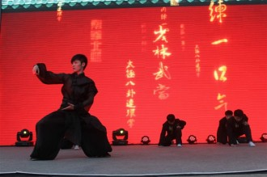

# 止戈而起，心必如常。--专访罗汉拳嫡传第十五代掌门人

杜宾，21岁，中国罗汉拳嫡传第十五代掌门人，武汉体育学院太极专业大三学生，中华六段，国家一级运动员，国家一级裁判员。3岁习武 9岁进入专业队，先后效力于北京、广州、河南武术队。2003年北京市传统武术锦标赛罗汉拳冠军，2005年广东省锦标赛太极拳剑全能冠军，2009年河南省传统武术锦标赛太极拳剑全能冠军，2011年全国体育院校武术套路锦标赛太极拳冠军，被功夫网评为武林新秀。高希希执导电影《三国》武术指导组成员。

第一次见杜宾是在校门口的天桥上，跟我聊得正起劲的师妹突然拽住我的手使劲摇晃，兴奋地低声对我喊：“师姐！师姐！快看杜宾学长！”，顺她手指方向看去，白衫的清瘦少年浅笑点头，眼角弯弯十分亲和温柔，眼神却异常闪耀锐利。那双与外在气质不相容的眼睛勾起了我的好奇心。对于习武的人而言，他体格瘦小，皮肤白皙细腻，充满清逸的书生气。

-----记者 杜青铃

 杜氏罗汉拳 

Q：据我所知罗汉拳是少林拳，你非少林人，如何能成为这套拳的掌门？

A：嗯，是的，这要从祖上的故事说起。明神宗43年下令火烧少林寺，寺中一个和尚受住持之命携拳谱逃往山东，得当地一户许姓人家收留与帮助，定居香源寺。和尚感恩，亲授许家少爷武功，圆寂后赠予拳谱。许家6代单传，许少爷生性漂泊风流，好四处云游。一日逛到黄河坝边，遇上一伙人被匪贼劫持，许氏拔刀相助。事后得知那伙人是微服私访的王爷一行。王爷欣赏他的胆魄武艺，收他做近身带刀侍卫。后来许少爷染上毒瘾，盗取王府金银宝物后逃河南新乡。河南省新乡市获嘉县东古风的杜姓地主好心收留，供他吃住，后来他以拳谱向地主换来四亩田地长久安身于此，罗汉拳拳谱也因此传到我们家。

Q：你们家所有人都练罗汉拳么？

A：以前传男不传女，男子练武时房门紧闭，只有杜氏直系子孙有学习的资格，不传外人，偷学者重罚。到我爷爷出任掌门之时，他打破禁忌，广收弟子，在祖传老屋中亲授拳法。最多的时候，学生多达两万人，不收学费，免费吃住。童年最难忘的就是跟众师兄弟们一起在祖屋的地上挤着睡。地板上铺满凉席，大家讲笑话、看星星，特别热闹。

Q：练武过程中谁对你的影响最大？

A：我受爷爷的影响比较大。我爷爷三岁登台表演武术，一生嗜武如命，宁可不吃饭不能不练武。他以武德武技征服获嘉县，行侠仗义、惩恶扬善成为一方美谈。有一次我们村的人跟东古风附近的回民起了争执，他们纠集了一帮人带上砍刀来闹事。我爷爷带领大家守在村口，三天三夜一动不动。

Q：少林寺的罗汉拳相比你们家的有什么不一样么？

A：罗汉拳总共18套，少林寺仅存12套，完整的拳谱在我家。1997年少林寺多方打听得知完整拳谱在我们家，他们出30万想把它买回去，双方一直在沟通。

Q：为什么不卖呢？

A：我觉得拳谱不能买卖，它来到我们家也是偶然。况且这套拳不是我的，不是你的，不属于任何一个个体人的，它属于整个中华武术。所以我们一直在考虑怎么处理它。

Q：你是罗汉拳嫡传第十五代掌门人，掌门之位只能嫡子继承？

A：不是，本派武功最高者出任掌门。但罗汉拳拳谱为我们家族所有，拳法对外人多少还是有所保留，一般人也打不过本家人。我祖父生有两子，虽然是我爸爸继承了我爷爷的掌门之位，但我堂兄弟同样有争夺掌门的权力。我是通过掌门人比武大会当上这个掌门的。

Q：你有没有想过朝影视方面发展？

A：吴冰是李连杰在北京队时的教练，98年李连杰拍了《少林寺》，99年我入队，当时跟我一起训练的师兄有吴京。99年因为李连杰和少林寺的大红大紫，吴冰出任北京武术管理中心主任。硬要说的话，我也可以算是李连杰的师弟了，哈哈。我之前在高希希的电影《三国》剧组当武术指导，感觉娱乐圈还是不太适合我。

### **武学看重努力和人品**

Q：小时候有没有抗拒过习武？

A：有，通常别的小孩都可以有其他选择，我不行，我生下来就得学武。当时觉得不公平、不想学。这是落地责任，抗拒也没办法。

Q：抗拒学武的时候会被责罚吗？

A：当然。小时候不练功就常常被我爸打，他从来都是用手，掌力很大。我记忆最深的一次，有一年冬天，我不肯练功要跟别的孩子一起出去玩，他往我身上倒了桶水，我身上厚厚的衣裤全部湿透，然后把我拖到院子里让我扎马步。院里的水龙头结着厚厚的冰凌，我就那样扎了一天的马步，直到全身发紫。

Q：你的压力大么？

A：我是罗汉拳的传人，自小找我挑战的人就不少。罗汉拳需要两人一起练习，同门都是两两一组，我每次练习都是以车轮战的方式对抗6—8人。父亲喜欢云游四海，到处踢馆，难逢敌手。打输了的人哪肯就此罢休，所以我们家每年也会有很多人上门踢馆。我父亲又常常不在家，只能我出面应战。

Q：如果你也不在家呢？

A：每年大年初九我们都会举办擂台赛，邀请各门各派及非武术界人士前来打擂，由本派掌门亲自坐镇。现在的比赛都由我亲自坐镇，每年这个时候我一定会在家，不用担心（笑）。

Q：擂台赛不分级吗？你体型还偏瘦，如何应付那些彪形大汉呢？

A：跟体型无关，武术里“四两拨千斤”的巧劲真正发力的不是拳脚是肌腱。

Q：肌腱？怎么说？

A：这算是武学机密了，不能告诉你，哈哈。

Q：不过你真的很瘦啊……你多重？

A:瘦有瘦的不同，我这种是精壮，姑娘你就是瘦不禁风了，哈哈。

这么说吧，我看上去很瘦很白，一般人根本不相信我是学武的，但真正练武的人一看我的脚步、观察我的气息、气色很容易知道我不仅习武，而且是高手。

Q：擂台赛上被打输了会被父亲罚么？

A：目前尚未有过败绩。

Q：你功夫这么好，又正是血气方刚的年纪，会去找人挑战么？

A：不主动找人，一般都是别人上门找我（笑）。其实我还蛮听话、性格蛮温柔的。

Q: 你们有门规么？

A: 嗯，门规有厚厚的一本，上百条。有两条我记得比较清楚，一是我无帖不收，还有一条大意是不欺弱怕强。

Q：什么是“无帖不收”？

A：想拜师的人先要下帖，用红纸写个拜师帖装在红信封里，说明为什么拜师，写上某某人于某日拜于谁门下，即日起为某某门下弟子，将恪守本门门规、谨遵师父教诲之类的话。

Q：收徒有仪式吗？

A：决定收拜帖之人为徒的话，会择吉日、鸣炮奏乐，再行上香、拜师磕头之礼。

Q：择徒标准是什么？

A：有一次，我爷爷外出遇上俩毛孩向他挑衅，爷爷觉得辈分差距大，怕让人说以大欺小，拒绝应战。两人先是出言侮辱，爷爷不予理睬，他们便冲过来直接动手。结果老头子一招把他们放倒，他们当下磕头拜师求我爷爷传授武艺。这样随便拜师的人我们不收，门规有要求。还有天资太差、体质不行的我们一般也会劝他另寻他路。

Q：有没有那种一看就是武学奇才马上收归门下的？

A：哈哈，看有没有学武的天资一般看脚底板和跟腱，硬件好会有点帮助但主要还是靠后天努力，我们收徒更看重人品。

### **传统武术在民间**

Q：个人认为外国的格斗术在技巧上更具实战力。

A：各有不同吧。每种运动与其所在的环境背景、文化背景都是相关的。大家都说的“南拳北腿”是有原因的。南方雨水充沛、尽是山地丘陵，常常无法在室外活动，家里的场地有限，腿脚无法自如伸展，所以南方武人擅拳。北方晴天多，平原地势广阔，所以北方“练家子”腿功好。中国武术是一种全面的综合性强的格斗术，跆拳道吸收了中国武术里的腿法，把它做深做精。拳击取了武术的拳法之长，在拳术上煞费苦心。中国武术把两者都做全了攻击力反而下降。拳不如拳击，腿不如跆拳道。

Q：这么说中国武术的发展前景在哪呢？

A：我觉得发展的方向在民间武术吧，民间其实潜伏着很多武林高手。我有一次去老家的山村，看见一位80几岁的太婆双腿离地把自己吸在墙上。

然后是推广大众武术，这个方面主要是推广武术文化、强身健体吧。现在竞技武术的形势并不好，最主要的是要提升观赏性，做到更高更难更美。

Q：有大侠梦么？

A：我3岁习武，9岁进入北京武术专业队，12年职业生涯里拿过北京、广东、河南和全国的武术比赛冠军，就差一个奥运冠军了。我的梦里还有把少林罗汉拳和杜氏一族发扬光大。

Q：你现在的专业是太极？

A：是

Q：为什么会转练太极呢？

A：因为一次偶然的机会改了太极拳，这是家族的罗汉拳所达不到的一个境界，并且练习太极拳也可以辅助罗汉拳的练习。

Q：太极练了多久？

A：太极拳练了8年，之前练了3年长拳，1年南拳。太极拳有五种，陈氏，杨式，孙式，吴式，武式。陈氏太极拳的发源地是河南温县陈家沟的陈氏太极拳，具我家距离只有40公里。

Q：太极拳和罗汉拳有什么不同？

A：太极拳以柔克刚，虚实无常，这正是罗汉拳达不到的；罗汉拳刚劲有力，罗汉拳的精神是练为战、战为赢。太极比较平和中庸，这也是我说的太极有罗汉拳达不到的境界。

Q：以后更想往哪方面发展？

A：以后想发扬中国传统文化，发扬家族罗汉拳！我认识的武术大师最后都画国画学中医去了， 那时候你不只是一个练武术的人或者一个中医，这些都内化为你身体的一部分了。

Q：你们平时学的一招一式都跟武侠小说里面一样有很酷的名字么？

A：我们平时练习的是套路，武术套路跟散打是分开的，散打是竞技的延伸。

Q：套路里的招式都是用来表演的？

A：不是，太极的招式都是实战出来的，都有具体的攻防意义。我们平时学的虽然是套路，表演的时候也是按套路顺序来打，但实战中是可以随意灵活运用的。套路动作是有逻辑的，由浅入深，所以学习、训练的时候按套路走。

Q：学习太极是不是除了练习动作技术，其他的文化学习也很重要？

A：武德是武术的升华。如果技术精湛，但品德低劣、文化修养差，不能成为大师。相反如果技术略逊一筹，但品德好，对太极文化的理解深刻便可以称其为大师。

Q：武术本身争斗性很强，青少年血气方刚，如此练习武术会不会有什么负面影响？

A：因人而异吧，要参透武术的内涵才能明白习武的真正意义吧。武术文化要从小熏陶，从正面的角度去渲染。“武”字本来表示“止戈”，我所教授的这么多学生里那些目的不纯的、好斗的大多是半路出家的。学习动作招式之前要先提高个人修养。

Q：哪一次比赛最难忘？

A：最难忘的就是05年的广东省锦标赛，右边膝关节积水浮肿，膝盖肿得大腿一样粗。不敢回忆当时的情景，不过最后拿了冠军。

（记者：杜青铃 责编：郑萃颖）
