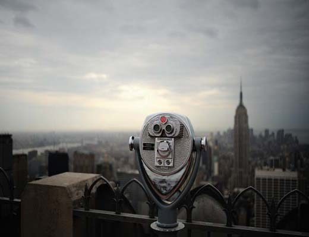

# 死刑

** **

早上醒来和建筑工打声招呼，是他这些日子每天生活的起始。

在这个只剩天窗的屋子里，旁边不断升高的大厦与周遭由安静变得日益嘈杂的人声，成了他与外界相连的仅有标志。

＂上周那个秃顶的油漆匠调到七层去了，半个月前的小水泥工这会儿该在二十层。＂眼看在自己抬头可见处忙碌的人们逐渐在视野里变小，成为一个黑点，最后完全消失。他自言自语，嘟囔些什么。

＂那个胖子的太太应该生了，恩...我打赌是女孩；老矮子的儿子拿到了高中毕业证书，真是幸运；至于那个暴牙......＂

他清楚他们的确切名字，准确来说是记不得。毕竟，每人只在他声音可触及的高度工作五六天，升降机便把这批工人送上更高的楼层。那些新来的便小心翼翼扶着脚手架来到这个位置，继续完成后续工作。

当然，这是近期以来发生的事。在此之前，商务区尚未规划，他的墙外是一条偏僻的乡间公路。数过往的车子是他唯一可以耗尽时间的事情。数一辆，便在墙上划几道标记一下。当头顶的天窗被星空填满，他知道，这一天已被自己成功杀死了。

＂下一辆会是什么呢？听声音一定是老款式的旧福特！＂

当他所认识的最后一个工人离开时，大厦完工了。它拥有四十层的宏伟体魄与遍布玻璃的窗口。高耸的天线塔楼直劈云端，几乎挤满了他的整扇天窗。

＂伟大的工程。＂他喃喃嘀咕。随后又是在墙上一阵乱划：＂下一辆...哦，上帝，那是什么？＂

汽车的轮子可不是时间可以修补得起的。不久，宾利、奔驰、SUV从一墙之隔的路上轰然辗过，又过了几天，出租车主疯狂按动的喇叭、校车里孩子们的嬉闹、救护车的尖叫一股脑儿冲进了天窗，末了，不忘在深夜灌上一街机车骑士的咆哮。他陶醉于这些可算为噪音的波段里，尽管许多车辆崭新到他不可能知晓那究竟是什么。

＂外面的世界愈来愈近了！＂的确，自从城市的开发推进到这里，他似乎融进了那一片繁华之间。工人、建筑、车辆，一切的一切在他脑中交织，重叠，成了立体的图册，而他，是万物的设计者：这儿是那条公路，那边是主干道。医院放在邮局对面，广场附近是学校......

是的，他，这片土地的拥有者，享受长久居于此境的权利，聆听外界的变迁，而墙体使他安然守候在时间之外，由天窗审视那一片一片颤动的云彩！

他伸长了脖子，想仰望日落时血色的天空。他明白，那很美。无尽的虫鸣从道路两旁的麦田中升起，托出烧红了的西霞。

可这次什么也没有。黑黢黢的铁架塔台成了一把大刀，是那座天线塔。这会儿，它闪烁起霓虹。

＂为什么不到外面瞧瞧呢？＂他嘿嘿地笑着，走向屋子对面的墙，一把推开，太阳燃尽前最后一抹光晖扑面而来。

＂唉，这可真是出乎预料啊。＂狱警抽着烟，瞟了一眼那个封闭的屋子。

＂没想到他熬过二十年，只需两年便刑满释放了，如今却...＂监狱长摇摇头。

血沿着他的前额滚落下来，染红了那堵混凝土浇注的狱墙，带着上面密密麻麻的划痕，在跳动的灯火下扭曲了。

1970型...福特...两辆雷诺...三菱...

 

（采编：陈锴；责编：陈锴）

 
