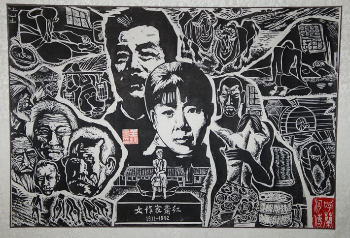

# 死国

当我在一个又一个被我称为“穷乡僻壤”的欧洲小镇上看见中餐馆和风水书的时候，我总是感叹中华文明旺盛的生命力。那无所不在的春卷，幸运谶语饼干，招财猫，都在向处于西方荒蛮之地的用刀叉切割半生烤肉的白皮野人展示一个遥远的神秘而丰饶的东方古国。

虽然身处这古国之中的人们表示，其实春卷不是这么个弄法。

每逢此时，我总会作出一副高深莫测的神情，用遗老遗少怀念故园的悲悯语调，感叹被误解被扭曲的文化。可是千万不要因此把我当做一个深沉的人，其实我只是在想，你们这些幼稚的白皮猪，不在春卷里放芝士会死吗？

异乡何物充饥肠，酸甜鸡，左宗棠。油条加糖，无语话凄凉。

咸菜袋子上老师张铁林老师的微笑，是我最沉重的乡愁。

我想尽量用轻松的语气来开始这篇文章，到此发现很难。

每次写到“故乡”这个话题，就觉得笔触滞重，年岁陡增，实在做不成一个冷眼旁观的人。

离家日久，逐渐习惯缺乏归属感，直到这种“缺乏”成为了一种新的归属感，我竟感到微微的惭愧，仿佛是叛国者一般。可是每当我转过身回看我的故乡，干涸的河，折断的树，被推倒的旧屋，故乡正在难堪的死去，随着故乡变得越来越陌生，我的无力感也与日俱增。以前读梁思成的传记，他曾为了保护北京旧城奔走呼告，五十年过去，城市早已面目全非，如今他死了，他的旧宅也被拆迁。

听说这事儿，觉得像个黑色幽默，想笑，又笑不出来。

我最喜欢的作家中，东北女人居多，萧红，齐邦媛，迟子健。最打动人心的作品，来自于漫长的苦难生活，她们用一种处于底层的忌刻深邃的语调，写流亡，写迷茫，写奋起与沉沦。萧红在寂寞中客死他处。她本是个懦弱的人。她写过许多故乡的人，愚昧，可怜，历经艰辛，他们是最原始最顽强最有生命力的人，尽管他们的生活看起来如同梦魇。

在阴惨的异乡天空下，她到死都在与寒冷与孤寂对抗。

别梦依稀咒逝川，故园三十二年前。

这与我的“冻土”般的心境不谋而合。

伦敦的冬天特别干燥，这种干燥叫人无处躲藏，尽管时常下雨，但那雨水就是无法润泽。心绪敏感的人，比如我，离乡在外，此时总是觉得分外委屈，分外孤独，倾诉的欲望如骨鲠在喉，张口却是无言，孤独的本质是永恒的静默，这种个人的体验无法言说，说出来就是错。

马克思说要唤醒世人，使人拥有自由的灵魂。“落叶归根”是一种俗气的执念，自由理应高于故乡，“万里归来年愈少，此心安处是吾乡”，人总要有这样高贵豪迈的情节。

可是谁又能够真正的自由？每一个人，终其一生，都在被自己的来处束缚。虽然月亮无处不在，人们却总是记挂着自己家乡的月亮。

这是生而为人的绝望。

几年前，我去广州给萧红扫墓。她最初葬在浅水湾，后来迁葬到广州银河公墓。去年是萧红百年诞辰，看见新闻，希望萧红归葬黑龙江呼兰县，那儿是她的故乡。她生前颠沛流离，死后依旧不知魂归何处。她曾留下遗言，“……身先死，不甘，不甘。”

我曾经想，我有一种卑贱的乡愿，而这乡愿生发成见证与记录的义务，与每个书写苦难的作家一样，烽火硝烟，河流土地，和身处其中为了生存而苦苦挣扎的人们，这是我们的来处。这种回忆对于失去故乡人来说，并非愤怒或是悲苦，而是自我折磨，却又是唯一可赖以生存的渴念，想要忘却，却又不忍忘却。

我的故乡，有太多被迫隐藏的历史和被迫失语的人。春温秋肃，大喜大悲，宇宙万物的灵，世间许多沧桑的故事都附着在草木砖瓦之中，可我却读不出来，徒增无端烦恼叹谓。现在，这些失语者曾存在于世上的痕迹都快要被抹去了，一切都已无从“补救”，我连悲哀的力气都没有。

细看百年国史，波诡云谲，雄浑壮阔，一代人缓缓谢幕，最终都归于寂寥。

生之渺小，古今至伟至大之人，还是逃不开这命运，人都要死，旧屋都要化成瓦砾，哪怕竖起了一座纪念馆，把死者的一生都展开给世人看，这也都与死者无关了。生前已是个失语者，死后又想如何？

从生，到死，从你我他，到最宏大雄伟的历史命题，其实都在被误解。

相较之下，我对于菜谱的那点儿斤斤计较，顿时显得毫无必要。

到医学院念书之后，常看见救护车在窗前呼啸而过，回过神来再低头看桌上的书，书上有统计的数据，疾病灾害造成死亡。死亡是极端个人化的体验，对于陌生人来说，个体的牺牲只是化成书上的一个数字。

我有时会想到一句歌词，“谁的父亲死了”。

浪漫如赫尔博斯，说起死亡，分外平静，“如水消失在水中”。

当我开始接受这终将被曲解和被遗忘的命运，我终于不再执着于人生的意义，也不再为我心中愈发淡漠的乡愁感到忧伤，这种态度坦然的近乎无赖。

我匆匆过完一辈子，还没来得及问问我生而在世所谓何来，想来有些不甘心，可是转念一想，我的故乡也快要死去，我又有什么好不甘心的。

直到入冬后的一天，我在医院的走廊上看见一个坐在轮椅上的老太太，她老了，老的好像一块树皮，她记不得家在哪里，也记不得自己是谁，只能惊慌失措的摇着护士的手，央护士送她回家。

那天我坐在医院的厕所里失声痛哭，我看见了生命最沉重的一幕，不是沉疴缠身，也不是死之将至，而是遗忘，被他人和被自己遗忘。

到最后，我还是不甘心。

此时此刻，处于离乡万里之遥的小岛上，推开酒馆的门，被人好奇的打量着。

我是个来自异乡的人。

就让我背着故乡这沉重尸骸走遍天涯海角，哪怕我只是那万千即将被遗忘的流亡者中最沉默的一个。

**《我与姚鼐》**

陶家巷五号 

墙上蓝底白字的门牌， 

生锈的铁钉叹息，无奈无奈。 

两百六十年的煎熬。 

无色无情的桥， 

诗书艺礼浇灌青苔。 

煮在灶火堆里噼啪歌唱的薪柴， 

唱的什么词，离骚。 

那年你从京城南下， 

肩上是泰山顶雪霁后的雾霭， 

五辆马车，踽踽而行是你的“教化”。 

用旧房拆迁的告示做一张担架。 

抬出一具余温尚存的尸骸， 

脚腕上挂着死者的姓名：家。 

------《陶家巷五号》 

四进的小院坐东朝西，破败的可怜。 

小院正中是一方逼仄的天井，黄熟软糯的阳光从铅灰的屋瓦上流下来，冲洗天井里积攒了两百六十七年的尘土，我便身在一块白亮亮的四方形土地上。 

黄昏时的太阳叫人欢喜，五点钟准时骑上了这一从破屋烂瓦。太阳在屋脊上端端正正的抱膝团坐，对着我嘻嘻的笑着。 

墙角有一张倒下的瘸了腿的椅子，支撑椅子腿的横梁也断了，突兀的翘在那儿。我跑过去拔那半截瘸腿，椅子不让，与我推推搡搡。木刺扎进了我的皮肤，痛极，痛极。我呆呆的低头看我的手掌。 

邻居家有个很胖的姐姐说，手掌上有三条神奇的线，会告知主人的命运。现在我的爱情线上扎着一根木刺，像骠骑将军射在匈奴单于马蹄旁的箭。 

我向手心吐了口唾沫，搓一搓，用指甲去抠那根木刺。木刺拔出来，手掌中央是个小小的血窟窿，我把手指攥起来，血窟窿变成了一张咧开的嘴。 

我生气，我的爱情线断了，我用脚去踢那椅子的瘸腿。 

“哎哎哎，小娃娃，莫要踢我的椅子哟。” 

回头，身后是一张带笑的脸。这脸真老，真老，发了霉的橘子皮都比这张脸来的滋润。这脸不仅老，还散发着一种酸酸苦苦的味道。 

这张干涩而松弛的老脸架在一支伶仃的细脖子上，脖子下垫着单薄的肩，肩上有一根鼠灰色的小辫子。我伸长了脑袋一看，脑袋后面稀疏的发总成这一只小辫子，不过手指粗。 

我去拽小辫子梢上的红绒绳。 

老脸瞬间生动了起来，皱眉攒目。 

“哎哟哟。” 

我哈哈大笑。见我笑的欢实，老脸上也浮出一丝笑意。月白府绸袍里伸出了一只厚实干燥的手，牵起了我的手。另一只手扶起了那把瘸腿的椅子，掸去表面的浮灰，呼的一声，云遮雾绕。 

他说，“你坐呀，坐嘛。” 

我坐下，他慢吞吞的进了屋扶出了另一把瘸腿椅子，像扶着个一品诰命夫人。 

院子里到处是胡乱堆砌着泥砖瓦砾，木屑依偎着房梁懒懒的睡，我走过去一跺脚，嗵嗵嗵，声音沉闷，被惊醒的木屑四散飞起，最后落在我的鞋子上。我蹲下身看着木屑，像看着一张呆滞的脸，眼角还留着眵目糊。 

木屑不说话，我感到乏味。 

“这院子真小。” 

我站起身，用手蒙住眼睛，围着院子中央的小叶黄杨转了一个圈。 

小叶黄杨的腰上挂了一个园林局发来的红铁牌，“黄杨树，树龄200岁，编号787”。 

“因为我穷呀。”他盯住了我的身形，寿眉下压着一双三角眼，睥睨之间，微光散漫。 

“你不穷，哪有穷人穿府绸袍子，千层底布鞋是新的吧，半点泥星子也没有。” 

我对他脏兮兮的小院好奇不已，每样玩意儿都要拿起来问问再放下。 

小院外有一节石墩子，细瘦的要上一圈浅浅的勒痕。 

“这是拴马石，我用来拴驴。” 

“驴呢？” 

“卖了。” 

“卖驴的钱呢？” 

“买书去了。” 

“买了什么书？” 

“《燕子笺》。” 

“好看么。” 

“好看，百子山樵写的戏，都是好看的。” 

“百子山樵是个好人么？” 

“不是，他是应该入《贰臣传》的人，党附阉患，首鼠两端。” 

“你是好人么？” 

“不是。” 

“为什么不是？” 

“文无济世之章，武无扛鼎之能。” 

“为什么不做官？” 

“做了，又辞了。” 

“我知道。” 

“你知道？” 

“我知道。” 

“古之君子，仕非苟焉而已，将度其志可行于时，其道可济于众。从容进退，庶免耻辱之在咎已尔。” 

我摇头晃脑的背诵，他笑不可遏。“好，好好。” 

贴着南墙是两个从未洗刷过的竹编箧，朝外的一面被阳光泡的发白，里面却是星星点点嫩绿的霉斑。 

“这箧用来装什么？” 

“圣人的教化。” 

“从哪里来？” 

“武英殿。” 

我指着裂了口的竹笔筒问他。 

“这是什么。” 

“这是读书人的风骨，有节。” 

“你有节么？” 

“我有。” 

“南山先生有节么？” 

他沉默了半晌，悠然开口，那苍老的声音像是来自远古洪荒。 

“南山先生有节。” 

说罢低下头，颔首不语。 

我见他微驼的背，忽起了顽童的心性，三步并作两步奔到他的背后，捞起他鼠灰色的辫子问他，“这又是什么？” 

他大声呼痛，“哎哟哟，这是国本。” 

“原来国本有条老鼠尾巴。” 

他大骇，枯黄的脸霎那变得惨白，护着自己辫子的手停在半空，大约是中了我的定身法。 

我不依不饶，仍旧笑骂，“原来国本有条老鼠尾巴，啃掉了南山先生的节，啃掉了所有读书人的节。你既说百子山樵是贰臣，你又如何？” 

他再也忍不住，俯下身剧烈的咳嗽，腰肢成了被共工一头撞断的不周山，四肢筛糠般簌簌颤抖。 恻隐之心大起，我想他终究是个老人，我轻轻的拍他的背。 

“好啦好啦，大清国亡了一百多年啦。” 

他轻轻的喘，“那年宝和殿传胪，簪花跨马游街，同年齐赴鹿鸣宴。我在南书房向纪师傅和戴先生辞行，他们还背毛诗，胡归胡不归，想起来还像昨天的事，想不到这一转眼，大清国竟亡了。亡了也罢，这人，这家，这国，这宇宙万方，都有化成灰的一天。” 

“也想过要回桐城，家乡山肥水美，张季鹰有莼鲈之思，我难道还不如他？谁知到了泰山顶，豪气顿生，竟罢了回乡的心。” 

我随口应他，“苍山负雪，明烛天南。” 

他满面惊喜，“你竟能背诵？” 

我亦欣慰，伸手去慢慢捶他僵硬的腿。 

“老朽不堪，风烛残年，桐城虽不远，于我也是山高路遥，回乡之意已绝，钟山书院是我命里注定的归所，不枉我清白一世。” 我听他说的凄惶，已是痴了。 

“出世难，入世更难。” 

天色愈发昏暗，他催促我回去，“君子勿做白龙鱼服之戏，勿以身犯险。走吧走吧，夜路不安稳。”他桐城的口音嗡嗡的，前鼻音团在嘴里，粗侉笨拙。 

我不愿，磨磨蹭蹭出了巷口，回头一看，陶家巷五号的门牌被余晖笼罩，庄严不可侵犯。 

院墙上有一个黑漆涂的“拆”字，敦厚的黑体字蜷在一个圈里，成了一张法力无边的符。 

他还在小院门口站着，冲我挥手，如同每一个送孙儿远行的祖父。瘦而佝偻的影子落在在身后，被西坠的夕阳拉扯的越来越长，就好像要裹挟着他离开这个世界。 

我无力追回消逝的阳光。 

他老了，他就要离开这个世界，他已经离开这个世界。 

我跑回他的身前跪下，轻轻的磕了一个头。 

再也忍不住，泪水夺眶而出。 

（采稿：吴子衿；编辑：周凌希； 责编：欧阳银华）
