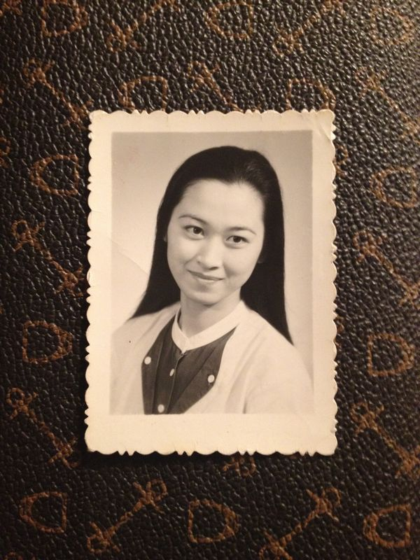
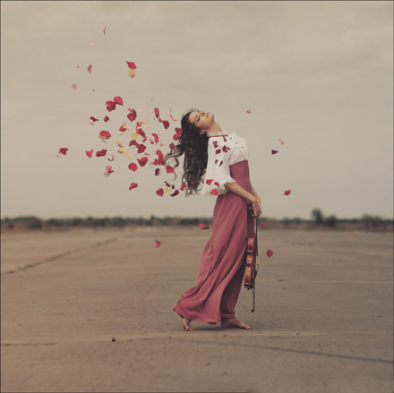

# 母亲的奢侈品

** **

回美国之后的头件事情，便是清理从国内带来的衣物。我打开那个深蓝色的盒子，小心翼翼地把叠得整整齐齐的真丝围巾和睡袍拿出来挂好。围巾大多是重磅真丝，都是母亲的挚爱；那条齐我脚颈的珍珠白色的长睡袍，因为长时间的折叠已经有了方形的褶皱。母亲告诉我，真丝的东西要经常穿，经常保养，放的时间太久就会烂掉。那件长睡袍上已经有了几块洗不掉的深褐色印记，据说是汗水和蚕丝蛋白结合在一起之后产生的反应——母亲总是怪我说，“这衣服我买了一次也没穿过，肯定是你小时候和你姐姐偷偷穿了，留了哈喇子（湖北方言，即口水）在上面！真是一群败家子！”听她这么说多了，我也竟然真的相信这件完美艺术品上的瑕疵是我和表姐一手造成的了。这次回国，母亲塞了些自己不穿不用的好东西给我，说自己老了，穿了也浪费，索性就留给小孩子穿吧。

母亲年轻的时候是个美人。我的钱包里总是放着一张她年轻时随便照的登记照，从中国带到了美国；每逢付账，有朋友在身边的时候，我都会拿出来炫耀一下说：“你们看，我妈妈年轻的时候多美！”那个时候，市场里没有什么高端的化妆品，整容也不太流行，平常人家的女孩子极少靠脂粉修饰自己。她的明眸皓齿在黑白照片上显得优雅端庄极了，眼神如《卡萨布兰卡》里的英格丽褒曼一样迷人。她与我拉家常的时候常回忆：因为年轻时候的容貌，不知道让多少人为她倾心；照相的时候，随便穿一件衣服，无论从什么角度拍都好看。她说话时候的神情，又幸福又失落。俗话说，人老珠黄，原来是真的。这次待我回家，她又跟我抱怨眼睛经常充血，再也不如以前透亮了。现在的她，皮肤失去了年轻时候的白皙水嫩；长时间的操劳家务，油烟和灰尘在她的脸上留下了一条条皱纹和褐色的斑点。她总要我给她照相，“你不是摄影非常专业么，咋不给老妈好好照几张照片呢？”照完了她又惊呼：“这是我么？怎么脸这么大啦？哎，老了，老了！人老了真可怕！”

在我的印象里，母亲是个生活俭朴的人。家里的梳妆台上几乎看不见昂贵的化妆品，更没有香水一类的东西。她没有耳洞，也几乎不带其他首饰。我问她为什么不带，她说：“戴着首饰给谁看，穿的漂漂亮亮的，再踩着高跟鞋去买菜吗？一天到晚洗碗，哪里能带呢？上次买的那条手链，洗衣服的时候掉进下水道里了！再也不戴了。”两年过去了，她还背着我从香港给她买的那个皮包，皮包的背带因为长时间的摩擦已经淡退了光泽，皮质也变得乌黑。回国之前一直寻思着再给她买个好点的包回去，可惜也因为囊中羞涩而作罢，现在想一下颇有些后悔。我走了之后，三房两厅的大房子只剩了她一人。家里的衣柜和抽屉深处，藏着好些她珍爱的东西，有些都沾上了灰尘——全羊毛的大衣，真丝的睡裙、西服和套装，还有在阳光下能发出不同彩色光芒的珍珠项链。我戴那珍珠项链很好看，母亲看了也很欢喜，每看到一次就感叹：“20年前就花了我600块钱，我当时是多么舍得啊！”她年轻的时候喜欢逛友谊商店。我们还住在北京的时候，友谊商店是北京最好的百货公司，听说里面很多东西都是从外国进口，或者卖给外国人的。女孩子自然都是爱美的，看到美丽的东西难怪都抵不住诱惑了。我问她哪里来的钱，她撇撇嘴说：“没钱也狠心买了，谁叫那么好看呢？”那件沉睡在衣柜深处的重磅真丝长睡袍，想必也是一个年轻美丽的女孩子经不住诱惑的结果。“买回来一次也没穿过，当时想象着能穿着它，多么雍容华贵啊！诶，嫁错了人，享不了福！”听她这么说，我觉得心酸极了。母亲为这个家做出了极大的牺牲；这么多年来，我想她唯一的寄托和希望就是我了。她本是可以穿着她的真丝睡衣，戴着好看的珍珠项链，优雅地走来走去——然而时间和责任消磨了一切。

前几天偶然读了一篇名为《折纸》的文章，看了一遍中文一遍英文，每次看都流下了眼泪。文中有一段写到，出生在美国的男孩儿不希望自己的中国妈妈讲中文，嫌弃她文化水平低、不懂美国文化，我忽然记起自己有一次和母亲在餐厅吃饭，母亲和我拉家常，说到菜又涨价了，白菜多少钱一斤，胡萝卜多少钱一斤，我忽然说：“你怎么每天就说这些东西？”她愣了一下，转而说：“你上了大学，就瞧不起妈妈了么？”当时的我还觉得很不以为然，现在回想一下，自己是多么自私，多么幼稚啊！出国之后，见得世面多了起来，我开始给她写信写贺卡，夏天的时候絮絮叨叨在信里说了在纽约看的博物馆，听的音乐会和形形色色的人，她后来对我说：“你给我写的东西，我都好好留着！很珍贵！”如今她老了，曾经买过的“奢侈品”，无论是衣物还是首饰，她都几乎不再触碰；现在对她来说最珍贵的，反而是我这个唯一的女儿。今年回国之后，她对我说：“你走了之后，打开衣柜，看见你穿过的衣服也想流泪；出门穿鞋，看见你的鞋子也想流泪。这样差不多过了三个月才好一点！”妈妈一个人在家很孤独，“我把一周安排得满满的，隔三差五去游泳、打羽毛球，和群友出去玩儿，可是越玩儿越觉得孤独。”我忽然想起在密歇根诺大的校园里也是这种感觉；刚开学的时候，中心广场上有上百个学生社团在展示招新，已然是夏末的安娜堡却依旧散发着热气，人们摩肩接踵地走着，笑着，闹着——那句话是怎么说来着？“热闹都是他们的；我什么也没有。”我走了，她好似失去了珍宝一般失落。一个失去过至亲的人曾对我说：“那段时间我拼命出去聚会，喝酒，没心没肺地笑，越是这样心里越觉得痛。”还好现在科技发达，我们常常通电话或者视频，但是这种和相依为命20年的孩子相隔一个太平洋的感觉一定十分难过。

安娜堡的家有两个大衣柜，被我塞得满满的。那条真丝长袍在一堆衣服里面很是显眼；旁边木桌子的抽屉里躺着一个正方形的杏色天鹅绒首饰盒，我把那串淡紫的珍珠项链小心翼翼地放在里面。每每看到它，我就想起母亲年轻时候的样子。

 

（采编：周拙恒；责编：周拙恒）

 
