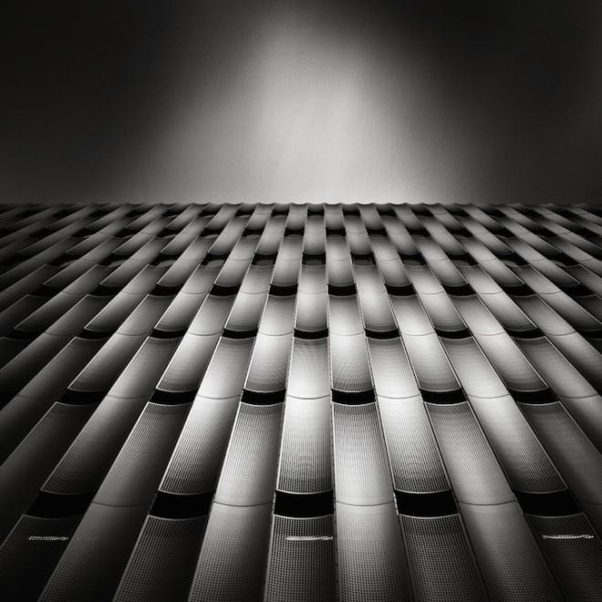

# 每一天都是纪念日

** **

我打开电视，看到所有频道都在直播某个庆典——就是花车游行那种形式的。参加游行的花车，每一辆都五颜六色，有的做成某种珍贵禽鸟的模样，有的则像是某种稀罕的野兽；参加游行的人，无论男女老少，每一张脸上都满载着健康、幸福的笑容。

忽然，在庆典的游行队伍里，我看到一个人长得跟自己有些相像。看着那幸福的笑容，我不禁想到半年前的一个梦。

太阳惨白地漂浮在烟尘里，石块铺成的街道仿佛被碾压过数百年。放眼看去：到处都是烟囱冒着浓烟，到处都是破旧店铺晃荡着招牌。转过街角，女士们风姿绰约地迈着步子，仿佛一个不小心，她们肥腻的肌肤就要从衣领里洒出来一样。我刚把视线从她们身上移开，一个长胡子的酒鬼就拿着半瓶啤酒踉踉跄跄地从酒馆里冲了出来。我赶紧躲开，却没能阻止他撞在一位绅士的身上。啤酒洒满了衬衫的前襟，温文尔雅的绅士也禁不住破口大骂。很巧的是，一个衣着入时的女郎恰在此时经过，并且娴熟地从绅士的口袋里取走了钱包。一个肥胖的警官似乎发现了什么，晃着滑稽可笑的啤酒肚慌忙跑来。这边呵斥着酒鬼，把他推向路边。另一边则回头向那位余怒未消的绅士赔着笑脸。

不要感到奇怪，梦里的旧市就是这么一个地方。

我继续向前走，街角处有几个流浪艺人在唱着歌谣。他们没能找来任何一个听众，倒是招来了街边楼上女人的咒骂。我抬头看了看那女人：乱着头发，却画着浓妆。似乎街的那边更加热闹一些，他们都在看什么呢？我假装没有看见旁边人不满的目光，踮着脚硬是从最后挤到了前面。喔～原来是一个长得如同兀鹫的瘦老头儿在推销滚筒洗衣机。

“这机器来自遥远的东方，是可以带来幸福的装置。”

我细细地打量这老头儿：高礼帽，西服，皮鞋……鹰钩鼻子，细细的眼睛在满脸的褶子里闪着凶光，嘴角的笑容让他的每一句话听起来都是假话。

我正想质疑，可是在梦里，我似乎是个哑巴——多么操蛋的人物设置。

“你说得这么玄乎，我们怎么知道是不是真的？是真的你就给大家演示演示！”，人群里传来一个中年男人的声音。

老头忽然瞪大了眼睛，显得格外狰狞，看着那个男人，说：“好的，那么就请你，钻到这台机器里来……”

“凭什么……” 说着，，男人把不由自主往后躲的身体向前赶了赶， “凭什么要我进去？！”

“哼，刚刚不是还挺豪气的。怎么，到自己头上就怕了？”

一个简单的挑衅，这莽汉就进了那滚筒洗衣机。然后机器开动，疯狂地旋转了足足十分钟。

男人被老头儿从机器里拉出来，所有人都惊呆了：男人一脸幸福和满足，简直仿佛刚从妓院出来一样！！

群众纷纷惊叹着，老头儿的嘴角露出得意的笑容。人群里传来追问的声音。

“这机器真是太神奇了，是不是对所有人都有效果呢？”

“哈哈哈，当然啦！对谁都神奇， 然后老头儿拉过我，“这个哑巴也可以！”

说着，老头儿就生生把我给塞进洗衣机里去了。

机器打开，我跟着滚筒飞一样地转起来。不消两分钟，我就已经晕死过去了。

“快点进去！”

什么？我晕乎乎地睁开眼睛，发现自己就已经不在旧市了。这是哪里？

“快点！”

说着，我就被推进了一个看守森严的院子。院子里，一个苦鬼正在埋头洗脏衣服。我定睛一看：这不是刚才的那个男人么？

我心想：刚刚你不是还一脸幸福的么，怎么在这里当上苦力了？

不料，在这种靠不住的梦里，我一个哑巴说出话来了。

男人不高兴地看着我， “我开心？！说，你是什么人？！”

“我也是被老头儿塞进那个机器里的人啊。”

“这样……告诉你吧，那机器根本就是个陷阱。我转着转着就晕了，醒了就被押在这里。”

“什么？那外面那个人是谁？”

“什么人？”，他不解地看着我。

什么……这……哦，我想我明白了：也就是说现在，在旧市，应该有一个幸福的哑巴走在街上——长得和我一模一样。

看着那些洗干净的衣服被送上流水线，看着院子外的流水线尽头：各色各样满脸幸福的人正被工人们装进货箱，不知将要运送到哪里。

想完这个梦，我又看了看电视上满脸笑容的人群。我走上去，还连着电线就把电视放到了旁边的窗台上。然后，一脚踹了下去。

“观众朋友们，下面是这次九十周年庆……”

我双手扶着窗台，把头探出窗外，对着满院子的报废电视机吐了口痰。

 

(采编：应鹏华；责编：麦静)

 
