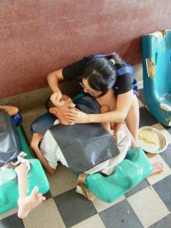
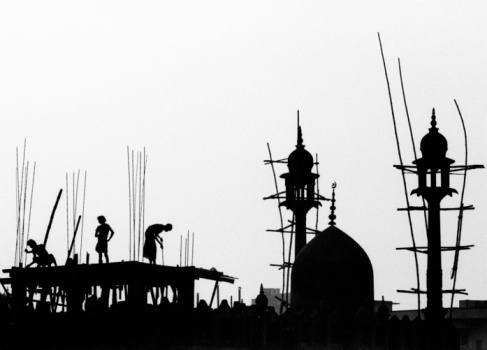

# 毕业就思奔，安芯的间隔年（二）：我在加尔各答，遇见了我自己

** **

“Anita，我这边的公车爆胎了，走过来可能还需要一段时间，不好意思让你久等了。”电话那边的国语声音很甜美，却也略微夹杂着熟悉的港腔。她叫叶培，香港人，在广州念的大学，随后在香港的东方日报当了五年的记者，后十年在加尔各答的垂死之家当义工，第十一年嫁给了印度人，开始在加尔各答的语言学校教中文。

对我这个加尔各答的路人甲乙丙丁，她好生客气。而我只是来印度之前无意在别人的博客里看到了有这么一个香港人，在垂死之家做了十年的义工，最后选择扎根加尔各答。遂感好奇，辗转联系上了她。第一次电话她时，她在学校上课，很忙，答复我说半小时后再回我电话。我想，半小时后她大概也就忘了吧，毕竟我们互不相识。没想到，半小时不到她主动给我电话，约好第二天下午喝茶聊天，再同她一块去学校上课。

“好的，没关系，我坐着等你，叶培姐你不用着急的。”

“不要叫我叶培姐啦，就直接叫叶培，不要再叫叶培姐啦。”电话那头一阵抱怨。多么年轻的姿态，我只能改口直呼其名。

见面时，眼前的女人俨然一身印度妇女的装扮，身着印度的旁遮比服，自脖颈以下长及膝盖的白色袍子，袖口绣有淡黄色图案。相别花花绿绿轻盈剔透的沙丽，旁遮比服更为厚实朴素。她的额头上的红点，对于印度妇女而言，表示已经结婚，或是吉祥如意。但当她开口说话之时，我仿佛又置身于广州，周围是港腔式的普通话，偶尔发音诙谐得会令你善意的捧腹。更巧合的是，我们是校友，这个世界可以很大，同样也可以很小。

她走在前面，领我去到地铁站附近的餐馆，热情地点了很多印度南部特色的菜，偶尔也同服务员用流利的印度语交谈，奥不，确切的说应该是Bengali，光是印度的官方语就有十四种，你知道的。“主要是在垂死之家的日子里学会的。”她淡淡地笑着。

我们用刀叉切着盘里的菜，聊着各自的在不同NGO的体会。话匣子既然打开，我便忍不住向她流露出在尼泊尔的儿童之家做义工时的担忧：“尼泊尔比印度还要贫穷，因此街头流浪儿童特别多，在尼泊尔的一个月，我不仅在陪孩子们玩，给他们辅导功课，同时也发现很多尼泊尔的儿童NGO并非很纯粹，有的甚至是以商业盈利为目的创办的。多多少少的NGO都会向义工收取一定的费用，有的很多，有的还算靠谱。我在加德满都以各种名义暗访了很多这样的儿童NGO，所有的信息资料都在手里了，我也有足够的材料说明我所在的儿童之家是一所以盈利为主要目的的机构，我可以写出来，告诉大家。可是，你当过记者的，你知道大家看过之后也许就不会来做义工了，而孩子是无辜的，只是大人做事的方式不对罢了。若是没有志愿者过去陪他们玩耍，给他们补习，那些孩子怎么办呢？”

这对于我来说，是一个两难的问题。也是不断有人向我咨询尼泊尔NGO时我哑然不知如何回应的主要原因。

“你要知道人无完人，只要有人在的地方就会有问题产生。十年来我在垂死之家做义工，有修女向我要玩具，其实是带回老家送给自己的亲朋好友，也会有修女不是很负责地照顾病人。就连联合国也是会有丑闻的，在非洲地区，传闻有漂亮女人通过性交易与联合国的工作人获取更多的食物或者资源。”我连连点头，因为我也曾遇到一些看护孩子的当地工作人员，频频将志愿者带去的玩具或者手链占为己有。她很擅长举各种例子来解决我的困惑，和我一样喜爱碎碎念。

“以前我在垂死之家的工作之一就是到街上将那些垂死的人抬回去。有一次修女们在做弥撒，我们恰好抬回去了一个临终需要救助的病人，修女回头说等她把弥撒做完再处理，有的义工很不理解，究竟是生命重要还是神重要。可是我们都忘了，这毕竟是一个宗教性的场所，而非医院。我们总是一厢情愿地认为非政府组织的所有人都应该是很伟大的人，应该无私地奉献自己。每个人都有EGO（自我），这是不可以避免的。只是我们的期望值太高了而已。”她语速时而轻快，时而沉稳。

不断地调整自己的期望值，这既会避免从高空垂直坠落下的沮丧抑郁，亦会减少从低处直冲云霄的眩晕。我也逐渐明白了为什么就算有些欧洲义工明明心里清楚尼泊尔的儿童之家在财务方面存在很大的问题，却愿意多次回到那里，陪孩子成长一段时间的原因。每个人的内心深处都是有黑暗一面的，只是有的人正视它，有的人却回避它。

“好在从2005年开始中国人来这里做义工渐渐多了起来。”十年，她在垂死之家竟呆了十年，想到这点时我不禁沉默起来。若是将自己十年的时间挪给垂死之家，又会是怎样一番生活。可是，十年的时间，挥手打一个响指，就像这样，甚至二十年，就是这么的快，一个响指，一个瞬间。不是吗”

“为什么欧美国家会有那么多的人来印度旅游或者做义工呢？”我忽而想起一年前每当给中国好友聊起去印度做义工，大部分人都会很诧异地盯着我。而当我告诉国外的朋友时，他们又会竖起大拇指般地赞叹，COOL！COOL?我想我的家人都快哭了。

“你知道吗，欧美国家的人他们先经历了经济的繁荣，他们也曾经一度认为快乐和金钱是成正比的。但当他们真正富裕的时候，会发现自己其实并不快乐，于是他们开始更多地在精神上需求答案。当他们来到东南亚这些贫穷的国家时，他们会诧异于为什么这些人那么的穷，却生活得很快乐。你看加尔各答的街上时常都会有以天为被以地为床地睡着，有时冬天寒冷，他们也不会介意和街头的流浪狗挤着睡在一块互相取暖。于是更多欧美国家的人来印度练瑜伽，上冥想课，为的就是精神上的释放与追求。”

“那么中国岂不是正在经历这样的蜕变，有没有什么方式可以加速这个蜕变呢？”我的问题变得急切起来。

胡适说，国家的耻辱不在于打败仗。打败仗固然是国耻，但真正的国耻是我们没有图书馆，没有博物馆，这些才是真正的国耻。多一座学校，便少了一座监狱。思想与精神的重要性，由此可见。

欧洲文艺复兴时期，法国有沙龙，便于知识分子相互毫无禁忌地探讨，思维碰撞；德国一边是以武力拷打世界，一边也是以思想拷问上帝。二战以后，德国停下脚步思考，于是有了今天的发展。

而中国在不断地跳跃式前进，甚至飞跃，但却少了很多互为因果的关键步骤--思考。若是将鸦片战争打开国门，甲午中日战争，世界大战，内战，新中国成立等等事件排列开来，你会发现实在太拥挤，思考的时间几乎没有。从小就耳熟能详的一首歌是这样唱到的：“中华民族到了最危险的时候，每个人被迫着发出最后的吼声，起来！起来！起来！”这实在是太危急，危急得没有时间去思考我们遗失已久的传统文化，没有时间去思考自己存在所承担的内容，没有时间去思考骨子里面的基因究竟如何去适应外部环境的变化。

叶培放下手里的刀叉，摇了摇头，“这是必经之路，没办法做到太快，也不会太慢。你有听说过family counseling这个词语吗？宏观上来讲，世界就是一个大家庭。一个人的成长，和它的家庭有着极大的关系。既然身在这个国家，那么现在的所有都和这个国家的过去有着千丝万缕的联系。你明白我的意思吗？”

我完全明白她的意思。思想上的发展，欲速则不达。就像印度的种姓制度，中国的宗法制度对现在的影响犹存，我们都可以在过往的流毒思想中，依旧可以找到现世种种问题的源头。

“If they get it, it's OK; if not, next time. （如果他们有机会明白，那很好；如果不能，那就下一次吧。）每个时代每个国家都会经历的，只是时间的问题。就像一些人的转变，时候到了，它就自然会领悟了。”她继续解释着。

我已然在她的回答里听出了些许佛家的思维方式，再加上先前她说来加尔各答做义工完全是因为特蕾莎修女的缘故，我忍不住问了句，“你有宗教信仰吗？”

“没有喔。”她的答案有些让我出乎意外，“世界上最大的宗教就是爱。每个人都是需要爱的，我曾经采访过Michael Jackson，你可以想象吗，他的童年从来没有碰过篮球，那是本属于孩子快乐天性源泉的一部分，他是巨星，但他同样是多么地需要爱。印度有位哲学家，他有句话是这么说的，神只创造了男人和女人，其他的分类都是人类自己创造的。国籍对我来说，是没有意义的。”她不喜欢分类，这点和我完全相同。

每天早晨我都会头顶着太阳走在去特雷莎修女之家的路上，从每个我所经过的地方抬头望向太阳，映入我眼里的太阳大小形状光亮程度都是不同的，可是那天空中的确只有一轮太阳，唯一不变的，高挂在我头顶之上。这便是宗教，变的本质就是不变。

可是假使圣经里的故事真的存在，那么神最开始并非创造了男人与女人，而是仅仅只是人类，是他们在蛇的引诱下吃了善恶果，才学会分辨自己的性别，知道羞耻，产生罪恶。不去可以分类的确存在于世界最混沌的时期，那是乌托邦也好，美丽新世界也罢，但或许那是人类共同追求的终极目标。可我们毕竟是人，不是神，我们会犯错误。

“每当有人和我说，don't do that（不要那么做），我都会说，OK, I'll do that。”叶培爽朗地同我说着自己的生活态度。“只有自己经历过了，才会印象深刻。”

“完全赞同，现在走冤枉路只是为了以后少走冤枉路而已。在别人眼里或许这是弯路，但没准脚下的正是康庄大道，谁知道呢？”我想象着十一年前叶培义无反顾地乘着飞机从香港降落在加尔各答的情形，可这一切都无从得知了。

“可是谈到义工，我们又不得不承认，从人的本性出发，很多人是会有一种道德优越感在里面的。”她指出的恰好也是我力图让自己内心深处避免的，生活方式千万种，只要过着自己喜欢的，没有侵害到别人利益的，其实也就足够了。“以前有位义工戴着手套帮助病人清洗完大便后，虽然清洗过手套，却依旧戴着手套去给病人喂饭。你知道，很多病人虽不能言语，但是还是有意识的，有的甚至会仔细地观察义工的举动。我们时常会告诉别人，不要那样做，不要这样做。可是我们往往忽略了停下来想想我们自己的tension（意图），我们这样做这样说是否是为了显示自己更加聪明更加明白事理吗？可是我们真正懂的又有多少呢？当我想到这点后，进而转换了一种更为礼貌的方式去告诉他。”

我明白她在说什么。我一直都在记录故事，分享故事，我只是希望呈现给更多的人不同文化背景下的不同生活方式，喔，原来我们可以这么生活，然后愿意的人去尝试，去打破，去改变。但并不意味着，义工旅行就是一种优于按部就班地工作打拼的生活方式。我一直在避免自己去过多地评判异域文化下的不同生活，因为绝对的对与错，善与恶，美与丑之间，谁都不会找到适用于所有人的答案。我不能以我的思维方式文化背景去盖棺定论别人的言行举止穿着打扮。

“对了，你为什么会是素食主义？”先前我们点菜时已经知道彼此是素食主义，加之她告诉我她非宗教教徒，我愈发好奇起来。因为吃素的一般是基于宗教信仰，又或者是倡导绿色环保。而我坚持了两个月的素食，主要是因为在尼泊尔儿童之家几乎吃不到肉，平时一块出去玩的Egle吃素八年，我不忍心在她面前开荤，逐渐地我也开始吃起素来。其实就是一种习惯，于我而言没有太多为什么。

“习惯啊，我在国内时吃荤，到这里来吃素吃多了发现不吃肉也死不了的，若是不吃素也不用死，那我就干脆什么都不吃了。”我愈发地觉得这是一场和自己的对话。 大抵是因为宗教的缘故，尼泊尔印度的菜单向来都是素食与非素食分开的，而印度南部的宗教教徒相对北部来说更多，在食物的选择方面会更加方便。若是回到中国，我怕是要对着菜单一筹莫展了。 谈到这点，我和叶培不禁相视一笑。

不知不觉两个小时便过去了，我便随着叶培搭车去她任教的学校了。那是一所神奇的学校，创办者是印度著名的哲学家Swami Vivekananda，创办的初衷则是为印度那些贫困的人提供语言教育，英语法语西班牙语中文韩语日语阿拉伯语等等，每月的学费仅为100卢比（人民币14元左右）。Swami Vivekananda为了纪念他的精神导师Rama Krishna，遂将学校命名为Rama Krishna Institute。

“每个地方的文化都有它独特而美丽的地方，而认识它们最大的困难的就是语言障碍。”叶培早前几乎走遍了南美国家，她的西班牙语老师就是秘鲁人。

“再次完全赞同，我现在也在学西班牙语和日语。每天晚上七点到九点，和日本的义工酒井骏坐在餐馆里捧着笔记本和书，他教我日语，我教他中文。因为恰好四年前学过，所以现在进展特别快。但西班牙语的大舌音折磨了我好长时间。”学语言，是写作创作，交流沟通，理解异域文化的工具，它也是漫长痛苦但也快乐的过程。我从不认为我比任何人聪明，只是十分的力气，化解为了一分的智慧，两分的悟性，三分的方法和四分的坚持。

课堂上，印度学生的问题千奇百怪：“老师，猫咪和猫有什么区别？咪是什么意思？”我坐在一旁忍俊不禁。

叶培用拼音一点一滴地在黑板上写着，并逐字逐句地教其发音：ta hen qiong,dan shi ta hen cheng shi。

放学时，我们走在加尔各答的街道上，我手舞足蹈地同她描述下次回加尔各答的计划：“下次你得帮我找个印度人家homestay（寄宿）一两个月，这可比住在hotel省钱，然后我上午就继续做义工，空闲时就像你一样去学印度舞，再花十天的时间上冥想课，还有还有，海吉拉（印度的第三性边缘人物）我还没找到，这次和贫民窟的孩子们hang out（到处闲逛）了，下次该轮到红灯区的妓女们了！”印度，是需要我用至少一年的时间去体验与沉淀的。我想若是再有时间与机会，我会愿意的。

20号我就不得不飞去泰国的雷神父基金会了，但我的印度之旅仿佛才刚开始。

“若是冬天有假期，我会再从泰国折回来的。不知什么时候会再见了。”我略微有些失望，为这短暂相逢的一晚。

叶培用手指了指了如墨的天空，“一切都听它的安排吧。”

我长吁了口气，是的，就像我们当初认识的那样，冥冥中自有安排。 分别时，我努力地朝叶培挥着手，然后戴上耳机，歌曲恰好跳转到了张国荣的《我》，于是扭头钻进了夜幕。夜阑人静，地铁里的行人逐渐稀疏起来，忽地一道光亮从轨道最黑最暗的深处利刃般地闪来，我揉了揉略微有些睡意的双眼，低头看了看手机的时间：2011年的10月13日，我在印度加尔各答，遇见了我自己。

 附： 安芯的微博：[http://weibo.com/anita0429](http://weibo.com/anita0429) 安芯的博客：[http://blog.sina.com.cn/jing0429anita](http://blog.sina.com.cn/jing0429anita)

（采编：应鹏华；责编：应鹏华）

 
