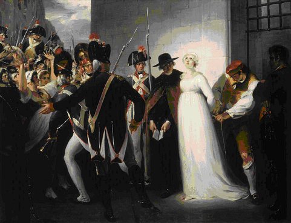
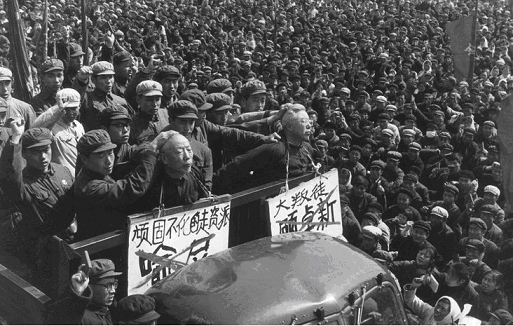

# 民主理想为何会演变成民粹结局？

一、 何谓民主理想？ 

为什么我们会对民主充满向往？也就是说，民主何以可以成为一种理想？肯定是因为我们期待民主会给我们带来一些美好的、有价值的东西，这种有价值的东西可以是民主本身就具有的，也可以是民主所带来的结果。作为生活在一个共同体中的个人来说，我可以期望共同体产生的理想价值大约有四种：自由、平等、公正、仁爱。其中，公正和仁爱在任何一种政治制度中都可能产生，我们一般并不期望民主给我们带来公正和仁爱，唯有自由和平等才是我们常常给民主赋予的理想价值。

我们先来看看民主所追求的平等。民主所追求的平等不是禀赋、才能、德性、机遇等方面的平等，这些完全由先天赋予、个人努力或自然因素所决定，跟采取何种政治制度之间不具有必然相关性，所以，民主所追求的平等是与制度安排相关的平等，如人格尊严的平等、政治法律权利的平等等等。

我们再来看看民主所追求的自由。按照以赛亚·伯林的划分，这种自由大致可以分为两种：消极自由和积极自由。所谓消极自由，就是指不被干涉的自由；所谓积极自由，就是指一个人成为自己主人或个性化存在的愿望。在此意义上，民主是专制独裁或暴政的解毒剂，专制独裁一方面任意干涉个人的行动和生活，没有消极自由，另一方面，除独裁者之外，人人皆为奴隶， 没有积极自由。

二、 何谓民粹？民粹会导致什么后果？ 

民粹或称民粹主义，其类型多种多样，有俄国的民粹主义、美国的民粹主义、拉美的民粹主义等，也有文化民粹主义、政治民粹主义等区分；其定义也有多种，国内外学界还还没有一个权威的定义。综观各家观点，关于民粹，大约有三个特征大家普遍接受：1、民粹往往是反精英的，或者反智主义的；2、民粹是反制度化或体制化的，往往诉诸暴力式的运动；3、民粹往往没有一套核心价值，随情绪、环境、条件的变化而变化，是地方主义的。

所以，民粹所导致的后果一般有以下几个：1、知识的退步、或文化的庸俗化；2、容易被个别煽动家所利用，演化成独裁或暴政；3、破坏法律制度、社会秩序和文化传统，个人自由和安全无法保障，制度传统出现断裂；4、同质化的文化生活，压制个性。这些都是与自由平等的民主理想相对立的。

三、 民主理想为何会演变成民粹结局？ 

历史上，许多伟大的社会革命或运动往往都是从追求平等、自由的民主理想开始，但最后却往往走向自由、平等的反面，导致了民粹的结局，如法国大革命。其中的原因何在？

根据波普尔的理论，美好的民主政治理想之所以演变成可怕的极权主义或民粹主义后果，一个根本的原因在于把民主定义为“由人民统治”。从词源学看，民主的最早是希腊词，意思是“由人民统治”，在波普尔看来，这个定义背后的问题是“由谁统治？”，这样就把政治问题变成了“谁统治谁”的问题，或者说确定谁是统治者的问题，这种政治思考模式从柏拉图一直贯穿到马克思。

正确的提问方式应该是“如何统治？”，这样对民主来说，其本义就应该是“如何避免专制独裁或暴政”，这一点不管是从雅典的陶片放逐法，还是从伯利克里及希罗多德的论述中都能得到体现[1]。

“由谁统治”与“如何统治”到底有什么不同呢？

“由谁统治”的提法关心“谁是统治者、谁是被统治者”的问题，这样就把政治体的价值诉求寄托于“人”，即那些有资格做统治者的人，统治者有智慧则政治清明，统治者愚蠢则政治昏暗；统治者公正则政治公正，统治者不公则政治不公；统治者高贵则政治高贵，统治者卑贱则政治庸俗；统治者进步则政治进步，统治者堕落则政治堕落…总之，政治体的性质依赖于统治者的德性或特性，政治的好坏取决于统治者的好坏，这样，谁是统治者便成了确定政体性质的核心问题。这种政治共同体的最大问题是，缺乏一种内在于政治体的恒定价值诉求，它的价值诉求依赖于统治者的天赋、才能或德性，这些特性要么来自于自然，要么来自于机遇，要么来自某一文化传统或习俗，总之，都是变化不居的，是政治体之外的因素，而政治体结构却本身不具有价值导向功能。

而“如何统治”的提法则自然把政治体的价值诉求内嵌于政治体的结构之中，使政治体的结构设计本身便具有规范性，因为“如何统治”的提法自然蕴涵着“如何统治才是好的”这样一个价值诉求，需要一些核心价值指引政治体结构的构建和运行，只要政治体能够得到合理构建和有效运行，政治体结构中所蕴含的价值诉求便自然会得到实现。

可以这样说，以“由谁统治”的政治逻辑为基础构建的政治体结构依赖于该政治体结构之外的价值诉求，而这些价值诉求又受到某些个人或群体的禀赋、才能、德性、机遇或传统等易变因素的约束，因此，这种政治体结构本身是不稳定的；而以“如何统治”的政治逻辑为基础构建的政治体结构则是在其内在的价值诉求指引下运行的，这种价值诉求不随政治体结构之外的因素变化而变化，因此，这种政治体结构本身是稳定、自洽的。

“由谁统治”的政治逻辑蕴涵的是一种高贵与低贱、真理与错误、进步与落后、智慧与愚昧的对立结构，“如何统治”的政治逻辑蕴涵的是一种目的与手段、价值与事实、独立与共存、普遍与特殊的共在结构。

“由谁统治”的政治结构是力量的结构，而“如何统治”的政治结构是规范的结构。力量的结构需要不断寻找新的合法性资源才能得以维持，而规范的结构需要不断处理各种合理性诉求才能得以良性运转。

当以“谁来统治”的政治逻辑为理论基础进行体制化的政治统治时，它便成了极权主义的思想根源；当以“由人民统治”为口号发动社会运动时，它便容易导致民粹主义的结局。

在此，我主要处理后一种情况，试图解释“由人民统治”的民主幻象为何会导致民粹统治的后果？

（一） “由谁统治”的政治逻辑容易导致价值虚空的民粹后果。 

“由人民统治”的口号背后是“由谁统治”的政治思维，预设了统治者与被统治者相互对立的力量结构。从事这种政治活动的核心目标就是夺取政权，成为统治者，统治者的属性决定着政治体的性质：人民是统治者，政治体就具有人民性；人民是至上者，政治体的存在就具有正当性；人民是进步的，政治体就是进步的；人民是高尚的，政治体就是高尚的… “人民”概念本身蕴含着“人人平等”（平等）、“人人做主人”（积极自由）等理想价值，但单纯的“由人民统治”并不能赋予政治体实现这些理想价值的方式和路径，即“人民如何统治才能实现人人平等、人人做主人”的“如何统治”问题。这样，人民取得统治权以后，往往处理不好“人民”所包含的理想价值如何落实的问题，这些理想价值就会像游魂一样慢慢稀释、消散，失去了理想价值，人民就会堕落，变成了没有灵魂的躯壳，即民粹。民粹要么被恶灵附体，即独裁；要么被圣贤收留，即贤人政治；要么灵魂重生，即革命；要么僵尸乱舞，即暴乱。

（二） “人民”概念的多义性容易导致其被庸俗化、民粹化。 

“人民”概念本身包含着从规范和事实两个对立视角理解的可能性：一方面，从规范的意义上看，人民的概念承载着平等、自由等价值理想，这种“人民”往往是一个单数概念，把人民视为一个有共同意志、有机结合的统一体；同时，这样的“人民”也是一个抽象概念，像神一样，不可见、至高无上、至善至美、全知全能、永生不死等。另一方面，从事实的意义上看，“人民”又往往被理解民众、平民、群众等不具有任何规范意义的社会群体，这种“人民”往往是个复数概念，被理解为多数的人；这样的“人民”是由一些具体的个人组成的，可见、多变、趋利避害、可操纵等等。当“由人民统治”中的“人民”是指规范意义上的人民时，也就不失其民主理想，但当“人民”是指事实意义上的人民时，便就演化成了民粹。而在现实的社会运动或革命中，这两种人民概念往往是根据需要来调用的：在进行动员时，往往使用规范意义上的人民概念，而在实际行动时，却使用的是事实意义上的人民概念；在设立目标时，把规范意义上的“人民”当作神供着，但在实现目标时，却把事实意义上“人民”当工具来使用；在政权出现合法性危机的时候，就祭出规范意义上的“人民”这尊神像，在政府面临合理性诘难时，就翻出事实意义上的“人民”这件华丽衣裳遮一下羞。

（三）抽象的“人民”概念容易被具体的个人“附身”，导致独裁后果。 

由于人民概念的抽象性和多义性，往往容易被独裁者所利用：他们要么把规范意义上的“人民”捧上神坛，变成神像或牌位，供其随时拿出唬人；要么把事实意义上的“人民”抽精吸髓，变成僵尸或工具，供其恣意挥舞摆弄。因此，在“由人民统治”动员下的社会运动中，当独裁者出现时，人民要么被架空而变成符号，要么被抽空而变成民粹，从而演变成独裁统治的结局！

（此文为同道读书会第4期活动“构建一个开放的社会何以可能？”主题发言稿） 

[1] 那么，在民主制度中，人民究竟应该如何进行统治？或者说人民应该通过什么方式、扮演什么角色才能实现民主的目的或价值理想？为此，波普尔区分了两个概念：people initiative(人民创制) 和judgment by people（人民评判） ，前一个概念是指政策由人民或根据人民的意志来制定，后一个概念是指人民只负责评判政策，让好的政策保持，让坏的政策终止，而不负责制定政策。在民主制度中，人民应该扮演后一种角色，即政策评判者的角色，而不是政策创制者的角色。 

人民之所以不适合做政策创制者的角色，原因有两个：一是，人民首先是个人的集合，是一群人，这群人只有对共同体的认同及对公共事务的关心达到高度一致时才可以称之为一个有机的整体，在某个问题的认识水平、关心程度上达到高度一致时才可能形成统一的意志和决定，才能成为政策创制的主体，这要求的条件比较高；二是，政策的创制往往需要考虑多种复杂的因素，需要理性和智慧才能做出明智的政策，而人民的同意只能确保方向的正确，即为了公共的利益，而不能确保政策的明智或者说结果的正确。所以，人民不合适扮演政策创制者或者积极支配者的角色。

既然是民主制度，就要体现出人民性来。一般情况下，民主制下的人民虽然不适合做政策的积极支配者，但却适合做政策的消极支配者；人民没有能力统治，却有能力不被统治；人民不容易给出明智的政策，但却容易判断政策结果的好坏。因此，在民主制度下，人民适合扮演政策评判者或消极支配者的角色。

（采编：陈肃；责编：彭程）
