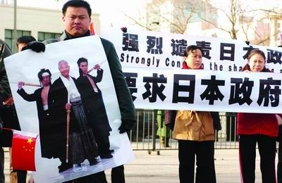
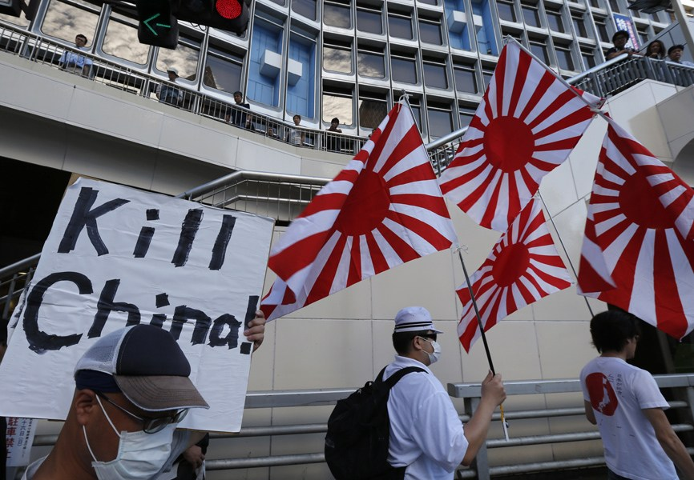

# 民族主义与中日关系的未来

** **

中国在亚太区域是扮演和平的使者还是冲突的媒介，并不仅仅取决于人们广泛认为的中国内部政治本身，更重要的是取决于中国和这个区域其他国家的互动。

日本政府“国有化”具有主权争议的钓鱼岛，引发了中国大规模的反日示威游行潮。同时日本国内也有规模不等的反中示威游行。中日勃发的民族主义，使得人们对亚洲地区的安全深感忧虑。中日关系往何处去？是和平？还是战争？在亚洲众多的国家间的关系中，中日关系可以说是这个地区和平与安全的决定因素。为什么这么说？有几个主要原因。

首先，中日两国分别为世界第二、第三大经济体，不仅两国的经济体互相依赖，而且这两个经济体各自和其他经济体，也有高度的相互依赖性。因此，一旦中日两国民族主义发生冲突，必然影响整个亚太地区的经济，甚至是整个世界经济。

第二，美日联盟的存在表明，中日民族主义的冲突必然影响到中美关系，而中美关系则是当今世界的结构性因素，可对整个世界事务构成实质性影响。美国一直把美日联盟，视为维持其在亚太霸权地位的主柱。一旦中日民族主义发生冲突，无论从哪个角度来说，美国很难置身事外。卷入？还是不卷入？对美国来说都是困境。不卷入，就等于废弃了美日联盟，美国在日本的信誉必将荡然无存，其在整个亚洲的信誉也必将消失。卷入呢？这就意味着两个核大国之间的冲突。

中美两国之间高度的经济互相依赖，已经形成了一些美国学者所说“中美国”，各自可以对对方构成金融“恐怖主义”。一旦中美发生冲突，结果不会像冷战期间美国和苏联那样，而更像古希腊时代的雅典和斯巴达之间的冲突那样。美苏对抗最终导致了苏联的解体，但中美一旦对抗，更可能导致两败俱伤。

这一点美国很清楚。因此，美国尽管从地缘政治的角度，乐意看到中日之间一定的紧张关系，但如果美国感觉到中日之间有发生公开冲突的现实可能性，就紧张起来。美国的这种矛盾态度，最近表现得尤其明显。一方面，美国对日本表示，美日联盟可以适用到钓鱼岛；另一方面，美国也在呼吁中国和日本不要诉诸于武力来解决问题。一边是经济上的“中美国”，另一边是军事战略上的“美日联盟”，美国要在这两者之间做到平衡，是一件艰难的工作。但一旦失衡，不仅会导向中日之间的冲突，也会导向中美之间的冲突。不过，美国近年来的行为，使得人们越来越怀疑其是否有能力来做到这个平衡。

#### **中日民族主义具有特殊性**

第三，较之中国和其他亚洲国家间的民族主义，中日民族主义具有特殊性。中国、越南、菲律宾等国之间的民族主义，可以视为是常态民族主义，民族主义的核心就是领土和海洋的具体纠纷。就是说，这些民族主义包含着的更多的是物质意义上的“国家利益”。这种形态的“国家利益”之间的纠纷和冲突，往往可以管理。但中国针对日本的民族主义，却具有特殊性。

近代以来，中国的民族主义本来由日本输入，也是因为日本因素在中国生根、发展和强化。从甲午战争到第二次世界大战，日本给中国带来战争和巨大灾难，如此长的一段历史，彻底改观了中国人的民族主义观念。中国人的民族和国家的耻辱，是和日本有直接关联的。就是说，中国对日本的民族主义，在具体的国家利益的基础上，增加了强烈的情感因素。这种强烈的情感因素，使得这一民族主义难以控制和管理。从“五四运动”到这次反日示威运动中所展现出来的情绪性甚至暴力性，可以清楚地看到。

这些因素表明，中日两国如何理性地应付各自的民族主义，决定了亚太区域的安全或者不安全。从理性主义的观点看，任何问题的产生总有其原因。只要有原因，人们便可找到控制、管理甚至最终解决问题的方法。中日民族主义也一样。要控制和管理民族主义，首先就必须理解它们各自产生和发展的路径。历史地看，任何民族主义并不是一产生就具有进攻性和侵略性的。民族主义最终成为国家间冲突和战争的根源，是后来人为造成的，即政治力量把民族主义作为一种力量来动员并使用到国际关系上。在这个意义上，中日两国的民族主义，如果任其发展，都具有其导致两国最后冲突的潜在危险性。

首先就中国民族主义来说，到目前为止，其主要特征表现为反应性和防御性，和二战前德国、日本的民族主义不同。即使这次具有暴力性的民族主义示威运动，也是对日本政府“国有化”钓鱼岛的反应。但这并不是说，中国民族主义的性质就不会发生变化。如果外在条件一再恶化，中国也有可能演变成往日德国和日本的民族主义。

德国和日本的民族主义在最初的阶段，也是反应性的和防御性的，但为什么最终演变成为具有高度进攻性的民族主义呢？进攻性的民族主义，既是当时德国、日本各自的内部政治因素推动的产物，也是当时国际条件下德国、日本各自和其他国家互动的产物。一个特定国家的民族主义的性质，是这个国家与其他相关国家互动的结果。也就是说，今天中国反应性和防御性的民族主义，在和其他国家的民族主义互动过程中，也有可能在未来，演变成一个具有进攻性的民族主义；而一个具有进攻性的民族主义，则倾向于导致冲突甚至战争。这意味着中国在亚太区域是扮演和平的使者还是冲突的媒介，并不仅仅取决于人们广泛认为的中国内部政治本身，更重要的是取决于中国和这个区域其他国家的互动。

今天，中国的民族主义越来越表现出其自发性。民族主义在中国已经变成一种客观的存在。一方面，政府的确可以利用民族主义，来论证其一些内外政策的合理合法性。不过，到现在为止，中国政府非常节制。从中央到地方，没有一位政治人物可以大肆动员民族主义，诉诸于民族主义来达到特定的政治目标。相反，政府对民族主义更多的是管理和控制。另一方面，政府在管理和控制民族主义方面，面临越来越艰巨的挑战。中国政府经常遭到国内外中国民族主义者的批评，甚至攻击。一些政府官员尤其是外交系统的官员，被民众视为是“汉奸”和“卖国贼”。同时，中国民族主义越来越表现出激烈的情绪面，使得其可以产生巨大的破坏性的同时，大大增加着对政府的压力。

#### **日本右派势力壮大**

也同样重要的是，我们必须对日本民族主义性质的变化有足够的认识。因为日本是民主国家，长期以来，人们对日本民族主义的潜在威胁没有多少认识。不论美国和西方还是亚洲其他国家，都对日本民族主义抱“理解”的态度，总是认为日本是“和平”国家。理由有两个，一是日本的和平宪法，二是日本的社会变化（民主、消费社会、少子化、老年化等等）。即使在中国国内，持这种看法的人也不少。但实际上的情况又是怎样的呢？

多年来，日本的民间民族主义（即一般称之为“右派势力”的社会群体）一直在壮大。同时，政治精英也在动员着民族主义力量。和其它很多发达国家一样，日本的大众民主越来越难以产生一种强有力的政府。为了政治的需要，政治人物往往以民主为借口，用民粹主义政治方式，动员着民间存在着的民族主义资源。结果，牺牲的往往是日本和其它国家的关系，尤其是和其邻国中国、韩国的关系。这种现象在小泉纯一郎期间表现得很明显。

日本政治现在的一般趋势是，无论是执政党还是反对党，无论是中央政治人物还是地方政治人物，无论是政府还是民间，都有很大的动力去诉诸于民族主义。小泉纯一郎、石原慎太郎（东京市长）和桥下彻（大阪市长）等，之所以成为日本的政治明星，其中一个很重要的因素，就是因为他们善于动员民族主义力量。可以想象，随着日本政府的继续弱化和这些民族主义政治精英的崛起，日本民族主义的发展趋势会是怎样？而日本民族主义的勃兴，又必然转而刺激中国的民族主义。

很显然，正如人们所已经感受到的，在中日关系中，民族主义力量越来越显现出其巨大的能量。在这样的大趋势下，中日关系向何处去？中日关系会有怎样的未来？人们可以设想如下几种有可能变成现实的情形。

首先，中日两国政府回归理性，并且各自有能力有效管理本国民族主义。在这个情形中，尽管两国民间民族主义也不时会爆发出来，两国经常吵吵闹闹，但不至于发生公开冲突和战争。在这方面，中国政府的能力不容置疑，但日本政府面临巨大的困难。目前，在大众民主结构内，日本很难产生一个强有力和有效的政府。不仅如此，如前面所讨论的，日本的政治精英为了权力，不仅不去遏制民族主义，反而诉诸于民族主义。

其次，最理想的状态就是双方政府能够比较具有“自主”权（也就是政府不受民间民族主义的过度影响），达成“搁置争议、共同发展（开发）”的共识，并能够把此共识转化成为具体的政策，从而实现日本前首相鸠山所说的把东海变成“友情”之海。但现在看来，这种情形是遥不可及的理想。在两国强大的民族主义面前，政府的“自主性”谈何容易！

其三，中日关系随着民族主义的继续强大而不断恶化。历史地看，民族主义的逻辑是，当其力量崛起并强大到一定的程度，必然有政治力量通过诉诸于民族主义来掌握国家政权。如果这样，就意味着两国都有可能被极端势力所挟持，最后使得冲突和战争变得不可避免。不过，战争也解决不了问题。战争所能解决的最多只是谁实际上占领钓鱼岛的问题。但即使这样，战败的一方也不会承认。就是说，战争只是把仇恨遗留给下一代而已。

第四种情形就是中日回归传统相对“孤立”状态。中日两国相处数千年，但从战略上说两国大部分时间都处于相对“孤立”状态。这种相对孤立状态，并没有妨碍两国民间的商业、文化等多方面的交流，并且是和平的交流。但一旦两国意图在战略层面进行交往，或者说两国政治关系过紧，双方就没有“幸福”的生活了。尽管中日两国都认同“一山不容二虎”的概念，但两国则可以处于两个“山头”，都有足够的能力来保卫自己。为了避免大规模的冲突和战争，回到传统那种相对“孤立”状态，也是一个理性的选择。如同过去，在相对“孤立”状态下，也可以发展具有实质性的民间交流，尤其在文化和商业等方面。

（采编：彭程；责编：周拙恒）

 
