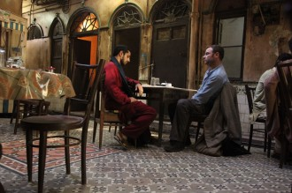

# 永远的陌生人——《拉合尔茶馆的陌生人》影评

电影，永恒的主题就是人的命运。我们乐意看到那些与命运抗争的故事，更崇拜于那些改变甚至创造了命运的人。这源于人类对自身的困惑与无助，希望有那么一种神迹般的力量来鼓舞自己，于是人们虚构出无数个伟大的形象，在电影里，这些伟大的形象更是被人们所追逐膜拜着。然而一个也许让人沮丧的事实是，这世上的多数人，也许就是看着电影的多数人，都是在命运的左右中无可奈何的小人物，你就是被大侠踢翻了摆摊的商贩，你就是被孤胆枪手误伤的路人甲，外星人入侵时你就是第一批炮灰甚至连一个正脸的镜头都没有。 而《拉合尔茶馆的陌生人》这部电影再去除了宗教与文化冲突这些外层解读之后，就是这么一个小人物无可奈何的悲情故事。 

这部改编自同名小说的电影是由印度女导演米拉•奈尔执导的，整部影片采取了采访+回溯的形式，在采访中主人公向一位美国记者讲述了自己过去的故事，而在结尾又把人拉回到了眼前的世界里。

主人公可以说是“美国梦”的楷模，他虽然生活在一个巴基斯坦家庭，然而却崇尚西方文化，在美国凭借个人奋斗在一家评估公司获得了不错的位置并且得到了老板的器重，还收获了美好的爱情，你几乎看不出来他和其他的美国人有什么不同点。如果故事讲到这里，这或许是一个主旋律色彩的影片，用美好的氛围告诉人们民族与宗教不是隔阂，只要个人奋斗都可以获得成功和尊重。

太天真了。

小人物的悲情往往并不是来自于他们不可以改变命运，而是来自于他们的命运太容易被改变了。就像大洋里的一艘小帆船，随时可以改变航向，然而一个大浪就可以把它打翻，这个大浪就是9.11事件。

我无意再去讨论这个事件的影响如何或者孰是孰非，也不打算说一番化解冲突谴责恐怖主义的煽情废话，导演显然也没有用太多篇幅去讨论这个事件本身，而更多的放在了这个事件对一个毫不相干的普通人的影响。

于是我们的主人公开始发现周围的一切变得不对劲了，在机场一群同事里只有他一个人需要被脱光衣服检查，只因为他是巴基斯坦人，是穆斯林；他的同事和周围的人开始把矛头对准伊斯兰教和穆斯林，尽管他们连伊斯兰教的典籍叫什么都不知道；开始有陌生人辱骂他；警察毫无理由检查和抓捕他，只因为他留着胡子，而他的女人带他去的艺术展览也在诽谤他的宗教信仰。

最后他回到了巴基斯坦，成为了一名激进主义教师，他开始教授他的学生们他自己的感受，他向他的学生们发问：人人都在追逐“美国梦”，可我想问问你们，有没有考虑过“巴基斯坦梦”存在的可能性呢？而“巴基斯坦梦”是什么呢？结尾告诉了我们，当局对待这些青年人更加残酷和血腥。

当我看完这部电影的时候，我只觉得一种无力感，主人公努力地想融入美国社会，成为一名美国人，他也自认为自己的确做到了，获得了美国的信任和尊重。然而在911之后，他发现这种信任与尊重瞬间消失了，这个国家还是把他当作第一位的嫌疑人，或者说他悲伤地发现其实这个国家可能从来也没有真的信任过他。他所做的职业是为公司做利益评估，也正如他的职业来说，美国也在对他进行着利益评估，仅仅是把他当作可以为社会产生价值的工具，而没有把他当作自己人。

与另一部穆斯林题材的电影《纽约五尖塔》不同的是，这部电影从头至尾都没有太涉及宗教话题，而主人公也不是一个对宗教很狂热的人，甚至有些漠不关心。恰恰是这样一个对宗教不感兴趣的年轻人最后却成为了一名激进主义教师，而他最初的梦想是美国一个普通的中产阶级，有美满的婚姻，和同事一起烧烤聊天，在这个号称可以让所有人实现梦想的国家里过自己的幸福生活。

当我们以“穆斯林”作为标签来看待一个人的时候，事实上没有完全标准意义上的穆斯林，因为每一个穆斯林在这个社会里对他产生作用的并不是宗教身份，而是其他的社会身份。在工作中他是上级或下属，在交易中他是商家或消费者，在家庭里他是父亲或儿子，但这个世界上没有一个人身上只有“穆斯林”这个身份。

一个穆斯林从另一个穆斯林手里买东西，难道就不用花钱吗？

我本人作为在汉族居住区长大的回族，其实很能理解主人公的处境，影片名字中说的拉合尔茶馆的陌生人，其实说的不是那个美国记者，而是主人公。他在美国是个陌生人，在拉合尔同样是一个陌生人。他有自己的信仰让他无法完全融入美国的社会里，但他所接受的西方文化与教育又让他无法完全融入巴基斯坦的社会里，这个与很多生活在东部汉族区域的少数民族的处境是很相像的。

一方面这部分少数民族依然保留着自己的信仰和底线，他们无法完全融进汉族社会，而另一方面他们或多或少又被汉化了，让他们与自己的民族主体有了一定的隔阂，最后的结果是两个社会里，他们都是陌生人。于是一部分人完全放弃了自己的民族意识，彻底融入汉人社会变成了实际意义上的汉族人，另一部分人为了获得本民族人的认同，民族意识变得更加强烈而极端。

而在这个区分中，最悲剧的依然还是那些小人物。他们必须生活在一个个圈子里，所以他们必须获得认同感，于是他们辛苦地应付着所有人，小心翼翼地说话做事，生怕让自己显得和别人不一样。但是永远永远，他们总是能看到别人的误解、诽谤甚至是猜疑。他们在自己民族的圈子里要注意自己不要像个外族人，要谨慎地注意遵守习俗；在外族人的圈子里又要时刻宽容和容忍他人的无知与无意的诋毁，这些都

不是小人物敢于去碰撞和冲突的。

在这个文化与宗教冲突背景下的故事，其实讲述的一个人如何在夹缝里生存的故事。

《飞砂风中转》里面有句对白：

“狼吃肉，狗吃屎，你想做狼还是做狗？”

“我想做个人。”

(采编：王卜玄；责编：王卜玄)

[【隔夜梦】压寨夫人](/archives/41510)——在我前半生的生命中，我见到的男人都是白面书生，他们肃穆雅致，喝茶走路，吟诗颂词，迈着小步。而你把我抱起，往你的房间走去，那步伐稳稳中带风，我的腰身被你手牢牢地控住，我知道我是安全的。 [【隔夜梦】失去睡眠的梁先生](/archives/41474)——他惨淡地一笑，说还是算了，毕竟睡完女人后不能擦干净睡一觉，而是默默躺着数自己多少个小时以后能再睡她一次，世界上没有什么比这个听起来更令人感到绝望的了。 [【隔夜梦】恋梦者](/archives/41536)——“这里建好之后就会被水淹没，以后我们再也没办法来到这里了。” “所以呢？” “如果我现在跟你表白却被你拒绝的话，我以后也不会因为触景生情而难过。” [ 【隔夜梦】红X](/archives/41572)——这么说，你坚持认为，分级制会打开中国的潘多拉魔盒？ 不会。 苏格兰人祝酒时有句常用语——“希望你能在天堂呆上半个小时……在魔鬼知道你死之前。”
