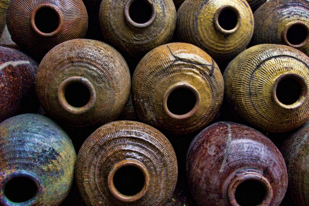

# 沙民系列之一·沙民

**长江南移，老岸变桑田，沙上筑新堤，沙民刚刚上岸又站在了水患的最前沿，历次洪灾，不知多少船户舍弃自家赖以为生的渔船去填大堤缺口，用血肉之躯，用身家性命保卫家园。更有甚者，在船毁之后，也不愿脱出漂泊生涯，三次赴疆支边，应者多是船户，小长源的哥哥大长源，一去三十年，到死也不曾回来。沙民的后代从不惧怕远行，因为停留就意味着没落与老去。河流是他们的灵魂，漂泊是他们的故乡。**  

# 沙民

## 文/周阿飞（南京师范大学）

# 

 

我的故乡水三是典型的圩乡村落。以圩坝拦洪围田，水道纵横，称作圩乡，我们那里叫“一圩三水六分田”。水三的村圩成“三”字形横平，左右两条长港遥遥的引江水下来，一直向北延伸，我家就在水三最下边的曹圩上，这里也是沙上小镇的最北端，后面隔条小河就是红光镇，长江老岸地界。家往西走十里路到泰县，百十里达扬州城。十五里南望，就是淘尽古今英雄的大江。

水三也是江里淘出来的，往上推二百年，这里一片的水泊汪洋，不过百多年冲刷，就让江水打出这一片沙地。太平天国之乱，江南流民来住，才渐生人息。沙土中做生活，故而称沙上，与老岸相对。老岸即原先江岸，三国时孙权牧马的江心洲，后岳武穆退兵至此，见水草丰茂，便将义从的江淮难民安顿下来。同样是江中泥沙堆积而成，同样是流民汇聚，却人文迥异。老岸千年繁衍，终有根基，不急不缓，善趋利避害；沙土贫瘠，谋活不易，沙民又都是流水浮萍，想扎下根来，实在太难。

世人皆道江南好，可知当初北人南来拓荒是何等艰辛？这种磨难也造就了沙上百姓坚韧果毅的性格:苦中求活，不计得失——反正也无从可失，一个人贱得只剩性命了，又怎会再去在意活计辛苦，总不能就死去吧？

世上三等人最苦，撑船打铁磨豆腐。从安徽、扬中来的沙民大多无地，要么只租种一两块田，也不指望能糊口粮，只种些蔬菜荞麦，但每户必有一条船，一船便是一家，锅碗瓢盆柴炊炉火都在船上，除却卖鱼很少上岸，老岸居民称他们“船上人”。船上人的家都是有乌篷的木船，如果做渡江客生意的可能要稍微大一些，也带一桅帆，长杆一撑橹一摇，一声号子一水漂。除了渡客打渔，也兼装货运输，整日风吹雨淋，无分昼夜寒暑。

船上人世代撑船，子孙长成之后分家，便是打一条新船，购一副锅炉碗筷，另立船户。因而船户家的儿子水性都极好，为人爽气，胆子大的惊人，船微水深，无风三尺江浪，若没有几分胆色的，早早上岸罢。民国三十八年渡江战役，我本家太爷临时入伍，一舟横江，迎面枪林弹雨，涌浪翻天，这边军令一下，他一声牛号子响，全船士卒卧在舱里，独一人与帆同立，来回运兵十三趟，帆布和篷舱都被打烂了，依然面不改色率队冲锋。当然，若只有胆量的，多半也葬身水底了，天上的暴雨狂风，水下的漩涡暗流，甚至是江里的大鱼，哪一桩都能轻易要人性命。所以船户们都擅辨水文天相，他说要有雨就一定不会出太阳，我小时候极佩服，觉得这真是神仙的本事。

我家有个姨太太嫁在界河，就是原先船户上岸的人家，但还弄舟，姨太的孙子唤作大小长源，我见过小长源几次，高高个儿，有点儿驼，他的右臂明显粗大，看上去左右很不协调，我想大约是常年用右手摇橹所致，脸上和身上的皮颜色无二，通身黝黑，臂上的筋脉爆出来，一摁下去还弹出来，很结实。他带我到港里游泳，一双手使得好似螺旋桨，这边一个猛子扎下去，能到河对岸才冒出头来，然后哈哈狂笑，像犯了夯病，偏生叫人也跟着笑，因为实在好笑。这笑声像江鱼发出来的，又像铜锣对磨，沙哑又高昂，用尽了力量和豪情，好似他完成了一桩大事业，脸色酡红着，像是用性命在笑。

我最爱看人家笑，所有丰满的性格，心中的情意，都在笑声中传出来，一听能透心底，不差似歌剧。鱼也是会笑的，他和我说。我信，我想听听。

水三有人家嫁女儿去江南，我奶奶去送亲，上的就是小长源的船，离了岸就是风大浪高，船颠如筛糠，一船人战战兢兢，小长源哈哈狂笑，乘风破浪。我奶奶抿紧了嘴，往隔板上靠住，双手攥死了船梆子，一声不吭，雨水打在脸上，皮又疼又白。

小长源甩一把橹子，半唱半叫：“姑奶奶，你莫怕，我卵蛋才有黄豆粒大的时候就出来弄船哩！”

奶奶闭上眼不答话，脸色愈白。

他嘿然一笑，双腿微蹲，往上提一提袖子，单手稳舵，下盘猛地发力，船一瞬间定住，忽又窜到风雨当中去了。

江南有人邀我奶奶也嫁过去。她说，江南再好我也不来了，这江上的浪头吓也把人吓死。一众船户哈哈大笑。那一年她十六岁，两年后就嫁到了隔壁周家。那时的江南也真不好，残垣断壁，草长莺飞，一派荒凉凄景，远比不得今日的寸土寸金。若是她能预知后来发生的一切，会不会后悔当初没有渡江？

我是真想念小长源，他每次来看我们总带那好喝的银杏露，还和我说江里的好故事。他说江中有条大鱼，时时出没，若是渡船遇到了就要当心，大鱼高兴了不高兴了一尾子甩过去，船就要翻。

“那会死人么？”

“会的，不过不常有。船翻了人就抓着船梆子，定一会儿就没事。”

“它不吃你们么？”

“不吃不吃，他只咬那做了亏心的船工和渡客。”

“它有多大？”

“有二三十条船相连那么长，两层楼那么高，嗯，大得很！”说这话他还拿手伸长了比，木船我见过，二十条木船连起来，那可真大。

“它这么大吃什么呀！”

“吃鱼啊，草荤，鲢子，刀鱼，鲥鱼，江鲫，什么都吃。”

“那鱼都被他吃光了啊，你们怎么打来卖钱呢？”

“哈哈哈哈，那不能，江里鱼多得很，它吃不完，我们也打不完。”

他说这话我都信，我问过爷爷，他也这么说。不过我始终没有见过大鱼儿，听他们说是化工厂太多了，江水不好，它游到海里去了。可是海里的水就好？话又说回来，现在都是铁壳船了，它想打翻也不容易吧，还是说如今做了亏心的船客太多，咬不完，这条侠鱼就撂手不干了？江里的鱼也没有了，再不是吃不尽打不完，它要是留下会挨饿吧，小长源要是还在的话，许是要伤心呢。

他还和我说他小时候遍河乡都是乌龟螃蟹，大家都不欢喜吃。我想，那真好。

“那后来呢，乌龟都去哪了？”

“都顺着江水，往海里去啦。”

“都去了，怎么去的？”

“有个顶大的游在最前面，后面的一个咬住前一个的尾巴，组成一个队伍，这就不怕浪打散了。”

“都去了？”

“都去了！”

“你见着了？”

“见着了，老长的一个队，看得人多得很，还挤塌了一段江堤！”

原来是这样。怪不得乌龟没有了，这些剩下来的个把个，应该是当初没赶上队伍的咯，真可怜。乌龟咬尾巴是对的，它们的嘴有力，能咬断一根筷子。为此我伤心了好久，因没能赶上大队伍，送送它们。

为什么它们要走呢？人又不吃它们，干嘛要走呢？

姨太太没了之后，我就很少见到小长源了。他应该是沙民中船户的最后一代，先人留下来谋生的手段在“一桥飞架南北”的年月里，上不得台面了。听说早就不弄船，过后没几年，也殁了。我觉得他是找那大鱼去了，他们才是伙伴，笑起来的声音也像。一个甩尾一个摇橹，一同过长江。

船户上岸是这几十年的事，虽离舟楫，骨子里的聪慧悍勇却不减分毫，不少人也正受惠于祖宗流在血里的脾性，在更大的江海中崭露头角。长江南移，老岸变桑田，沙上筑新堤，沙民刚刚上岸又站在了水患的最前沿，历次洪灾，不知多少船户舍弃自家赖以为生的渔船去填大堤缺口，用血肉之躯，用身家性命保卫家园。更有甚者，在船毁之后，也不愿脱出漂泊生涯，三次赴疆支边，应者多是船户，小长源的哥哥大长源，一去三十年，到死也不曾回来。

沙民的后代从不惧怕远行，因为停留就意味着没落与老去。河流是他们的灵魂，漂泊是他们的故乡。

造八世重孽才投胎到船户人家，他们实在没有什么舍不出去了，所以才敢挣命，不去拼不去闯，就只有往江里裹了。他们不抱怨，不信命，才能豪情万丈，才敢翻江蹈海。

我决然认为水三曹圩是要出大人物的，而且必出在我奶奶娘家这一户。当年改革开放大潮涌入江北之时，水三不甘寂寞，建村办企业有二，位于两侧，称东西两厂。曹圩并总五十六户人家，只我奶奶娘家姓朱，且是沙民船户出身。我舅爷娶三妻育四子二女，儿辈皆胆壮气正，不类凡人，然孙辈却只有一子传承，余者全部巾帼，到第四代已无男丁，令人颇为意外。不过想想就也通了，当今世界，阴盛阳衰乃是天道，他年朱家若出个大周武皇也在情理之中的。

 

（采编：孙梦予；责编：徐海星）

 
