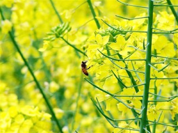

# 沙民系列之三﹒儿童放学归来早

#### 一

小儿稚年，从不知道世上还有上学这等痛苦的事，每日毕恭毕敬的叫了先生，端坐在黑乎乎的屋子里听一些无聊的东西，还不能乱动——不上课的时候也不行。

我最早的记忆，就是每天早上和奶奶去折羊草，拔萝卜，逗弄一会儿肥猪和小羊，回来的时候躺在奶奶的箩担里，一头挑草，一头挑我，扁担上有露水的味道。中午有炖蛋泡饭吃，吃完可以坐在自留地里眯眼睛捉虫子，渴了就摘一个番茄，一咬一嘴汁。晚间拖着大黑狗去队长家开会，嗑瓜子，夜里搂着奶奶的脖子听着过去的故事入梦，一觉睡到鸡打鸣。

我常常想，同现在从胎教开始不能输在起跑线上的负责家长们比，奶奶真是个顶好的启蒙教育家。相对于县城辅导班里的孩子，我的童年未免太过幸运了，所以后来发生的一切，也是对这段最好的时光的补课吧。

六岁生日一过，爸爸送我去村小报名，因为是下半年，而且已过小半学期了，只是让我去适应一下环境。

第一课刚开始我就后悔了。同学们像傻子一样坐着，没有人动。老师更奇怪，手里拿着像捣衣杖一样的木条条挥来挥去，在黑板前面站着说话。最可怕的是，她在讲什么？不是沙上话，也不像电视里的人说的话，又不像婆婆家那边儿的老岸话，叫人怎么听得懂？我太不高兴了。

终于，在老师转身的空，我捏住鼻子，“哄哄”学猪叫了几声。在所有的家畜中，我学猪叫学得最像，到圈前一叫，猪们闻一声必然耳动，两声抬头，三声以上，集体起立朝我行注目礼。这本事一直到高中都没落下，还借着它成了一桩巧事。然而此刻却失灵了，老师和同学们惊诧地看着我，他们居然没有笑！

一路冲到校长室，扑在爸爸怀里，嚎啕不止。爸爸让我坐到他大腿上，摸头抚脸，疼爱的不得了。这时正好有个老师过来，叫做周国民。这位老师曾经教过我的父亲，又是本家爷爷，住在水三中间的高圩上，逢年过节我与父亲都要过去请安的。

这位先生的眉目很特别，他的瞳仁极大，几乎占了眼珠的三分之二，眉毛则像两把剃刀，横行目上，加之眉骨突出，脸颊瘦削，更显得目光深邃，所谓剑眉星目者，大抵如此。他常年穿一身白衬衫，夏天就套蓝袜子踏拖鞋，中分的头发疏的一丝不滑，满面的严肃刚正，配上高高的个子，真有先生的派头。他有一辆凤凰牌的凤头车，原先在江边口的小学校教书时买的，从水三到口上，来回摇了二十年。

后来父亲换了摩托车，先生还是摇着破凤头，一直到退休。我和父亲每次骑着摩托在路上遇见他，总是父子二人齐声大喊：“老师！”他总高声回应：“哎，士根。”士根是我父亲的名字，有时他也喊我的名字，但都是喊大名，他从不叫别人的诨名，那不尊重。

周国民老师要我先回教室，我不敢违逆。他我是知道的，家里老大人见到了也要客客气气。而且别瞧着先生斯文，他手上的劲大得很，不久我就深切体会到了。

我坐在靠窗户的座位，泪眼婆娑地哼唧。爸爸不久就回来了，给我带了一大包虾条。

“你看别的伢儿都没得吃，你有这么多。”

“哼哼……额呜哼哼。”

“虾条好吃吗？”

“好吃的。”

“以后想吃吗？”

“想。”

“那你在这上课，我每天都买给你吃。”

回应他的是嗷嗷的大哭。我是天生的绒鸭嗓，又哑又憨，要是哭出来，比老鸹叫还难听。一位老师听不下去了，提着那捣衣杖走到我跟前：“不准哭，再哭要挨打！”

她脸上的白肉一步一晃，说话的时候牙总咬着下嘴唇。我不敢说话，虾条也不吃了，怕被打了，只是哭。

她一跨到我眼前，擒住我正在抓虾条的手，举起棒子作势要打：“赶紧不要哭，还敢吃虾条，你看别人怎么不吃，怎么不哭？”

我惊恐地往后缩，想靠到爸爸身边去，却怎么也脱不开手，两个人拉拉扯扯，校长和父亲，老师与同学，像呆了一样看我们拔河，我在地上又厥又跳，老师浑身的肉波浪起伏，窗外阳光明媚，柏木青翠，银灰色高音大喇叭里面在唱：“亲爱的朋友们，我们来相会……”

“啪！”一声清脆的响声，我的手红红的拱起来了。老师真的打了。她怎么能真打呢？我爸爸还在这呢！我又气又急又疼又恼，突然想起了父亲惩罚我的方法，勉强止住哭，大声脱口而出：“你再打我，我就让爸爸用胡子戳你的脸！”

场面瞬间安静了。平时一向一丝不苟的国民先生最先笑了，露出一颗大瓷牙。我父亲手从裤袋里一下子拿出来，似乎不知道往哪里放，朱老校长扶着他的肩膀，笑的直不起腰。倒霉的女老师呢，脸比我的手掌还红，手里的棒子拿也不是放也不是，终于忍不住，也笑出声了。

他们为什么要笑呢，兴许是我这用尽力气吼出来的杀手锏震慑了老师，她害怕了。

不管怎么说，这努力总为自己争取到了半年的美好时光，安然的度过了最后一个童话般的冬季。到第二年的春天，我已经能自己背着书包走去学堂了。

#### 二

在乡下长成的孩子，他的童年梦境和现实生活是重合的。从梦里出来，走到水三的田园里，一样的美丽。这是我逃课最主要的原因。想一想，课堂里残破的黑板，脏兮兮的课桌，不喜欢笑的老师，难道比得过外面明黄芬芳的油菜花、长嘴鸟、花蝴蝶？

油菜花的起点是东疆岸的小路边，再往东是芦花荡，临着东港，一片黄向西漫延。不像金子的色，它是淡的，清而明亮，会不会因此才在清明开的最好？我最爱看傍晚起风时的花景，花浪一起，花香千溢，花粉铺天盖地的卷起来，是要把天空染黄，把夕阳熏醉了。

东疆岸花田的底下是各家的坟地，多且密，藏着许多小洞，洞中躲着的大多是野鸡雏，也有刺猬，田鼠，兔子什么的，但是春夏草密花多，难以发觉，秋冬万物萧杀之后，那些洞口又被动物们拿土封住了，不容易找到。找到了也不行，野雏子跑得比狗快，还千万不能追，一追前面可是花田啊——见过油菜花的都知道，一株菜花十根枝桠，而且十分坚韧，易折而难断，更何况千万株并立的花田。

往前追两步就挤到田里头，放佛有千百只手抓着你不放你朝前走，你越是用力挤，它们越是密密地挡，你若想往回退，它们攀住你的脚，锁死了后路。前有千军当道，后藏百爪缚足，满目都是比人还高的花枝，连后头的小路都见不着，喊也没人应，动也不能动，真是要急得五内俱焚。

那滋味是终身难忘的，我被夹在花丛中，也不敢呼救了，花田里的蜜蜂太多，怕它们来咬我。眼珠子随着这些平日被我欺压的小东西们转悠，渐渐开始胡思乱想。

就想起来爷爷和我说的个故事，说有个地下党装作卖烧饼的去刺探敌情，被发现之后缚住了。就绑在现在堂堂圩的公车站，一根大柱子上拷好了一动不能动，敌人拿着刺刀审问他，他怒目而视，敌人就戳一刀，再问，再怒目，又戳一刀……一共戳了八刀才死掉，眼珠子还瞪的大大的。我一想，这不就是我吗？被绑在菜地里不能动，好多的蜜蜂捉着刺刀来回飞，只是故事里围着看的人们换成了这些个漂亮的花儿啊。

一想起来，四周仿佛一下子安静了许多，眼泪和冷汗一道儿淌下来，呜呜哼哼凄凄惨惨地自语，哪个来救救我，要是有人来救我，我就再不逃课了，保证不。

当然没有人来救，我哼累了，自己挂在那儿睡着了。春风吹捧着曳曳生姿的花海，海面上捧着个娃娃，海底深处，藏着的小野雏们肆意欢快地嘲笑他。

太阳刚要落下的时候，救星来了。家隔壁的年富大伯从东厂下班，捡到了小路边我落下的衣裳，摸进来的时候，看到我正长在花上。他惊愕地问我：“阳阳，你怎么拱在这里不家去？天都要夜了啊。”

我既喜且哀，哭丧着脸说：“大大，我被夹住了，出不去啊。”

那一刹那居然又想到奶奶讲的个笑话，爸爸的干爹娘年轻时候也弄过船，没有时间照料孩子，一次奶奶上工看到他家的老五在地上爬，想着这五儿也该有五岁了吧，就问他：“五儿五儿，你怎么不起来走路啊？”

五儿哭丧着脸：“二娘娘，我不会哎！”

如今终于知道五儿当时的心情，非不愿，实不能也。

不过打那以后，居然也知道了不去乱碰貌似美妙的东西，因为不知道有什么尴尬和危险藏在美丽的外表背后。再美丽的东西，一旦以恐怖的数量出现，也容易酿成悲剧。高尔泰说集体使人恐惧，是否有此意？

逃课的下场就是第二天被罚站黑板，这让我感到和被挂在花间一样屈辱，全班同学像看马戏团里的狗熊一样盯着我，似乎光站着还不够，最好能做些动作才好玩，尽管我知道他们中的大多数都没看过马戏。果然，集体使我恐惧。

所以我更多的时候是和黄儿在一起，他不会嘲笑我，也不会在下课的时候趁你不注意，摔你一个大马趴。

当然，逃课还是要继续的。

#### 三

水三有几处地方，从来是孩子的天堂。自留地里的香瓜棚，望腰沟上的白桑田，小豆眉家的油橘树，大队院中的石榴红。当然，最少不得门前的河。深不过两米，阳光直射，可以清楚的看到水底的游鱼和淤泥。三伏天下午一两点钟，无事的男人小子，挂着花肚兜的小姑姑，通通地跳进水里去，把鱼虾惊得跃出水面，连绵不断组成一条白练在水面上飘飞，身上的白鳞反射了太阳的火光，水珠四溅，如同搅动了满池的七彩珍珠。

把大木盆浮在水上，跃起的鱼儿能够落在盆里噼啪响，还有藏在泥里的青蚌，脚板一划，猛子一扎，浮出水面举手笑哈哈。最甜最脆是塘里的菱角，挑刚刚长成的白角，两手一掰能流出清甜的汁水，拿唇稍吸，白嫩的果肉滑到舌头的味蕾，比莲子香，比琼脂美，像和仙女娘娘亲了个嘴。

洗半天澡，去人家田头吃香瓜黄瓜，拿桑葚柑橘。桑葚是贱品，桑树又多，各家随拿随吃，只要不踩坏桑枝就行。瓜果就不同了，人家要卖钱的，不能明目张胆地拿，我们管这叫“请”——都是邻居乡亲，怎么能叫偷呢！往往一人放风，二三人潜入田间，连摸带摘，一有风声，放风的哨子一响，众人立作鸟兽散，田主极难抓到现行。请瓜客一般只取成果，不坏幼苗，且轮流各户，不使一家损失过大，庄户们也就睁只眼闭只眼了。

不过也有例外。偷拿柑橘黄瓜，若是被小豆眉撞见了，他是要追赶的，还要打人。黄儿就吃了这个亏。实在也是那些孩子太坏，每次都叫黄儿把风，分赃时又只把些粗硬莄子给他吃，有时小豆眉埋伏好了等我们去，那边被发现立时就跑，留下个不知所措还在忠于职守的黄儿，被粗暴的抓住。

每次都是我去营救，因这小豆眉即是五儿的爹爹，我父的干爹。上了年纪弄不动船，就植了这二亩油橘，平时兼种果蔬，聊作补贴。我去喊门，小豆眉见了就不折腾黄儿了，告诫说下次不能，都弄坏了他的树了，又塞几个橘子给我，就放我们去了。

可怜黄儿已经是眼泪在眶里打转，耳朵被揪得红通通的，他又不会喊，真可怜。这我也挨过，有次当面喊一个太太“聋子老娘”，足足被她追了半条圩，一直揪到奶奶那数落，差点没吓死个人。那时她都七十多了，老人们都爱较真。

我就不让黄儿跟着他们去请瓜了。我对他说，大队部的院子里有顶大的石榴，我带你去吃石榴。他听着就忍住眼泪，溜溜的跟我走了。

大队的石榴树是上了年纪的，我是随爷爷进过一次院子才知道，此后就一直惦记着。小学校和大队部一墙之隔，学校护院的狼狗窝当中有个狗洞，可以直通队院。那一日运气不错，狗子睡着了，我和黄儿从狗窝侧墙爬进去，捂着鼻子钻过了狗洞，太臭了。

石榴已经咧开嘴了。一粒粒晶莹剔透，汁酸肉甜，再怎么吃也不感觉涩嘴，可惜核子太大，间或也有小虫从果子里爬出来。我与黄儿吃的牙酸腮红，被那太阳一照，像是吃醉了酒一般，心里也确实是甜醉了。看时候不早，美美的原路返回。

到洞口一看，倒回不去了。那大狼狗醒转过来，对着这头龇牙咧嘴的，要不是脖子上铁链拴着，说不得就要来咬我们。思来想去，只好去大队部门口自首，好巧不巧，看大门的杨老二居然还不在，这一定是去小卖部看人家耍钱了。

我没法子了，黄儿也急得不行，他要是回去晚了，老头子要担心的。我们趴在门卫窗台，瞧见了刚装上的拉线广播，略略思索，顿时有了计议。

我让黄儿躲在花坛后面，一个人上了二楼广播室。二楼广播室的广播是老式的银灰大喇叭，一声喊出去，三五里路都听得见，还有阵阵的回音。按钮很简单，红的就是开关，往上一拨，可以讲话了。

“年轻的朋友们，今天来相会，荡起小船儿暖风轻轻吹……”

轻快的歌声响起，沁人心脾。同时响起的还有如老鸹叫似的童音：

“杨老二，你在哪里，快来开门放我们出去！”

“再过二十年，我们重相会，伟大的祖国，该有多么美……”

音乐继续，老鸹也不愿停，怕他听不见我又喊一声：

“杨老二，你快回来，我们被关在里面咯！”

果真是回音阵阵，排山倒海啊。霎时间，我真觉得如在云端，天下的百姓花草猫狗鱼虫都是我的子民，大家听到了我的喊话，花木摇曳，众生歌舞，真是快活。可惜还不到两分钟，就从天上掉到地里去了，还是脸先着的地。

周国民老师赶过来了。他健步如飞，迅猛地冲到楼梯口堵住想要逃跑的小贼，一把将我提起，扔沙袋似的朝院子角落破沙发上一甩，我被砸了个七荤八素，勉强看见杨老二脸跟猪肝似的站在那发抖，像要吐出口鲜血来。没及多想，又被国民先生揪住耳朵快步往前，几乎就被拖着前进，那可真疼啊，我吓得发昏，连哭都忘了。

“啊亲爱的朋友们，愿我们自豪的举起杯，挺胸膛，笑扬眉”

“光荣属于八十年代的新一辈！”

“光荣属于八十年代的新一辈！”

“光荣属于八十年代的新一辈！”

#### 四

儿时和爷爷用冲虾网，半天能捞一大澡盆的小龙虾，都是十斤八斤往别人家送，实在吃不掉了，又扔回河里去。如今居然也卖上了价钱。也不怪，今天下到圩乡，哪条河不是花花绿绿的闪着油光？养水产的人家鱼虾死绝的事情也是屡见不鲜了。

至于水三曹圩，去年夏天爸爸说要下河去摸摸蚌子，被我疾声喝住，他光身子站着，窘迫地站着，大概是心酸了好一会儿，终于穿起衣服，没下到飘满了垃圾的水里。那一刹那，我和他都成了小时候被卡在花丛里的孩子，身不由己，如何进退？

小豆眉夫妇死去好几年，那二亩橘子树没人照看，瘦的跟野树似的，结出来的果子又苦又涩，也没人光顾——现在的孩子，也不稀得做请瓜的事了。村中无人养蚕，腰沟里几十亩白桑被铲尽，种上了水稻。油菜花倒还有，不过相比于那时的香海滔天，眼下那几亩也着实寒酸，大约过几年，也不能保有了吧。

唯独老石榴还在，前些年水三撤了大队部并入前村，倒也没有人动他，只是杂草丛生，遥遥的和上了锈的大喇叭对照着，算是给了我一点凭吊过去的印记。小学校早已废弃，被承包出去办了个玩具厂，整日是轰轰的机器响，再不闻朗朗的读书声。

年节依旧拜访国民先生，头发白了大半，笑声还是爽朗，只是凤头车丢了多时，换上一架“小羚羊”，风驰电掣。那位打我手心的老师，小学校关门之后就在村口开了一家杂货店，来我家送过水，满面风尘，绝难看出当年的白秀娇羞。

老朱家第三代当中有个表姐在南京当小学老师，每年寒假我归家时总要约她，同走同走。她说，不敢回去，回去反不知道家在哪里。她十二岁随父迁金陵，家乡已近乎梦乡。我们仅有的回忆，像是学校白墙上褪尽颜色的标语，渐渐斑驳，埋沉，最后消失不见。

 

（采编：孙梦予；责编：徐海星）

 
